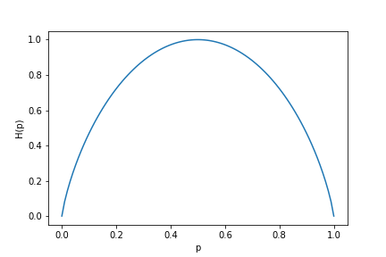
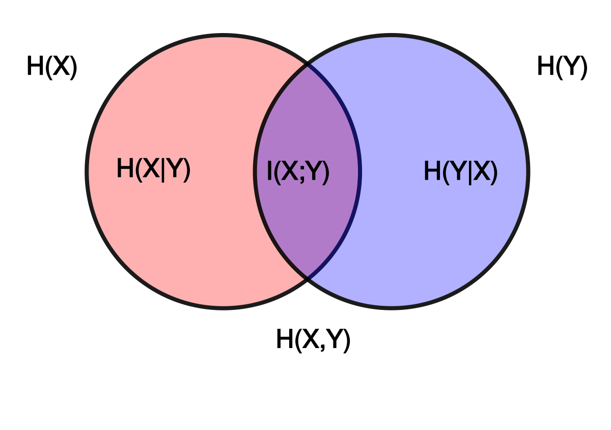
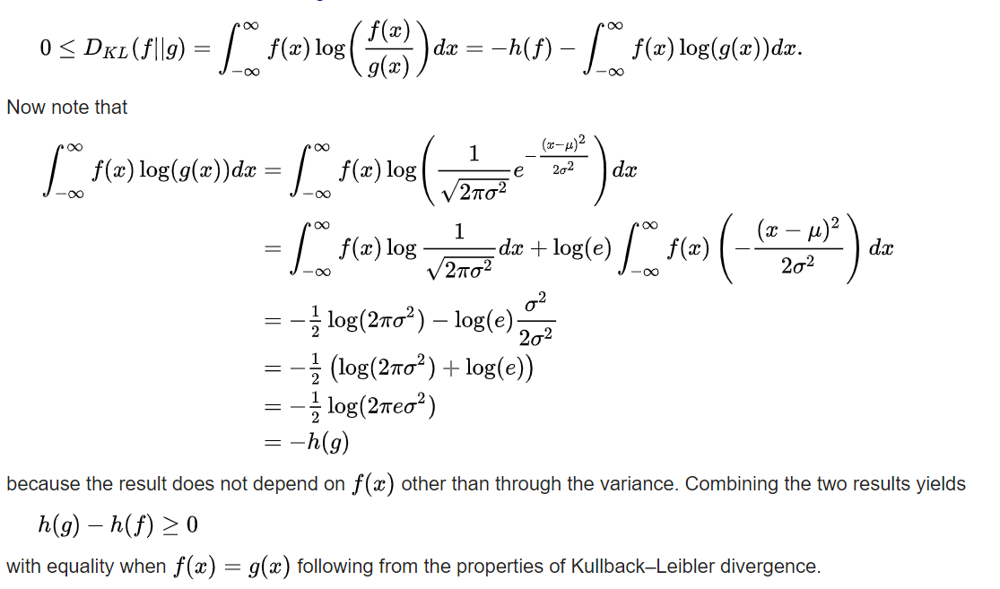

### Entropy

------

*Remember*:  

*Bayes Theorem* $\to$ $p(x|y) = \frac{p(y|x)p(x)}{p(y)}$

*Joint probability* $\to$ $p(x,y) = p(y|x)p(x) =p(x|y)p(y)$

------

Entropy measures the degree of our lack of information about a system. Suppose you throw a coin, which may land either with head up or tail up, each with probability $\frac{1}{2}$ . Then we have some uncertainty about the outcome of each "experiment". The uncertainty can be quantified by a positive number $H$. Now suppose you modified the coin (somehow) that you know for sure that each time you throw it, it will always land with head up (i.e. probability = $1$). Then there is no uncertainty about the possible outcome of each "experiment". The information entropy should be $H = 0$. In general, consider an experiment with $n$ possible outcomes, each with probability $p_{i} ,(\space i =1,...,n)$ with normalization condition $\sum_{i=1}^{n}p_{i} = 1$.

We are looking for a general formula $H(p_1,p_2,...,p_n)$ that can characterize the uncertainty in all these experiments. Intuitively, we expect:

- $ H(p_1=\frac{1}{n},p_2=\frac{1}{n},...,p_n=\frac{1}{n})$ should be the maximum among all values of $H$ with a fixed $n$.
- $ H(p_1=0,p_2=1,...,p_n=0)= 0$ should be the minimum (no uncertainty).

But to develop a general formula for arbitrary ${p_{i}}$ seems impossible! That's why Shannon was so smart. He did it! How we derive it? (For now we abandon the notation $H$ in favor of $I$ ,we'll then define $H$ as the expected value of $I$)

Shannon showed that if we assume the entropy function should satisfy a set of reasonable properties then there is only one possible expression for it. These conditions are:

- $I(p_1,p_2,\dots,p_n)$ is a continuous function and $I(p) \ge0$ (Information is a *non-negative* quantity)
- $f(n) = I(\frac{1}{n},\frac{1}{n},\dots,\frac{1}{n})$ is a monotonically increasing function of $n$.
- $I(1) = 0$ (Events that always occur do not communicate information)
- $I(p_1,p_2) = I(p_1) + I(p_2)$ (Information due to independent events is *additive*)

The last is a crucial property. It states that joint probability of independent sources of information communicates as much information as the two individual events separately. Particularly, if the first event can yield one of $n$ equiprobable outcomes and another has one of $m$ equiprobable outcomes then there are $mn$ possible outcomes of the joint event. This means that if $log_2(n)$ bits are needed to encode the first value and $log_2(m)$to encode the second, one needs $log_2(m\cdot n) = log_2(m) + log_2(n)$ to encode both. Shannon discovered that the proper choice of function to quantify Information, preserving this additivity, is ***logarithmic*** ! i.e.
$$
I(p) = \log\left(\frac{1}{p}\right)
$$
The base of the logarithm can be any fixed real number greater than 1. ($2 \to bits$, $3\to trits$, etc...)

Now, suppose we have a distribution where event $i$ can happen with probability $p_i$. Suppose we have sampled it $N$ times and the $i_{th}
$ outcome was, accordingly, seen $n_i =Np_i$ times. The total amount of information we have received is:
$$
\sum_in_iI(p_i)=\sum_i Np_i\log\left(\frac{1}{p_i}\right)=N\cdot \sum_ip_i\log\left(\frac{1}{p_i}\right)
$$
The average amount of information that we receive with every event is therefore:
$$
\sum_ip_i\log\frac{1}{p_i}
$$
So the entropy of a source that emits a sequence of $N$ symbols that are independent and identically distributed ($iid$) is $N·I$ bits (per message of $N$ symbols). 

Suppose $1000$ bits ($0s$ and $1s$) are transmitted, If the value of each of these bits is known to the receiver (has a specific value with certainty) *ahead* of transmission, it is clear that no information is transmitted. If, however, each bit is independently equally likely to be $0$ or $1$, $1000$ shannons of information (more often called bits) have been transmitted. Between these two extremes, information can be quantified as follows.

If $X$ is the set of all messages $\{ x_1,\dots,x_n\}$ that $X$ could be, and $p(x)$ is the probability of some $x \in X$ , then the entropy $H$ of $X$ is defined:
$$
H(X) = E_x\left[I(x)\right]=-\sum_{x\in X}p(x)\log p(x)
$$
The special case of information entropy for a random variable with two outcomes is the *binary entropy functions*, usually taken to the logarithmic base $2$, thus having the *shannon (Sh)* as unit:
$$
H_b(p) = -p\log_2{p}-(1-p)\log_2(1-p)
$$

Let's talk now about *Cross Entropy*... The joint entropy of two discrete random variables $X$ and $Y$ is merely the entropy of their pairing: $(X,Y)$. This implies that if $X$ and $Y$ are *independent*, then their joint entropy is the sum of their individual entropies (remember: *Probability Multiply* $ \to $ *Entropies Add* ). For example, if $(X,Y)$ represents the position of a chess piece ($X$ is the row and $Y$ the column), then the *joint entropy*  of the row of the piece and the column of the piece will be the entropy of the position of the piece.
$$
H(X,Y) = E_{X,Y}\left[-\log p(x,y)\right] = -\sum_{x,y}p(x,y)\log p(x,y)
$$
Let's talk now about *Conditional Entropy*... The conditional entropy or conditional uncertainty of $X$ given random variable $Y$ (also called the equivocation of $X$ about $Y$ ) is the average conditional entropy over $Y$.
$$
H(X|Y) = E_Y\left[H(X|y)\right]=-\sum_{y\in Y}p(y)\sum_{x\in X}p(x|y)\log p(x|y) = -\sum_{x,y}p(x,y)\log\frac{p(x,y)}{p(y)}
$$
Because entropy can be conditioned on a random variable or on that random variable being a certain value, care should be taken not to confuse these two definitions of conditional entropy, the former of which is in more common use. A basic property of this form of conditional entropy is that:
$$
H(X|Y) = H(X,Y)-H(Y)
$$

------

*Derivation* :
$$
H(X|Y)=\\-\sum_{x,y}p(x,y)\log\frac{p(x,y)}{p(y)} = -\sum_{x,y}p(x,y)(\log p(x,y)-\log p(y)) =\\ -\sum_{x,y}p(x,y)\log p(x,y)+\sum_{x,y}p(x,y)\log p(y) = H(X,Y)-H(Y)
$$
​				Observe that by the law of total probability $\sum_xp(x,y) = p(y)$ , hence
$$
\sum_{x,y}p(x,y)\log p(y) = \sum_yp(y)\log{p(y)=-H(Y)}
$$

------

Let's talk now about *Mutual Information*... Mutual information measures the amount of information that can be obtained about one random variable by observing another. It is important in communication where it can be used to maximize the amount of information shared between sent and received signals. The mutual information of $X$ relative to $Y$ is given by:
$$
I(X;Y) = E_{X,Y}\left[SI(x,y)\right]=\sum_{x,y}p(x,y)\log\frac{p(x,y)}{p(x)p(y)}
$$
Where *SI* *(Specific mutual information)* is the *pointwise mutual information*.

A basic property of the mutual information is that
$$
I(X;Y) = H(X)-H(X|Y)
$$
That is, knowing $Y$, we can save an average of $I(X;Y)$ bits in encoding $X$ compared to not knowing $Y$.

Mutual information is symmetric:
$$
I(X;Y) = I(Y;X) = H(X)+H(Y)-H(X,Y)
$$
To have an intuitive understanding of what's going on:

------

Remember that $H$ can be seen as a measure of *uncertainty*!

$H(X)$ = The information stored in $X$

$H(X|Y)$ = The information stored in $X$ given that the value of $Y$ is known 

$H(X)-H(X|Y)$ = The information we know of $X$ without what we know of $X$ given $Y$, which is a measure of the dependence of $X$ and $Y$.

If $X$ and $Y$ have no dependence, then we get $I(X;Y) = H(X)-H(X)=0$.

If they are fully dependent, we get $I(X;Y) = H(X)-0=H(X)$ or $I(X;Y)=H(Y)-0=H(Y)$

So the mutual information $I(X;Y)$, which is also referred of as a mutual dependence of $X$ and $Y$, can be captured using an equation in the form of:

$I(X;Y)=H(X)-H(X|Y)$.

------

The figure above is the Venn diagram showing additive and subtractive relationships various information measures associated with correlated variables $X$ and $Y$. The area contained by both circles is the *joint entropy* $H(X,Y)$. The circle on the left (red and violet) is the individual entropy $H(X)$ , with the red being the *conditional entropy* $H(X|Y) $. The circle on the right (blue and violet) is $H(Y)$, with the blue being $H(Y|X)$. The violet is the *mutual information* $I(X;Y)$.

Let's define now the *entropy* in a continuous domain, we see that the sum is replaced with an integral:
$$
H(X)=\int_{S}p(x)I(x)dx=-\int_Sp(x)log_bp(x)dx
$$
where $p(x)$ represents a *probability density function* and $S$ is the support region of the random variable. Let's try to derive the *continuous entropy* (also referred as *differential entropy*) of a *Gaussian* centered in $0$ (*Normal distribution*) :

We have $X \sim \mathcal{N}(0,\sigma^{2})$ with *probability density function*​ $\phi(x) = \frac{1}{\sqrt{2\pi\sigma^{2}}}e^{-\frac{x^{2}}{2\sigma^{2}}}$  then
$$
h_a(x) = -\int\phi(x)\log_a\phi(x)dx =\\
-\int\phi(x)\log_a\frac{1}{\sqrt{2\pi\sigma^{2}}}e^{-\frac{x^{2}}{2\sigma^{2}}}dx=
\\

-\int\phi(x)\left(\log_a{\frac{1}{\sqrt{2\pi\sigma^{2}}}-\frac{x^2}{2\sigma^2}\log_ae}\right)dx=\\

-\int\phi(x)\left(\log_a{\frac{1}{\sqrt{2\pi\sigma^{2}}}}\right)dx +  \int\left(\frac{x^2}{2\sigma^2}\log_ae\right)dx=\\

\frac{1}{2}\log_a(2\pi\sigma^2)+\frac{\log_ae}{2\sigma^2}E_{\phi}\left[X^2\right]=\\
\frac{1}{2}\log_a(2\pi\sigma^2)+\frac{\log_ae}{2\sigma^2}\sigma^2=\\

\frac{1}{2}\log_a(2\pi\sigma^2)+\frac{1}{2}\log_a=\\

\frac{1}{2}\log_a(2\pi e\sigma^2)
$$
Even if we had considered a mean $\mu \neq 0$ the result would have been the same, so all Gaussians with a common $\sigma $ have the same entropy.

We are going to prove that on the reals $\R$, the maximum entropy distribution with a given mean and variance is the *Gaussian* distribution.

Let $g(x)$ be a *Gaussian PDF* (probability density function) with mean $\mu$ and variance $\sigma^2$ and $f(x)$ an arbitrary *PDF* with the same variance. Since differential entropy is translation invariant we can assume that $f(x)$ has the same mean of $\mu$ as $g(x)$

Consider the ***Kullback–Leibler divergence*** (also called *Relative entropy*, is a measure of how one probability distribution is different from a second, reference probability distribution) between the two distributions:

(Note that this quantity is equal to $0$ when the two distributions are the same)

But why are we so interested in maximizing the entropy?

------

A data set where each point is equally probable has maximum entropy (or disorder). If we are given $16$ letters of the alphabet and each one of them appears equally often, and independently of each other, we need exactly $4$ bits to encode the $16$ letters. If we do not put any constraints on the data, the uniform distribution has maximum entropy. Now, assume that we are given data points from a specific problem (binarization of documents, for example) and we decide to keep only the mean $\mu $ and the variance $\sigma^2$ as descriptors of the data. The question would be, which distribution, among the many possible probability distributions, should we use later on to describe the data? Which is the distribution which makes no additional spurious assumptions? Which distribution most effectively models our ignorance by maximizing disorder? Not surprisingly, the answer is that the Gaussian distribution is the one with maximum entropy.

When in a pattern recognition problem we refer to a data class by its mean and variance, we are in fact compressing the original data. We delete all additional information possibly hidden in the data set. But we gain simplicity. If we keep only the mean and variance of the data, the distribution which does not "jump to conclusions", that is, the most general distribution given such constraints, is the Gaussian distribution. When we model data using the normal distribution we are trying to be as general as possible and we are trying to avoid introducing spurious expectations in the distribution. We are in fact recognizing our ignorance about the real data distribution. In applications, when dealing with real data, we expect a normal distribution (for example for the height of people or for the darkness of ink pixels in an OCR task). Most of the time, however, we have no real clue as to the specific probability distribution. In such cases, we play it safe, assuming a Gaussian distribution.

------

*Entropy of a multivariate Normal Distribution*
$$
h(X_1,X_2,\dots,X_n)=\frac{1}{2}\log_a(2\pi e)^n|\mathbb{K}|
$$
Where $\mathbb{K}$ is the *covariance matrix*.

The formulation above can be derived as before starting from the *pdf* of the multivariate (with $n$ different descriptors) normal distribution, which is:
$$
\phi(\mathbf{x})=\frac{1}{(2\pi)^{n/2}|\mathbb{K}|^{1/2}}e^{-\frac{1}{2}(\mathbf{x}-\mathbf{\mu})^T\mathbb{K}^{-1}(\mathbf{x}-\mathbf{\mu})}
$$
*Differential and Conditional Entropy*

The Diff. Entropy of jointly distributed variables $X_1,X_2,\dots,X_n$ is defined as:
$$
h(X_1,X_2,\dots,X_n)=-\int f(x^n)\log_a f(x^n)dx
$$
where
$$
f(x^n) = f(x_1,x_2,\dots,x_n)
$$
is the joint pdf.

The Conditional Differential Entropy of jointly distributed random variables $X,Y$ with joint pdf $f(x,y)$ is defined as:
$$
H(X|Y) = -\int f(x,y)\log_a f(x|y)dxdy = h(X,Y)-h(Y)
$$
As already discussed, the *Relative entropy* (Or Kullback-Leibler Distance between two densities $f(x)$ and $g(x)$ is defined as:
$$
\mathcal{D}(f||g)=\int f(x)\log_a\frac{f(x)}{g(x)}dx
$$

$$
I(X;Y)=\int f(x,y)\log_a\frac{f(x,y)}{f(x)f(y)}dxdy
$$
