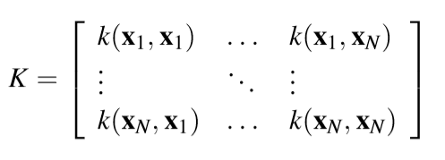
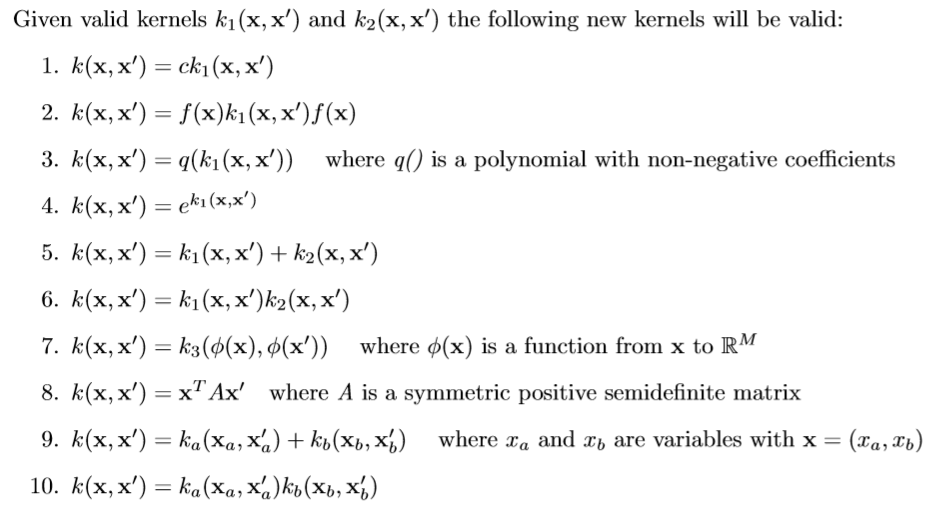

### Kernels

Traditionally, theory and algorithms of machine learning and statistics have been very well developed for the linear case. Real world data analysis problems, on the other hand, often require nonlinear methods to detect the kind of dependencies that allow successful prediction of properties of interest. By using a positive definite kernel, one can sometimes have the best of both worlds. The kernel corresponds to a dot product in a (*usually high-dimensional, possibly infinite*) feature space. In this space, our estimation methods are linear, but as long as we can formulate everything in terms of kernel evaluations, we never explicitly have to compute in the high dimensional feature space! (This is called the *Kernel Trick*)

Suppose we have a mapping $\varphi : \R^d \to \R^m$ that brings our vectors in to some feature space $\R^m$. Then the dot product of $\textbf{x}$ and $\textbf{y}$ in this space is $\varphi (\textbf{x})^T\varphi (\textbf{y})$. A kernel is a function $k$ that corresponds to this dot product, i.e. $k(\textbf{x},\textbf{y})=\varphi (\textbf{x})^T\varphi (\textbf{y}) $ . Why is this useful? *Kernels* give a way to compute dot products in some feature space without even knowing what this space is and what is $\varphi$ . For example, consider a simple polynomial kernel $k(\textbf{x},\textbf{y})=(1+\textbf{x}^T\textbf{y})^2$ with $\textbf{x},\textbf{y} \in \R^2$. This doesn't seem to correspond to any mapping function $\varphi$ ,  it's just a function that returns a real number. Assuming that $\textbf{x} = (x_1,x_2)$ and $\textbf{y} = (y_1,y_2)$, let's expand this expression:
$$
k(\textbf{x},\textbf{y})=(1+\textbf{x}^T\textbf{y})^2 = (1+x_1y_1 + x_2y_2)^2=\\1+x_1^2y_1^2+x_2^2y_2^2+2x_1y_1+2x_2y_2+2x_1x_2y_1y_2
$$
Note that this is nothing else but a dot product between two vectors$(1, x_1^2, x_2^2, \sqrt{2} x_1, \sqrt{2} x_2, \sqrt{2} x_1 x_2)$ and $(1, y_1^2, y_2^2, \sqrt{2} y_1, \sqrt{2} y_2, \sqrt{2} y_1 y_2)$ and $\varphi(\mathbf x) = \varphi(x_1, x_2) = (1, x_1^2, x_2^2, \sqrt{2} x_1, \sqrt{2} x_2, \sqrt{2} x_1 x_2)$.

So the kernel $k(\mathbf x, \mathbf y) = (1 + \mathbf x^T \mathbf y)^2 = \varphi(\mathbf x)^T \varphi(\mathbf y)$ computes a dot product in 6-dimensional space without explicitly visiting this space.

Another example is Gaussian kernel $k(\mathbf x, \mathbf y) = \exp\big(- \gamma \, \|\mathbf x - \mathbf y\|^2 \big)$. If we Taylor-expand this function, we'll see that it corresponds to an infinite-dimensional codomain of $\varphi$.

Instead, the simplest *kernel* is the *linear kernel* which corresponds to an *identity mapping* in the feature space: $k(\mathbf{x},\mathbf{x'}) = \varphi(\mathbf{x})^T\varphi(\mathbf{x'}) = \mathbf{x}^T\mathbf{x}$ 

Moreover, the *kernel* is a *symmetric* function of its arguments: $k(\mathbf{x},\mathbf{x'}) = k(\mathbf{x'},\mathbf{x})$

------

Many linear models for regression and classification can be reformulated in terms of *dual representation* in which the *kernel function arises naturally* ! For example if we consider a linear regression model we know that we obtain the best parameters by minimizing the *regularized sum of squares* error function (*ridge*):
$$
L_{\mathbf{w}} = \frac{1}{2}\sum_{n=1}^{N}(\mathbf{w}^T\varphi(\mathbf{x_n})-t_n)^2+\frac{\lambda}{2}\mathbf{w}^T\mathbf{w}
$$
Setting the gradient of $L_{\mathbf{w}}$ w.r.t $\mathbf{w}$ equal to $0$ we obtain the following:
$$
\mathbf{w} = -\frac{1}{\lambda}\sum_{n=1}^{N}(\mathbf{w}^T\varphi(\mathbf{x_n})-t_n)\varphi(\mathbf{x_n}) = \sum_{n=1}^Na_n\varphi(\mathbf{x}_n)=\Phi^T\mathbf{a}
$$
Where $\Phi$ is the design matrix whose $n^{th}$ row is $\varphi(\mathbf{x}_n)^T$ (remember that in $L_{\mathbf{w}}$ all the vectors are *column* vectors!) and the coefficients $a_n$ are functions of $\mathbf{w}$. So our definition of $\mathbf{w}$ is function of $\mathbf{w}$ itself...which is surely weird, just *wait for it...*

We now define the *Gram Matrix* $\mathbf{K} = \Phi \times \Phi^T$, an $N \times N$ matrix, with elements:
$$
K_{nm} = \varphi(\mathbf{x_n})^T\varphi(\mathbf{x_m})=k(\mathbf{x}_n,\mathbf{x}_m)
$$
So, given $N$ vectors, the *Gram Matrix* is the matrix of all *inner products* 

If we substitute $\mathbf{w} = \Phi^T\mathbf{a}$ into $L_{\mathbf{w}}$ we get
$$
L_{\mathbf{a}} = \frac{1}{2}\mathbf{a}^T\Phi\Phi^T\Phi\Phi^T\mathbf{a}-\mathbf{a}^T\Phi\Phi^T\mathbf{t}+\frac{1}{2}\mathbf{t}^T\mathbf{t}+\frac{\lambda}{2}\mathbf{a}^T\Phi\Phi^T\mathbf{a}
$$
where $\mathbf{t} = (t_1,...,t_N)^T$. Guess what? we can rewrite the Loss function in terms of *Gram Matrix* !
$$
L_{\mathbf{a}} = \frac{1}{2}\mathbf{a}^TKK\mathbf{a}-\mathbf{a}^TK\mathbf{t}+\frac{1}{2}\mathbf{t}^T\mathbf{t}+\frac{\lambda}{2}\mathbf{a}^TK\mathbf{a}
$$
 Solving for $\mathbf{a}$ by combining $\mathbf{w} = \Phi^T\mathbf{a}$ and $a_n = -\frac{1}{\lambda}(\mathbf{w}^T\varphi(\mathbf{x}_n)-t_n)$ (setting the gradient to $0$ etc...)
$$
\mathbf{a}=(K+\lambda\mathbf{I}_N)^{-1}\mathbf{t}
$$
Consider that $K = N\times N$ and $\mathbf{t} = N\times 1$, so $\mathbf{a} = N \times 1$.

So we can make our prediction for a new input $\mathbf{x}$ (which has dimension $D\times 1$ obviously, $\varphi(\mathbf{x})$ will have dimension $M\times 1$ instead, where $M>D$) by substituting back into our linear regression model:
$$
y(\mathbf{x}) = \mathbf{w}^T\varphi(\mathbf{x}) = (\Phi^T\mathbf{a})^T\varphi(\mathbf{x}) = \mathbf{a}^T\Phi\varphi(\mathbf{x})= \mathbf{k}(\mathbf{x})^T(K+\lambda\mathbf{I}_N)^{-1}\mathbf{t}
$$
where $\mathbf{k}(\mathbf{x})$ has elements $k_n(\mathbf{x}) = k(\mathbf{x}_n,\mathbf{x})$ . Prediction is just a linear combination of the *target values* from the *training set* . (If you make a dimensionality check you will see that $y(\mathbf{x})$ will be just a number)

The good thing is that instead of inverting an $M\times M$ matrix, we are inverting an $N\times N$ matrix! (as we already said different times,  this allows us to work with *very high or infinite dimensionality* of $\mathbf{x}$).

------

 But *how* can we build a valid *kernel*?

 We have manly two ways to do it:

- *By construction*: we choose a feature space mapping $ \varphi (\mathbf{x})$ and use it to find the corresponding kernel. (I'd call this method *by hand*)

- It is possible to test whether a function is a valid kernel without having to construct the basis function explicitly. The necessary and sufficient condition for a function $k(\mathbf{x},\mathbf{x}')$ to be a kernel is that the Gram matrix $K$ is positive semi-definite for all possible choices of the set $\{x_n\}$. It means that $\mathbf{x}^TK\mathbf{x}\ge 0$ for non-zero vectors $\mathbf{x}$ with real entries, i.e.$\sum_n\sum_m K_{n,m}x_nx_m \ge 0$ for any real number $x_n,x_m$. 

  *Mercer's Theorem :* Any continuous, symmetric, positive semi-definite kernel function $k(\mathbf{x},\mathbf{y})$ can be expressed as a dot product in a high-dimensional space.

  New kernels can be constructed from simpler kernels as *building blocks*:

  

