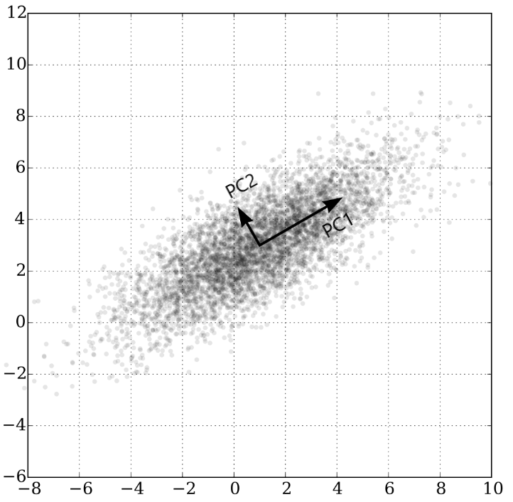

### Principal Component Analysis

*PCA* is an unsupervised learning method which aims to *reduce* the dimensionality of an input space $\mathcal{X}$ .

Formally, principal component analysis (PCA) is a statistical procedure that uses an *orthogonal transformation* to convert a set of observations of possibly correlated variables into a set of values of *linearly uncorrelated* variables called *principal components*.

To have a graphical intuition:

It is based on the principle of projecting the data onto the input subspace which accounts for most of the variance: 

- Find a line such that when the data is projected onto that line, it has the maximum variance. 
- Find a new line, orthogonal to the first one, that has maximum projected variance. 
- Repeat until $m$ lines have been identified and project the points in the data set on these lines. 

The precise steps of *PCA* are the following (remember that $\mathbf{X}$ is an $n\times d$ matrix where $n$ denotes the number of samples and $d$ is the dimensionality) : 

- Compute the mean of the data
  $$
  \overline{\mathbf{x}} = \frac{1}{N}\sum_{n=1}^N\mathbf{x}_n
  $$

- Bring the data to zero-mean (by subtracting $\overline{\mathbf{x}}$ )

- Compute the covariance matrix $\mathbf{S} = \mathbf{X}^T\mathbf{X} = \frac{1}{N-1}\sum_{n=1}^{N}(\mathbf{x}_n-\overline{\mathbf{x}})^T(\mathbf{x}_n-\overline{\mathbf{x}})$

  - Eigenvector $\mathbf{e}_1$ with largest eigenvalue $\lambda_1$ is the *first principal component* 
  - Eigenvector $\mathbf{e}_k$ with $k^{th}$ largest eigenvalue $\lambda_k$ is the *$k^{th}$ principal component* 
  - $\frac{\lambda_k}{\sum_i\lambda_i}$ is the proportion of variance captured by the $k^{th}$ principal component.

Transforming the reduced dimensionality projection back into the original spaces gives a reduced dimensionality reconstruction of the data, that will have some error. This error can be small and often acceptable given the other benefits of dimensionality reduction. PCA has multiple benefits: 

- Helps to reduce the computational complexity 
- Can help supervised learning, because reduced dimensions allow simpler hypothesis spaces and less risk of overfitting 
- Can be used for noise reduction 

But also some drawbacks:

- Fails when data consists of multiple clusters
- The directions of greatest variance may not be the most informative
- Computational problems with many dimensions 
- PCA computes linear combination of features, but data often lies on a nonlinear manifold. Suppose that the data is distributed on two dimensions as a circumference: it can be actually represented by one dimension, but PCA is not able to capture it.