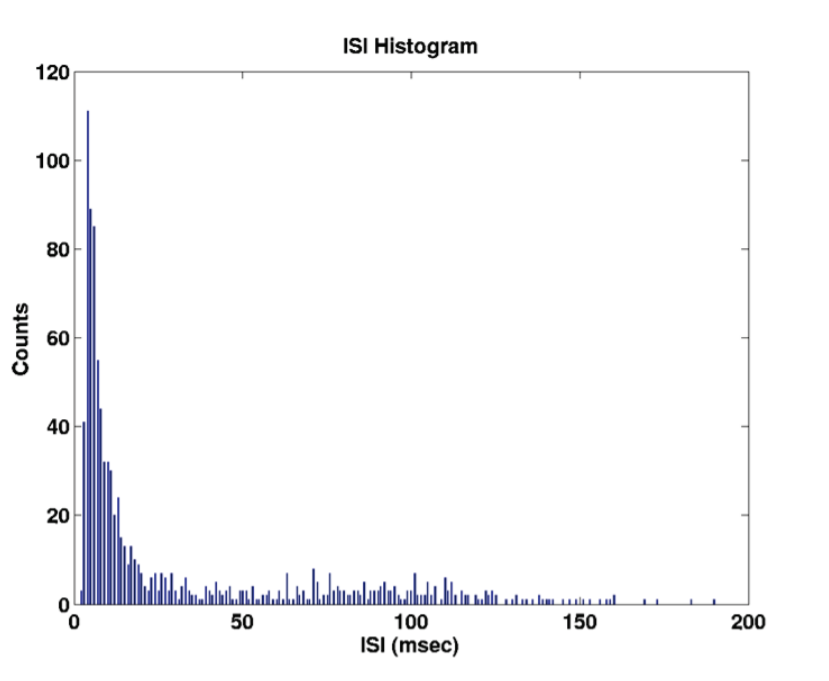

## Time Rescaling Theorem & Kolmogorov-Smirnov Plots

*This is a theoretical overview of the time-rescaling theorem applied to neural spike trains. (As well as GSRs or RR-intervals...)*

#### Background Knowledge

***Hazard Function in the Context of Survival Anaysis***

In *Survival Analysis* we are interested in understanding the *risk* of an event happening at a particular point in time, where time is a continuous variable.

For example, let's consider the event *firing of a neuron*: we define the time of firing as $X$, and time in general as $t$.

The *hazard function*, which is a function of time, is defined as:
$$
h(t) = \lim_{\Delta t\to0}\frac{P(t<X<t+\Delta t|X>t)}{\Delta t}
$$
We are conditioning on $X>t$ because we want to condition our probability on the fact that the event *hasn't occurred yet*.

It's important to note that $h(t)$ doesn't represent a probability, it can assume values bigger than $1$.

Is there a way to rewrite $h(t)$ in a different way?
$$
h(t) = \lim_{\Delta t\to0}\frac{P(t<X<t+\Delta t|X>t)}{\Delta t}\\
h(t) = \lim_{\Delta t\to0}\frac{P(t<X<t+\Delta t,X>t)}{P(X>t)\Delta t}\\
$$
It is easy to see that $(t<X<t+\Delta t)$ is just a subset of $X>t$

```
	O---------------------- {     X > t    }
    |		o-------------- { t < X < t+Δt }
    |		|	 	
----.-------.----.---------
	t		X   t+Δt
```


$$
  h(t) = \lim_{\Delta t\to0}\frac{P(t<X<t+\Delta t)}{P(X>t)\Delta t}
$$

 $P(X>t)$ is called the *survival function* and is just $1$ minus the cumulative distribution function (*CDF*):
$$
  P(X>t) = 1-F(t)=1-\int_{t_0}^tp(t)dt
$$
The remaining part is the definition of the derivative of the *CDF*, which is just the *probability density function* (*PDF*) at time $t$ 
$$
  \lim_{\Delta t\to0}\frac{P(t<X<t+\Delta t)}{\Delta t}= \lim_{\Delta t\to0}\frac{P(X<t+\Delta t)-P(X <t)}{\Delta t}=\\
  \lim_{\Delta t\to0}\frac{F(t+\Delta t)-F(t)}{\Delta t}=p(t)
$$
  So, finally we can rewrite the *hazard function* as:
$$
  h(t) = \frac{p(t)}{1-\int_{t_0}^tp(t)dt}
$$

***The Conditional Intensity Function and ISI probability density***

The key to deriving the likelihood function for a parametric model of a neural spike train is defining the joint probability density. The joint probability density of a neural spike train can be characterized in terms of the conditional intensity function. Therefore, we first derive the conditional intensity function for a point process and review some of its properties. 

Firstly, some definitions: 

- $(\ 0,T\ ]$ denotes the *observation interval* 
- $0<u_1<u_2<\dots<u_{J-1}<u_J\le T$ is a set of $J$ spike time measurements
- $N(t)$ is the number of spikes in $(\ 0,t\ ]$
- $N_{0:t}$ is the event $\{\ 0<u_1<u_2<\dots<u_j\le t\ \cap N(t) = j\ \}$ where $j\le J$ 

The function $N_{0:t}$ tracks the location and number of spikes in $(\ 0,t\ ]$ and hence, contains all the information in the sequence of spike times.

We define the *Conditional Intensity Function* for $t\in (\ 0,T\ ]$ as:
$$
\lambda(t|H_t)=\lim_{\Delta t\to 0}\frac{Pr(N(t+\Delta t)-N(t)=1|H_t)}{\Delta t}
$$
where $H_t$  is the history of the sample path and of any covariates up to time $t$.

In *survival analysis* the *CIF* is called the *hazard function* (as explained in the section above), it follows that $\lambda(t|H_t)$ can be defined in terms of inter-event or spike time probability density at time $t$ , $p(t|H_t)$ , as
$$
\lambda(t|H_t) = \frac{p(t|H_t)}{1-\int_0^tp(u|H_u)du}
$$
Moreover it is possible to prove that the probability of having a spike in $[\ t,t+\Delta t \ ]$ given $H_t$ and that there has been no spike in $(\ 0,t\ )$ is
$$
Pr(u\in[t,t+\Delta t]\ |\ u>t,H_t) \sim\lambda(t|H_t)\Delta t
$$
which is extremely important; this means that, for any time interval $[\ t,t+\Delta t \ ]$ , $\lambda(t|H_t)\Delta t$  

defines *the probability of a spike given the history up to time $t$ .*

If the spike train is an *inhomogenous Poisson Process* then $\lambda (t|H_t) = \lambda(t)$ becomes the *Poisson rate function*

This can be derived from the following observation:
$$
\lambda(t|H_t) = \frac{p(t|H_t)}{1-\int_0^tp(u|H_u)du}
$$

$$
\lambda(t|H_t)=-\frac{d\left[\log(\ 1-\int_0^tp(u|H_u)du\ )\right]}{dt}
$$

(Note that $\frac{d}{dt}\left(\int_0^tp(u|H_u)du\right) = p(t|H_t)$ holds cause of the *second fundamental theorem of calculus*)

We integrate both parts from $0$ to $t$ and multiply by $(-1)$:
$$
-\int_0^t\lambda(u|H_u)du=\log(\ 1-\int_0^tp(u|H_u)du\ )
$$
Finally, exponentiating yields
$$
e^{-\int_0^t\lambda(u|H_u)du} =1-\int_0^tp(u|H_u)du
$$

$$
\frac{1}{1-\int_0^tp(u|H_u)du}e^{-\int_0^t\lambda(u|H_u)du} = 1
$$

We multiply both parts by $p(t|H_t)$
$$
\frac{p(t|H_t)}{1-\int_0^tp(u|H_u)du}e^{-\int_0^t\lambda(u|H_u)du} = p(t|H_t)
$$
Which finally leads to
$$
p(t|H_t) = \lambda(t|H_t)e^{-\int_0^t\lambda(u|H_u)du}
$$
In this way we just proved that *given the conditional instensity function the interspike interval probability density is specified and viceversa.* Hence, defining one completely defines the other.

```
Doubt:
So in order to hold p(t|Ht) shouldn't have to be an Inhomogenous Poisson?
When parametrizing it as an Inverse Gaussian we are doing it just in order to obrain the Conditional Intensity Function? Is there any difference between the pdf represented by Eq. (16) and Eq. (17) ?
"The first step of this approach is to fit a history-dependent inverse Gaussian model to the inter-pulse interval distribution (which has a one-to-one relationship with the conditional intensity function for a point process)." (A Point Process Characterization of EDA)
"If the point process is an Inhomogeneous Poisson process, then lambda(t|Ht) = lambda(t) is simply the Poisson rate function.
Otherwise, it depends on the history of the process. Hence, the conditional intensity generalizes the de􏰜finition of the Poisson rate." (The Time-Rescaling Theorem and Its Application to Neural
Spike Train Data Analysis)
```

is it correct to define $p(t|H_t)$ as an *Inverse Gaussian* ? (Are equation $(16)$ and $(17)$ the same thing?)
$$
p(t|H_t,\theta) = \left[\frac{\theta_{p+1}}{2\pi(t-u_k)^3}\right]^{1/2}e^{-\frac{1}{2}\frac{\theta_{p+1}\left(t-u_k-\mu(H_{u_k},\theta)\right)^2}{\mu(H_{u_k},\theta)^2(t-u_k)}}
$$
Where $H_{u_k} = (\color{green}{u_k},w_k,w_{k-1},\dots,w_{k-p+1})$ , $w_k = u_k-u_{k-1}$ is the $k_{\text{th}}$ inter-event interval (note that we need $\color{green}{u_k}$ just to "reset" our distribution to the last observed event ), $\mu(H_{u_k},\theta)=\theta_0+\sum_{j=1}^{p}\theta_jw_{k-j+1} > 0$ is the mean, $\theta_{p+1}$ is the scale parameter and $\theta = \left(\theta_0,\theta_1,\dots,\theta_{p+1}\right)$.

The useful features that we can extract once estimted this probability distribution are the *mean* and the *std​*
$$
\mu =\mu(H_{u_k},\theta)
$$

$$
\sigma = \sqrt{\frac{\mu(H_{u_k},\theta)^3}{\theta_{p+1}}}
$$

Example of an Inter-Spike Intervals distribution and some Inverse Gaussian *pdf*s:

        

Remember that the origin of the $t$-axis correspond to $\color{green}{u_k}$.

***Estimating the Likelihood***

Now, supposing to have a set of $n$ events, if events are independent, the probability of their union of happening all together, is the product of the probability of having each of the events. If they are not independent, it means that one event is conditional to another event or more than one event. 

Given a set of $n$ events $E_1,E_2,E_3,\dots,E_n$

it the events are independent

$Pr(E_1\cap E_2 \cap E_3\dots\cap E_n)=\prod_{j=1}^{n}Pr(E_j)$

if they are not independent

$Pr(E_1\cap E_2 \cap E_3\dots\cap E_n)=\left(\prod_{j=2}^{n}Pr(E_j|E_1,\dots E_{j-1})\right)Pr(E_1)$

which comes from (e.g. for $4$ events) :
$$
{\displaystyle {\begin{aligned}\mathrm {P} (E_{4}\cap E_{3}\cap E_{2}\cap E_{1})&=\mathrm {P} (E_{4}\mid E_{3}\cap E_{2}\cap E_{1})\cdot \mathrm {P} (E_{3}\cap E_{2}\cap E_{1})\\&=\mathrm {P} (E_{4}\mid E_{3}\cap E_{2}\cap E_{1})\cdot \mathrm {P} (E_{3}\mid E_{2}\cap E_{1})\cdot \mathrm {P} (E_{2}\cap E_{1})\\&=\mathrm {P} (E_{4}\mid E_{3}\cap E_{2}\cap E_{1})\cdot \mathrm {P} (E_{3}\mid E_{2}\cap E_{1})\cdot \mathrm {P} (E_{2}\mid E_{1})\cdot \mathrm {P} (E_{1})\end{aligned}}}
$$
Why are we interested in this? Well, spike train is a series of events, so we can define the joint density of a spike train. In our formulation the inter-event intervals are *independent and identically distributed (i.i.d) random variables*.

```
Doubt:
We can treat inter-event intervals are i.i.d just because they explicitly consider the history up to time t (H_t) ? 
Yes!
```

#### The Time-Rescaling Theorem

Because we would like to apply the *time-rescaling theorem* to spike train data series, we require the joint probability density of exactly $n$ event times in $(0, T].$ This joint probability density is (Daley & Vere-Jones, $1988$; Barbieri, Quirk, et al., $2001$)
$$
p(u_1,u_2,...,u_n \cap N(T) = n  )\\
= p(u_1,u_2,...,u_n \cap u_{n+1} > T)\\
= p(u_1,u_2,...,u_n \cap N(u_n) = n)\text{Pr}(u_{n+1}> T\ |\  u_1,u_2,\dots,u_n)\\
= \prod_{k= 1}^n\lambda(u_k|H_{u_k})e^{-\int_{u_{k-1}}^{u_k}\lambda(u|H_u)du}e^{-\int_{u_{n}}^{T}\lambda(u|H_u)du}
$$
where
$$
p(u_1,u_2,\dots,u_n\cap N(u_n) = n)\\
= \prod_{k= 1}^n\lambda(u_k|H_{u_k})e^{-\int_{u_{k-1}}^{u_k}\lambda(u|H_u)du}\\
$$ { }

```
Doubt:
Given that we know that p(t|Ht) is given by equation (16)
What is the difference between
1) p(u_1,u_2,...,u_n AND N(u_n) = n)
and
2) p(u_1,u_2,...,u_n)
?
Why do we need 1) instead of 2) ?

Something with right censoring (check Barbieri 2005)
```

and
$$
\text{Pr}(u_{n+1}> T\ |\  u_1,u_2,\dots,u_n)\\
= e^{-\int_{u_{n}}^{T}\lambda(u|H_u)du}\\
$$
The conditional intensity function provides a succinct way to represent the joint probability density of the spike times. We can now state and prove the time-rescaling theorem.

***Time Rescaling Theorem***

*Let $0 < u_1 < u_2 <\dots < u_n < T$ be a realization from a point process with a conditional intensity function $\lambda(t|H_t)$ satisfying $0 < \lambda(t|H_t)$ for all $t \in (0,T]$. Define the transformation*
$$
\Lambda(u_k) = \int_{0}^{u_k}\lambda(u|H_u)du
$$
*for $k = 1,\dots,n$ , and assume $\Lambda(t) < \infty$ with probability one for all $t\in(0,T]$. Then the $\Lambda(u_k)$'s are a Poisson process with unit rate.*

*Proof:*

Let $\tau_k = \Lambda(u_k)-\Lambda(u_{k-1})$ for $k = 1,\dots,n$ and set $\tau_{T}=\int_{u_n}^{T}\lambda(u|H_u)du$. To establish the result, it suf􏰜fices to show that the $\tau_k$'s are independent and identically distributed exponential random variables with mean one. Because the $\tau_k$ transformation is one-to-one and $\tau_{n+1}>\tau_T$ if and only if $u_{n+1}>T$, the joint probability density of the $\tau_k$'s is:
$$
p(\tau_1,\tau_2,\dots,\tau_n \cap\tau_{n+1} > \tau_T)=\\
p(\tau_1,\tau_2,\dots,\tau_n)\text{Pr}(\tau_{n+1}>\tau_T|\tau_1,\dots,\tau_n)
$$
We evaluate each of the two terms on the right side of the equation above. The following two events are equivalent:
$$
\{\tau_{n+1}>\tau_T |\tau_1,\dots,\tau_n \} = \{u_{n+1}>T|u_1,u_2,\dots,u_n\}
$$
Hence
$$
\text{Pr}(\tau_{n+1}>\tau_T|\tau_1,\tau_2,\dots,\tau_n) = \text{Pr}(u_{n+1}>T|u_1,u_2\dots,u_n)\\
=e^{-\int_{u_n}^{T}\lambda(u|H_{u_n})du}\\
=e^{-\tau_T}
$$
where the last equality follows from the definition of $\tau_T$. By the multivariate change-of-variable formula (Port,1994)
$$
p(\tau_1,\tau_2,\dots,\tau_n) = |J|\cdot p(u_1,u_2,\dots,u_n\cap N(u_n) = n)
$$
Where $J$ is the Jacobian of the transformation between $u_j$, $j = 1,\dots,n$ and $\tau_k$, $k = 1,\dots,n$. Because $\tau_k$ is a function of $u_1,\dots,u_k$, $J$ is a lower triangular matrix (it's trivial to show that $\frac{\part \tau_{k_1}}{\part u_{k_2}}$ is $0$ for $k_2 > k_1$), and its determinant is the product of its diagonal elements defined as $|J| = |\prod_{k=1}^{n}J_{kk}|$. By assumption $0<	\lambda(t|H_t)$ and by equation $(25)$ and the definition of $\tau_k$, the mapping of $u$ into $\tau$ is one-to-one. Therefore, by the inverse differentiation theorem (Protter & Morrey, 1991), the diagonal elements of $J$ are
$$
J_{kk} = \frac{\part u_k}{\part \tau_k} = \lambda(u_k|H_{u_k})^{-1}
$$
*Derivation:*
$$
\tau_k = \int_{u_{k-1}}^{u_k}\lambda(u|H_u)du\\
\frac{\part \tau_k}{\part u_k} = \lambda(u_k|H_{u_k})\\
J_{kk}=\frac{\part u_k}{\part \tau_k} = \lambda(u_k|H_{u_k})^{-1}
$$
Substituting $|J|$ and equation $(21)$ into equation $(27)$ yields
$$
p(\tau_1,\tau_2,\dots,\tau_n) = \prod_{k=1}^{n}\lambda(u_k|H_{u_k})^{-1}\prod_{k=1}^{n}\lambda(u_k|H_{u_k})\cdot e^{-\int_{u_{k-1}}^{u_k}\lambda(u|H_u)du}\\
= \prod_{k=1}^{n}e^{-\int_{u_{k-1}}^{u_k}\lambda(u|H_u)du}\\
=\prod_{k=1}^{n}e^{-(\Lambda(u_k)-\Lambda(u_{k-1}))}\\
= \prod_{k=1}^{n} e^{-\tau_k}
$$
Substituting equation $(26)$ and $(30)$ into $(24)$ yields
$$
p(\tau_1,\tau_2,\dots,\tau_n \cap\tau_{n+1} > \tau_T)\\
= p(\tau_1,\tau_2,\dots,\tau_n)\text{Pr}(\tau_{n+1}>\tau_T|\tau_1,\dots,\tau_n)\\
=\left(\prod_{k=1}^{n} e^{-\tau_k}\right)e^{-\tau_T}
$$
which establishes the result.

The time-rescaling theorem generates a history-dependent rescaling of the time axis that converts a point process into a Poisson process with a unit rate.

#### Assessing Model Goodness of Fit

We may use the time-rescaling theorem to construct goodness-of-􏰜t tests for a spike data model. Once a model has been 􏰜fit to a spike train data series, we can compute from its estimated conditional intensity the rescaled times
$$
\tau_k = \Lambda(u_{k}) -\Lambda(u_{k-1})
$$
If the model is correct, then, according to the theorem, the $\tau_k$'s are independent exponential random variables with mean one. If we make the further transformation
$$
z_k = 1-e^{-\tau_k}
$$
The $z_k$'s are independent uniform random variables on the interval $(0,1)$. because the transformations in equations $(29)$ and $(30)$ are both one-to-one, any statistical assessment that measures agreement between the $z_k$'s and a uniform distreivution directly evaluatres how well the original model agrees with the spike train data. Here we present one method: *Kolmogorov-Smirnov* plots.

To construct the  *Kolmogorov-Smirnov* test, we first order the $z_k$'s from smallest to largest, denoting the ordered values as $z_{(k)}$'s. we then plot the values of the cumulative distribution function of the uniform density defined as $b_k = \frac{k-\frac{1}{2}}{n}$ for $k=1,\dots,n$ against the  $z_{(k)}$'s. If the model is correct, then the points should lie on a $45$ degree line. Confi􏰜dence bounds for the degree of agreement between the models and the data may be constructed using the distribution of the Kolmogorov-Smirnov statistic.

```
#TODO add illustrations for KS plots
```

***Once we estimated $\lambda$ , how could we simulate a Point Process?***

-  $(1)$ Set $u_0=0$ and $k=1$ 
-  $(2)$ Draw $\tau_k$ ad an exponential random variable with mean $1$
-  $(3)$ Find $u_k$ as the solution of $\tau_k =\int_{u_{k-1}}^{u_k}\lambda(u|u_1,u_2,\dots,u_{k-1})du$
-  $(4)$ If $u_k>T$ then stop
-  $(5)$ $k = k+1$
-  $(6)$ Go to $(2)$

