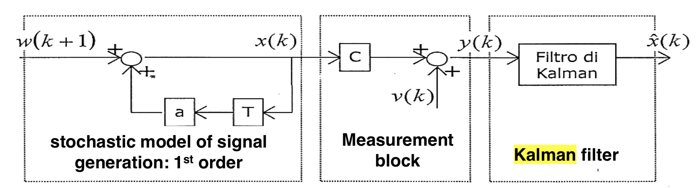
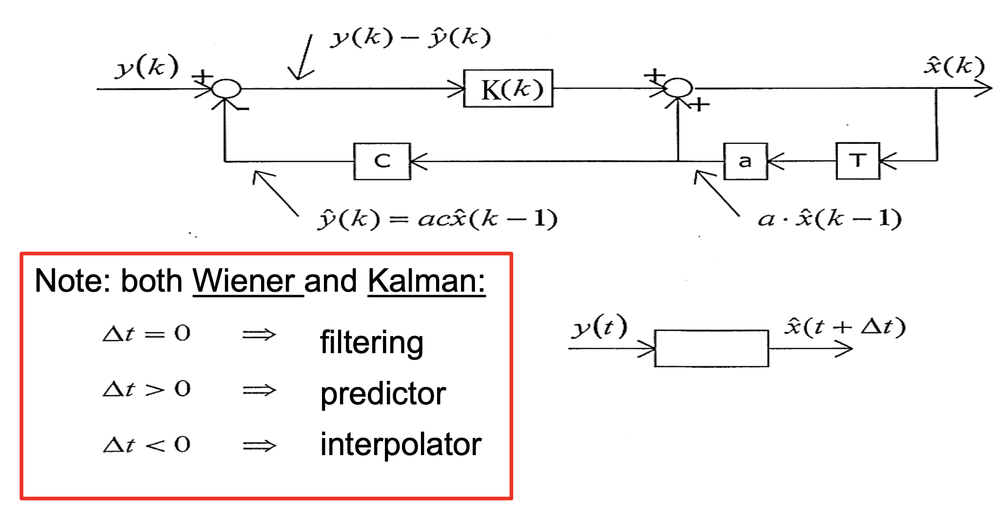
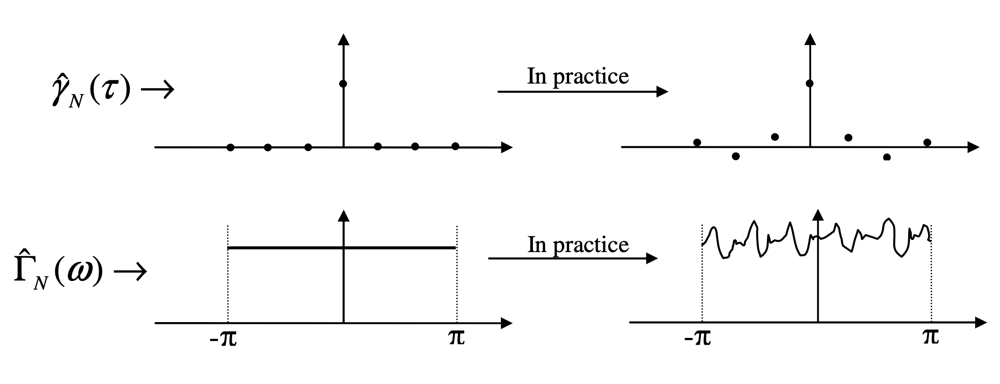

#### Kalman filter approach

We have three main blocks:

($\color{red}{\text{Non dovrebbe essere w(k-1)l'ingresso qui sotto?}}$)

- ***Signal Generation Model***

	It's a *stochastic* model (this means that the model is fed by a *white noise*) which generates the *signal* in which I'm interested, for this first block we can consider the $ARMA$ models family.

- ***Measure Block***

	In this block $C$ is the *transformation matrix* used to map the *state vector parameters* (i.e. $\mathbf{x(k)}$) into the *measurement* domain. We then suppose that this new *measurement* vector is affected by a *white noise*  $v(k)$.

- ***Kalman Filter*** : 

	The signal $\mathbf{y(k)}$ then enters the *Kalman Filter* which can be represented schematically in the following way:

	

	In summary, we have the following equations:

	*Processes*
	$$
	\mathbf{x}(k)=\mathbf{A}\mathbf{x}(k-1) + \mathbf{W}(k-1)\\
	\mathbf{y}(k) = \mathbf{C}\mathbf{x}(k)+\mathbf{v}(k)
	$$
	*Estimators*
	$$
	\mathbf{\hat{x}}(k) = \mathbf{A}\mathbf{\hat{x}}(k-1) + \mathbf{K}(k)\underset{\text{Innovation!}}{\underbrace{\left(\mathbf{y}(k)-\mathbf{CA}\mathbf{\hat{x}}(k-1)\right)}}
	$$
	It's important to observe and comment the equation above in the following way:

	----

	*The new estimate $\mathbf{\hat{x}}(k)$ is equal to the old estimate $\mathbf{\hat{x}}(k-1)$ multiplied by the state transition matrix $\mathbf{A}$ plus a weighting factor $\mathbf{K}(k)$ (Kalman Gain) times the innovation introduced by a measurement $\mathbf{y}(k)$. We can see that in the innovation expression the matrix $\mathbf{C}$ just represents the transformation matrix used to map the state vector parameters into the measurement domain (Of course you have to compare $\mathbf{y}(k)$ and $\mathbf{A}\mathbf{\hat{x}}(k-1)$ in the same domain!)*

	If you see how the Kalman Gain is calculated (see equations below) it's trivial to understand that in corrispondence of high uncertainty in the measurement ($\mathbf{R}(k)$ is high) the Kalman Gain $\mathbf{K}(k)$ becomes tiny $\to$ low trust in the measurement!

	---

	We define:
	$$
	\mathbf{P_1}(k)=\mathbf{A}\mathbf{P}(k-1)\mathbf{A}^T 
	  	+\mathbf{Q}(k)
	$$

	$$
	\mathbf{P}(k) = \mathbf{P_1}(k) - \mathbf{K}(k)\mathbf{C}(k)\mathbf{P_1}(k)
	$$

	$$
	\mathbf{K}(k) = \mathbf{P_1}(k)\mathbf{C}^T\left(\mathbf{C}\mathbf{P_1}(k)\mathbf{C}^T+\mathbf{R}(k)\right)^{-1}
	$$

	Where
	$$
		\mathbf{R}(k) = \text{Measurement Noise} = \mathbb{E}\left[\mathbf{v}(k)\mathbf{v}^T(k)\right]\\
		\mathbf{Q}(k) = \text{Process Noise}= \mathbb{E}\left[\mathbf{W}(k)\mathbf{W}^T(k)\right]\\
		  	\mathbf{P}(k) = \text{Error Covariance Matrix}= \mathbb{E}\left[\left(\mathbf{x}(k)-\mathbf{\hat{x}}(k)\right)\left(\mathbf{x}(k)-\mathbf{\hat{x}}(k)\right)^T\right]
	$$

How do we practically implement the *Kalman* filter?

- First, we have to define the physical model of the signal we are studying, this means that we have to specify the $\mathbf{A}$ and $\mathbf{C}$ matrices.

- Then we have to obtain the statistics of the stochastic processes involved, i.e. the matrices $\mathbf{Q}$ and $\mathbf{R}$.

- Then we have to initialize the state vector $\mathbf{\hat{x}}(0)$.

- Finally we have to test the efficiency of our model, we do that by testing the whiteness of the prediction error (if the prediction error is a *white noise* then we can claim that our model has extracted all the possible information from the signal we're observing) , to do so we use the Anderson test which checks the sample covariance function estimate or the sample spectrum  estimate.

	A *white noise* is characterized by the following *sample covariance* and *spectrum*:

	

