# Time - Frequency Analysis

For starters, there are two main methods of *power spectral density* estimation: **non-parametric** and **parametric**.

- *Non-parametric* methods are used when little is known about the signal ahead of time. They typically have less computational complexity than parametric models. Methods in this group are further divided into two categories: *direct* methods and *indirect* method.

	*Direct methods* include the sample spectrum, Bartlett's method, Welch's method, and the Daniell Periodogram.

	*Indirect methods* exploit the Wiener-Khinchin theorem. Therefore these methods are based on taking the Fourier transform of some sort of estimate of the autocorrelation sequence. Because of the high amount of variance associated with higher order lags (due to a small amount of data samples used in the correlations), windowing is used.

- *Parametric* methods typically assume some sort of signal model prior to calculation of the power spectral density estimate. Therefore, it is assumed that some knowledge of the signal is known ahead of time.

	Among the *parametric* methods we can find *autoregressive* methods.

	Autoregressive methods assume that the signal can be modeled as the output of an autoregressive filter (such as an $IIR$ filter) driven by a white noise sequence. Therefore all of these methods attempt to solve for the $IIR$ coefficients, whereby the resulting power spectral density is easily calculated. The model order (or number of taps), however, must be determined. If the model order is too small, the spectrum will be highly smoothed, and lack resolution. If the model order is too high, false peaks from an abundant amount of poles begin to appear. If the signal may be modeled by an $AR$ process of model $p$, then the output of the filter of order $>= p$ driven by the signal will produce white noise.

The main problem with these classical approaches is that this way we have a representation of the signal in *time* <u>OR</u> in *frequency*, with biological signals instead we would like to represent the signal in <u>BOTH</u> *time* and *frequency* domains.

The common approaches are the following:

- *LInear Decomposition of the Signal*:
	- Short TIme Fourier transform (STFT) $\to$ Spectrogram
	- Wavelet Transform (WT) $\to$ Scalogram
- *Quadratic Energy Distribution*
	- Wigner-Ville Transform
	- Time-frequency distributions (Cohen's classes)
- *Time Variant or Adaptive Parametric Models*

# Short Time Fourier Transform

The Fourier series for periodic signals and, more generally, the Fourier transform (*FT*)  decomposes a signal into sinusoidal components invariant over time. Considering a signal $x(t)$, its Fourier transform is 
$$
FT_{x}(f) = \int_{-\infty}^{\infty}x(t)e^{-j2\pi ft}dt
$$
The amplitude of the complex value $FT_x(f)$ represents the strength of the oscillatory component at frequency $f$ contained in the signal $x(t)$; however, no information is given on the time localization of such component. Since a non-stationary signal can not be analyzed using the traditional Fourier Analysis we hypothesize that the signal is stationary in short windows and we introduce the *Short Time Fourier Transform* (STFT) (Allen and Rabiner, 1977; Portnoff, 1980; Crochiere and Rabiner, 1983) , which introduces a temporal dependence, applying the *FT* not to all of the signal but to the portion of it contained in an interval moving in the time.
$$
STFT_{x,w}(t,f) = \int_{-\infty}^{\infty}x(\tau)w^{*}(\tau-t)e^{-j2\pi f\tau}d\tau
$$
At each time instant $t$, we get a spectral decomposition obtained by applying the *FT* to the portion of signal $x(\tau)$ viewed through the window $w^{*}(\tau-t)$ centered at the time $t$. This $w(\tau)$ is a function of limited duration, such as to select the signal belonging to an analysis interval centered around the time $t$ and deleting parts outside the window.


The *STFT* is, therefore, made up of those spectral components relative to a portion of the signal around the time instant $t$.

In order to preserve energy and to get the energy distribution in the time-frequency plane, the window $w^{*}(\tau-t)$ should be normalized to unitary energy.

The *STFT* is a linear operator with properties similar to those of the *FT* :

 - *Invariance for time shifting apart from the phase factor:*

	$ \tilde{x}(t) = x(t-t_0) \implies STFT_{\tilde{x},w}(t,f) = STFT_{x,w}(t-t_{0},f)e^{-j2\pi t_0f} $

 - *Invariance for frequency shifting:*

	$\tilde{x}(t) = x(t)e^{j2\pi f_{0}t} \implies STFT_{\tilde{x},w}(t,f) = STFT_{x,w}(t,f-f_0) $

The *STFT*  expression can be expressed as a *convolution and then as the output of a filter* (Hlawatsch and Boudreaux- Bartels, 1992). 

In particular we consider the *STFT* as

- ***Frequency shifting*** the signal $x(t)$ by $-f$.

	This operation is represented in the equation below as $\left[ x(\tau)e^{-j2\pi ft}\right]$, in poor words this means that we shift the spectrum of our signal $x(t)$ by $-f$ such that the frequency of interest ( $f$ ) becomes $0$ Hz.

- Followed by a ***Low-Pass Filter*** given by the convolution with the function $w(-t)$

	Remember that an ideal low-pass filter can be realized mathematically (theoretically) by multiplying a signal by the rectangular function in the frequency domain or, equivalently, convolution with its impulse response, a sinc function, in the time domain.

$$
STFT_{x,w}(t,f) = \int_{-\infty}^{\infty}\left[ x(\tau)e^{-j2\pi ft}\right]w(\tau-t)d\tau
$$

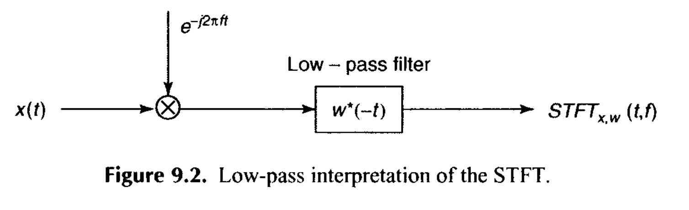

Otherwise, the *STFT* can be considered as a ***Band-Pass Filter***. Filtering the signal $x(t)$ around the frequency $f$, obtained by convolution with the function $w(-t)e^{j2\pi ft}$, followed by a shift in frequency by $-f$ .
$$
STFT_{x,w}(t,f) = e^{-j2\pi tf}\int_{-\infty}^{\infty} x(\tau)\left[w(\tau-t)e^{-j2\pi f(\tau-t)}\right]d\tau
$$
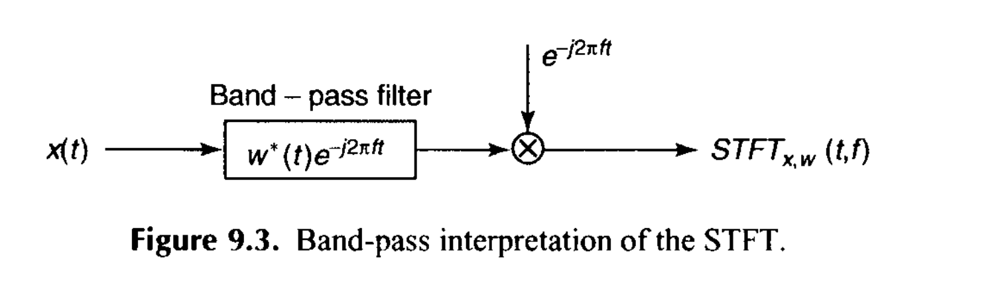

*Derivation*:
$$
STFT_{x,w}(t,f) = \int_{-\infty}^{\infty}x(\tau)w(\tau-t)e^{-j2\pi f\tau}d\tau = \\
\int_{-\infty}^{\infty}x(\tau)w(\tau-t)e^{-j2\pi f\tau} \left(e^{+j2\pi ft} e^{-j2\pi ft}\right)d\tau=\\
e^{-j2\pi tf}\int_{-\infty}^{\infty} x(\tau)\left[w(\tau-t)e^{-j2\pi f(\tau-t)}\right]d\tau
$$
It should be noted that the filter impulse response is merely given by the window function modulated at the frequency $f$.

In addition, the convolution between $x(t)$ and $w(-t)e^{j2\pi ft} $ can be written as an inverse transform of the product $X(v)W^{*}(v-f)$, where $W(f)$ is the transform of the window function $w(t)$:
$$
STFT_{x,w}(t,f) = e^{-j2\pi tf}\int_{-\infty}^{\infty} X(v)W^{*}(v-f)e^{j2\pi tv}dv
$$
(*Remember that convolution in time domain corresponds to multiplication in frequency domain*)

This expression reinforces the interpretation of the *STFT* as a *filter bank*. Indeed, the product $X(v)W^{*}(v-f)$ represents the transform of the output of a filter with a frequency response given by $W^{*}(v-f)$, which is a band-pass filter centered at frequency $f$ , obtained by shifting the frequency of the response of the low-pass filter $W(v)$.

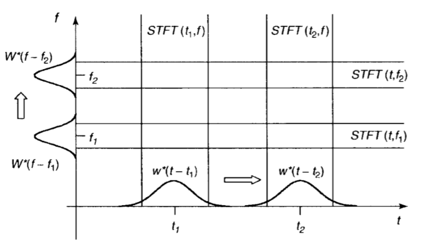

The continuous *STFT* is extremely redundant. The discrete version of STFT can be obtained by discretizing the time-frequency plane with a grid of equally spaced points $(nT,k/NT)$ where $1/T$ is the sampling frequency, $N$ is the number of samples, and $n$ and $k$  are integers.

What about Time-Frequency resolution?

The *STFT* is the local spectrum of the signal around the analysis time $t$ . To get a good resolution in time, analysis windows of short duration should be used, that is, the function $w(t)$ should be concentrated in time. However, to get a good resolution in frequency, it is necessary to have a filter with a narrow band, that is, $W(f)$ must be concentrated in frequency. it can be proved that the product of the time and of the frequency resolutions is lower bounded:
$$
\Delta t\Delta f \ge \frac{1}{4\pi}
$$
The lower limit is reached only by $w(t)$ functions of Gaussian type. This inequality is often referred as the *Heisenberg uncertainty principle* and it highlights that the frequency resolution $\Delta f$ can be improved only at the expense of time resolution $\Delta t$ and vice versa.

The squared module of *STFT* represents the signal power distribution in both the time and the frequency domains. Its representation in the time-frequency plane is defined *Spectrogram*.

# Wavelet Transform

It is well known from Fourier theory that a signal can be expressed as the sum of a, possibly infinite, series of sines and cosines. This sum is also referred to as a Fourier expansion. The big disadvantage of a Fourier expansion however is that it has only frequency resolution and no time resolution. This means that although we might be able to determine all the frequencies present in a signal, we do not know when they are present. To overcome this problem several solutions have been developed which are more or less able to represent a signal in the time and frequency domain at the same time.

The idea behind these time-frequency joint representations is to cut the signal of interest into several parts and then analyze the parts separately. It is clear that analyzing a signal this way will give more information about the when and where of different frequency components, but it leads to a fundamental problem as well: how to cut the signal?
Suppose that we want to know exactly all the frequency components present at a certain moment in time. We cut out only this very short time window using a *Dirac pulse*, transform it to the frequency domain and … something is very wrong.
The problem here is that cutting the signal corresponds to a convolution between the signal and the cutting window.
*Since convolution in the time domain is identical to multiplication in the frequency domain and since the Fourier transform of a Dirac pulse contains all possible frequencies the frequency components of the signal will be smeared out all over the frequency axis. In fact this situation is the opposite of the standard Fourier transform since we now have time resolution but no frequency resolution whatsoever.*

*In wavelet analysis the use of a fully scalable modulated window solves the signal-cutting problem.* The window is shifted along the signal and for every position the spectrum is calculated. Then this process is repeated many times with a slightly shorter (or longer) window for every new cycle. *In the end the result will be a collection of time-frequency representations of the signal, all with different resolutions.*

- *Continuous Wavelet Transform:*
	$$
	\gamma(s,\tau) = \int{f(t)\Psi^{*}_{s,\tau}(t)dt}\\
	$$
	Where $*$ denotes complex conjugation.
	This equation shows how a function $f(t)$ is decomposed into a set of basis functions $\Psi_{s,\tau}(t)$, called *wavelets*.

	This functions are supposed to be *oscillatory signal with zero mean and finite duration* ( $\int_{-\infty}^{\infty}\Psi_{s,\tau}(t)dt = 0$ ) and *finite energy* ( $\int_{-\infty}^{\infty}|\Psi_{s,\tau}(t)|^2dt < \infty $).

	The variables $s$ and $\tau$ are the new dimensions, scale and translation, after the wavelet transform. 

	For completeness sake the following equation gives the inverse wavelet transform:
	$$
	f(t) = \int\int\gamma(s,\tau)\Psi_{s,\tau}(t)d\tau ds
	$$
	The wavelets are generated from a single basic wavelet, the so-called *mother wavelet*
	$$
	\Psi_{s,\tau}(t) = \frac{1}{\sqrt{s}}\Psi(\frac{t-\tau}{s}) \\
	$$
	where $s$ is the scale factor, $\tau$ is the translation factor and $s^{-\frac{1}{2}}$ is for energy normalisation across the different scales.

	Differently from STFT, *we use longer windows to investigate lower frequencies and shorter windows to investigate higher frequencies*!

	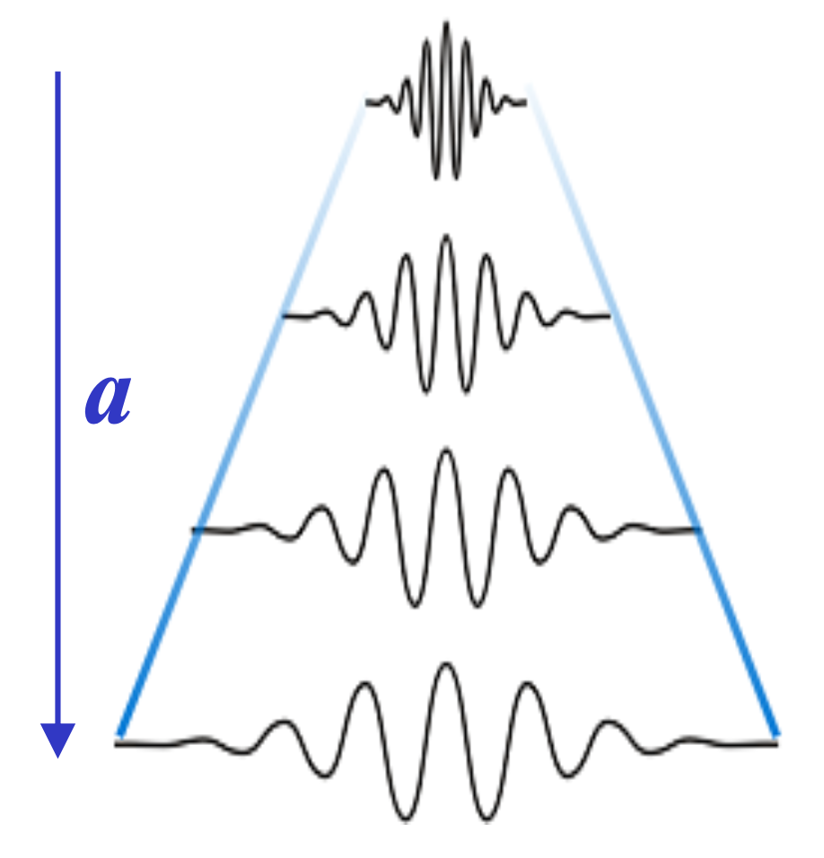

	Look here for example how the *Morlet Wavelet* changes with different values of $a$ 

	($a$ is the scaling factor $s$ referred above )

	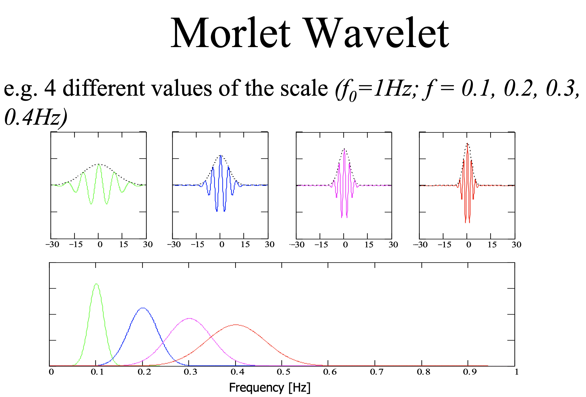

	(Note that better resolution in time results in worse resolution in frequency and viceversa as always!)

	Moreover WT can be seen in terms of frequency by choosing for parameter $a$ the expression:
	$$
	a = \frac{f}{f_0}\ \ \ \ \ \ \ \ \ \ \ \ \ f>0
	$$
	Where $f_0$ is the frequency spectrum *center* of the mother wavelet. This way if you want to investigate a frequency *higher* than $f_0$ ( i.e. $f >f_0$ ) you'll have to *shrink* the mother wavelet ( $0<a<1$ ) and if you want to investigate a frequency *lower* than $f_0$ ( i.e. $f < f_0$ ) you'll have to *spread* the mother wavelet ( $a > 1$ ) .

	The band-pass bandwidth ( $\Delta f$ ) of the filter varies with its central frequency ( $f$ ) according to the law  $\frac{\Delta f}{f} = Q = \textit{constant}$ , i.e. the higher the frequency we are investigating, the wider the band-pass bandwidth (less resolution in frequency)

- *Discrete Wavelet Transform*

	Now that we know what the wavelet transform is, we would like to make it practical. However, the wavelet transform as described so far still has three properties that make it difficult to use directly in the form of *(8)*. The first is the redundancy of the *CWT*. In *(8)* the wavelet transform is calculated by continuously shifting a continuously scalable function over a signal and calculating the correlation between the two. It will be clear that these scaled functions will be nowhere near an orthogonal basis and the obtained wavelet coefficients will therefore be highly redundant. For most practical applications we would like to remove this redundancy.

	Even without the redundancy of the CWT we still have an infinite number of wavelets in the wavelet  transform and we would like to see this number reduced to a more manageable count. This is the second problem we have.
	The third problem is that for most functions the wavelet transforms have no analytical solutions and they can be calculated only numerically or by an optical analog computer. Fast algorithms are needed to be able to exploit the power of the wavelet transform and it is in fact the existence of these fast algorithms *(like the Mallat's one, see below)* that have put wavelet transforms where they are today.  Discrete wavelets are not continuously scalable and translatable but can only be scaled and translated in discrete steps.
	$$
	\Psi_{j,k}(t) = \frac{1}{\sqrt{s_0^j}}\Psi\left(\frac{t-k\tau_0s_0^j}{s_0^j}\right) \\
	$$
	where $j$ and $k$ are integers and $s_0 > 1$ is a fixed dilatation step.
	The translation factor $\tau_0$ depends on the dilation step. The effect of discretizing the
	wavelet is that the time-scale space is now sampled at discrete intervals. 
	We usually choose $s_0 = 2$ so that the sampling of the frequency axis corresponds to dyadic sampling.
	This is a very natural choice for computers, the human ear and music for instance.
	For the translation factor we usually choose $\tau_0 = 1$ so that we also have dyadic
	sampling of the time axis.


### Mallat's algorithm for FWT.

The *Fast Wavelet Transform* is a mathematical algorithm designed to turn a waveform or signal in the time domain into a sequence of coefficients based on an orthogonal basis of small finite waves, or wavelets. The transform can be easily extended to multidimensional signals, such as images, where the time domain is replaced with the space domain. This algorithm was introduced in 1989 by *Stéphane Mallat*. 

Given a signal $s$ of length $N$, the $FWT$ consists of $log_{2}N$ stages at most. Starting from $s$, the first step produces two sets of coefficients: approximation coefficients $cA_1$ and detail coefficients $cD_1$. These vectors are obtained by convolving $s$ with the low-pass filter $Lo\_D$ for approximation and with the high-pass filter $Hi\_D$ for detail, followed by dyadic decimation.

More precisely, the first step is:

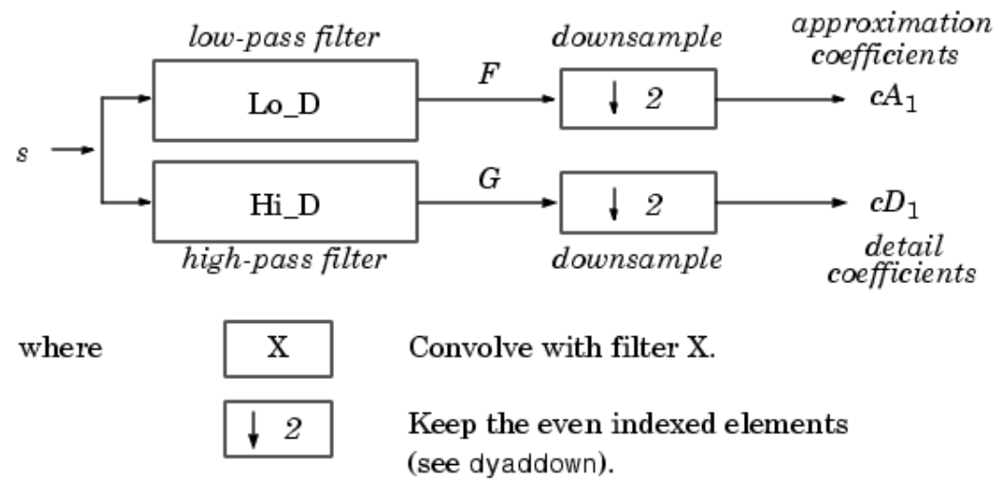


the length of each filter is equal to $2n$. if $N = length(s)$, the signal $F$ and $G$ are of length $N + 2n -1$  and the coefficients $cA_1$ and $cD_1$ are of length $floor(\frac{N−1}{2})+n$.

```python
# e.g. we convolve a filter of dimension 2*2 = 4 (expressed as "++++" ) (n = 2)
# to a signal s of 5 samples (expressed as "-----" ) (N = 5)

...-----... # signal s
++++....... # 1
.++++...... # 2
..++++..... # 3
...++++.... # 4
....++++... # 5
.....++++.. # 6
......++++. # 7
.......++++ # 8

# and we will obtain a new signal composed by 
# N + 2n - 1  = 5 + 4 - 1 = 8 samples.
# if we downsample it the samples become 4.
```

The next step splits the approximation coefficients $cA_1$ in two parts using the same scheme, replacing $s$ by $cA_1$, and producing $cA_2$ and $cD_2$, and so on.

The wavelet decomposition of the signal $s$ analyzed at level $j$ has the following structure: $[cA_j, cD_j, ..., cD_1]$.

This structure contains, for $j = 3$, the terminal nodes of the following tree:

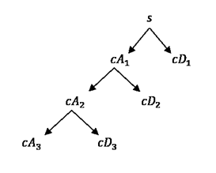

To go into further detail: *Mallat* suggests to decompose the signal utilizing two families of wavelet functions:

$ h_{j,k}(t) = 2^{j/2}h(2^jt-k)$  to extract Low-Frequency content from the signal (Approximation).

$ g_{j,k}(t) = 2^{j/2}g(2^jt-k)$   to extract High-Frequency content from the signal (Detail).

The index $k$ determines the position in time of the filter *w.r.t.* the signal.

----

Note that in the equations below we have that $j$ is the level of the decomposition, so we at each step we *spread* the *wavelets* $h$ and $g$ by a factor equal to $2^{j/2}$ (we *spread* it because at each step we are interested in lower frequencies, i.e. we need a longer window in order to detect them) and we implicitly consider just half of the samples (*downsampling*) at each decomposition step ( $t$ is multiplied by $2^j$ ) .

We apply the *downsampling* operation cause of the *Shannon's* theorem, if at the beginning we had a band of  $0\to500$ Hz we needed a *samplig frequency* of $1000$ Hz, once we have a band of $0\to250$ Hz we'll be ok with a sampling frequency of $500$ Hz.

-----

The couple of functions just described is known as "*quadrature mirror filters*" since presents the following property:
$$
g[L-1-n] = (-1)^n\cdot h[n]
$$
$g$ is a *high-pass* filter, $L$ is the number of samples. Starting from $j = 1$, the *Mallat* algorithm decompose the signal in two equal sub-bands, each of which is equal to half the spectrum of the former signal.  **The further subdivisions in sub-bands can be obtained by fixing the two filters $g[n]$ and $h[n]$  and compressing the signal exiting from the same filters.**

In the image below we can see an example of the two functions $g[n]$ and $h[n]$.

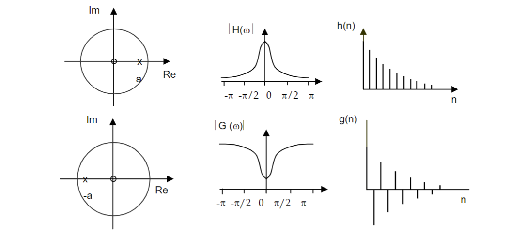

The *Mallat algorithm* can be seen as a bank of filters:

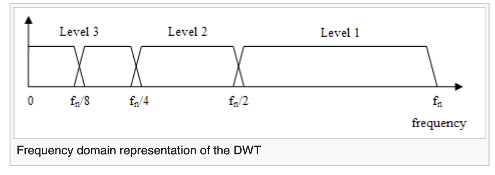

### Example of application of DWT in biomedical signals

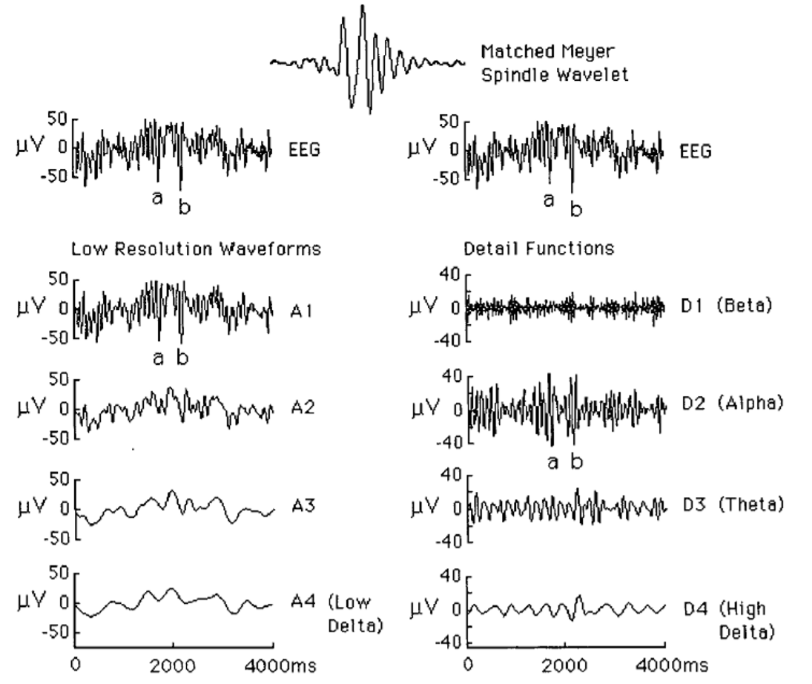

Four-Level DWT of the EEG trace at the top of the figure using the matched Mayer spindle wavelet. The four detail functions on the right correspond to the frequency bands associated with the *beta* (16-32 Hz), *alpha* (8-16 Hz), *theta* (4-8 Hz) and *high delta* (2-4 Hz) regimes. The A4 low resolution signals on the left corresponds to the frequency band associated with the *low delta* regime (0-2 Hz). Each of the remaining three low resolution signals on the left illustrate the effect of successively adding each detail function into the next lower low resolution signal to reconstruct the ERP at the top left of the figure. Good frequency selectivity by the matched Meyer spindle wavelet in the *alpha* band is evident in the figure.

# Difference between STFT and WT.

Traditionally, the techniques used for signal processing are realized in either the time or frequency domain. For instance, the Fourier Transform (FT) decomposes a signal into it’s frequency components; However, *information in time is lost.*

One solution is to adopt Short-Time-Fourier-Transform (STFT) that get frequency components of local time intervals of *fixed duration*. But if you want to analyze signals that contain *non-periodic and fast transients features* (i.e. high frequency content for short duration), you have to use *Wavelet Transform* (WT).

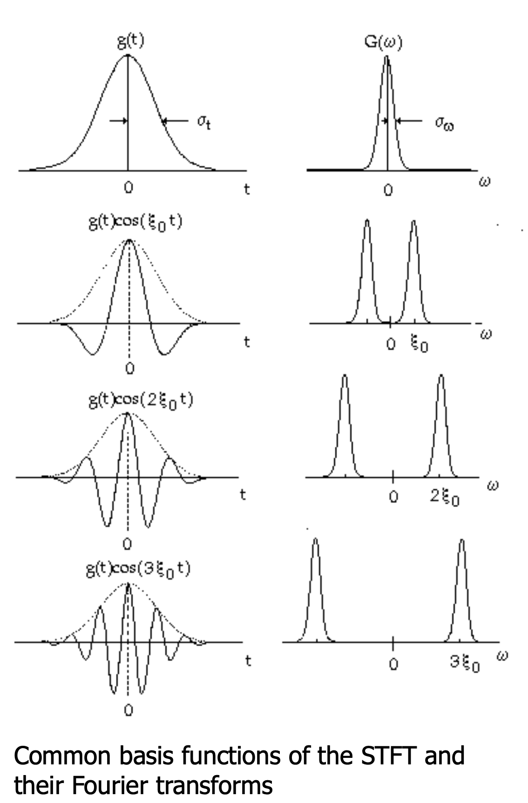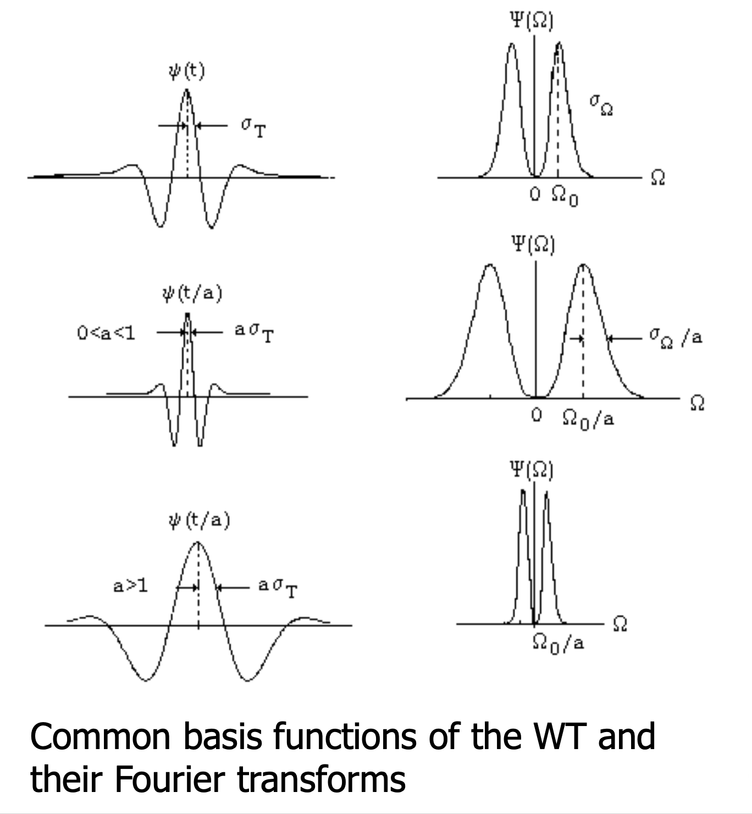

Unlike the FT or the STFT, the WT analyzes a signal at *different frequencies with different resolutions*. It can provide ***good time resolution and relatively poor frequency resolution at high frequencies while good frequency resolution and relatively poor time resolution at low frequencies***. Wavelet transform shows excellent advantages for the analysis of ***transient signals***.

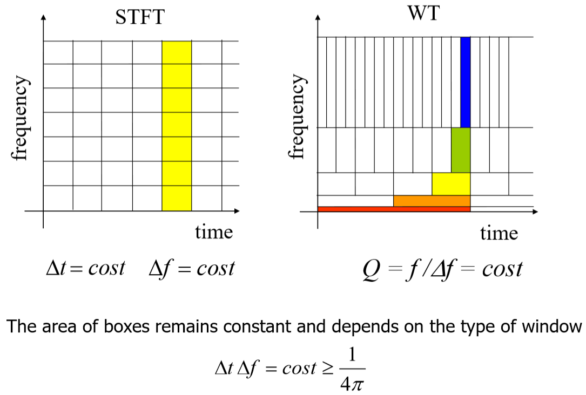

# Quadratic TF representation & Wigner-Ville distribution

In the previous questions/answers, we learned how to decompose a signal using elementary blocks of different shapes and dimensions: sinusoids, mother functions, or time-frequency distributions. These blocks are efficient tools for describing, in a synthetic way, morphological features of signals, such as waves, trends, or spikes. In a dual way, the same signal can be investigated in the frequency domain by using the Fourier transforms of these elementary functions. However, time and frequency domains are treated as separate worlds, often in competition because the need to locate a feature in time is usually paid for in terms of frequency resolution. A conceptually different approach aims to jointly look at the two domains and to derive a joint representation of a signal $x(t)$ in the combined time and frequency domain. A quadratic time-frequency distribution is designed to represent the signal energy simultaneously in the time and frequency domains and, thus, it provides temporal information and spectral information simultaneously.

A link between time and frequency domains may be obtained through the signal energy $E_x$ The following relation holds:
$$
E_x = \int{|x(t)|^{2}dt = \int|X(\omega)|^{2}d\omega}
$$
where $X(\omega)$ is the Fourier transform of the signal and $|X(\omega)|^2$ is its power spectrum. It is therefore intuitive to derive a *joint* time-frequency representation, $TFR(t,\omega)$, able to describe the energy distribution in the $t-f$ plane and to combine the concept of instantaneous power $|x(t)|^2$ with that of the power spectrum $|X_t(\omega)|^2$. Such a distribution, to be eligible as an *energetic* distribution, should satisfy the marginals
$$
\int{TFR_x(t,\omega)d\omega = |x(t)|^2} \\
\int{TFR_x(t,\omega)dt = |X(\omega)|^2}
$$
Thus, for every instant $t$ , the integral of the distribution over all the frequency should be equal to the instantaneous power, whereas, for every angular frequency ω, the integral over time should equal the power spectral density of the signal. As a consequence of the marginals, the total energy is obtained by integration of the $TFR$ over the whole $t-f$ plane: 
$$
E_x = \int\int TFR_x(t,\omega)d\omega dt
$$
This is trivial since
$$
|x(t)|^2=\int{TFR_x(t,\omega)d\omega}\\
E_x = \int|x(t)|^{2}dt = \int\int TFR_x(t,\omega)d\omega dt
$$
As the energy is a quadratic function of the signal, the $TFR(t,\omega)$ is expected to be quadratic.   An interesting way to define energetic $TFR$ starts from the definition of a time-varying spectrum (Page, 1952). Using the relationship that links power spectral density and TFR imposed by marginals, we derive a simple definition of a TFR:
$$
\text{from...}\int{TFR_x(t,\omega)dt = |X(\omega)|^2}\\
\text{to... }\ \ \ \ \ \ \ TFR(t,\omega) = \frac{\partial}{\partial t}|X_t(\omega)|^2
$$
The subscript $t$ indicates that the quantity is a function of time and, thus, $|X_\color{red}{t}(\omega)|^2$is a time-varying spectrum. The latter can be derived by generalization of the relationship between the power spectrum of a signal and its autocorrelation function $R_t(\tau)$ (Remember that from the *Wiener-Kinchin Theorem* the power spectrum is equal to the Fourier transform of the autocorrelation function):
$$
|X_t(\omega)|^2 = \frac{1}{2\pi}\int R_t(\tau)e^{-j\omega \tau}d\tau
$$
where
$$
R_t(\tau) = \int x(t)x^*(t-\tau)dt = \int x\left(t + \frac{\tau}{2}\right)x^*\left(t - \frac{\tau}{2}\right)dt
$$
is a function of time. By substitution, a new definition of TFR is obtained:
$$
TFR(t,\omega) = \frac{1}{2\pi}\int \frac{\partial}{\partial t}R_t(\tau)e^{-j\omega \tau}d\tau = \frac{1}{2\pi}\int K_t(\tau)e^{-j\omega \tau}d\tau
$$
where $K_t(\tau)$  is known as a *local autocorrelation function*.

See that $t$ and $\tau$ are different variables.

The above relation shows that a $TFR$ can be obtained as the Fourier transform of a *time-dependent autocorrelation function*. We may observe that due to the derivative operation, the integral that characterizes the $R_t(\tau)$ disappears in $K_t(\tau)$ which de facto describes local properties of the signal. Among all the possible choices of $K_t(\tau)$ the most simple (Mark, 1970) is to select
$$
K_t(\tau)=\frac{\part}{\part t}\int x\left(t + \frac{\tau}{2}\right)x^*\left(t - \frac{\tau}{2}\right)dt\\
K_t(\tau) = x\left(t + \frac{\tau}{2}\right)x^*\left(t - \frac{\tau}{2}\right) \\
$$
The derived time-frequency distribution
$$
TFR(t,\omega) = \frac{1}{2\pi}\int K_t(\tau)e^{-j\omega \tau}d\tau
$$
is known as the *Wigner-Ville (WV) distribution* .

(From now on we'll use the term $W_{xx}(t,f)$ instead of $TFR(t,\omega)$)

This distribution was originally introduced by *Wigner* (1932) in the field of quantum mechanics and successively applied to signal analysis by *Ville* (1948). It plays a fundamental role among the quadratic time-frequency distributions and it is a fundamental part of the *Cohen class* ( *we'll talk about that later*).

For a *linear chirp* (a signal whose instantaneous frequency varies linearly with time according to $ f_x(t) =f_0 + \alpha t $ ) it can be shown that 
$$
W_{xx}(t,f) = \delta[t,f-f_x(t)]
$$
(Dimostration at page $237$ of *Cerutti*'s book)

and the *WV* is a line in the $t-f$ plane, concentrated at any instant around the instantaneous frequency of the signal. From a practical point of view, this property shows that the representation is able to correctly localize (jointly in *time* and *frequency*) a sinusoidal component whose properties are varying with time.

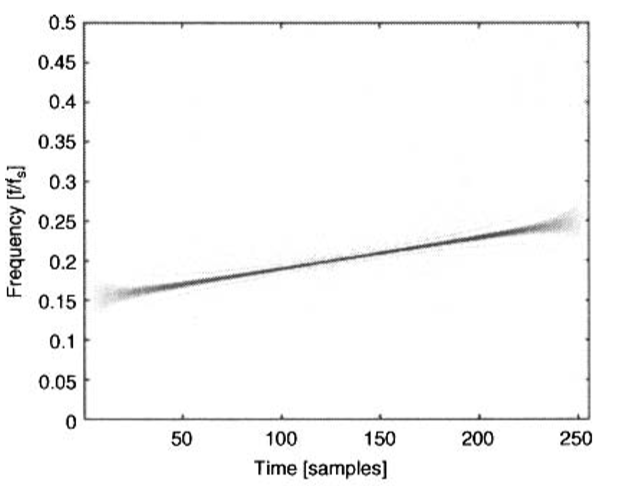

Even if the *WV* representation is attractive for representing single-component, nonstationary signals, *it becomes of poor utility when multicomponent signals are considered*. In these cases, the distribution may assume negative values (and this is in contrast with the interpretation of energetic distribution) and interference terms (or cross terms) appear. The cross terms disturb the interpretation of the $TFR $ as they are redundant information that may mask the true characteristics of the signal.

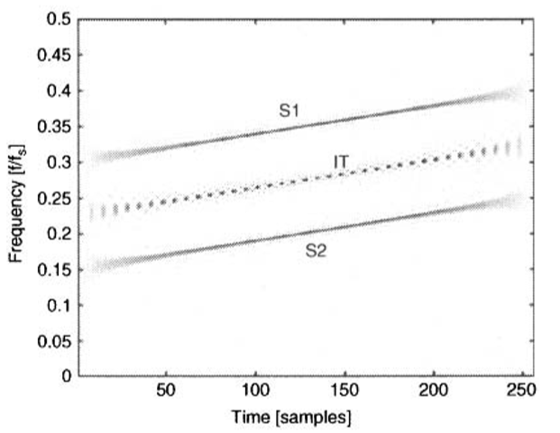

In the case of an N-component signal the representation will be characterized by N signal terms and 
$$
{N\choose 2}=\frac{N(N-1)}{2}
$$
interference terms. The latter grows quadratically in respect to the number of components and may overwhelm the signal contributes quite rapidly. 

An example is shown in the figure below where two signal terms are centered in $(t_1,f_1)$ and $(t_2,f_2)$ It is possible to observe that interference terms are located around the central point $[\;t_{12} = \frac{t_1+t_2}{2} \:,\:f_{12} = \frac{f_1+f_2}{2}\;]$ and their amplitude oscillates in time with a period of $\frac{1}{|f_1-f_2|}$ and in frequency with a period of  $\frac{1}{|t_1-t_2|}$. Therefore, the oscillation frequency grows with the distance between signal terms and the direction of oscillation is perpendicular to the line connecting the signal points $(t_1,f_1)$and  $(t_2,f_2)$. 


It is worth noting that the interference terms may be located in time intervals where no signal is present, for example between $t_1$ and $t_2$ in the figure above, showing signal contributions in an area where no activity is expected (like a mirage in the desert).

For the sake of curiosity, in the figure below we notice that IT may appear also in the case of a single component, interferences are located in the concavity of the distribution and are related to the interaction between past and future signal frequencies. 

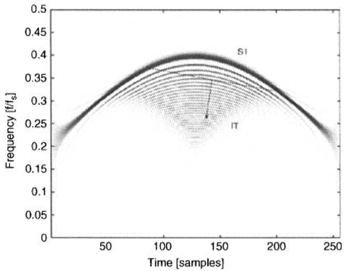

These effects make the *WV* hardly readable, especially when a wideband noise is superimposed, and many authors have labeled the *WV* as a *"noisy"* representation (Cohen, 1989). 

*Finally it is worth noting that any real signal generates interference between positive and negative frequencies of their spectrum, to avoid this effect in practical applications, the Hilbert transform is applied to the real signal to generate the analytic signal in which the negative frequencies are canceled.*

## Cohen's Class

The characteristics of cross terms (*oscillating*) suggest the strategy for their suppression: the idea is to perform a *two-dimensional low-pass filtering* of the $TFR$, in order to suppress the higher frequency oscillations.

If the properties of the selected filter do not depend on their position in the $t-f$ plane (i.e. the filter characteristics are invariant to shifts in the $t-f$ plane), we derive the class of shift-invariant, quadratic $TFRs$, known as *Cohen's Class* (*Cohen*, $1989$).
$$
C_{x,x}(t,f) = \int \int \Psi(u-t,v-f)W_{xx}(u,v)dudv
$$
As evident from the above relation, every member of the class can be obtained as the convolution between the $W_{xx}$ and a function $\Psi$ , the *kernel*.  

Every $TFR$ of this class can be interpreted as a filtered version of $W_{xx} $.  By imposing constraints on the *kernel* one obtains a subclass of $TFR$ with a particular property.

A few examples of $TFRs$ obtained using different *kernels* are shown in the next figure:

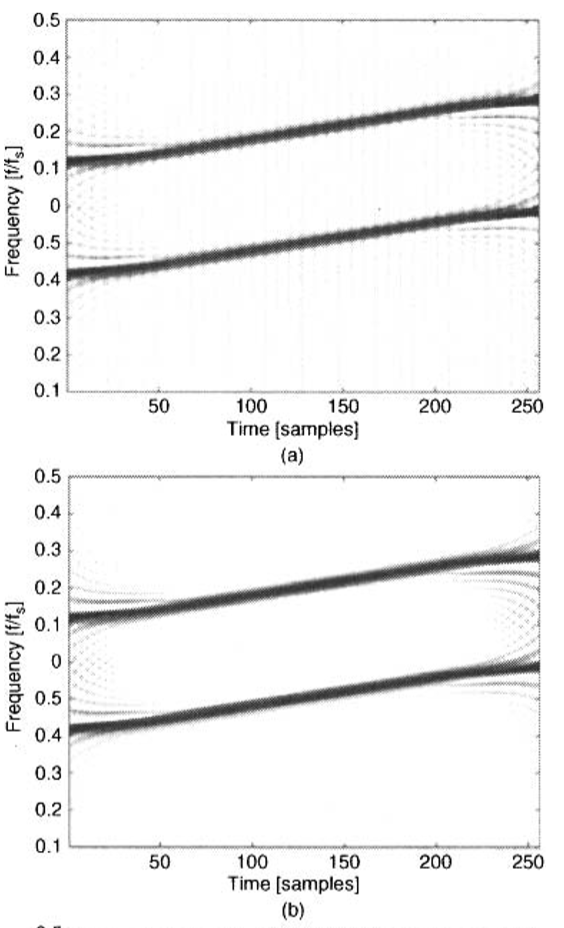

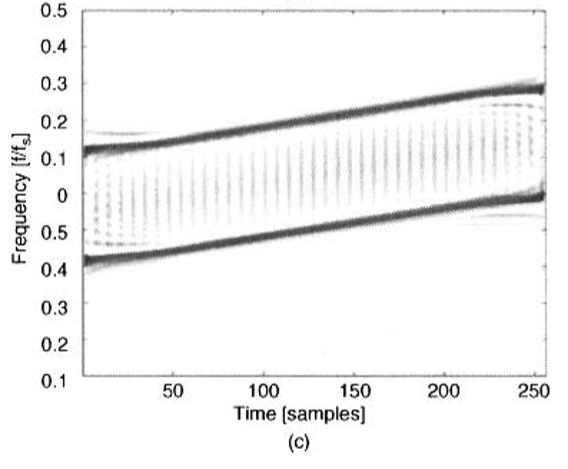

It is worth noting that the lines corresponding to the *chirps* are larger than in the figure shown in the previous question; thus, the *kernels* reduce time-frequency localization.

In fact, the useful property ($W_{xx}(t,f) = \delta[t,f-f_x(t)]$, see question above ) is lost in $C_{xx}$ due to the low-pass filtering effect of $\Psi$. Therefore, we are facing a compromise between the entity of the cross term and the preservation of joint time-frequency resolution in the $t-f$ plane.

*Whereas in the linear time-frequency representations the compromise is between time or frequency resolution, in the quadratic $TFR$ the compromise is between the maximization of joint $t-f$ resolution and the minimization of cross terms.*

The question is...*which tools* should be used to project the $TFR$ with the desired properties? An important tool is the *ambiguity function* ($AF$)
$$
A_{xx}(\theta,\tau) = \int x\left(t + \frac{\tau}{2}\right)x^*\left(t - \frac{\tau}{2}\right)e^{j\theta t}dt
$$
There's a structural analogy with the $WV$, with the difference that integration is performed over time. The $AF$ is the projection of $W_{xx}$ in the plane $\theta - \tau$ (known as the *correlative domain* ).

In fact we have that
$$
W_{xx}(t,f) = \frac{1}{2\pi}\int x\left(t + \frac{\tau}{2}\right)x^*\left(t - \frac{\tau}{2}\right)e^{-j2\pi f \tau}d\tau\\

A_{xx}(\theta,\tau) = \int x\left(t + \frac{\tau}{2}\right)x^*\left(t - \frac{\tau}{2}\right)e^{j\theta t}dt
$$


In this plane, signal and cross terms tend to separate. The former are mainly located close to the origin; the latter are located far from it. The effect is evident in the next figure:


A nice property of the *Cohen's Class* is that its representation in the correlative domain is simply described by a product:
$$
C_{xx}(\theta,\tau) = \phi(\theta,\tau)A(\theta,\tau)
$$
where $\phi(\theta,\tau)$ is the two-dimensional Fourier transform of $\Psi$ . 

From this equation the effect of the *kernel* can be immediately appreciated; it weights the points of the $\theta - \tau$ plane. Therefore, in order to perform an efficient reduction of cross terms, the function $\phi(\theta,\tau)$ should have higher values close to the origin than far from it. Thus $\phi(\theta,\tau)$ should be the transfer function of a two-dimensional low-pass filter, to get an idea just look at the grey zones in figures $(c)\space,\space (d) \space,\space (e)\space$ and $\space (f)$ below.

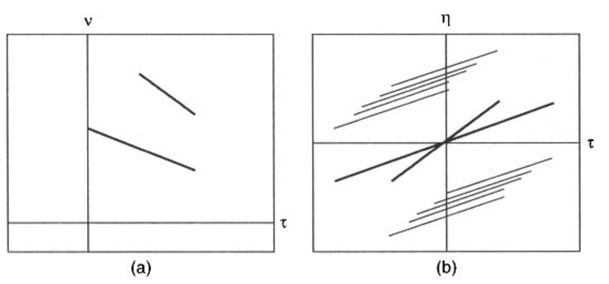

$(a)$ represents the $TFR$ of the signal and $(b)$ represents its projection in the $\theta - \tau$ plane, . signal terms are the two lines passing from the origin; the others are the IT (*interference terms*).

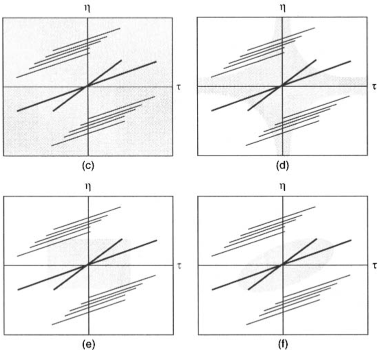

Here different *kernels* are superimposed on the $AF$:

$(c)$ *WV* kernel (*Wigner-Ville*)				$\phi(\theta,\tau) = 1$

$(d)$ BJD (*Born and Jordan*)				$\phi(\theta,\tau) = \frac{sin(\pi \tau\theta)}{\pi \tau \theta}$

$(e)$ SPWV (*Smoothed Pseudo Wigner-Ville*)			$\phi(\theta,\tau) = \eta(\frac{\tau}{2})\eta^{*}(-\frac{\tau}{2})G(\theta)$

$(f)$ generic *time-frequency* filter.

# Time-Variant parametric methods for Time-Frequency Analysis

The parametric approach to the estimation of power spectral density assumes that the time series under analysis is the output of a given process whose parameters are, however, unknown. Sometimes, some a priori information about the process is available, or it is possible to take into account some hypothesis on the generation mechanism of the series, and this can lead to a more targeted selection of the model structure to be used. The parametric spectral approach is a procedure that can be summarized in three steps: 

- Choice of the correct model for the description of the data .
- Estimation of the model parameters based on the recorded data.
- Calculation of the power spectral density (PSD) through proper equations (according to the selected model) into which the parameters of the estimated model are inserted . 

In practice, however, *linear models with rational transfer functions are most frequently used*; in fact, they can reliably describe a wide range of different signals. Among them, the autoregressive ($AR$) models are preferred for their all-pole transfer function;  in fact, their identification is reduced to the solution of a linear equation system. 
$$
y(t)=a_1y(t-1)+a_2y(t-2)+\dots+a_py(t-p)+e(t)
$$
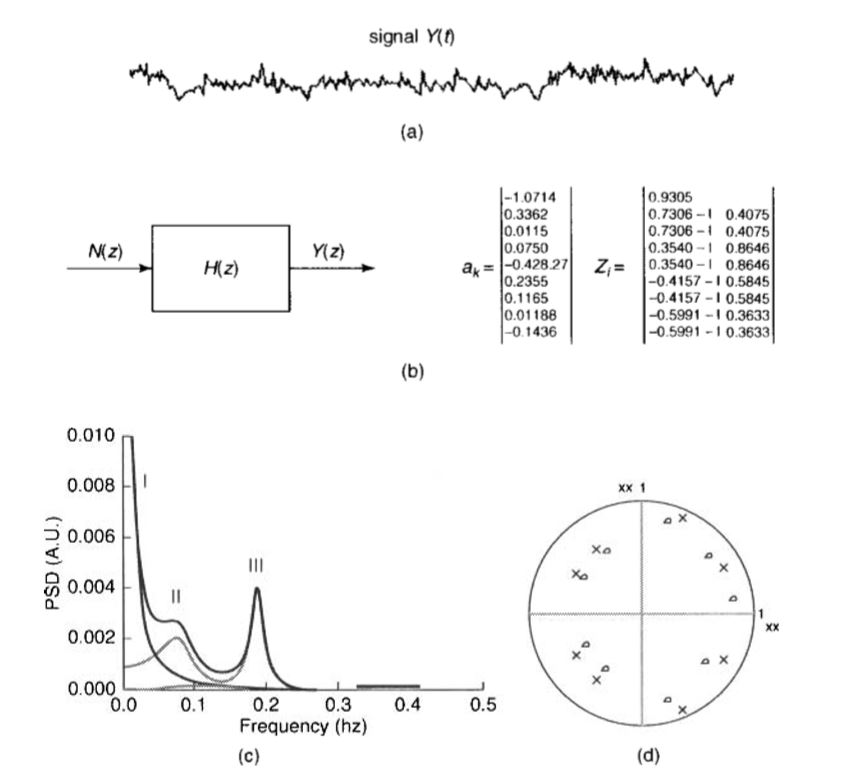


The described method provides an estimation based on a known sequence of data, and when a new value is made available (for example, because a new sample of the signal has been acquired), the whole identification procedure should be restarted. This could lead to considerable problems, for example, in real-time applications. It could be useful in such cases to maintain the already obtained information and evaluate only the innovation that the new sample provides to the model, using recursive methodologies. In the literature, different methods for recursive parametric identification do exist. They allow one to update the set of autoregressive parameters each time a new sample is made available, and find application in real-time processing systems. As better explained in the following, the use of proper forgetting factors makes the updating dependent mainly on the more recent data, allowing the model to track changes in the signal each time the hypothesis of stationarity is not verified. We can then obtain time-variant AR models from which we have spectral estimations that vary in time according to the dynamic changes of the signal. Adaptive spectral estimation algorithms belong to two main categories: approaches based on the approximation of a gradient (these include the well-known least-mean squares or LMS algorithm) and recursive estimation of least squares algorithms (recursive least squares, RLS). `During class we only talked about RLS (which is the most interesting and most used in literature)`.

Firstly, let's revisit the solution of the least squares identification for AR linear models.
$$
y(t) = a_1y(t-1)+a_2y(t-2)+\dots+a_py(t-p)+w(t)\\

\mathbf{a}=\left[ a_1,a_2,\dots,a_p\right]^T\\

\mathbf{\phi(t)}=\left[y(t-1),y(t-2),\dots,y(t-p)\right]^T\\

y(t)=\mathbf{\phi(t)}^T\mathbf{a}+w(t)\\

\hat{y}(t)=\mathbf{\phi(t)}^T\mathbf{a}\\

\varepsilon(t)=y(t)-\hat{y}(t)=y(t)-\mathbf{\phi(t)}^T\mathbf{a}\\

J_N=\frac{1}{N}\sum_{t=1}^N\varepsilon_{\mathbf{a}}^2(t)\\

\frac{\part J_N}{\part a} = -\frac{2}{N}\sum_{t = 1}^{N}\left(y(t)-\mathbf{\phi(t)^T\mathbf{a}}\right)\mathbf{\phi(t)}=0\\

\sum_{t = 1}^{N}\left(y(t)\mathbf{\phi(t)}-\mathbf{\phi(t)^T\mathbf{a}}\mathbf{\phi(t)}\right)=0\\

\sum_{t = 1}^{N}y(t)\underset{p\times 1}{\underbrace{\mathbf{\phi(t)}}}=\sum_{t=1}^{N}\left(\underset{1\times p}{\underbrace{\mathbf{\phi(t)^T}}}\underset{p\times 1}{\underbrace{\mathbf{a}}}\right)\left(\underset{p\times 1}{\underbrace{\mathbf{\phi(t)}}}\right)\\

\sum_{t = 1}^{N}y(t)\underset{p\times 1}{\underbrace{\mathbf{\phi(t)}}}=\sum_{t=1}^{N}\left(\underset{p\times 1}{\underbrace{\mathbf{\phi(t)}}}\right)\left(\underset{1\times p}{\underbrace{\mathbf{\phi(t)^T}}}\underset{p\times 1}{\underbrace{\mathbf{a}}}\right)\\

\sum_{t = 1}^{N}y(t)\underset{p\times 1}{\underbrace{\mathbf{\phi(t)}}}
=
\left(\sum_{t=1}^{N}\underset{p\times 1}{\underbrace{\mathbf{\phi(t)}}}\underset{1\times p}{\underbrace{\mathbf{\phi(t)^T}}}\right)\underset{p\times 1}{\underbrace{\mathbf{a}}}\\

\color{blue}{\hat{\mathbf{a}}}=\left[\sum_{t=1}^N\mathbf{\phi(t)}\mathbf{\phi(t)^T}\right]^{-1}\sum_{t=1}^N\mathbf{\phi(t)}y(t)=\underset{p\times p}{\underbrace{S(N)^{-1}}}\underset{p \times 1}{\underbrace{Q(N)}}
$$
Where $\mathbf{S(N)}$ is the autocorrelation matrix.

In the nonstationary case, the minimum to be reached is continuously moving and the algorithm needs to track it. This is possible when the input data are slowly varying in respect to the convergence speed of the algorithm. In such a case, the estimation of S and Q also needs to be updated for each new sample added to the known sequence. There is, however, the possibility of updating these quantities recursively, according to these relations: 
$$
\mathbf{Q(t)}=\mathbf{Q(t-1)}+\varphi(t)y(t)\\

\mathbf{S(t)}=\mathbf{S(t-1)}+\varphi(t)\varphi(t)^T\\

\color{red}{\text{Q(t) nel libro è sbagliato, secondo lui è: } Q(t) = Q(t-1)+ \varphi(t)\varphi(t)}
$$
Somehow we obtain the following recursive formulation (*Soderstom and Stoica*, $1989$):
$$
\cases{
\mathbf{\hat{a}}(t) = \mathbf{\hat{a}}(t-1)+\mathbf{K}(t)\varepsilon(t)\\
\mathbf{K}(t)=\mathbf{S}(t)^{-1}\varphi(t)\\
\varepsilon(t) = y(t)-\varphi(t)^T\mathbf{\hat{a}}(t-1)\\
\mathbf{S}(t) = \mathbf{S}(t-1)+\varphi(t)\varphi(t)^T
}
$$
In such a case, the parameter vector $\mathbf{\hat{a}}(t)$ is given by the sum of the same parameters obtained at the previous time instant $(t - 1)$ and of a correction term that is proportional to the estimation error $\varepsilon(t)$ weighed according to a gain vector $\mathbf{K}(t)$. Further, thanks to the matrix inversion lemma, the algorithm is made more efficient, as it is possible to directly update the matrix $\mathbf{P}(t) = \mathbf{S}(t)^{-1}$ without inversions at each iteration:
$$
\cases{
\mathbf{\hat{a}}(t) = \mathbf{\hat{a}}(t-1)+\mathbf{K}(t)\varepsilon(t)\\
\mathbf{K}(t)=\frac{\mathbf{P}(t-1)\varphi(t)}{1+\varphi(t)^T\mathbf{P}(t-1)\varphi(t)}\\
\varepsilon(t) = y(t)-\varphi(t)^T\mathbf{\hat{a}}(t-1)\\
\mathbf{P}(t) = \mathbf{P}(t-1)-\frac{\mathbf{P}(t-1)\varphi(t)\varphi(t)^T\mathbf{P}(t-1)}{1+\varphi(t)^T\mathbf{P}(t-1)\varphi(t)}
}
$$
If the samples of the signal come from a nonstationary process, we can introduce into the recursive formulation, a forgetting factor, $\lambda$, that modifies the figure of merit $J$ according to the following relation 
$$
J=\frac{1}{N}\sum_{t=1}^{N}\lambda^{N-t}\varepsilon(t)^2
$$
The forgetting factor (which assumes values $\lambda \ll 1$), exponentially weights the samples of the prediction error in the calculation of $J$, then gives importance to the more recent values in the definition of the updating while the oldest ones are progressively forgotten with a time constant, $T= 1/(1 - \lambda)$, that can be interpreted as the "memory length" of the algorithm. 

We end up with the following formulation:
$$
\color{blue}{\cases{
\mathbf{\hat{a}}(t) = \mathbf{\hat{a}}(t-1)+\mathbf{K}(t)\varepsilon(t)\\\ \\

\mathbf{K}(t)=\frac{\mathbf{P}(t)^{-1}\varphi(t)}{\lambda+\varphi(t)^T\mathbf{P}(t-1)\varphi(t)}\\\ \\

\varepsilon(t) = y(t)-\varphi(t)^T\mathbf{\hat{a}}(t-1)\\\ \\

\mathbf{P}(t) = \frac{1}{\lambda}\left[\mathbf{P}(t-1)-\frac{\mathbf{P}(t-1)\varphi(t)\varphi(t)^T\mathbf{P}(t-1)}{\lambda+\varphi(t)^T\mathbf{P}(t-1)\varphi(t)}\right]}}
$$
*RLS*'s performance is strongly dependent on the choice of the forgetting factor $\lambda$. Of course, the choice of the optimal forgetting factor is a critical point in the use of the time-varying models. In fact, high values of $\lambda$ may lead to inability to reliably track the fast dynamics of the signal, whereas too low values may make the algorithm too sensitive to the casual variations due to the noise. For these reasons, in the literature different formulations of the forgetting factor have been proposed that attempt to finding an optimal balance between the convergence speed and noise rejection. 


- *Varying forgetting factor*

	The prediction error contains relevant information about the goodness of the estimation. In fact, if its variance is small, the model is properly fitted to the data and the dynamic of the signal variation is slower than the adaptation of the algorithm. Thus, we can think of using a higher forgetting factor for making the estimation more reliable from a statistical point of view. If, on the contrary, the noise variance is high, the model is still converging, or the dynamics of the signal changes are faster than the adaptation capability of the algorithm. In such conditions, it could be useful to decrease the value of the forgetting factor in order to allow a faster convergence.

	!!! *Based on these considerations, Fortescue and Ydstie (1981) proposed the use of a varying forgetting factor able to self-adapt to the signal characteristics, increasing when the signal is slowly varying, and decreasing when transitions are fast.* !!!

- *Whale forgetting factor*

	From the approximate analysis of the estimation error (Lorito, 1993), it is possible to calculate how casual noise in the input data can affect the estimation error of the parameters. This relation is described by the transfer function that in case of the exponential forgetting factor (EF) has the following expression: 
	$$
	  G^{EF}(z)=\frac{1-\lambda}{1-\lambda z^{-1}}
	$$
	This is a low-pass filter with only one pole in $z = \lambda$, on which the properties of speed, adaptation, and noise rejection depend. The compromise between noise sensitivity and adaptation speed can be made less restrictive if we increase the degrees of freedom of the filter, for example, by increasing the number of the coefficients of its transfer function. With a higher number of poles, in fact, it is possible to modulate the shape of the impulse response and then the sensitivity to the noise and the adaptation speed (the WF is less sensible to high frequencies (probably noise) as you can see in the frequency response diagram). A solution adopted in literature uses a second-order transfer function: 
	$$
	G^{WF}(z)=\frac{1-a_1-a_2}{1-a_1z^{-1}-a_2z^{-2}}
	$$

where the coefficients are chosen in order to guarantee the filter stability (poles inside the unitary circle). 


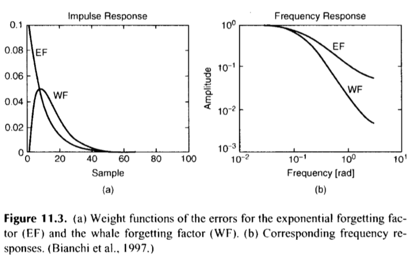


Simulated example in order to better understand the role of the forgetting factor:

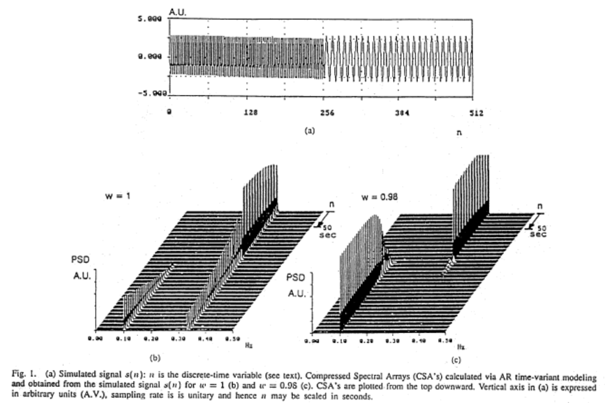

# Brief overview of TF methods:

- *STFT* *(Short Time Fourier Transform)* :

	uses time windows with constant duration and this allows obtaining a good frequency resolution with long time windows (bad time resolution) and viceversa.

- *WT*  *(Wavelet Transform)* :

	allows a multiresolution analysis that optimizes the time resolution and the frequency resolution for each frequency value.

- *WVD* *(Wigner-Ville Distribution)* :

	has a good time and frequency resolution, but it introduces interferences (cross-terms) that make the distribution hardly interpretable.

- *Time-Variant Models* :

	allow a good time and frequency resolution, but the performance is highly dependent on the morphology of the forgetting factor.