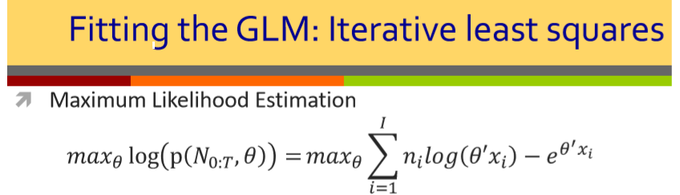

- ***Slide 2 Pag.30***

  
  $$
  \mathcal{D}(f||g)=\int \color{red}f(x)\color{black}\log_a\frac{f(x)}{g(x)}dx
  $$

- ***Slide 4 Pag.31***

  
  $$
  Pr(k\;spikes\;in\;[t,t+s])=\frac{(\lambda\color{red}(s)\color{black})^k}{k!}e^{-\lambda\color{red}(s)}\;\;\;\;\;for\;k=1,2,...
  $$
  

- ***Slide 5 Pag.22***

  
  $$
  p(N_{0:T})= \prod_{j=1}^{J}\lambda(u_j|\color{red}H_{u_{j}}\color{black})e^{-\int_{0}^T\lambda(u|H_{u})du}\\
  $$

- ***Slide 5 Pag.28***

  
  $$
  \underset{\theta}{\text{argmax }}\mathcal{L}(\theta) = \underset{\theta}{\text{argmax }}\sum_{i=1}^{I}\left(\color{red}n_i(\theta^{'}x_i)\color{black}-e^{\theta^{'}x_i}\right)
  $$

- **Slide 12 Pag.23**

  

  *Power Spectrum*:
  $$
  C(\omega_1)=\color{red}\sum_{\tau_1=-\infty}^{+\infty}\color{black}c_{\color{red}2}(\tau_1)e^{-j\omega_1\tau_1}\\
  $$
  *Bispectrum:*
  $$
  C(\omega_1,\omega_2)=\color{red}\sum_{\tau_1=-\infty}^{+\infty}\sum_{\tau_2=-\infty}^{+\infty}\color{black}c_{\color{red}3}(\tau_1,\tau_2)e^{-j\omega_1\tau_1}e^{-j\omega_2\tau_2}
  $$
  *Trispectrum*:
  $$
  C(\omega_1,\omega_2,\omega_3)=\color{red}\sum_{\tau_1=-\infty}^{+\infty}\sum_{\tau_2=-\infty}^{+\infty}\sum_{\tau_3=-\infty}^{+\infty}\color{black}c_{\color{red}4}(\tau_1,\tau_2,\tau_3)e^{-j\omega_1\tau_1}e^{-j\omega_2\tau_2}e^{-j\omega_{\color{red}3}\tau_3}
  $$

