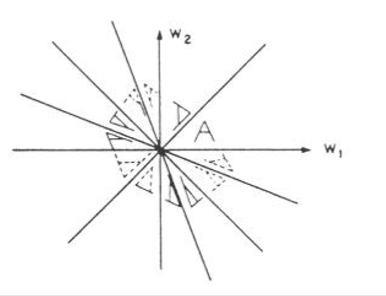

### Higher Order Spectra

Limits of *spectral analysis*:

Any information that the spectrum contains is a transfer from time to frequency of the *autocorrelation function* (which is just a second order function! ), so that any level above the second level is "lost", for example the spectrum discard all the *phase* relationship between oscillations. Different signals may have same power spectrum!

We can expand our framework and obtain more complex models.

But when do we have to consider non-linearities? For example when we observe non-gaussian signals (we know that gaussian signals are always the the product of some linear interaction)

We can define moments of a function $f(x)​$, the general formula for the moment, for a random variable $X​$ with distribution $f(x)​$, is:
$$
\mathbb{E}[g(x)]=\int_{-\infty}^{\infty}g(x)f(x)dx
$$
where $g(x)$ is a polinomial.

$\mathbb{E}[x]$ = *Mean* (mean value of $f(x)$)

$\mathbb{E}[x^2]​$ = *Autocorrelation* (dispersion of $f(x)​$ around its mean)

$\mathbb{E}[x^3]$ = *Skewness* (asimmetry of $f(x)$)

$\mathbb{E}[x^4]$ = *Kurtosis* (measure of the "*tailedness*" of $f(x)$)

Generally we define $m_r = \mathbb{E}[x^r]​$

If $f(x)$ is *Normal* we have $m_r=0\ \forall{r}>2$

An easy way to compute the moments is to subtract the mean to the signal (always do that if you want to understand its properties), we define the *Moment-Generating Function*:
$$
\Phi(t) = \mathbb{E}[e^{tx}]=\int_{-\infty}^{\infty}f(x)e^{tx}dx
$$
The exponential has a very classic form when expanded as a *Taylor series*:
$$
e^{tx} = 1+tx+\frac{t^2x^2}{2!}+\frac{t^3x^3}{3!}+\dots\\
\Phi(t) = \mathbb{E}[e^{tx}]=\int_{-\infty}^{\infty}\left(1+tx+\frac{t^2x^2}{2!}+\frac{t^3x^3}{3!}+\dots\right)f(x)dx=1+m_1t+\frac{m_2t^2}{2!}+\dots
$$
The $r^{th}$ order moment is defined as the $r^{th}$ derivative of the *moment-generating function* computed at $t=0$.
$$
\frac{\part^r}{\part t^r}\Phi(t)=\int_{-\infty}^{\infty}x^re^{tx}f(x)dx\underset{t\to0}{=}\int_{-\infty}^{\infty}x^rf(x)dx=\mathbb{E}[x^r] = m_r
$$
A further function can be generated, describing the probability disribution function of a random variable $\to$ *cumulant generating function*
$$
g(t) = \log(\mathbb{E}[e^{tx}]) = k_1t+\frac{k_2t^2}{2!}+\frac{k_3t^3}{3!}+\dots
$$
The cumulant of order $r$ is defined as the derivative of order $t$ of the *cumulant generating function* computed in $t=0$.

Because the cumulant generating function and the moment generating function are log linked, cumulants can be univocally defined as a function of moments (and viceversa)
$$
k_1 = m_1\\
k_2 = m_2-m_1^2\\
\dots
$$
If the variable has zero mean, then the first $3$ cumulants correspond to the first $3$ moments.
$$
k_1 = m_1\\
k_2 = m_2\\
k_3=m_3In case we have some multidimensional variable we have that that the total vectorial moment of order $r$ is defined by the sum of the powers $r_i$ of each single variable
$$
In case we have some multidimensional variable we have that that the total vectorial moment of order $r$ is defined by the sum of the powers $r_i$ of each single variable-

Consider the stochastic vector (a set of $n$ random variables)
$$
X = \{x_1,x_2,\dots,x_n\}
$$

$$
m_{r = r_1+r_2+\dots+r_n}=\mathbb{E}[x_1^{r_1}x_2^{r_2}\dots x_n^{r_n}]
$$
if $r_1=r_2=\dots=1$ the $n_{th}$ vectorial moment is
$$
m_n=\mathbb{E}[x_1x_2\dots x_n]
$$
Here we have the *joint moment generating function*:
$$
\Phi(t_1,t_2,\dots,t_n)=\mathbb{E}[e^{x_1t_1+x_2+t_2+\dots+x_nt_n}]\\
m_{1\dots N}(X) = \left.\frac{\part^N\Phi(x)}{\part x_1\dots\part x_N}\right|_{x_1 =x_2=\dots=x_N=0}
$$
therefore the cumulant of order $r$ is defined as the derivative of order $r$ of the *logarithm of the joint moment generating function*
$$
k_{1\dots N}(X)=\left.\frac{\part \ln(\Phi(X))}{\part x_1\dots\part x_N}\right|_{x_1=x_2=\dots=x_N=0}
$$
*Properties of cumulants:*

The spectrum of order $N$ is the *Multidimensional Fourier Transform* of the statistics of order $N+1​$ .

*Power Spectrum*:
$$
C(\omega_1)=\sum_{\tau_1=-\infty}^{+\infty}c_2(\tau_1)e^{-j\omega_1\tau_1}\\
$$
*Bispectrum:*
$$
C(\omega_1,\omega_2)=\sum_{\tau_1=-\infty}^{+\infty}\sum_{\tau_2=-\infty}^{+\infty}c_3(\tau_1,\tau_2)e^{-j\omega_1\tau_1}e^{-j\omega_2\tau_2}
$$
*Trispectrum*:
$$
C(\omega_1,\omega_2,\omega_3)=\sum_{\tau_1=-\infty}^{+\infty}\sum_{\tau_2=-\infty}^{+\infty}\sum_{\tau_3=-\infty}^{+\infty}c_4(\tau_1,\tau_2,\tau_3)e^{-j\omega_1\tau_1}e^{-j\omega_2\tau_2}e^{-j\omega_3\tau_3}
$$
We are just interested in the *Bispectrum* since it's the easiest to interpret.

With the bisepctrum we are able to detect interaction (dependence) between two different pahases of a signal. The *bispectrum* represents the constant phase relations in a bidimensional domain. It is defined as a function of the cumulant ( and *not moments*) because:

- The cumulants of order $n>2$ of a gaussian process are zero (the moment is not)
- Moments do not follow property $VI$ (zero cumulant for independent variables)
- HIgher order cumulants of a nongaussian white noise can be represented by multidimensional impulses
- The sum of the cumulants of independent processes is equal to the cumulant of the sum (property $V$). This is true for the moments only in presence of a single causal variable

Other properties of the bispectrum are:

- knowing the bispectrum in the triangular region
  $$
  \omega_1\ge\omega_2\\
  \omega_1+\omega_2\le\pi
  $$
  is sufficient for defining the bispectrum over the entire domain.

  

- The bispectrum is represented by complex values

- The bispectrum is periodic (period $2\pi$ ) along both dimensions

The bispectrum of a *linear (non gaussian) process* can be written in the frequency domain as:
$$
B(\omega_1,\omega_2) =\gamma_3^vH(\omega_1)H(\omega_2)H^*(\omega_1+\omega_2)
$$
The bispectrum is technique to detect phase relationships (or phase coupling) between different components of a signal. With EEGs, I can imagine it would be useful to understand how & which signal components (or latent sources captured by a single EEG) are covariates.

Bispectrum features are used to detect decreases in the stability of the phase relationships of fast rhythms in EEG signals, this is considered an abnormality that corresponds to the existence of Alzheimer disease.

In general we can compute the *Bicoherence*, which is a quantity that tells us how much the bispectrum in non-linear in respect to the power spectrum. (analogy with the *Coherence*!)
$$
\mathcal{Bic}(\omega_1,\omega_2)=\frac{B(\omega_1,\omega_2)}{\sqrt{P(\omega_1)P(\omega_2)P(\omega_1+\omega_2)}}
$$
We can see that if the numerator is perfectly linear we'd have that $\mathcal{Bic}$ is equal to $1$ and it gets less than $1$ otherwise