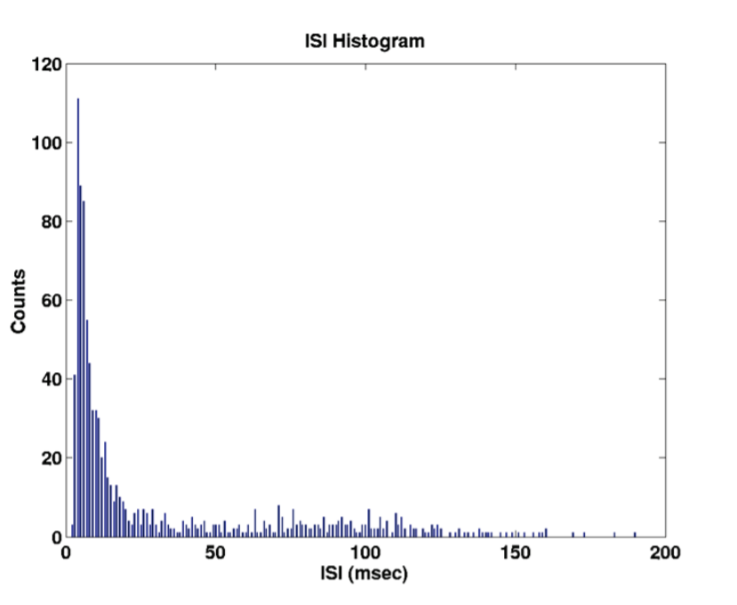

## Point Process Framework

- ***What is the problem of binning?***

  

    

  If we use too large bins we lose resolution, if we use too small bins we lose structure. Too much resolution is less able to capture "common rules" (Trade-off)

  It would be nice to build a model which doesn't suffer from this trade-off. How can we do that? We will have to make some specific assumptions. Remember that when we build a model we can only *restrict* the total amount of information that the brain is actually passing.

- ***Hazard Function in the Context of Survival Anaysis***

  In *Survival Analysis* we are interested in understanding the *risk* of an event happening at a particular point in time, where time is a continuous variable.

  For example, let's consider the event *firing of a neuron*, we define the time of firing as $X$, and time in general as $t$.

  The *hazard function*, which is a function of time, is defined as:
  $$
  h(t) = \lim_{\Delta t\to0}\frac{P(t<X<t+\Delta t|X>t)}{\Delta t}
  $$
  We are conditioning on $X>t​$ because we want to condition our probability on the fact that the event *hasn't occurred yet*.

  It's important to note that $h(t)​$ doesn't represent a probability, it can assume values bigger than $1​$.

  Is there a way to rewrite $h(t)$ in a different way?
  $$
  h(t) = \lim_{\Delta t\to0}\frac{P(t<X<t+\Delta t|X>t)}{\Delta t}\\
  h(t) = \lim_{\Delta t\to0}\frac{P(t<X<t+\Delta t,X>t)}{P(X>t)\Delta t}\\
  $$
  It is easy to see that $(t<X<t+\Delta t)$ is just a subset of $X>t$

  ```
  	O---------------------- {     X > t    }
      |		o-------------- { t < X < t+Δt }
      |		|	 	
  ----.-------.----.---------
  	t		X   t+Δt
  ```


$$
  h(t) = \lim_{\Delta t\to0}\frac{P(t<X<t+\Delta t)}{P(X>t)\Delta t}
$$
  $P(X>t)$ is called the *survival function* and is just $1$ minus the cumulative distribution function (*CDF*):
$$
  P(X>t) = 1-F(t)=1-\int_{t_0}^tp(t)dt
$$
  The remaining part is the definition of the derivative of the *CDF*, which is just the *probability density function* (*PDF*) at time $t​$ 
$$
  \lim_{\Delta t\to0}\frac{P(t<X<t+\Delta t)}{\Delta t}= \lim_{\Delta t\to0}\frac{P(X<t+\Delta t)-P(X <t)}{\Delta t}=\\
  \lim_{\Delta t\to0}\frac{F(t+\Delta t)-F(t)}{\Delta t}=p(t)
$$
  So, finally we can rewrite the *hazard function* as:
$$
  h(t) = \frac{p(t)}{1-\int_{t_0}^tp(t)dt}
$$

- ***The Conditional Intensity Function and ISI probability density***

  The key to deriving the likelihood function for a parametric model of a neural spike train is defining the joint probability density. The joint probability density of a neural spike train can be characterized in terms of the conditional intensity function. Therefore, we first derive the conditional intensity function for a point process and review some of its properties. 

  Firstly, some definitions: 

  - $(\ 0,T\ ]$ denotes the *observation interval* 
  - $0<u_1<u_2<\dots<u_{J-1}<u_J\le T$ is a set of $J$ spike time measurements
  - $N(t)$ is the number of spikes in $(\ 0,t\ ]$
  - $N_{0:t}$ is the event $\{\ 0<u_1<u_2<\dots<u_j\le t\ \cap N(t) = j\ \}$ where $j\le J$ 

  The function $N_{0:t}$ tracks the location and number of spikes in $(\ 0,t\ ]$ and hence, contains all the information in the sequence of spike times.

  We define the *Condtional Intensity Function* for $t\in (\ 0,T\ ]$ as:
  $$
  \lambda(t|H_t)=\lim_{}\frac{Pr(N(t+\Delta)-N(t)=1|H_t)}{\Delta}
  $$
  where $H_t$  is the history of the sample path and of any covariates up to time $t$.

  In *survival analysis* the *CIF* is called the *hazard function*, it follows that $\lambda(t|H_t)$ can be defined in terms of inter-event or spike time probability density at time $t$ , $p(t|H_t)$ , as
  $$
  \lambda(t|H_t) = \frac{p(t|H_t)}{1-\int_0^tp(u|H_u)du}
  $$
  Moreover it is possible to prove that the probability of having a spike in $[\ t,t+\Delta \ ]$ given $H_t$ and that there has been no spike in $(\ 0,t\ )$ is
  $$
  Pr(u\in[t,t+\Delta]\ |\ u>t,H_t) \sim\lambda(t|H_t)\Delta
  $$
  which is extremely important; this means that, for any time interval $[\ t,t+\Delta \ ]$ , $\lambda(t|H_t)\Delta$  

  defines *the probability of a spike given the history up to time $t$ .*

  If the spike train is an *inhomogenous Poisson Process* then $\lambda (t|H_t) = \lambda(t)$ becomes the *Poisson rate function*

  This can be dervied from the following observations:
  $$
  \lambda(t|H_t)=-\frac{d\left[\log(\ 1-\int_0^tp(u|H_u)du\ )\right]}{dt}
  $$
  Or, equivalently
  $$
  -\int_0^t\lambda(u|H_u)du=\log(\ 1-\int_0^tp(u|H_u)du\ )
  $$
  Finally, exponentiating yields
  $$
  e^{-\int_0^t\lambda(u|H_u)du} =1-\int_0^tp(u|H_u)du
  $$
  and combining the equation above with $\lambda(t|H_t) = \frac{p(t|H_t)}{1-\int_0^tp(u|H_u)du}$ leads to
  $$
  p(t|H_t) = \lambda(t|H_t)e^{-\int_0^t\lambda(u|H_u)du}
  $$
  In this way we just proved that *given the conditional instensity function the interspike interval probability density is specified and viceversa.* Hence, defining one completely defines the other.

- ***Estimating the Likelihood***

  Now, supposing to have a set of $n$ events, if events are independent, the probability of their union of happening all together, is the product of the probability of having each of the events. If they are not independent, it means that one event is conditional to another event or more than one event. 

  Given a set of $n$ events $E_1,E_2,E_3,\dots,E_n$

  it the events are independent

  $Pr(E_1\cap E_2 \cap E_3\dots\cap E_n)=\prod_{j=1}^{n}Pr(E_j)$

  if they are not independent

  $Pr(E_1\cap E_2 \cap E_3\dots\cap E_n)=\prod_{j=2}^{n}Pr(E_j|E_1,\dots E_{j-1})Pr(E_1)$

  which comes from (e.g. for $4​$ events) :
  $$
  {\displaystyle {\begin{aligned}\mathrm {P} (E_{4}\cap E_{3}\cap E_{2}\cap E_{1})&=\mathrm {P} (E_{4}\mid E_{3}\cap E_{2}\cap E_{1})\cdot \mathrm {P} (E_{3}\cap E_{2}\cap E_{1})\\&=\mathrm {P} (E_{4}\mid E_{3}\cap E_{2}\cap E_{1})\cdot \mathrm {P} (E_{3}\mid E_{2}\cap E_{1})\cdot \mathrm {P} (E_{2}\cap E_{1})\\&=\mathrm {P} (E_{4}\mid E_{3}\cap E_{2}\cap E_{1})\cdot \mathrm {P} (E_{3}\mid E_{2}\cap E_{1})\cdot \mathrm {P} (E_{2}\mid E_{1})\cdot \mathrm {P} (E_{1})\end{aligned}}}
  $$
  Why are we interested in this? Well, spike train is a series of events, so we can define the joint density of a spike train. In our formulation the inter-event intervals are *independent and identically distributed (i.i.d) random variables*.

  -----------------------------------------------------------

  Given the *spike times* $0<u_1,u_2,u_3,\dots,u_k<T$ 

  The joint distribution of the spikes is 
  $$
  p(u_1,u_2,u_3,\dots,u_k)=\prod_{j=1}^{k}\lambda(u_j|H_j)e^{-\int_0^T\lambda(u|H_u)du}
  $$
  We are going to prove this at the end of this section.

  ------

  The likelihood of a neural spike train, like that of any statistical model, is defined by finding the joint probability density of the data. We show that the joint probability of any point process is easy to derive from the conditional intensity function. 

  Joint probability density can be written as a product of conditional *Bernoulli* probabilities in terms of the conditional intensity function. At each moment in time we might have or not a spike. This *joint probability* is extremely important! It is the measure that we will use to choose a model in respect to another model.

  *Derivation of the Joint Probability:*

  Let $\{t_k\}_{k=1}^{K}$ be a partition of the observation interval $(\ 0,T\ ]$ , take $\Delta_k=t_k-t_{k-1}$, where $t_0=0$. Assume that the partition is sufficiently fine so that there is at most one spike in any $(\ t_{k-1},t_k \ ]$. For a neural spike train choosing $\Delta_k\le1$ *msec* would suffice. We define $n_k=1$ if there is a spike in $(\ t_{k-1},t_k \ ]$ and $n_k=0​$ otherwise.

  By construction of the partition we must have $\mu_j \in (\ t_{k_j-1},t_{k_j}\ ]\ \ ,\ j=1,\dots,J$ (*remember that $J$ is the total number of spikes we observed*) satisfying $k_1<k_2\dots<k_J$. The remaining $K-J$ intervals have no spikes.

  

  *Remember that* $Pr(u\in[t,t+\Delta]\ |\ u>t,H_t) \sim\lambda(t|H_t)\Delta​$ 
  $$
  \prod_{k=1}^{K}Pr(t_k|H_{t_k}) = \prod_{k=1}^{K}\left[\lambda(t_k|H_{t_k})\Delta\right]^{n_k}\left[1-\lambda(t_k|H_{t_k})\Delta\right]^{1-n_k}\\
  
  = \prod_{k=1}^{K}\left[\lambda(t_k|H_{t_k})\Delta\right]^{n_k}\left[1-\lambda(t_k|H_{t_k})\Delta\right]^{-n_k}\prod_{k=1}^K\left[1-\lambda(t_k|H_{t_k})\Delta\right]\\
  
  \color{red}\lim_{x\to 0}e^x=1+x\\
  
  = \prod_{k=1}^{K}\left[\frac{\lambda(t_k|H_{t_k})\Delta}{1-\lambda(t_k|H_{t_k})\Delta}\right]^{n_k}\prod_{k=1}^Ke^{-\lambda(t_k|H_{t_k})\Delta}\\
  
  \ \\
  \color{red}e^{\log x}= x\\
  \ \\
  =e^{\log\left[\prod_{k=1}^{K}\left[\frac{\lambda(t_k|H_{t_k})\Delta}{1-\lambda(t_k|H_{t_k})\Delta}\right]^{n_k}\prod_{k=1}^Ke^{-\lambda(t_k|H_{t_k})\Delta}\right]}\\
  \ \\
  =e^{\sum_{k=1}^{K}\log\left[\left(\frac{\lambda(t_k|H_{t_k})\Delta}{1-\lambda(t_k|H_{t_k})\Delta}\right)^{n_k}\right]+\sum_{k=1}^K\log\left[e^{-\lambda(t_k|H_{t_k})\Delta}\right]}
  \ \\
  \ \\
  =e^{\sum_{k=1}^{K}n_k\log\left(\frac{\lambda(t_k|H_{t_k})\Delta}{1-\lambda(t_k|H_{t_k})\Delta}\right)-\sum_{k=1}^K\lambda(t_k|H_{t_k})\Delta}\\
  \ \\
  \color{red}\lim_{\Delta\to 0}\log\frac{\lambda(t_k|H_{t_k})\Delta}{1-\lambda(t_k|H_{t_k})\Delta}=\log \lambda(t_k|H_{t_k})\Delta\\
  \ \\
  \ \\
  = e^{\sum_{k=1}^{K}n_k\log\left[\lambda(t_k|H_{t_k})\Delta\right]-\sum_{k=1}^K\lambda(t_k|H_{t_k})\Delta}\\
  $$
  The probability density of these $J$ exact spikes in $(\ 0, T\ ]$, given by $p(N_{0:T}) = \lim_{\Delta\to 0}\frac{\prod_{k=1}^{K}Pr(t_k|H_{t_k})}{\prod_{j=1}^J\Delta}$ is then obtained from
  $$
  p(N_{0:T})=\lim_{\Delta\to 0}\frac{e^{\sum_{k=1}^{K}n_k\log\left[\lambda(t_k|H_{t_k})\Delta\right]-\sum_{k=1}^K\lambda(t_k|H_{t_k})\Delta}}{\prod_{j=1}^J\Delta}\\
  \ \\
  p(N_{0:T})= \lim_{\Delta\to 0}\frac{e^{\sum_{k=1}^{K}n_k\log\left[\lambda(t_k|H_{t_k})\right]+\sum_{j=1}^J\log\left(\Delta\right)-\sum_{k=1}^K\lambda(t_k|H_{t_k})\Delta}}{\prod_{j=1}^J\Delta}\\
  \ \\
  p(N_{0:T})= \lim_{\Delta\to 0}\frac{e^{\sum_{k=1}^{K}n_k\log\left[\lambda(t_k|H_{t_k})\right]-\sum_{k=1}^K\lambda(t_k|H_{t_k})\Delta}\cdot e^{\sum_{j=1}^J\log\left(\Delta\right)}}{\prod_{j=1}^J\Delta}\\
  \ \\
  p(N_{0:T})= \lim_{\Delta\to 0}\frac{e^{\sum_{k=1}^{K}n_k\log\left[\lambda(t_k|H_{t_k})\right]-\sum_{k=1}^K\lambda(t_k|H_{t_k})\Delta}\cdot \prod_{j=1}^J\Delta}{\prod_{j=1}^J\Delta}\\
  \ \\
  \text{Finally...}\\
  \ \\
  p(N_{0:T})= e^{\int_{0}^{T}\log\left[\lambda(t|H_{t})\right]dN(t)-\int_{0}^T\lambda(t|H_{t})dt}\\
  $$
  which is the *joint probability density of the point process spike train in continuous time*. The logarithm of this quantity is called *log-likelihood* and is the quantity that we will want to *maximize*.
  $$
  \mathcal{L} = \int_{0}^{T}\log\left[\lambda(t|H_{t})\right]dN(t)-\int_{0}^T\lambda(t|H_{t})dt
  $$
  Note that we could have derived the likelihood for the continuous time point process by a generalization of the continuous time Poisson process, without resorting to representing the neural point process as a conditional Bernoulli process. 

  In fact we have that
  $$
  p(N_{0:T})= e^{\int_{0}^{T}\log\left[\lambda(t|H_{t})\right]dN(t)-\int_{0}^T\lambda(t|H_{t})dt}\\
  p(N_{0:T})= e^{\int_{0}^{T}\log\left[\lambda(t|H_{t})\right]dN(t)}e^{-\int_{0}^T\lambda(t|H_{t})dt}\\
  p(N_{0:T})= \prod_{j=1}^{J}\lambda(u_j|H_{u_{j}})e^{-\int_{0}^T\lambda(u|H_{u})du}\\
  $$

- ***How do we maximize the Likelihood?***

  As said before, we want to *maximize* the *log-likelihood*
  $$
  \mathcal{L} = \int_{0}^{T}\log\left[\lambda(t|H_{t})\right]dN(t)-\int_{0}^T\lambda(t|H_{t})dt
  $$
  To do so, we can parametrize either the *CIF* either the *PDF*.

  The *simplest case* is to model the log of the *CIF* by a linear regression
  $$
  \log \lambda(i|H_i) = \mu+\underset{\color{red}\text{Stimulus}}{\underbrace{\sum_{j=0}^{J}\alpha_js_{i-j}}}+\underset{\color{red}\text{History}}{\underbrace{\sum_{k=1}^{K}\beta_k n_{i-k}}}=\theta^{'}x_i
  $$
  This is a *Generalized Linear Model with*

  - Poisson Observations $\color{red}??$
  - Log-Link $\color{red}??$

  $$
  \underset{\theta}{\text{argmax }}\mathcal{L}(\theta) = \underset{\theta}{\text{argmax }}\sum_{i=1}^{I}\left(n_i(\theta^{'}x_i)-e^{\theta^{'}x_i}\right)
  $$

  The *GLM* is a flexible generalization of ordinary linear regression that allows for response variables that have error distribution models other than a *normal distribution*. 

  The *GLM* generalizes linear regression by allowing the linear model to be related to the response variable via a *link function* and by allowing the magnitude of the variance of each measurement to be a function of its predicted value.  ([Look Here](<https://www.youtube.com/watch?v=vpKpFMUMaVw>))

  - *Gaussian GLM*
    $$
    y_i\sim\mathcal{N}(c_i\sigma^2)
    $$
    mean = linear function of covariates $c_i = \theta^{'}x_i$ 

  - *Poisson GLM*
    $$
    n_i\sim\mathcal{Poisson}(\lambda(i|H_i)\Delta)
    $$
    mean = *nonlinear* function of covariates $\log \lambda(i|H_i) =\theta^{'}x_i$ $\color{red}??$

  Another interesting approach consists in the *State-Space Models*

  *General Paradigm*:

  - Observation Model
    $$
    \mathcal{Data}_t=f(\mathcal{Signal}_t,\mathcal{Noise}_t)
    $$

  - State Model
    $$
    \mathcal{Signal}_t=f(\mathcal{Signal}_{t-1}\ ,\ \mathcal{Noise}_t)
    $$

  - FIltering
    $$
    \hat{\mathcal{Signal}}_t=\hat{\mathcal{Signal}}_{t-1} +\mathcal{K}_t(\mathcal{Data}_t-\mathcal{Predicted\ Data}_t)
    $$
    

  A Linear State-Space Model can be summarized as

  $\color{red}\text{Ma qui u(t) è il notro $n_t$ di prima? (0 o 1 a seconda del fatto che il neurone abbia sparato o meno)}$
  $$
  \begin{cases}
  \frac{dx(t)}{dt}=Ax(t)+\underset{\ \ \ \ \text{Input}}{B\underbrace{u(t)}}\ \ \ \ \text{State evolution}\\  \\
  y(t) = Cx(t)+Du(t)\ \ \ \ \ \text{Observation}
  \end{cases}
  $$
  a Linear Discrete State-Space model can be derived (see [here](<https://en.wikipedia.org/wiki/Discretization#Discretization_of_linear_state_space_models>) for the proof):
  $$
  \begin{cases}
  x_{k+1}=\mathcal{A}x_k+\mathcal{B}u_k\ \ \ \ \text{State evolution}\\  \\
  y_k = Cx_k+Du_k\ \ \ \ \ \text{Observation}
  \end{cases}\\
  \ \\
  \mathcal{A}=e^{AT}\\
  \mathcal{B}=A^{-1}(e^{AT}-I)B
  $$
  where $T$ is the sampling time.

  From deterministic to probabilistic:
  $$
  \begin{cases}
  x_{k+1}=\mathcal{A}x_k+\mathcal{B}u_k\\
  y_k = Cx_k+Du_k
  \end{cases}\\
  $$
  *becomes*...
  $$
  Pr(x_{k+1}|x_k,x_{k-1},u_k)\\
  Pr(y_k|x_k,x_{k-1},\dots,u_k)
  $$
  if *Markov*:
  $$
  Pr(x_{k+1}|x_k,u_k)\\
  Pr(y_k|x_k,x_{k-1},\dots,u_k)
  $$
  Coming back to our GLM problem we'd have that:
  $$
  Pr(\mathbf{x_k}=[n_{k-K+1},n_{k-K+2},\dots,n_{k-1},\mathbf{1}]\ |\mathbf{x_{k-1}})\sim\lambda(n_k|H_k)\Delta\\
  Pr(\mathbf{x_k}=[n_{k-K+1},n_{k-K+2},\dots,n_{k-1},\mathbf{0}]\ |\mathbf{x_{k-1}})\sim 1-\lambda(n_k|H_k)\Delta
  $$
  ***Recursive Solution:***

  *Chapman-Kolmogorov Equation* (I think with *Markov* hipothesys)

  (Prediction Step):
  $$
  \color{black}p(x_{k+1}|y_{1:k})=\int_{x_k}\color{green}\underset{\text{State Equation}}{p(x_{k+1}|x_k)}\color{red}p(x_k|y_{1:k})\color{black}dx_k
  $$
  (Update Step):
  $$
  \color{red}\underset{\text{Posterior Density}}{p(x_{k+1}|y_{1:k+1})}=\frac{\color{blue}\overset{\text{Observation Equation}}{p(y_{k+1}|x_{k+1})}\color{black}p(x_{k+1}|y_{1:k})}{\int_{x_{k+1}}p(y_{k+1}|x_{k+1})p(x_{k+1}|y_{1:k})dx_{k+1}}
  $$


  $\color{purple}\text{What is y????}​$

  

- ***Once we find our model, is there a way to graphically measure the goodness-of-fit of our model?***

  Yes, we can use the *Kolmogorov-Smirnov (KS) Plots*

  For the *Time Rescaling Theorem* we know that: 

  "*Any set of observations from a point process that has a conditional intensity function can be transformed into a sequence of independent exponential random variables with a rate of $1​$.*" 

  So, given the *spike times* $0<t_1,t_2,t_3,\dots,t_k<T$ 

  we define the transformed variables $z_j$ as
  $$
  z_j = \int_{t_{j-1}}^{t_j}\lambda(u|H_u)du
  $$
  which, as already said, are independent, exponential random variables with rate $1$.

  A further transformation of the $z_j$'s gives
  $$
  \mu_j = 1-e^{-z_j}
  $$
  which, if the model is correct, are uniformly distributed variables between zero and one.

  To construct the KS plot:

  - Order the observations (empirical quantiles) $\mu_j = \mu_{(j)}$ for $j=1,\dots,J$ 
  - Compute the theoretical quantiles $b_j = \frac{j-\frac{1}{2}}{j}​$ for $j=1,\dots,J​$ 
  - Plot $b_j​$ *vs.* $\mu_j​$ with $95\%(99\%)​$ confidence intervals $b_j\pm\frac{1.36}{j^{1/2}}(b_j\pm\frac{1.63}{j^{1/2}})​$

- ***Once we estimateed $\lambda$ , how could we simulate a Point Process?***

- We want to find the best way to *estimate the stimulus from the response.*

  

  We formulate the problem in terms of the probability distribution $p(T)​$ of inter-spike intervals (*ISI*s), assuming that spikes are detected with arbitrary but finite temporal resolution.

  -------------

  An *inter-spike-interval histogram* is one of the ways by which experimental neurophysiologists analyze the electrical behaviour of neurons in the brain, it consists in a plot of the distribution of the observed times between spikes ($t_1, t_2, t_3,$ etc) collected in "bins" of fixed width, say $1$ $ms$. Typically, such a histogram would be constructed from about $2000$ such intervals; if a neuron is firing at an average rate of about 5 spikes/s this will need a recording of $5$-$10$ $min$ of activity.

  -----------

  So, the first thing we do to build a model is to build the *ISI* (Inter Spike Interval) function.

  The *ISIH* below is the result of of maintaining retinal neurons under constant light and environmental conditions. The spontaneous spiking activity of these neurons is recorded.

   

  The ISIH is more powerful than the PSTH because it allows to extrapolate concepts independently from the stimulus , so if we want to go beyond the specific stimulus we have to build histograms where *time* is absolute ( *ISIH* ). This is extremely useful because we know that neurons are encoding in frequency and the *ISIH* is telling us something about it. The ISI Probability Density Function is the ISI normalized by the total number of spikes.

  Nowe, given the following problem (a rat moving in some $2-D​$ space denoted by $x_1​$ and $x_2​$)

    

  We'd like to infer the *stimulus* (position) by looking at the *response* (spiking) [Look here](<https://www.youtube.com/watch?v=lfNVv0A8QvI>)

  We have a *continuous* hidden process (which is the trajectory of the *rat*) and then there is the spiking activity which is *not* continuous but happens in *specific* points in time, we call this kind of process a *Point Process*. Point processes are characterized by events that are specific and unpredictable without any other information. 

  - *Definition* : a *Point Process* is a binary ($0​$-$1​$) stochastic process that occurs in continuous time or space.

    A point - process can be represented:

  - by the timing of the spikes

  - by the waiting times between spikes, using a counting process

  - as a set of $1s$ and $0s$, very similar to binary code, in this case *time* has to be discretized enough to ensure that in each window only one event has the possibility of occurring, that is to say one time bin can only contain one event. 

   A *temporal point process* is a stochastic time-series of binary events that occurs in continuous time. 

  One of the simplest types of neural-spiking models is the *Poisson Process* (a *Poisson Process* is a model for a series of discrete events where the average time between events is known, but the exact timing of events is random. The arrival of an event is independent of the event before (waiting time between events is memoryless). The *rate function* of a Poisson Process is $\lambda$  ($Number\;of\;spikes/second$) , in other words $\lambda$ is the mean of spikes occurrences in the time *unit*. 
  $$
    Pr(spike\;in\,[t,t+\Delta]) \sim \lambda\Delta\\
    Pr(k\;spikes\;in\;[t,t+s])=\frac{(\lambda(s-t))^k}{k!}e^{-\lambda(s-t)}\;\;\;\;\;for\;k=1,2,...\\ \text{DUBBI SU QUESTA FORMULA!!! }
  $$
    The formula above can be seen as a generalization of the canonical *Poisson* distribution

  
  $$
  p(k) = \frac{e^{-\lambda'}\lambda'^k}{k!}\\
    p(k,\Delta) = \frac{e^{-(\lambda \Delta)}(\lambda \Delta)^k}{k!}
  $$
    where, in our case, $\lambda '=\lambda(s-t)=\lambda\Delta$

  The inter-spike interval ($t$) (which is what we're interested in) probability density is the exponential probability density (here we force $k = 1$ so $p(t)$ will express the probability of having exactly $1$ spike in the time interval $t$ ):
  $$
  p(t)=\lambda e^{-\lambda t}
  $$
  Since in our case the rate function $\lambda$ is *time-varying* it makes sense to consider an *Inhomogeneous Poisson Process* where $\lambda = \lambda(t)$
  $$
    Pr(spike\;in\,[t,t+\Delta]) \sim \lambda(t)\Delta\\
    Pr(k\;spikes\;in\;[t,t+s])=\frac{\int_t^{t+s}\lambda(u)du}{k!}e^{-\int_t^{t+s}\lambda(u)du}\;\;\;\;\;for\;k=1,2,...\\
  $$
    The inter-spike interval ($t$) probability density is the exponential probability density:
  $$
  p(t) = \lambda(t)e^{-\lambda(t)t}
  $$
  The *Poisson process*, however, is limited in that it is *memory-less*. It does not account for any spiking history when calculating the current probability of firing! And we know that neurons exhibit a fundamental ( *biophysical* ) *history dependence* by way of their relative and absolute refractory periods.

  So we have to build a more accurate model of the neural spiking activity.

  To address *history dependence*, a conditional intensity function is used to represent the probability of a neuron spiking, conditioned on its own history.  The *conditional intensity function* expresses the instantaneous firing probability (???) and implicitly defines a complete probability model for the point process. It defines a *probability per unit time*. 

  If this unit time is taken small enough to ensure that only one spike could occur in that time window, then our conditional intensity function completely specifies the *probability that a given neuron will fire at a certain time*.

    ...

  A *renewal process* is an idealized stochastic model for events that occur randomly in time (generically called renewals or arrivals). The basic mathematical assumption is that the times between the successive arrivals are independent and identically distributed. Renewal processes have a very rich and interesting mathematical structure and can be used as a foundation for building more realistic models. Moreover, renewal processes are often found embedded in other stochastic processes, most notably Markov chains.

  Any probability density satisfying $f(t) >0$ for $t>0$ can be a renewal probability density. Common probability models used as renewal processes include:

  - *Exponential*

    Probability distribution that describes the time between events in a Poisson process, i.e. a process in which events occur continuously and independently at a constant average rate. It is a particular case of the gamma distribution. It is the continuous analogue of the geometric distribution, and it has the key property of being memoryless.

    *PDF* : $p(t)=\lambda e^{-\lambda x}$

    

  - *Gamma*

    In probability theory and statistics, the *gamma distribution* is a two-parameter family of continuous probability distributions. The exponential distribution, Erlang distribution, and chi-squared distribution are special cases of the gamma distribution.

    The gamma distribution can be parameterized in terms of a shape parameter *α* = *k* and an inverse scale parameter *β* = 1/*θ*, called a rate parameter. A random variable *X* that is gamma-distributed with shape *α* and rate *β* is denoted
    $$
    X \sim \Gamma(\alpha,\beta) = \text{Gamma}(\alpha,\beta)
    $$
    The corresponding probability density function in the shape-rate parametrization is
    $$
    p(x;\alpha,\beta) = \frac{1}{\Gamma(\alpha)}\beta^{\alpha}x^{\alpha-1}e^{-\beta x}\ \ \ \ \text{for $x>0$ and $\alpha,\beta>0$}\\
    \text{or, equivalently...}\\
    p(x;k,\theta) = \frac{1}{\Gamma(k)\theta^k}x^{k-1}e^{-\frac{x}{\theta}}
    $$
    

    Where $\Gamma(\alpha)$ is the *gamma function* , which is an extension of the *factorial function*( $ \Gamma(n) = (n-1)!$ ) and is defined as follows:
    $$
    \Gamma(t)=\int_{0}^{\infty}x^{t-1}e^{-x}dx
    $$
    Both parametrizations are common because either can be more convenient depending on the situation.

    The *cumulative distribution function* is the regularized gamma function:
    $$
    P(x;k,\theta) = \int_{0}^{x}f(u;k,\theta)du
    $$
    

  - *Inverse Gaussian*
    $$
    p(x;\mu,\lambda) = \left[\frac{\lambda}{2\pi x^{3}}\right]^{\frac{1}{2}}e^{-\frac{\lambda(x-\mu)^2}{2\mu^{2}x}}\ \ \ \ \ \mu>0\ ,\ \lambda>0
    $$
    

    As λ tends to infinity, the inverse Gaussian distribution becomes more like a normal (Gaussian) distribution. 

  - *Log Normal*

    A log-normal (or lognormal) distribution is a continuous probability distribution of a random variable whose logarithm is normally distributed. Thus, if the random variable $X$ is lognormally distributed, then $Y = \ln(X)$ has a normal distribution. Likewise, if $Y$ has a normal distribution, then $X = exp(Y)$ has a log-normal distribution. A random variable which is log-normally distributed takes only positive real values. 
    $$
    P(x;\mu,\lambda) = \frac{1}{x\sigma\sqrt{2\pi}}e^{-\frac{(\ln(x)-\mu)^{2}}{2\sigma^{2}}}
    $$
    

  Between these *pdf* we choose the *Inverse Gaussian*, why?

  The inverse Gaussian distribution is the link between deterministic and stochastic models of neural spiking activity because it can be derived from an integrate and fire model defined as a *random walk with drift* (*Definition*: For a random *walk with drift*, the best forecast of tomorrow's price is today's price plus a *drift* term. One could think of the *drift* as measuring a trend in the price (perhaps reflecting long-term inflation). Given the *drift* is usually assumed to be constant. Related: *Mean* reversion.) 
  $$
  V(t) = V_0+\beta t+\int_{0}^{t}dW(u)du\ \ \ \ \ V(t)<\theta\\
  \text{or}\\
  dV(t)=\beta t+dW(t)
  $$
  where $W(t)$ is a *Wiener* process (*Brownian motion*)

  Coming back to the ISI function let's see how each of these function are able to model the former:

  

  Now, remember that we modeled the ISI pdf as an *Inhomogeneous Poisson Process*:
  $$
  p(t) = \lambda(t)e^{-\lambda(t)t}
  $$


