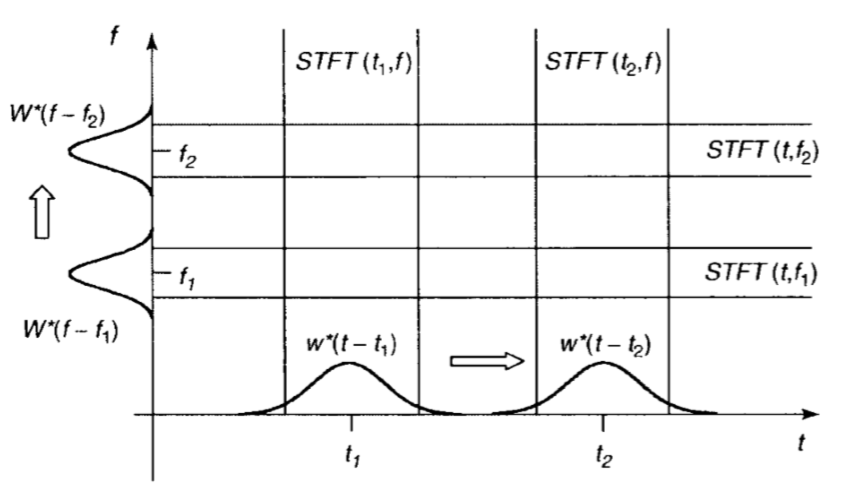
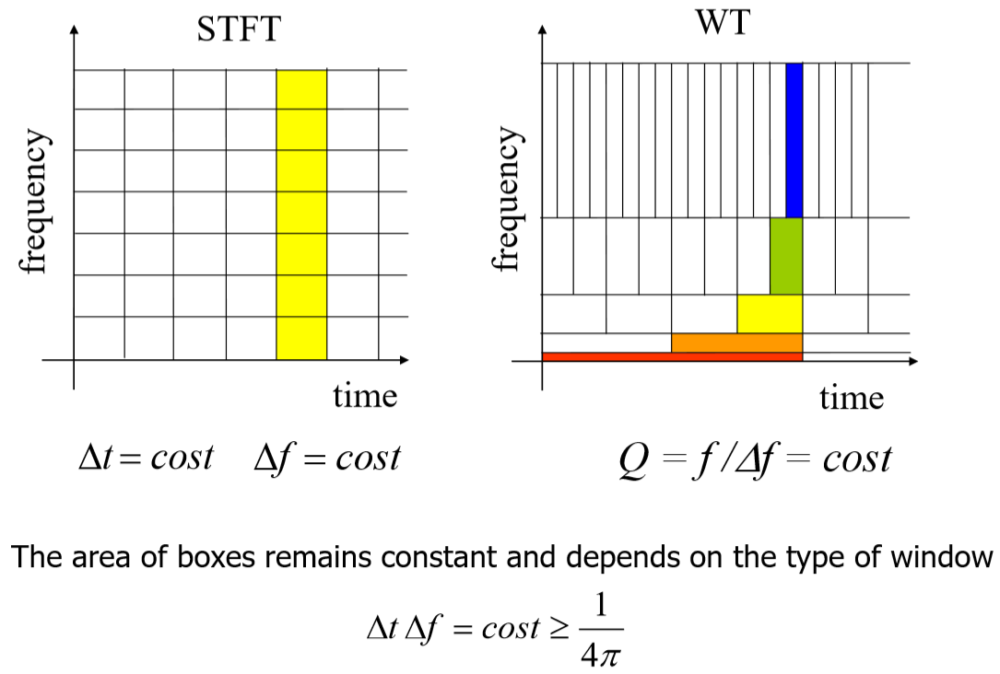
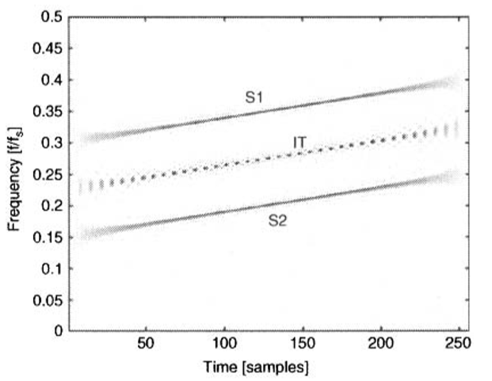
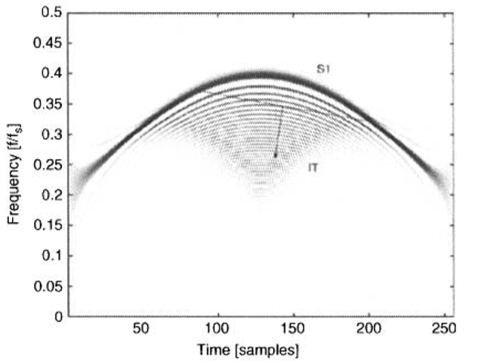
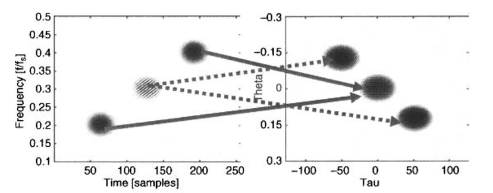
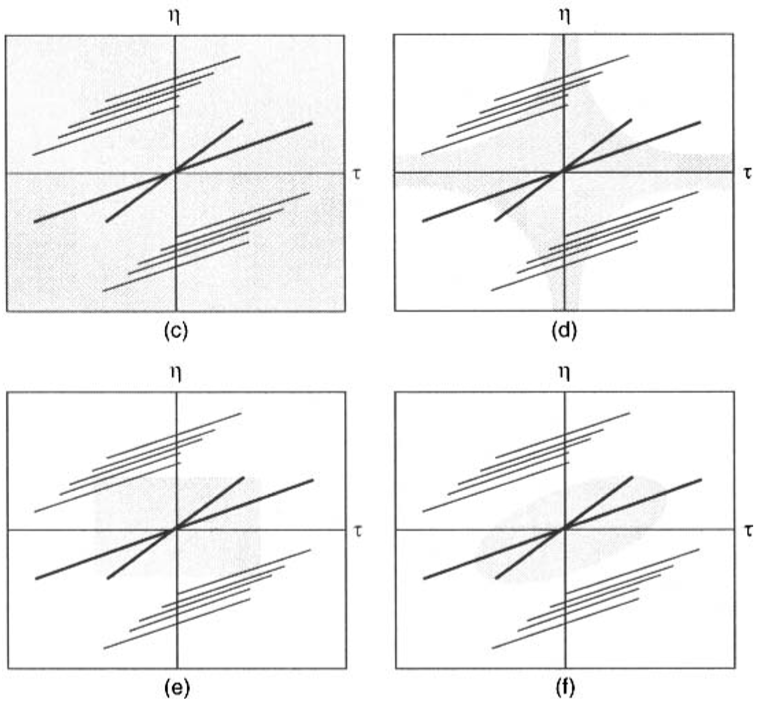
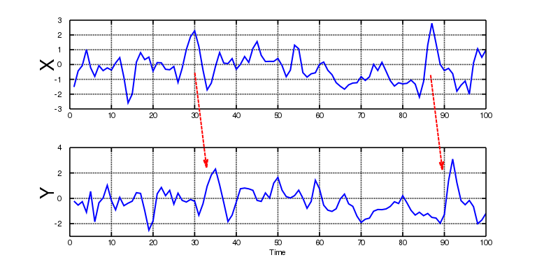

Advanced Signals and Data Processing in Medicine

*A series of notes on the "Advanced SIgnals and Data Processing in Medicine" course as taught by Sergio Cerutti and Riccardo Barbieri during the second semester of the academic year 2018-2019 at Politecnico di Milano.*

## Exam Questions *Cerutti*

- ***Talk me about the Wiener filter (in both frequency and time domains) and its applications.***

  The *Wiener Filter* is a non-recursive filter used to produce an estimate of a desired or target random process by linear time-invariant filtering of an observed noisy process, assuming known *stationary* signal and noise spectra, and additive noise. The Wiener filter minimizes the mean square error between the estimated random process and the desired process.

  So...hypothesis behind the Wiener Filter:

  - $y(k) = x + v(k) \space$

    Where $x$ is the signal we are interested in and $v$ is a random noise. 
    $x$  and  ​$v$ are not necessarily linked by an additive relationship

  - $x$ and $v$ are stationary stochastic processes.

  - $M$ (number of samples) must be sufficiently large ( $ M\to \infty $).

  Given these hypothesis *Wiener* designed a LTI filter able to minimize the quadratic error.

  The filter is non-recursive and $h(i)$ will be the coefficients of the Wiener Filter.
  Since we have to "clean" the $y$ signal we must choose the right values of $h(i)$ in order to reduce the effect of the noise. To do so we compute the derivative of the error function *w.r.t.* the $h(i)$ coefficients and put it to $0$ to find the minimum.
  $$
  \hat{x} = \sum_{i= 1}^{M}h(i)\cdot y(i) \\
  p_{e} = E[e^{2}] = E[(x-\hat{x})^{2}] = E[(x - \sum_{i= 1}^{M}h(i)\cdot y(i))^{2}] \\
  \frac{\partial{p_{e}}}{\partial{h(j)}} = -2E[(x-\hat{x})^{2}] = -2E[(x - \sum_{i= 1}^{M}h(i)\cdot y(i))]\cdot y(j) = 0  \\ \text{   $j =
  1,2,$..$,M$} \\
  $$
  We drop (-2) (useless) and obtain
  $$
  E[(x-\sum_{i=1}^{M}h(i) \cdot y(i)) ]\cdot y(j) = 0 \\
  \sum_{i}^{M}h(i) \cdot E[y(i) \cdot y(j)] = E[x \cdot y(j)] \\
  $$
  We define
  $$
  E[y(i) \cdot y(j)] = p_{y}(i,j) = R_{yy} \text{   (autocorrelation)} \\
  E[x \cdot y(j)] = p_{xy}(j) = R_{xy} \text{   (correlation between x and y)}
  $$
  And reach the *Wiener-Hopf* equation:
  $$
  \sum_{i}^{M}h(i) \cdot p_y(i,j) = p_{xy}(j) \\
  h(i) = Unknown \\
  p_y(i,j) = Known \\
  p_{xy}(j) = Known \\
  (???) p_e = E[x^{2}] - \sum_{i=1}^{M}h(i) \cdot E[x \cdot y(i) ] = E[x^{2}] - \sum_{i=1}^{M} h(i) \cdot p_{xy}(i)
  $$
  In *matricial form*:
  $$
  \begin{cases}
  \overline{h} = P_{y}^{-1}\overline{p_{xy}} \\
  \hat{x} = \overline{h^{T}}\overline{y} = \overline{p_{xy}^{T}}P_{y}^{-1}\overline{y} \\
  p_{e} = E[x^{2}] - \overline{p_{xy}^{T}}P_{y}^{-1}\overline{p_{xy}}
  \end{cases}
  $$
  The *Wiener Filter* is *optimal* among the time-invariant linear filters but, obviously, if the hypothesis are not fulfilled is *sub-optimal*.

- ***What is the Adaptive filter?***

  Source: [Paper from Stanford](http://isl-www.stanford.edu/~widrow/papers/b1971adaptivefilters.pdf)

  Here we present an approach to signal filtering using an *adaptive filter* that is in some sense self-designing (really self-optimizing). The adaptive filter described here bases its own "design" (its internal adjustment settings) upon *estimated* (measured) statistical characteristics of input and output signals. The statistics are not measured explicitly and then used to design the filter; rather, the filter design is accomplished in a single process by  a recursive algorithm that automatically updates the system adjustments with the arrival of each new data sample. How do we build such system?

  A set of stationary input signals is weighted an summed to form an output signal. The input signals in the set are assumed to occur simultaneously and discretely in time. The $j_{th}$ set of input signals is designated by the vector $\mathbf{X}^T(j) = [x_1(j),x_2(j),....x_n(j)]$ , the set of weights is designed by the vector $\mathbf{W}^T(j) = [w_1(j),w_2(j),...,x_n(j)]$, the $j_{th}$ output signal is:
  $$
  y(t) = \sum_{l=1}^{n}w_l(j)x_l(j)
  $$
  This can be written in matrix form as:
  $$
  y(j) = \bold{W}^T(j)\bold{X}(j) = \bold{X}^T(j)\bold{W}(j)
  $$
  Denoting the desired response for the $j_{th}$ set of input signals as $ d(j) $, the error at the $J_{th}$ time is:
  $$
  \bold{\epsilon}(j) = \bold{d}(j) - \bold{y}(j) = \bold{d}(j) - \bold{W}^T(j)\bold{X}(j)
  $$
  The square of this error is:
  $$
  \bold{\epsilon^{2}}(j) = \bold{d}^{2}(j) -2\bold{d}(j)\bold{X}^T(j)\bold{W}(j) + \bold{W}^T(j)\bold{X}(j)\bold{X}^T(j)\bold{W}(j)
  $$
  The mean-square error, the expected value of  $\bold{\epsilon^{2}}(j)$ is
  $$
  E[\bold{\epsilon^{2}}(j)] = \bold{d}^{2}(j) -2\bold{\Phi}(x,d)\bold{W}(j) + \bold{W}^T(j)\bold{\Phi}(x,x)\bold{W}(j)
  $$
  where the vector of cross-correlation between the input signals and the desired response is defined as
  $$
  \bold{\Phi}(x,d) =
  	E\left[ {\begin{array}{cc}
  	x_1(j)d(j) \\
  	x_2(j)d(j) \\
  	.\\
  	.\\
  	.\\
  	x_n(j)d(j)
  	\end{array}} \right]
  $$
  and where the correlation matrix of the input signals is defined as
  $$
  E[\bold{X}(j)\bold{X}^T(j)] =
  	E\left[ {\begin{array}{cc}
  	x_1(j)x_1(j) & x_1(j)x_2(j) & ... &  \\
  	x_2(j)x_1(j) & x_1(j)x_2(j) & ... &  \\
  	.\\
  	.\\
  	.\\
  	& & x_n(j)x_n(j)
  	\end{array}} \right] = \bold{\Phi}(x,x)
  $$
  It may be observed that for stationary input signals, the mean-square error is precisely a second-order function of the weights. The mean-square-error performance function may be visualized as a *bowl* shaped surface, a parabolic function of the weight variables. The adaptive process has the job of continually seeking the "bottom of the bowl". A means of accomplishing this by the well-known method of steepest descent is discussed below.

  In the nonstationary case, the bottom of the bowl *may be moving*, while the orientation and curvature of the bowl may be changing. The adaptive process has to track the bottom of the bowl when inputs are non-stationary. It will be assumed that the input and desired-response signals are stationary. Here we are concerned with transient phenomena that take place when a system is adapting to an unknown stationary input process, and in addition, it is concerned with steady-state behaviour after the adaptive transients die out.

  The method of steepest descent uses gradients of the performance surface in seeking its minimum. The gradient at any point on the performance surface may be obtained by differentiating the mean-square-error function with respect to the weight vector.

  The gradient is
  $$
  \nabla[\overline{\epsilon}^{2}(j)] = -2\bold{\Phi}(x,d) + 2\bold{\Phi}(x,x)\bold{W}(j)
  $$
  To find the "optimal" weight vector $\bold{W}_{LMS}$ that yields the last mean-square error, set the gradient to zero. Accordingly:
  $$
  \bold{\Phi}(x,d) = \bold{\Phi}(x,x)\bold{W}_{LMS} \\
  \bold{W}_{LMS} = \bold{\Phi^{-1}}(x,x)\bold{\Phi}(x,d)
  $$
  The equation above is the *Wiener-Hopf equation* in matrix form.

  However it is also possible to evaluate the optimal vector *iteratively*, where in each step we change the vector *proportionally to the negative of the gradient vector*.
  $$
  \bold{W}_{j+1} = \bold{W}_j - \mu\nabla_j
  $$
  where $\mu$ is a scalar that controls the stability and rate of convergence of the algorithm. It is easy to demonstrate that 
  $$
  \nabla[\overline{\epsilon}^{2}(j)] = -2\bold{\Phi}(x,d) + 2\bold{\Phi}(x,x)\bold{W}(j) = -2\bold{\epsilon}_j\bold{X}_j
  $$
  And the optimal weight vector is estimated as 
  $$
  \bold{\overline{W}}_{j+1} = \bold{\overline{W}}_j + 2\mu\bold{\epsilon}_j\bold{X}_j
  $$
  A necessary and sufficient condition for convergence is:
  $$
  \lambda_{max}^{-1} > \mu > 0
  $$
  where $\lambda_{max}$ is the largest eigenvalue of the correlation matrix $\bold{\Phi}(x,x)$.

- ***What is the Lyapunov Exponent?***

  It's a number that tells us how sensitive a system is to its initial conditions.

  Let's suppose we have two initial conditions $x_{0}$ and $y_{0}$.
  We define measure of the distance $D_{0}$ as follows:
  $D_{0} = |x_{0} - y_{0}|$
  and we keep track of it over the time :
  $D(t) = | x_{t} - y_{t}|$

  For many systems this is an exponential function of time:
  $D(t) =D_{0}e^{\lambda t} $

  $\lambda ​$ is the Lyapunov Exponent

  We can see that when $\lambda > 0$ we have SDIC (Sensitive Dependency on Initial Conditions) and when $\lambda < 0 $ we don't have SDIC.

- ***Talk me about the Mane-Takens theorem***.

- ***What are Wavelets?***

  Source:[A Really Friendly Guide For Wavelets](https://www.cs.unm.edu/~williams/cs530/arfgtw.pdf)

  It is well known from Fourier theory that a signal can be expressed as the sum of a, possibly infinite, series of sines and cosines. This sum is also referred to as a Fourier expansion. The big disadvantage of a Fourier expansion however is that it has only frequency resolution and no time resolution. This means that although we might be able to determine all the frequencies present in a signal, we do not know when they are present. To overcome this problem in the past decades several solutions have been developed which are more or less able to represent a signal in the time and frequency domain at the same time.

  The idea behind these time-frequency joint representations is to cut the signal of interest into several parts and then analyze the parts separately. It is clear that analyzing a signal this way will give more information about the when and where of different frequency components, but it leads to a fundamental problem as well: how to cut the signal?
  Suppose that we want to know exactly all the frequency components present at a certain moment in time. We cut out only this very short time window using a *Dirac pulse*, transform it to the frequency domain and … something is very wrong.
  The problem here is that cutting the signal corresponds to a convolution between the signal and the cutting window.
  Since convolution in the time domain is identical to multiplication in the frequency domain and since the Fourier transform of a Dirac pulse contains all possible frequencies the frequency components of the signal will be smeared out all over the frequency axis. In fact this situation is the opposite of the standard Fourier transform since we now have time resolution but no frequency resolution whatsoever.

  The *wavelet transform* or *wavelet analysis* is probably the most recent (*remember that this was written in 1999) solution* to overcome the shortcomings of the Fourier transform. In wavelet analysis the use of a fully scalable modulated window solves the signal-cutting problem. The window is shifted along the signal and for every position the spectrum is calculated. Then this process is repeated many times with a slightly shorter (or longer) window for every new cycle. In the end the result will be a collection of time-frequency representations of the signal, all with different resolutions.

  - *Continuous Wavelet Transform:*

    ​				  						  *(1)*
    $$
    \gamma(s,\tau) = \int{f(t)\Psi^{*}_{s,\tau}(t)dt}\\
    $$
    Where * denotes complex conjugation.
    This equation shows how a function $f(t)$ is decomposed into a set of basis functions $\Psi_{s,\tau}(t)$, called the wavelets. 
    The variables $s$ and $\tau$ are the new dimensions, scale and translation, after the wavelet transforms. For completeness sake the following equation gives the inverse wavelet transform:

    ​										  *(2)*
    $$
    f(t) = \int\int\gamma(s,\tau)\Psi_{s,\tau}(t)d\tau ds
    $$
    The wavelets are generated from a single basic wavelet, the so-called *mother wavelet*
    $$
    \Psi_{s,\tau}(t) = \frac{1}{\sqrt{s}}\Psi(\frac{t-\tau}{s}) \\
    \text{where $s$ is the scale factor, $\tau$ is the translation factor and $s^{-\frac{1}{2}}$ is for } \\
    \text{energy normalisation across the different scales.}
    $$

  - *Discrete Wavelet Transform:*

    Now that we know what the wavelet transform is, we would like to make it practical. However, the wavelet transform as described so far still has three properties that make it difficult to use directly in the form of *(1)*. The first is the redundancy of the *CWT*. In *(1)* the wavelet transform is calculated by continuously shifting a continuously scalable function over a signal and calculating the correlation between the two. It will be clear that these scaled functions will be nowhere near an orthogonal basis and the obtained wavelet coefficients will therefore be highly redundant. For most practical applications we would like to remove this redundancy.

    Even without the redundancy of the CWT we still have an infinite number of wavelets in the wavelet  transform and we would like to see this number reduced to a more manageable count. This is the second problem we have.
    The third problem is that for most functions the wavelet transforms have no analytical solutions and they can be calculated only numerically or by an optical analog computer. Fast algorithms are needed to be able to exploit the power of the wavelet transform and it is in fact the existence of these fast algorithms *(like the Mallat's one, see question below)* that have put wavelet transforms where they are today.  Discrete wavelets are not continuously scalable and translatable but can only be scaled and translated in discrete steps. 
    $$
    \Psi_{j,k}(t) = \frac{1}{\sqrt{s_0^j}}\Psi\left(\frac{t-k\tau_0s_0^j}{s_0^j}\right) \\
    $$
    where $j$ and $k$ are integers and $s_0 > 1$ is a fixed dilatation step.
    The translation factor $\tau_0$ depends on the dilation step. The effect of discretizing the
    wavelet is that the time-scale space is now sampled at discrete intervals. 
    We usually choose $s_0 = 2$ so that the sampling of the frequency axis corresponds to dyadic sampling.
    This is a very natural choice for computers, the human ear and music for instance.
    For the translation factor we usually choose $\tau_0 = 1$ so that we also have dyadic
    sampling of the time axis.

- **Talk me about the Mallat's algorithm for FWT.** 

  Sources:

  [Mathworks](https://it.mathworks.com/help/wavelet/ref/wavedec.html)

  [Andreadd](https://www.andreadd.it/appunti/polimi/ingegneria/corsi/ing_biomedica/Magistrale/SPEC/Signals_data_processing/viewer.html?file=altro/Algoritmo_mallat.pdf)

  The *Fast Wavelet Transform* is a mathematical algorithm designed to turn a waveform or signal in the time domain into a sequence of coefficients based on an orthogonal basis of small finite waves, or wavelets. The transform can be easily extended to multidimensional signals, such as images, where the time domain is replaced with the space domain. This algorithm was introduced in 1989 by *Stéphane Mallat*. 

  Given a signal $s​$ of length $N​$, the DWT consists of $log_{2}N​$ stages at most. Starting from $s​$, the first step produces two sets of coefficients: approximation coefficients $cA_1​$ and detail coefficients $cD_1​$. These vectors are obtained by convolving $s​$ with the low-pass filter *Lo_D* for approximation and with the high-pass filter *Hi_D* for detail, followed by dyadic decimation.

  More precisely, the first step is:

  

  

  the length of each filter is equal to $2n$. if $N = length(s)$, the signal $F$ and $G$ are of length $N + 2n -1$  and the coefficients $cA_1$ and $cD_1$ are of length $floor(\frac{N−1}{2})+n$.

  ```python
  # e.g. we convolve a filter of dimension 2*2 (expressed as "++++" ) (n = 2)
  # to a signal s of 5 samples (expressed as "-----" ) (N = 5)
  
  ...-----... # signal s
  ++++....... # 1
  .++++...... # 2
  ..++++..... # 3
  ...++++.... # 4
  ....++++... # 5
  .....++++.. # 6
  ......++++. # 7
  .......++++ # 8
  
  # and we will obtain a new signal composed by 
  # N + 2n - 1  = 5 + 4 - 1 = 8 samples.
  ```

  The next step splits the approximation coefficients $cA_1$ in two parts using the same scheme, replacing $s$ by $cA_1$, and producing $cA_2$ and $cD_2​$, and so on.

  The wavelet decomposition of the signal $s$ analyzed at level $j$ has the following structure: $[cA_j, cD_j, ..., cD_1]​$.

  This structure contains, for $j = 3$, the terminal nodes of the following tree:

  

  To go into further detail: *Mallat* suggests to decompose the signal utilizing two families of wavelet functions:

  $ h_{j,k}(t) = 2^{\frac{j}{2}}h(2^jt-k)$  to extract Low-Frequency content from the signal (Approximation).

  $ g_{j,k}(t) = 2^{\frac{j}{2}}g(2^jt-k)$   to extract High-Frequency content from the signal (Detail).

  The index $k$ determines the position in time of the filter *w.r.t.* the signal.

  The couple of functions just described is known as "*quadrature mirror filters*" since presents the following property:
  $$
  g[L-1-n] = (-1)^n\cdot h[n]
  $$
  where $L​$ is the number of samples. Starting from $j = 1​$, the *Mallat* algorithm decompose the signal in two equal sub-bands, each of which is equal to half the spectrum of the former signal.  The further subdivisions in sub-bands can be obtained by fixing the two filters $g[n]​$ and $h[n]​$  and compressing the signal exiting from the same filters.

  In the image below we can sees an example of the two functions $g[n]$ and $h[n]$.

  

- **Example of application of DWT in biomedical signals:**

  Source: *Course's Slides*

  

  Four-Level DWT of the EEG trace at the top of the figure using the matched Mayer spindle wavelet. The four detail functions on the right correspond to the frequency bands associated with the *beta* (16-32 Hz), *alpha* (8-16 Hz), *theta* (4-8 Hz) and *high delta* (2-4 Hz) regimes. The A4 low resolution signals on the left corresponds to the frequency band associated with the *low delta* regime (0-2 Hz). Each of the remaining three low resolution signals on the left illustrate the effect of successively adding each detail function into the next lower low resolution signal to reconstruct the ERP at the top left of the figure. Good frequency selectivity by the matched Meyer spindle wavelet in the *alpha* band is evident in the figure.

- **Talk me about parametric methods and AR models**

- ***What is the  STFT*?**

  Source: *Cerutti*'s book.

  The Fourier series for periodic signals and, more generally, the Fourier transform (*FT*)  decomposes a signal into sinusoidal components invariant over time. Considering a signal $x(t)$, its Fourier transform is 
  $$
  FT_{x}(f) = \int_{-\infty}^{\infty}x(t)e^{-j2\pi ft}dt
  $$
  The amplitude of the complex value $FT_x(f)$ represents the strength of the oscillatory component at frequency $f$ contained in the signal $x(t)$; however, no information is given on the time localization of such component. Since a non-stationary signal can not be analyzed using the traditional Fourier Analysis we hypothesize that the signal is stationary in short windows and we introduce the *Short Time Fourier Transform* (STFT), which introduces a temporal dependence, applying the *FT* not to all of the signal but to the portion of it contained in an interval moving in the time.
  $$
  STFT_{x,w}(t,f) = \int_{-\infty}^{\infty}x(\tau)w^{*}(\tau-t)e^{-j2\pi f\tau}d\tau
  $$
  At each time instant $t$, we get a spectral decomposition obtained by applying the *FT* to the portion of signal $x(\tau)$ viewed through the window $w^{*}(\tau-t)$ centered at the time $t$. This $w(\tau)$ is a function of limited duration, such as to select the signal belonging to an analysis interval centered around the time $t$ and deleting parts outside the window.

  

  The *STFT* is, therefore, made up of those spectral components relative to a portion of the signal around the time instant $t$.

  In order to preserve energy and to get the energy distribution in the time-frequency plane, the window $w^{*}(\tau-t)​$ should be normalized to unitary energy.

  The *STFT* is a linear operator with properties similar to those of the *FT* :

   - *Invariance for time shifting apart from the phase factor:*

     $ \tilde{x}(t) = x(t-t_0) \implies STFT_{\tilde{x},w}(t,f) = STFT_{x,w}(t-t_{0},f)e^{-j2\pi t_0f} ​$

   - *Invariance for frequency shifting:*

     $\tilde{x}(t) = x(t)e^{j2\pi f_{0}t} \implies STFT_{\tilde{x},w}(t,f) = STFT_{x,w}(t,f-f_0) $

  The *STFT* can be expressed as a convolution and then as the output of a filter. In particular we consider the *STFT* as frequency shifting the signal $x(t)$ by $-f$, followed by a low-pass filter given by convolution with the function $w(-t)$:
  $$
  STFT_{x,w}(t,f) = \int_{-\infty}^{\infty}\left[ x(\tau)e^{-j2\pi ft}\right]w(\tau-t)d\tau
  $$
  Otherwise, the *STFT* can be considered as a band-pass filter. filtering the signal $x(t)$ around the frequency $f$, obtained by convolution with the function $w(-t)e^{j2\pi ft}$, followed by a shift in frequency by $-f$ .
  $$
  STFT_{x,w}(t,f) = e^{-j2\pi tf}\int_{-\infty}^{\infty} x(\tau)\left[w(\tau-t)e^{-j2\pi f(\tau-t)}\right]d\tau
  $$
  It should be noted that the filter impulse response is merely given by the window function modulated at the frequency $f​$.

  In addition, the convolution between $x(t)​$ and $w(-t)e^{j2\pi ft} ​$ can be written as an inverse transform of the product $X(v)W^{*}(v-f)​$, where $W(f)​$ is the transform of the window function $w(t)​$:
  $$
  STFT_{x,w}(t,f) = e^{-j2\pi tf}\int_{-\infty}^{\infty} X(v)W^{*}(v-f)e^{j2\pi tv}dv
  $$
  (*Remember that convolution in time domain corresponds to multiplication in frequency domain*)

  This expression reinforces the interpretation of the *STFT* as a *filter bank*. Indeed, the product $X(v)W^{*}(v-f)$ represents the transform of the output of a filter with a frequency response given by $W^{*}(v-f)$, which is a band-pass filter centered at frequency $f$ , obtained by shifting the frequency of the response of the low-pass filter $W(v)$.

  

  The continuous *STFT* is extremely redundant. The discrete version of STFT can be obtained by discretizing the time-frequency plane with a grid of equally spaced points $(nT,k/NT)$ where $1/T$ is the sampling frequency, $N$ is the number of samples, and $n$ and $k$  are integers.

  What about Time-Frequency resolution?

  The *STFT* is the local spectrum of the signal around the analysis time $t$ . To get a good resolution in time, analysis windows of short duration should be use, that is, the function $w(t)$ should be concentrated in time. However, to get a good resolution in frequency, it is necessary to have a filter with a narrow band, that is, $W(f)​$ must be concentrated in frequency. it can be proved that the product of the time and of the frequency resolutions is lower bounded:
  $$
  \Delta t\Delta f \ge \frac{1}{4\pi}
  $$
   The lower limit is reached only by $w(t)$ functions of Gaussian type. This inequality is often referred as the *Heisenberg uncertainty principle* and it highlights that the frequency resolution $\Delta f$ can be improved only at the expense of time resolution $\Delta t$ and vice versa.

- **Applications of STFT:**

  Source: *Cerutti*'s book.

  An example of application of the methods of time-frequency representation is shown in the figure below. The series of time intervals between two successive heartbeats (RR), represented on the bottom of the figure, is relative to a tilt test and consists of two periods. In the first, the subject is in clinostatism (A near-extinct term for *lying down*); the RR duration is about one second and shows an oscillatory component of respiratory origin. In the second, the subject is under orthostatism (*erect standing* position of the body); the RR interval is much shorter and the respiratory component is absent.          The panel in the figure below has been achieved with STFT, using a Von Hann window with resolution in time $\Delta t  = 36 s​$ . Although this choice allows a discrete frequency resolution in the low-frequency band, it provides an inadequate temporal localization of the changes in power in the high-frequency band related to the tilt maneuver.  

  

  The example in the next figure shows the time-frequency representation relative to a series of RR intervals with high variability of respiratory component. The three-dimensional view allows us to grasp the small details of nonstationary oscillatory phenomena. The series in this case has been analyzed with the STFT using a relatively narrow window. The good temporal resolution obtained allows us to assess the power of the respiratory component of origin ($0.3-0.4 \;Hz​$) and its evolution over time. 

  

- **Difference between STFT and WT.**

  Source: [Quora](https://www.quora.com/What-is-the-difference-between-wavelet-transform-and-STFT)

  Traditionally, the techniques used for signal processing are realized in either the time or frequency domain. For instance, the Fourier Transform (TF) decomposes a signal into it’s frequency components; However, *information in time is lost.*

  One solution is to adopt Short-Time-Fourier-Transform (STFT) that get frequency components of local time intervals of *fixed duration*. But if you want to analyze signals that contain *non-periodic and fast transients features* (i.e. high frequency content for short duration), you have to use *Wavelet Transform* (WT).

  Unlike the TF or the STFT, the WT analyzes a signal at *different frequencies with different resolutions*. It can provide good time resolution and relatively poor frequency resolution at high frequencies while good frequency resolution and relatively poor time resolution at low frequencies. Wavelet transform shows excellent advantages for the analysis of *transient signals*.

  

- **Quadratic TF representation & Wigner-Ville distribution**

  Source: *Cerutti*'s book.

  In the previous questions/answers, we learned how to decompose a signal using elementary blocks of different shapes and dimensions: sinusoids, mother functions, or time-frequency distributions. These blocks are efficient tools for describing, in a synthetic way, morphological features of signals, such as waves, trends, or spikes. In a dual way, the same signal can be investigated in the frequency domain by using the Fourier transforms of these elementary functions. However, time and frequency domains are treated as separate worlds, often in competition because the need to locate a feature in time is usually paid for in terms of frequency resolution. A conceptually different approach aims to jointly look at the two domains and to derive a joint representation of a signal $x(t)$ in the combined time and frequency domain. A quadratic time-frequency distribution is designed to represent the signal energy simultaneously in the time and frequency domains and, thus, it provides temporal information and spectral information simultaneously.

  A link between time and frequency domains may be obtained through the signal energy $E_x$ The following relation holds:
  $$
  E_x = \int{|x(t)|^{2}dt = \int|X(\omega)|^{2}d\omega}
  $$
  where $X(\omega)$ is the Fourier transform of the signal and $|X(\omega)|^2$ is its power spectrum. It is therefore intuitive to derive a *joint* time-frequency representation, $TFR(t,\omega)$, able to describe the energy distribution in the $t-f$ plane and to combine the concept of instantaneous power $|x(t)|^2$ with that of the power spectrum $|X_t(\omega)|^2$. Such a distribution, to be eligible as an *energetic* distribution, should satisfy the marginals
  $$
  \int{TFR_x(t,\omega)d\omega = |x(t)|^2} \\
  \int{TFR_x(t,\omega)dt = |X(\omega)|^2}
  $$
  Thus, for every instant $t$ , the integral of the distribution over all the frequency should be equal to the instantaneous power, whereas, for every angular frequency ω, the integral over time should equal the power spectral density of the signal. As a consequence of the marginals, the total energy is obtained by integration of the $TFR$ over the whole $t-f​$ plane: 
  $$
  E_x = \int\int TFR_x(t,\omega)d\omega dt
  $$
  As the energy is a quadratic function of the signal, the $TFR(t,\omega)​$ is expected to be quadratic.   An interesting way to define energetic $TFR​$ starts from the definition of a time-varying spectrum (Page, 1952). Using the relationship that links power spectral density and TFR imposed by marginals, we derive a simple definition of a TFR:
  $$
  TFR(t,\omega) = \frac{\partial}{\partial t}|X_t(\omega)|^2
  $$
  The subscript $t​$ indicates that the quantity is a function of time and, thus, $|X_t(\omega)|^2​$is a time-varying spectrum. The latter can be derived by generalization of the relationship between the power spectrum of a signal and its autocorrelation function $R_t(\tau)​$:
  $$
  |X_t(\omega)|^2 = \frac{1}{2\pi}\int R_t(\tau)e^{-j\omega \tau}d\tau
  $$
  where
  $$
  R_t(\tau) = \int x(t)x^*(t-\tau)dt = \int x\left(t + \frac{\tau}{2}\right)x^*\left(t - \frac{\tau}{2}\right)dt
  $$
  is a function of time. By substitution, a new definition of TFR is obtained:
  $$
  TFR(t,\omega) = \frac{1}{2\pi}\int \frac{\partial}{\partial t}R_t(\tau)e^{-j\omega \tau}d\tau = \frac{1}{2\pi}\int K_t(\tau)e^{-j\omega \tau}d\tau
  $$
  where $K_t(\tau)$  is known as a *local autocorrelation function*. The above relation shows that a $TFR$ can be obtained as the Fourier transform of a time-dependent autocorrelation function. We may observe that due to the derivative operation, the integral that characterizes the $R_t(\tau)$ disappears in $K_t(\tau)$ which de facto describes local properties of the signal. Among all the possible choices of $K_t(\tau)$ the most simple (Mark, 1970) is to select
  $$
  K_t(\tau) = x\left(t + \frac{\tau}{2}\right)x^*\left(t - \frac{\tau}{2}\right) \\
  $$
  The derived time-frequency distribution
  $$
  TFR(t,\omega) = = \frac{1}{2\pi}\int K_t(\tau)e^{-j\omega \tau}d\tau
  $$
  is known as the *Wigner-Ville (WV) distribution* .

  This distribution was originally introduced by *Wigner* (1932) in the field of quantum mechanics and successively applied to signal analysis by *Ville* (1948). It plays a fundamental role among the quadratic time-frequency distributions and it is a fundamental part of the *Cohen class* ( *we'll talk about that in the next question*).

  For a *linear chirp* (a signal whose instantaneous frequency varies linearly with time according to $ f_x(t) =f_0 + \alpha t $ ) it can be shown that 
  $$
  W_{xx}(t,f) = \delta[t,f-f_x(t)]
  $$
  and the WV is a line in the $t-f$ plane, concentrated at any instant around the instantaneous frequency of the signal. From a practical point of view, this property shows that the representation is able to correctly localize (jointly in *time* and *frequency*) a sinusoidal component whose properties are varying with time.

  

  Even if the *WV* representation is attractive for representing single-component, nonstationary signals, it becomes of poor utility when multicomponent signals are considered. In these cases, the distribution may assume negative values (and this is in contrast with the interpretation of energetic distribution) and interference terms (or cross terms) appear. The cross terms disturb the interpretation of the $TFR $as they are redundant information that may mask the true characteristics of the signal.

  

  In the case of an N-component signal the representation will be characterized by N signal terms and 
  $$
  {N\choose 2}=\frac{N(N-1)}{2}
  $$
  interference terms. The latter grows quadratically in respect to the number of components and may overwhelm the signal contributes quite rapidly. 

  An example is shown in the figure below where two signal terms are centered in $(t_1,f_1)$ and $(t_2,f_2)$ It is possible to observe that interference terms are located around the central point $[\;t_{12} = \frac{t_1+t_2}{2} \:,\:f_{12} = \frac{f_1+f_2}{2}\;]$ and their amplitude oscillates in time with a period of $\frac{1}{|f_1-f_2|}$ and in frequency with a period of  $\frac{1}{|t_1-t_2|}$. Therefore, the oscillation frequency grows with the distance between signal terms and the direction of oscillation is perpendicular to the line connecting the signal points $(t_1,f_1)$and  $(t_2,f_2)$. 

  

  It is worth noting that the interference terms may be located in time intervals where no signal is present, for example between $t_1$ and $t_2$ in Figure 10.2, showing signal contributions in an area where no activity is expected (like a mirage in the desert),  Interferences are located in the concavity of the distribution and are related to the interaction between past and future signal frequencies. 

  

  These effects make the WV hardly readable, especially when a wideband noise is superimposed, and many authors have labeled the WV as a *"noisy"* representation (Cohen, 1989). 

   Finally it is worth noting that any real signal generates interference between positive and negative frequencies of their spectrum, to avoid this effect in practical applications, the Hilbert transform is applied to the real signal to generate the analytic signal in which the negative frequencies are canceled.

- **Talk me about Cohen's Class**

  Source: *Cerutti's* book

  Let's talk now about *Cohen's Class*... The characteristics of cross terms (*oscillating*) suggest the strategy for their suppression: the idea is to perform a *two-dimensional low-pass filtering* of the $TFR$, in order to suppress the higher frequency oscillations.

  If the properties of the selected filter do not depend on their position in the $t-f$ plane (i.e., the filter characteristics are invariant to shifts in the $t-f$ plane), we derive the class of shift-invariant, quadratic $TFRs$, known as *Cohen's Class*.
  $$
  C_{x,x}(t,f) = \int \int \Psi(u-t,v-f)W_{xx}(u,v)dudv
  $$
  As evident from the above relation, every member of the class can be obtained as the convolution between the $W_{xx}$ and a function $\Psi$ , the *kernel*. 

  Every $TFR$ of this class can be interpreted as a filtered version of $W_{xx} $.  By imposing constraints on the *kernel* one obtains a subclass of $TFR$ with a particular property.

   A few examples of $TFRs$ obtained using different *kernels* are shown in the next figure:

  

  

  It is worth noting that the lines corresponding to the *chirps* are larger than in the figure shown in the previous question; thus, the *kernels* reduce time-frequency localization.

  In fact, the useful property (Equation 10.10) is lost in $C_{xx}$ due to the low-pass filtering effect of $\Psi$. Therefore, we are facing a compromise between the entity of the cross term and the preservation of joint time-frequency resolution in the $t-f$ plane.

  *Whereas in the linear time-frequency representations the compromise is between time or frequency resolution, in the quadratic $TFR$ the compromise is between the maximization of joint $t-f$ resolution and the minimization of cross terms.*

  The question is...*which tools* should be used to project the $TFR$ with desired properties? An important tool is the *ambiguity function* ($AF$)
  $$
  A_{xx}(\theta,\tau) = \int x\left(t + \frac{\tau}{2}\right)x^*\left(t - \frac{\tau}{2}\right)e^{j\theta t}dt
  $$
  It is worth noting the structural analogy with the $WV$, with the difference that integration is performed over time. The $AF$ is the projection of $W_{xx}$ in the plane $\theta - \tau$ (known as the *correlative domain* ).

  In this plane, signal and cross terms tend to separate. The former are mainly located close to the origin; the latter are located far from it. The effect is evident in the next figure:

  

  A nice property of the *Cohen's Class* is that its representation in the correlative domain is simply described by a product:
  $$
  C_{xx}(\theta,\tau) = \phi(\theta,\tau)A(\theta,\tau)
  $$
  where $\phi(\theta,\tau)​$ is the two-dimensional Fourier transform of $\Psi​$ . 

  From this equation the effect of the *kernel* can be immediately appreciated; it weights the points of the $\theta - \tau​$ plane. Therefore, in order to perform an efficient reduction of cross terms, the function $\phi(\theta,\tau)​$ should have higher values close to the origin than far from it. Thus $\phi(\theta,\tau)​$ should be the transfer function of a two-dimensional low-pass filter, to get an idea just look at the grey zones in figures $(c)\space,\space (d) \space,\space (e)\space​$ and $\space (f)​$ below .

  

  $(a)$ represents the $TFR$ of the signal and $(b)$ represents its projection in the $\theta - \tau$ plane, . signal terms are the two lines passing from the origin; the others are the IT (*interference terms*).

  

  Here different *kernels* are superimposed on the $AF$:

  $(c)$ *WV* kernel (*Wigner-Ville*)				$\phi(\theta,\tau) = 1$

  $(d)$ BJD (*Born and Jordan*)				$\phi(\theta,\tau) = \frac{sin(\pi \tau\theta)}{\pi \tau \theta}$

  $(e)$ SPWV (*Smoothed Pseudo Wigner-Ville*)			$\phi(\theta,\tau) = \eta(\frac{\tau}{2})\eta^{*}(-\frac{\tau}{2})G(\theta)$

  $(f)​$ generic *time-frequency* filter.

- **Applications of Quadratic TFR**

  - Heart Rate (HR) Variability signal analysis
  - ECG signal analysis
  - EEG and ECoG (*Electrocochleography* ) signal analysis
  - Evoked Potentials
  - Electromyographic signal (EMG) analysis

- **Talk me about Time-Variant methods**

  

- **Brief overview of TF methods:**

  - *STFT* *(Short Time Fourier Transform)* :

    uses time windows with constant duration and this allows obtaining a good frequency resolution with long time windows (bad time resolution) and viceversa.

  - *WT*  *(Wavelet Transform)* :

    allows a multiresolution analysis that optimizes the time resolution and the frequency resolution for each frequency value.

  - *WVD* *(Wigner-Ville Distribution)*:

    has a good time and frequency resolution, but it introduces interferences (cross-terms) that make the distribution hardly interpretable.

  - *Time-Variant Models* :

    allow a good time and frequency resolution, but the performance is highly dependent on the morphology of the forgetting factor.

- **What is  a Spectrogram? and a Scalogram?**

- ***What is the Hurst exponent?***

- ***Which kind of signals have a chaotic behaviour?***

- ***How can we measure the fractal dimension of a signal?***


## Exam Questions Barbieri

- **Talk me about Shannon entropy: what's the concept behind the formula and how can we derive the latter? What's the link with information theory? Se ho n samples, how many bit i need? Compute binary entropy + plot , Relazione grafica tra entropia e mutua informazione. Joint entropy se sono indipendenti? Shannon entropy e il legame con l’informazione. Drawing of mutual information and entropy **

  ------------------------------------------------------------------------------------

  *Remember*:  

  *Bayes Theorem* $\to$ $p(x|y) = \frac{p(y|x)p(x)}{p(y)}$

  *Joint probability* $\to​$ $p(x,y) = p(y|x)p(x) =p(x|y)p(y)​$

  -----------------------------

  Entropy measures the degree of our lack of information about a system. Suppose you throw a coin, which may land either with head up or tail up, each with probability $\frac{1}{2}​$ . Then we have some uncertainty about the outcome of each "experiment". The uncertainty can be quantified by a positive number $H​$. Now suppose you modified the coin (somehow) that you know for sure that each time you throw it, it will always land with head up (i.e. probability = 1). Then there is no uncertainty about the possible outcome of each “experiment”. The information entropy should be $H = 0​$. In general, consider an experiment with $n​$ possible outcomes, each with probability $p_{i} ,(\space i =1,...,n)​$ with normalization condition $\sum_{i=1}^{n}p_{i} = 1​$.

  We are looking for a general formula $H(p_1,p_2,...,p_n)​$ that can characterize the uncertainty in all these experiments. Intuitively, we expect:

  - $ H(p_1=\frac{1}{n},p_2=\frac{1}{n},...,p_n=\frac{1}{n})$ should be the maximum among all values of $H$ with a fixed $n$.
  - $ H(p_1=0,p_2=1,...,p_n=0)= 0$ should be the minimum (no uncertainty).

  But to develop a general formula for arbitrary ${p_{i}}$ seems impossible! That's why Shannon is so smart. He did it! How we derive it? (For now we abandon the notation $H$ in favor of $I$ ,we'll then define $H$ as the expected value of $I​$)

  Shannon showed that if we assume the entropy function should satisfy a set of reasonable properties then there is only one possible expression for it. These conditions are:

  - $I(p_1,p_2,\dots,p_n)$ is a continuous function and $I(p) \ge0$ (Information is a *non-negative* quantity)
  - $f(n) = I(\frac{1}{n},\frac{1}{n},\dots,\frac{1}{n})$ is a monotonically increasing function of $n$.
  - $I(1) = 0$ (Events that always occur do not communicate information)
  - $I(p_1p_2) = I(p_1) + I(p_2)$ (Information due to independent events is *additive*)

  The last is a crucial property. It states that joint probability of independent sources of information communicates as much information as the two individual events separately. Particularly, if the first event can yield one of $n$ equiprobable outcomes and another has one of $m$ equiprobable outcomes then there are $mn$ possible outcomes of the joint event. This means that if $log_2(n)$ bits are needed to encode the first value and $log_2(m)$to encode the second, one needs $log_2(mn) = log_2(m) + log_2(n)$ to encode both. Shannon discovered that the proper choice of function to quantify Information, preserving this additivity, is ***logarithmic*** ! i.e.
  $$
  I(p) = \log\left(\frac{1}{p}\right)
  $$
  The base of the logarithm can be any fixed real number greater than 1. ($2 \to bits$, $3\to trits$, etc...)

  Now, suppose we have a distribution where event $i$ can happen with probability $p_i$. Suppose we have sampled it $N$ times and outcome $i$ was, accordingly, seen $n_i =Np_i$ times. The total amount of information we have received is:
  $$
  \sum_in_iI(p_i)=\sum Np_i\log\left(\frac{1}{p_i}\right)
  $$
  The average amount of information that we receive with every event is therefore:
  $$
  \sum_ip_i\log\frac{1}{p_i}
  $$
  So the entropy of a source that emits a sequence of $N$ symbols that are independent and identically distributed ($iid$) is $N·I$ bits (per message of $N$ symbols). 

  Suppose $1000$ bits ($0s$ and $1s$) are transmitted, If the value of each of these bits is known to the receiver (has a specific value with certainty) *ahead* of transmission, it is clear that no information is transmitted. If, however, each bit is independently equally likely to be $0$ or $1$, $1000​$ shannons of information (more often called bits) have been transmitted. Between these two extremes, information can be quantified as follows.

  If $X$ is the set of all messages $\{ x_1,\dots,x_n\}$ that $X$ could be, and $p(x)$ is the probability of some $x \in X$ , then the entropy $H$ of $X$ is defined:
  $$
  H(X) = E_x\left[I(x)\right]=-\sum_{x\in X}p(x)\log p(x)
  $$
  The special case of information entropy for a random variable with two outcomes is the *binary entropy functions*, usually taken to the logarithmic base 2, thus having the *shannon (Sh)* as unit:
  $$
  H_b(p) = -p\log_2{p}-(1-p)\log_2(1-p)
  $$
  

  Let's talk now about *Cross Entropy*... The joint entropy of two discrete random variables $X​$ and $Y​$ is merely the entropy of their pairing: $(X,Y)​$. This implies that if $X​$ and $Y​$ are *independent*, then their joint entropy is the sum of their individual entropies (remember: *Probability Multiply* $ \to ​$ *Entropies Add* ). For example, if $(X,Y)​$ represents the position of a chess piece ($X​$ is the row and $Y​$ the column), then the *joint entropy*  of the row of the piece and the column of the piece will be the entropy of the position of the piece.
  $$
  H(X,Y) = E_{X,Y}\left[-\log p(x,y)\right] = -\sum_{x,y}p(x,y)\log p(x,y)
  $$
  Let's talk now about *Conditional Entropy*... The conditional entropy or conditional uncertainty of $X​$ given random variable $Y​$ (also called the equivocation of $X​$ about $Y​$ ) is the average conditional entropy over $Y​$.
  $$
  H(X|Y) = E_Y\left[H(X|y)\right]=-\sum_{y\in Y}p(y)\sum_{x\in X}p(x|y)\log p(x|y) = -\sum_{x,y}p(x,y)\log\frac{p(x,y)}{p(y)}
  $$
  Because entropy can be conditioned on a random variable or on that random variable being a certain value, care should be taken not to confuse these two definitions of conditional entropy, the former of which is in more common use. A basic property of this form of conditional entropy is that:
  $$
  H(X|Y) = H(X,Y)-H(Y)
  $$

  ----------------------------

  *Derivation* :
  $$
  H(X|Y)=\\-\sum_{x,y}p(x,y)\log\frac{p(x,y)}{p(y)} = -\sum_{x,y}p(x,y)(\log p(x,y)-\log p(y)) =\\ -\sum_{x,y}p(x,y)\log p(x,y)+\sum_{x,y}p(x,y)\log p(y) = H(X,Y)-H(Y)
  $$
  ​				Observe that by the law of total probability $\sum_xp(x,y) = p(y)$ , hence
  $$
  \sum_{x,y}p(x,y)\log p(y) = \sum_yp(y)\log{p(y)=-H(Y)}
  $$

  ------------------------------------

  

  Let's talk now about *Mutual Information*... Mutual information measures the amount of information that can be obtained about one random variable by observing another. It is important in communication where it can be used to maximize the amount of information shared between sent and received signals. The mutual information of $X$ relative to $Y$ is given by:
  $$
  I(X;Y) = E_{X,Y}\left[SI(x,y)\right]=\sum_{x,y}p(x,y)\log\frac{p(x,y)}{p(x)p(y)}
  $$
  Where *SI* *(Specific mutual information)* is the *pointwise mutual information*.

  A basic property of the mutual information is that
  $$
  I(X;Y) = H(X)-H(X|Y)
  $$
  That is, knowing $Y$, we can save an average of $I(X;Y)$ bits in encoding $X$ compared to not knowing $Y$.

  Mutual information is symmetric:
  $$
  I(X;Y) = I(Y;X) = H(X)+H(Y)-H(X,Y)
  $$
  To have an intuitive understanding of what's going on:

  -------------------------------

  Remember that $H$ can be seen as a measure of *uncertainty*!

  $H(X)$ = The information stored in $X$

  $H(X|Y)$ = The information stored in $X$ given that the value of $Y$ is known 

  $H(X)-H(X|Y)$ = The information we know of $X$ without what we know of $X$ given $Y$, which is a measure of the dependence of $X$ and $Y$.

  If $X$ and $Y$ have no dependence, then we get $I(X;Y) = H(X)-H(X)=0$.

  If they are fully dependent, we get $I(X;Y) = H(X)-0=H(X)$ or $I(X;Y)=H(Y)-0=H(Y)$

  So the mutual information $I(X;Y)$, which is also referred of as a mutual dependence of $X$ and $Y$, can be captured using an equation in the form of:

  $I(X;Y)=H(X)-H(X|Y)$.

  -----------------------

  The figure above is the Venn diagram showing additive and subtractive relationships various information measures associated with correlated variables $X$ and $Y$. The area contained by both circles is the *joint entropy* $H(X,Y)$. The circle on the left (red and violet) is the individual entropy $H(X)$ , with the red being the *conditional entropy* $H(X|Y) $. The circle on the right (blue and violet) is $H(Y)$, with the blue being $H(Y|X)$. The violet is the *mutual information* $I(X;Y)$.

  Let's define now the *entropy* in a continuous domain, we see that the sum is replaced with an integral:
  $$
  H(X)=\int_{S}P(x)I(x)dx=-\int_SP(x)log_bP(x)dx
  $$
  where $P(x)​$ represents a *probability density function* and $S​$ is the support region of the random variable. Let's try to derive the *differential entropy* of a *Gaussian* centered in $0​$ (*Normal distribution*) :

  We have $X \sim \mathcal{N}(0,\sigma^{2})​$ with *probability density function*​ $\phi(x) = \frac{1}{\sqrt{2\pi\sigma^{2}}}e^{-\frac{x^{2}}{2\sigma^{2}}}​$  then
  $$
  h_a(x) = -\int\phi(x)\log_a\phi(x)dx = -\int\phi(x)\left(\log_a{\frac{1}{\sqrt{2\pi\sigma^{2}}}-\frac{x^2}{2\sigma^2}\log_ae}\right)dx\\=\frac{1}{2}\log_a(2\pi\sigma^2)+\frac{\log_ae}{2\sigma^2}E_{\phi}\left[X^2\right]=\frac{1}{2}\log_a(2\pi\sigma^2)+\frac{\log_ae}{2\sigma^2}\sigma^2=\\\frac{1}{2}\log_a(2\pi e\sigma^2)
  $$
  Even if we had considered a mean $\mu \neq 0$ the result would have been the same, $\mu$ does not enter the final formula, so all Gaussians with a common $\sigma $ have the same entropy.

  We are going to prove that on the reals $\R$, the maximum entropy distribution with a given mean and variance is the *Gaussian* distribution.

  Let $g(x)$ be a *Gaussian PDF* (probability density function) with mean $\mu$ and variance $\sigma^2$ and $f(x)$ an arbitrary *PDF* with the same variance. Since differential entropy is translation invariant we can assume that $f(x)$ has the same mean of $\mu$ as $g(x)$

  Consider the [Kullback–Leibler divergence](https://en.wikipedia.org/wiki/Kullback%E2%80%93Leibler_divergence) (also called *Relative entropy*, is a measure of how one probability distribution is different from a second, reference probability distribution.) between the two distributions:

  

  But why are we so interested in maximizing the entropy?

  ------

  A data set where each point is equally probable has maximum entropy (or disorder). If we are given $16$ letters of the alphabet and each one of them appears equally often, and independently of each other, we need exactly $4$ bits to encode the $16$ letters. If we do not put any constraints on the data, the uniform distribution has maximum entropy. Now, assume that we are given data points from a specific problem (binarization of documents, for example) and we decide to keep only the mean $\mu $ and the variance $\sigma^2$ as descriptors of the data. The question would be, which distribution, among the many possible probability distributions, should we use later on to describe the data? Which is the distribution which makes no additional spurious assumptions? Which distribution most effectively models our ignorance by maximizing disorder? Not surprisingly, the answer is that the Gaussian distribution is the one with maximum entropy.

  When in a pattern recognition problem we refer to a data class by its mean and variance, we are in fact compressing the original data. We delete all additional information possibly hidden in the data set. But we gain simplicity. If we keep only the mean and variance of the data, the distribution which does not ”jump to conclusions”, that is, the most general distribution given such constraints, is the Gaussian distribution. When we model data using the normal distribution we are trying to be as general as possible and we are trying to avoid introducing spurious expectations in the distribution. We are in fact recognizing our ignorance about the real data distribution. In applications, when dealing with real data, we expect a normal distribution (for example for the height of people or for the darkness of ink pixels in an OCR task). Most of the time, however, we have no real clue as to the specific probability distribution. In such cases, we play it safe, assuming a Gaussian distribution.

  ------

  TO DO : ADD LAST SLIDES (27 $\to$ 31)(THE DEFINITION OF RELATIVE ENTROPY IN THE SLIDES IS WRONG!)

- Moment generating function e cumulant generating function: la differenza?

- HOS: come sono definiti? (Come la trasformata dei cumulanti di ordine n+1)

- Definizione e concetto dei supervised learning problem (regressione e classificazione). Come descrivo il bias variance trade off? 

- Le sei proprietà dei cumulants.

- Bagging? Perché servono più osservazioni (in generale)?

- **How can we model a neuron? (stimulus-response model (p(r|s)) e poi point process model) + how to represent the response of a neuron (tuning curve). Descrivere il point process(in generale, partendo dalla definizione fino a spiegare il legame col segnale neuronale). La rappresentazione che lega il segnale con questo processo è l’ISI. Upper and lower bound. Tuning curve di un neurone. Spiking activity di un neurone, come posso caratterizzarla? Metodi per descrivere l’informazione in un neurone. (Spikes, lambda, binning, cond int function,...bernoulli, likelihood)** 

  So we want to model the response of a neuron... Experimentally it can be observed that the *tuning curve* of a neuron looks like that (this is just a random example)

  

  Remember that a *tuning curve* is just a graph of neuronal response (usually measured in action potentials or spikes per unit time) as a function of a continuous stimulus attribute, such as orientation, wavelength, or frequency. A neuron is said to be “tuned” for the stimulus that evokes the greatest response, and the width of the curve from the half-maximum response on either side of the peak indicates how broadly or narrowly tuned a neuron is for a particular stimulus attribute.

  The noisy neuron has a response that can be defined as: 
  $$
  R(s) = \mathcal{T}(s)+\sqrt{V(s)\xi}
  $$
  where $\mathcal{T}(s)$ represents the *Tuning deterministic* part and the second term represents the *Noise stochastic* part.

  From our definition of *Mutual information* (amount of information that can be obtained about one random variable by observing another) we know that:
  $$
  I(X;Y)=H(X)-H(X|Y)=H(Y)-H(Y|X)
  $$
  We now are interested in solving the following problem: given a response *r* what are the probabilities of having a stimulus *s* ? Let's try to solve this problem by firstly defining the *mutual information*:
  $$
  I(s;r) = H(r)-H(r|s)\\
  I(s;r) = H(r)-\sum_{s_i}p(s_i)H(r|s_i)
  $$
  For each stimulus value $s_i$ a distribution of response values $p(r|s_i)$ is generated, the more $p(r|s_i $ is closer to a delta function, the lower the value for $H(r|s_i)$. ( *remember: less noise uncertainty = higher information!* ) 

  In neural coding, $H(R|S)$ is the entropy in the neural response given the stimulus. This variable, called neuronal noise, measures the uncertainty remaining in the neural response when the stimulus conditions are known.

  Note that entropy measures uncertainty and that information is defined as the difference of entropies $\to$ a reduction of uncertainty.
  $$
  I(s;r)=-\sum_ip(r_i)\log_2p(r_i)+\sum_jp(s_j)\sum_ip(r_i|s_j)\log_2p(r_i|s_j)\\
  = -\sum_ip(r_i)\log_2p(r_i)+\sum_{i,j}p(r_i,s_i)\log_2p(r_i|s_j)\\
  = -\sum_{i,j}p(r_i,s_j)\log_2p(r_i)+\sum_{i,j}p(r_i,s_i)\log_2p(r_i|s_j)\\
  \sum_{i,j}p(r_i,s_j)\log_2\frac{p(r_i,s_j)}{p(r_i)p(s_j)}= \sum_{i,j}p(r_i,s_j)\log_2\frac{p(r_i|s_j)}{p(r_i)}
  $$
  ​			Observe that by the law of total probability $\sum_jp(r_i,s_j) = p(r_i)$ , hence
  $$
  \sum_ip(r_i)\log_2p(r_i) = \sum_{i,j}p(r_i,s_j)\log_2p(r_i)
  $$

  A final basic point of information theory is the "*data processing inequality*" theorem. Its basis is the somewhat trivial statement that information cannot be recovered after being degraded. For example, consider a neural processing chain where S is encoded by a first neuron in a set of neuronal responses R1, and R1 is then encoded by a second set of neuronal responses R2. The data processing inequality says that $I(S, R1) ≥ I(S, R2)​$. Note that this is true of all information channels, not just neurons. This theorem is a cornerstone of the method (below) used to find a lower bound on the amount of information about a dynamic stimulus transmitted in a neuronal channel. 

  

  

  Now, remember that we are in a real case scenario, where we have *noise*, our problem is that we don't know if uncertainty is given by the way the system is working or by a noisy variable that is not contemplated by the paradigm of *information theory*. We have to redefine information theory in terms of *Signal to Noise Ratio*. We will see tables that relate information theory and entropy as a function of the SNR.

  Remember that the entropy of a Gaussian is proportional to the variance (  $H(S) = \frac{1}{2}\log_a(2\pi e\sigma^2)​$ ) and, intuitively,  for additive Gaussian noise, information is proportional to signal-to-noise ratio (*SNR*) .

  For time-dependent signals, entropy grows with duration (uncertainty increases over time as properties may change).

  

  

  Now we want to estimate *information*, remember that
  $$
  I(s;r) = H(r)-H(r|s)\\
    I(s;r) = H(r)-\sum_{s_i}p(s_i)H(r|s_i)
  $$
  we have $3$ different methods for *estimating information*:

  - *Direct*:

    The first ("*direct*") method calculates information directly from the neural response by estimating its entropy, $H(R)$, and neural noise, $H(R|S)$. This method exactly determines the average information transmitted, but it does not reveal what aspects of the stimulus are being encoded. Because the direct method does not make any assumptions about response probability distributions, it also requires a lot of experimental data.

  - *Upper Bound*:

    The second method is similar to the first, with the added assumption that the neuronal response amplitudes, expressed in the frequency domain (see below), have *Gaussian* probability distributions. This method, which gives an upper bound for information transfer, requires significantly less data because Gaussian distributions are completely described by their mean and variance. 

    *Remember :* The fundamental assumption of this method is that the neuronal response and neuronal noise have Gaussian probability distributions in the *frequency domain* and that neuronal noise is *additive*.  Since the *Gaussian* has maximum entropy, the *real* entropy  has to be lower!

      

    The figure above consists in the flow chart of how to measure the channel capacity of a neuron. The same stimulus is presented $n$ times while the responses $R_i$ are measured (*left*). These responses are averaged to obtain the average response $R_{avg}$. The difference between each $R_i$ and $R_{avg} $ become the noise traces $N_i$ (*middle*). These are Fourier-transformed to the noise power spectra $N_i(f)$ (*right*), which can be averaged as well. Bottom left, power spectra of the mean response (*red*) together with the mean power spectra of the noise (*yellow*). Bottom right, ratio of these two functions, the so-called signal-to-noise ratio or $SNR$, together with the *cumulative* information rate. Response and noise data were created in a pseudorandom way from Gaussian distributions.

    - [ ] DOUBT: WHAT'S THE LINK BETWEEN INFORMATION RATE AND $I(s;r)$ ?

  - *Lower Bound*:

    We can investigate stimulus encoding by testing different encoding *models*. Because these models might not capture all the transmitted information, this gives a lower-bound estimate of information.

    One method of modeling stimulus encoding ("*reverse reconstruction*") describes how to calculate the best possible stimulus estimate from the neural responses. In this procedure, the stimulus signal $S$ is encoded into response spike trains. A reconstruction algorithm of choice is then used to estimate $S$ ($S_{est}$) from the response $R$. 

    Mutual information between $S$ and $R$ is then estimated by calculating the information between $S$ and $S_{est}$. From the *data processing inequality*, the information estimate is smaller than (or equal to) the information about $S$ that is in $R$. Thus this procedure gives us a *lower bound on the information*. If $S$ is estimated well, the resulting lower bound is close to the real information transmitted about the stimulus.

    ------

    An example of reverse reconstruction:

    

    Here a visual interneuron of the fly ( *H1 cell* ) was stimulated by a grating moving in front of the animal using a pseudo-random waveform (upper diagram, red trace). The spike output of the cell (shown in black) follows the velocity signal only roughly. The impulse response of the reverse filter (right diagram) is negative in time and possesses band-pass characteristics. Applied to the neural response, the reconstructed or estimated stimulus function comes out as shown in black in the bottom diagram. Except for fast signal deflections, this signal is close to the stimulus (Haag and Borst, unpublished).

  The following image is an example of upper and lower bound of information as calculated from the spike train of a fly motion-sensitive nerve cell (H1 cell). The fly was stimulated by a moving grating while the spikes were recorded extracellularly. The lower bound was calculated from the coherence between the membrane potential and the stimulus velocity, the upper bound was calculated from the SNR. The upper integration limit was set to 50 Hz, because higher frequencies were not delivered by the stimulation device. The neural signal is carrying 21–73 bits per s about the stimulus velocity (Haag and Borst, unpublished).

  

  Finally, here is the summary diagram for calculation of *upper* and *lower* bounds on information transfer. Top, situation where a stimulus $S$ is corrupted by additive noise and subsequently fed through an unknown encoder to result in the response $R$. The lower bound is obtained with a linear reverse filter operation. The upper bound is obtained directly by comparing average and individual responses.

  

  ------

  

  Here a mock neuron is tested with different stimulus intensities (from $0$ to $10$). For each stimulus intensity, it reveals a Gaussian distribution of spike responses around a mean value, ranging from $20 Hz$ for weak up to $80 Hz$ for strong stimuli. 

  $(a)$ Complete response distributions for each stimulus intensity; darker values indicate higher probabilities. 

  $(b)$ Summing these values along the horizontal lines leads to the overall response probability distribution (right), *assuming that each stimulus is equally likely to occur.* 

  $(c)$ Information theory allows one to replace the traditional stimulus–response curve (mean ± s.d.) with an information curve (thick line) that indicates how well different values of the stimulus are encoded in the response. The information calculation is based not only the mean value of the response but also on its complete distribution at each stimulus condition.

  The distribution of responses obtained for this mock neuron at the middle of its operating range is more unique than the distribution of responses obtained for other stimulus values, leading to maximal values of information in that range.

  ------------

  Within this general framework, the key problem is to find the best way to *estimate the stimulus from the response.*

  Why should we do that? *Brain Computer Interfaces*!

  First question, how can we represent *neural data?*

  Binning:

  

    

  What's the problem of *binning*?

  If we use too large bins we lose resolution, if we use too small bins we lose structure. Too much resolution is less able to capture "common rules" (Trade-off)

  It would be nice to build a model which doesn't suffer from this trade-off. How can we do that? We will have to make some specific assumptions. Remember that when we build a model we can only *restrict* the total amount of information that the brain is actually passing.

  We formulate the problem in terms of the probability distribution $p(T)$ of inter-spike intervals (ISIs), assuming that spikes are detected with arbitrary but finite temporal resolution . In the absence of added noise, all the variability in the ISIs could encode information, and the information rate is simply the entropy of the lSI distribution, $H(T) = \langle-p(T) \log_2 p(T)\rangle$, times the *spike rate*. $H(T)$ thus provides an exact expression for the information rate.  (??)

  The first thing we do to build a model is to build the *ISI* (Inter Spike Interval) function.

  An *inter-spike-interval histogram* is one of the ways by which experimental neurophysiologists analyze the electrical behaviour of neurons in the brain.

  One of the simplest ways to study the patterning of spike activity in a neuron is to record the spikes from a single neuron, using a fine microelectrode , and then to construct an inter-spike interval histogram. This is simply a plot of the distribution of the observed times between spikes ($t_1, t_2, t_3,​$ etc) collected in ‘bins’ of fixed width, say $1​$ $ms​$. Typically, such a histogram would be constructed from about $2000​$ such intervals; if a neuron is firing at an average rate of about 5 spikes/s this will need a recording of $5​$-$10​$ $min​$ of activity.

  The *ISIH* below is the result of of maintaining retinal neurons under constant light and environmental conditions. The spontaneous spiking activity of these neurons is recorded.

   

  The ISIH is more powerful than the PSTH because it allows to extrapolate concepts independently from the stimulus , so if you want to go beyond the specific stimulus you have to build histograms where *time* is absolute ( *ISIH* ). This is extremely useful because we know that neurons are encoding in frequency and the *ISIH* is telling us something about it. The ISI Probability Density Function is the ISI normalized by the total number of spikes.

  Given the following problem (a rat moving in some $2-D$ space denoted by $x_1$ and $x_2$)

    

  We'd like to infer the *stimulus* (position) by looking at the *response* (spiking) [Look here](<https://www.youtube.com/watch?v=lfNVv0A8QvI>)

  We have a *continuous* hidden process (which is the trajectory of the *rat*) and then there is the spiking activity which is *not* continuous but happens in *specific* points in time, we call this kind of process a *Point Process*. Point processes are characterized by events that are specific and unpredictable without any other information. 

  - *Definition* : a *Point Process* is a binary ($0$-$1$) stochastic process that occurs in continuous time or space.

    A point - process can be represented:

  - by the timing of the spikes
  - by the waiting times between spikes, using a counting process
  - as a set of $1s$ and $0s$, very similar to binary code, in this case *time* has to be discretized enough to ensure that in each window only one event has the possibility of occurring, that is to say one time bin can only contain one event. 

   A *temporal point process* is a stochastic time-series of binary events that occurs in continuous time. 

  One of the simplest types of neural-spiking models is the *Poisson Process* (a *Poisson Process* is a model for a series of discrete events where the average time between events is known, but the exact timing of events is random. The arrival of an event is independent of the event before (waiting time between events is memoryless). The *rate function* of a Poisson Process is $\lambda$  ($Number\;of\;spikes/second$) , in other words $\lambda$ is the mean of spikes occurrences in the time *unit*. 
  $$
    Pr(spike\;in\,[t,t+\Delta]) \sim \lambda\Delta\\
    Pr(k\;spikes\;in\;[t,t+s])=\frac{(\lambda(s-t))^k}{k!}e^{-\lambda(s-t)}\;\;\;\;\;for\;k=1,2,...\\ \text{DUBBI SU QUESTA FORMULA!!! }
  $$
    The formula above can be seen as a generalization of the canonical *Poisson* distribution

  
  $$
  p(k) = \frac{e^{-\lambda'}\lambda'^k}{k!}\\
    p(k,\Delta) = \frac{e^{-(\lambda \Delta)}(\lambda \Delta)^k}{k!}
  $$
    where, in our case, $\lambda '=\lambda(s-t)=\lambda\Delta$

  The inter-spike interval ($t​$) (which is what we're interested in) probability density is the exponential probability density (here we force $k = 1​$ so $p(t)​$ will express the probability of having exactly $1​$ spike in the time interval $t​$ ):
  $$
  p(t)=\lambda e^{-\lambda t}
  $$
  Since in our case the rate function $\lambda​$ is *time-varying* it makes sense to consider an *Inhomogeneous Poisson Process* where $\lambda = \lambda(t)​$
  $$
    Pr(spike\;in\,[t,t+\Delta]) \sim \lambda(t)\Delta\\
    Pr(k\;spikes\;in\;[t,t+s])=\frac{\int_t^{t+s}\lambda(u)du}{k!}e^{-\int_t^{t+s}\lambda(u)du}\;\;\;\;\;for\;k=1,2,...\\
  $$
    The inter-spike interval ($t​$) probability density is the exponential probability density:
  $$
  p(t) = \lambda(t)e^{-\lambda(t)t}
  $$
  The *Poisson process*, however, is limited in that it is *memory-less*. It does not account for any spiking history when calculating the current probability of firing! And we know that neurons exhibit a fundamental ( *biophysical* ) *history dependence* by way of their relative and absolute refractory periods.

  So we have to build a more accurate model of the neural spiking activity.

  To address *history dependence*, a conditional intensity function is used to represent the probability of a neuron spiking, conditioned on its own history.  The *conditional intensity function* expresses the instantaneous firing probability and implicitly defines a complete probability model for the point process. It defines a *probability per unit time*. 

  If this unit time is taken small enough to ensure that only one spike could occur in that time window, then our conditional intensity function completely specifies the *probability that a given neuron will fire at a certain time*.

    ...

  A *renewal process* is an idealized stochastic model for events that occur randomly in time (generically called renewals or arrivals). The basic mathematical assumption is that the times between the successive arrivals are independent and identically distributed. Renewal processes have a very rich and interesting mathematical structure and can be used as a foundation for building more realistic models. Moreover, renewal processes are often found embedded in other stochastic processes, most notably Markov chains.

  Any probability density satisfying $f(t) >0$ for $t>0$ can be a renewal probability density. Common probability models used as renewal processes include:

  - *Exponential*

    Probability distribution that describes the time between events in a Poisson process, i.e. a process in which events occur continuously and independently at a constant average rate. It is a particular case of the gamma distribution. It is the continuous analogue of the geometric distribution, and it has the key property of being memoryless.

    *PDF* : $p(t)=\lambda e^{-\lambda x}$

    

  - *Gamma*

    In probability theory and statistics, the *gamma distribution* is a two-parameter family of continuous probability distributions. The exponential distribution, Erlang distribution, and chi-squared distribution are special cases of the gamma distribution.

    The gamma distribution can be parameterized in terms of a shape parameter *α* = *k* and an inverse scale parameter *β* = 1/*θ*, called a rate parameter. A random variable *X* that is gamma-distributed with shape *α* and rate *β* is denoted
    $$
    X \sim \Gamma(\alpha,\beta) = \text{Gamma}(\alpha,\beta)
    $$
    The corresponding probability density function in the shape-rate parametrization is
    $$
    p(x;\alpha,\beta) = \frac{1}{\Gamma(\alpha)}\beta^{\alpha}x^{\alpha-1}e^{-\beta x}\ \ \ \ \text{for $x>0$ and $\alpha,\beta>0$}\\
    \text{or, equivalently...}\\
    p(x;k,\theta) = \frac{1}{\Gamma(k)\theta^k}x^{k-1}e^{-\frac{x}{\theta}}
    $$
    

    Where $\Gamma(\alpha)$ is the *gamma function* , which is an extension of the *factorial function*( $ \Gamma(n) = (n-1)!$ ) and is defined as follows:
    $$
    \Gamma(t)=\int_{0}^{\infty}x^{t-1}e^{-x}dx
    $$
    Both parametrizations are common because either can be more convenient depending on the situation.

    The *cumulative distribution function* is the regularized gamma function:
    $$
    P(x;k,\theta) = \int_{0}^{x}f(u;k,\theta)du
    $$
    

  - *Inverse Gaussian*
    $$
    p(x;\mu,\lambda) = \left[\frac{\lambda}{2\pi x^{3}}\right]^{\frac{1}{2}}e^{-\frac{\lambda(x-\mu)^2}{2\mu^{2}x}}\ \ \ \ \ \mu>0\ ,\ \lambda>0
    $$
    

    As λ tends to infinity, the inverse Gaussian distribution becomes more like a normal (Gaussian) distribution. 

  - *Log Normal*

    A log-normal (or lognormal) distribution is a continuous probability distribution of a random variable whose logarithm is normally distributed. Thus, if the random variable $X$ is lognormally distributed, then $Y = \ln(X)$ has a normal distribution. Likewise, if $Y$ has a normal distribution, then $X = exp(Y)$ has a log-normal distribution. A random variable which is log-normally distributed takes only positive real values. 
    $$
    P(x;\mu,\lambda) = \frac{1}{x\sigma\sqrt{2\pi}}e^{-\frac{(\ln(x)-\mu)^{2}}{2\sigma^{2}}}
    $$
    

  Between these *pdf* we choose the *Inverse Gaussian*, why?

  The inverse Gaussian distribution is the link between deterministic and stochastic models of neural spiking activity because it can be derived from an integrate and fire model defined as a *random walk with drift* (*Definition*: For a random *walk with drift*, the best forecast of tomorrow's price is today's price plus a *drift* term. One could think of the *drift* as measuring a trend in the price (perhaps reflecting long-term inflation). Given the *drift* is usually assumed to be constant. Related: *Mean* reversion.) 
  $$
  V(t) = V_0+\beta t+\int_{0}^{t}dW(u)du\ \ \ \ \ V(t)<\theta\\
  \text{or}\\
  dV(t)=\beta t+dW(t)
  $$
  where $W(t)​$ is a *Wiener* process (*Brownian motion*)

  Coming back to the ISI function let's see how each of these function are able to model the former:

  

  Now, remember that we modeled the ISI pdf as an *Inhomogeneous Poisson Process*:
  $$
  p(t) = \lambda(t)e^{-\lambda(t)t}
  $$
  To address *history dependence*, a conditional intensity function is used to represent the probability of a neuron spiking, conditioned on its own history.  The *conditional intensity function* expresses the instantaneous firing probability and implicitly defines a complete probability model for the point process. It defines a *probability per unit time*. 
  $$
  CIF = \lambda(t|H_t)\\
  \lambda(t|H_t)=\lim_{\Delta\to0}\frac{Pr(spike\ in\ [t,t+\Delta]|H_t)}{\Delta}
  $$
  The $CIF$ generalizes the Poisson process rate function!
  $$
  Pr(spike\ in\ [t,t+\Delta]|H_t) \sim\lambda(t|H_t)\Delta
  $$
  Knowing the conditional intensity function univocally defines the ISI probability density and viceversa. We obtain the following formulas:

  ISI Probability Density Function:
  $$
  p(t|H_t)=\lambda(t|H_t)e^{-\int_{0}^{t}\lambda(u|H_u)du}
  $$
  Conditional Intensity function:
  $$
  \lambda(t|H_t) = \frac{p(t|H_t)}{1-\int_{0}^{t}p(u|H_u)du}
  $$
  


  

  - 

  ...

- Unsupervised learning (cluster) + main problem of the cluster

- Hierarchical cluster and how to represent (dendrogram)

- Gini index

- leave-one-out cross validation

- bayes theorem (what is it, why is it important and how is it used) p(x|y)p(y)=p(y|x)p(x)

- which are the boundaries of discriminant analysis? Gaussian, small p, variance of every variables is the same

- nearest neighbour averaging

- cross validation in general (k fold and bootstrap)

- bicoherence and bispectrum

- Confusion matrix. Come creo la curva roc?Che classificatore uso e cosa fa? (immagino ad esempio che la temperatura sia la variabile coniderata, e in funzioen di questa stabilisco la presenza o meno di una malattia). Ogni valore di thr ci da un punto sulla curva. La regola di classificazione è la thr.  Scelgo una thr che mi dia un punto quanto piu possibile vicino al punto [0,1]. Cosa accade se  cambio la mia probabilità a priori? Cambia la distribuzione delle gaussiane. 

- 0-1 loss concept in SVM.  

- Trees.  Cos’è una splitting rule? Cosa fa? 

- Cos’è l’RSS? Ricorda che y cappello è la media dei punti nella regione. Come posso rappresentare in un albero grafico se ho diminuito o meno la RSS? Con l’altezza del braccio dell’albero. 

- Logistic regression. Perché si usa? Cos’è?

- Regressione. Qual è il problema principale? Tradeoff bias varianza.

- HOS

- Unsupervised learning

- Hierarchical clustering

- ***Granger causality. Main concept e come la valutiamo..Granger Causality. Multivariant process e granger causality (distrib spike di due neuroni e correlazione che compone terza variabile: insieme le tre distribuzioni sono indipendenti. indices of granger causality (voleva principalmente sapere il gci, directed transfer function and partial  directed coherence)how do you call the specific index for general case? Gci, dtf, pdc. Applications of granger causality on neurons: there is a problem. (we consider the point process model and different lambda and joint likelihood). Granger Causality. Qual è la novità introdotta? (Viene introdotta una terza variabile percercare di determinare il rapporto tra altre due).***

  *"The topic of how to define causality has kept philosophers busy for over two thousand years and has yet to be resolved. It is a deep convoluted question with many possible answers which do not satisfy everyone, and yet it remains of some importance. Investigators would like to think that they have found a "cause", which is a deep fundamental relationship and possibly potentially useful. In the early 1960's I was considering a pair of related stochastic processes which were clearly inter-related and I wanted to know if this relationship could be broken down into a pair of one way relationships. It was suggested to me to look at a definition of causality proposed by a very famous mathematician, Norbert Weiner, so I adapted this definition (Wiener 1956) into a practical form and discussed it."* ( *Clive Granger* )

  A time series *X* is said to Granger-cause *Y* if it can be shown, usually through a series of t-tests and F-tests on lagged values of *X* (and with lagged values of *Y* also included), that those *X* values provide statistically-significative information about future values of *Y*.

  

  When time series $X$ *Granger-causes* time series $Y$, the patterns in $X$ are approximately repeated in $Y$ after some time lag (two examples are indicated with arrows). Thus, past values of $X$ can be used for the prediction of future values of $Y$.

  ------------------------

  The basic "Granger Causality" definition is quite simple. The definition relies on the idea that the cause occurs before the effect. Suppose that we have three time series (*which are not related with the image above*) $X_t$, $Y_t$ and $W_t$, and that we first attempt to predict $X_{t+1}$ using past terms of $X_t$ and $W_t$. We then try to predict $X_{t+1}$ using past terms of $X_t$ , $W_t$ and $Y_t$ .  If the second prediction is found to be more successful, according to standard cost functions, then the past of $Y$ appears to contain information helping in forecasting $X_{t+1}$ that is not in past $X_t$ or $W_t$. In particular, $W_t$ could be a vector of possible explanatory variables. 

  Thus, $Y_t​$ would *Grange cause* $X_{t+1}​$ if:

  - $Y_t$ occurs before $X_{t+1}$
  - It contains information useful in predicting $X_{t+1}$ that is not found in a group of other appropriate variables.

  The larger $W_t$ is, the more carefully its contents are selected, and the more $Y_t$ is passing a stringent criterion.  Eventually, $Y_t$ might seem to contain unique information about $X_{t+1}​$ that is not found in other variables which is why the "causality" label is perhaps appropriate.

- Filosofia della likelihood

- **ICA. Negentropy. Projection pursuit, qual è la novità? Che trovo le proiezioni in modo iterativo, una dopo l’altra, e non tutte insieme. Ne trovo una, la sottraggo per trovare la seconda, e cosi via. **

  INDEPENDENT COMPONENT ANALYSIS, SUPPONI CHE I SEGNALI CHE HAI A DISPOSIZIONE SIANO L'INTERAZIONE DI ALCUNE SOURCES NON GAUSSIANE (NON GUAUSSIANE!) INDIPENDENTI TRA LORO, RICORDA CHE IL PRODOTTO DI GAUSSIANE è A SUA VOLTA UNA GAUSSIANA ETC...

- ***PCA***

  *PCA* is an unsupervised learning method which aims to *reduce* the dimensionality of an input space $\mathcal{X}$ .

  Formally, principal component analysis (PCA) is a statistical procedure that uses an *orthogonal transformation* to convert a set of observations of possibly correlated variables into a set of values of *linearly uncorrelated* variables called *principal components*.

  To have a graphical intuition:

  

  It is based on the principle of projecting the data onto the input subspace which accounts for most of the variance: 

  - Find a line such that when the data is projected onto that line, it has the maximum variance. 
  - Find a new line, orthogonal to the first one, that has maximum projected variance. 
  - Repeat until $m$ lines have been identified and project the points in the data set on these lines. 

  The precise steps of *PCA* are the following (remember that $\mathbf{X}$ is an $n\times d$ matrix where $n$ denotes the number of samples and $d$ the number of dimensions) : 

  - Compute the mean of the data
    $$
    \overline{\mathbf{x}} = \frac{1}{N}\sum_{n=1}^N\mathbf{x}_n
    $$

  - Bring the data to zero-mean (by subtracting $\overline{\mathbf{x}}$ )

  - Compute the covariance matrix $\mathbf{S} = \mathbf{X}^T\mathbf{X} = \frac{1}{N-1}\sum_{n=1}^{N}(\mathbf{x}_n-\overline{\mathbf{x}})^T(\mathbf{x}_n-\overline{\mathbf{x}})$

    - Eigenvector $\mathbf{e}_1$ with largest eigenvalue $\lambda_1$ is the *first principal component* 
    - Eigenvector $\mathbf{e}_k$ with largest eigenvalue $\lambda_k$ is the *$k^{th}$ principal component* 
    - $\frac{\lambda_k}{\sum_i\lambda_i}$ is the proportion of variance captured by the $k^{th}$ principal component.

  Transforming the reduced dimensionality projection back into the original spaces gives a reduced dimensionality reconstruction of the data, that will have some error. This error can be small and often acceptable given the other benefits of dimensionality reduction. PCA has multiple benefits: 

  - Helps to reduce the computational complexity 

  - Can help supervised learning, because reduced dimensions allow simpler hypothesis spaces and less risk of overfitting 

  - Can be used for noise reduction 

  But also some drawbacks:

  - Fails when data consists of multiple clusters
  - The directions of greatest variance may not be the most informative
  - Computational problems with many dimensions 
  - PCA computes linear combination of features, but data often lies on a nonlinear manifold. Suppose that the data is distributed on two dimensions as a circumference: it can be actually represented by one dimension, but PCA is not able to capture it.

- Supervised: nearest neighboor e bootstrap

- Multivariate point process

- Cross validation

- supervised learning (nearest neighnour e bias var tradeoff, flexibility, error)

- bootstrap