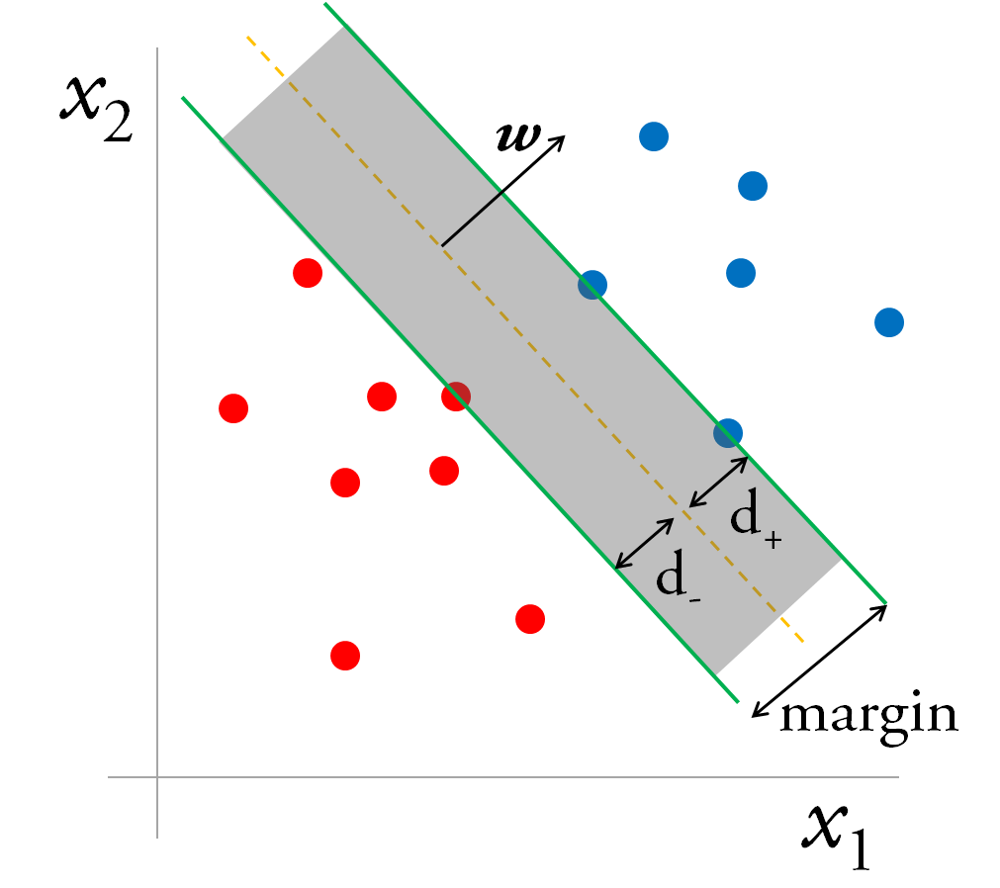
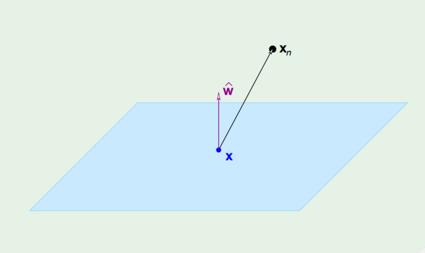

### Support Vector Machines

Our goal is to build a binary classifier by finding an hyperplane which is able to separate the data with the biggest *margin* possible. 

With SVMs we force our *margin* to be at least *something* in order to accept it, by doing that we restrict the number of possible dichotomies, and therefore if we're able to separate the points with a fat dichotomy (*margin*) then that fat dichotomy will have a smaller *VC* dimension then we'd have without any restriction. Let's do that.

Let be $\mathbf{x}_n$ the nearest data point to the *hyperplane* $\mathbf{w}^T\mathbf{x} = 0$ (just imagine a *line* in a $2$-D space for simplicity), before finding the distance we just have to state two observations:

- There's a minor technicality about the *hyperplane* $\mathbf{w}^T\mathbf{x} = 0$ which is annoying , let's say I multiply the vector $\mathbf{w}$ by $1000000$ , I get the *same* hyperplane! So any formula that takes $\mathbf{w}$ and produces the margin will have to have built-in *scale-invariance*, we do that by normalizing $\mathbf{w}$ , requiring that for the nearest data point $\mathbf{x}_n$:
  $$
  |\mathbf{w}^T\mathbf{x}_n|=1
  $$
  ( So I just scale $\mathbf{w}$ up and down in order to fulfill the condition stated above, we just do it because it's *mathematically convenient*! By the way remember that $1$ does *not* represent the Euclidean distance)

- When you solve for the margin, the $w_1$ to $w_d$ will play a completely different role from the role of $w_0$ , so it is no longer convenient to have them on the same vector. We  pull out $w_0$ from $\mathbf{w}$ and rename $w_0$ with $b$ (for *bias*).
  $$
  \mathbf{w} = (w_1,\dots,w_d)\\w_0=b
  $$

So now our notation is changed:

The *hyperplane* is represented by
$$
\mathbf{w}^T\mathbf{x} +b= 0
$$
and our constraint becomes
$$
|\mathbf{w}^T\mathbf{x}_n+b|=1
$$
It's trivial to demonstrate that the vector $\mathbf{w}$ is orthogonal to the *hyperplane*, just suppose to have two point $\mathbf{x}'$ and $\mathbf{x''}$ belonging to the *hyperplane* , then $\mathbf{w}^T\mathbf{x}' +b= 0$ and $\mathbf{w}^T\mathbf{x}'' +b= 0$.

And of course $\mathbf{w}^T\mathbf{x}'' +b - (\mathbf{w}^T\mathbf{x}' +b)=\mathbf{w}^T(\mathbf{x}''-\mathbf{x}') = 0 $ 

Since $\mathbf{x}''-\mathbf{x}'$ is a vector which lays on the *hyperplane* , we deduce that $\mathbf{w}$ is orthogonal to the *hyperplane*.

Then the distance from $\mathbf{x}_n$ to the *hyperplane* can be expressed as a dot product between $\mathbf{x}_n-\mathbf{x}$ (where $\mathbf{x}$ is any point belonging to the plane) and the unit vector $\hat{\mathbf{w}}$ , where $\hat{\mathbf{w}} = \frac{\mathbf{w}}{||\mathbf{w}||}$ ( the distance is just the projection of $\mathbf{x}_n-\mathbf{x}$ in the direction of $\hat{\mathbf{w}}$ ! )
$$
distance = |\;\hat{\mathbf{w}}^T(\mathbf{x}_n-\mathbf{x})\;|
$$
(We take the absolute value since we don't know if $\mathbf{w}$ is facing $\mathbf{x}_n$ or is facing the other direction )

We'll now try to simplify our notion of *distance*.
$$
distance = |\;\hat{\mathbf{w}}^T(\mathbf{x}_n-\mathbf{x})\;| = \frac{1}{||\mathbf{w}||}|\;\mathbf{w}^T\mathbf{x}_n-\mathbf{w}^T\mathbf{x}\;|
$$
This can be simplified if we add and subtract the missing term $b$.
$$
distance = \frac{1}{||\mathbf{w}||}|\;\mathbf{w}^T\mathbf{x}_n+b-\mathbf{w}^T\mathbf{x}-b\;| = \frac{1}{||\mathbf{w}||}|\;\mathbf{w}^T\mathbf{x}_n+b-(\mathbf{w}^T\mathbf{x}+b)\;|
$$
Well, $\mathbf{w}^T\mathbf{x}+b$ is just the value of the equation of the plane...for a point *on* the plane. So without any doubt $\mathbf{w}^T\mathbf{x}+b= 0$ , our notion of *distance* becomes
$$
distance = \frac{1}{||\mathbf{w}||}|\;\mathbf{w}^T\mathbf{x}_n+b\;|
$$
But wait...what is $|\;\mathbf{w}^T\mathbf{x}_n+b\;|$ ? It is the constraint the we defined at the beginning of our derivation!
$$
|\mathbf{w}^T\mathbf{x}_n+b|=1
$$
So we end up with the formula for the distance being just
$$
distance = \frac{1}{||\mathbf{w}||}
$$
Let's now formulate the optimization problem: 
$$
\underset{w}{\operatorname{argmax}}\frac{1}{||\mathbf{w}||}\\\text{subject to}\;\underset{n=1,2,\dots,N}{\operatorname{min}}|\mathbf{w}^T\mathbf{x}_n+b|=1
$$
Since this is not a *friendly* optimization problem (the constraint is characterized by a minimum and an absolute, which are annoying) we are going to find an equivalent problem which is easier to solve. Our optimization problem can be rewritten as
$$
\underset{w}{\operatorname{argmin}}\frac{1}{2}\mathbf{w}^T\mathbf{w}\\y_n(\mathbf{w}^T\mathbf{x}_n+b)\ge1 \;\;\;\;\text{for $n = 1,2,\dots,N$}
$$
where $y_n$ is a variable that we introduce that will be equal to either $+1$ or $-1$ accordingly to its real target value ( remember that this is a *supervised learning* technique and we know the real target value of each sample) . One could argue that the new constraint is actually different from the former one, since maybe the $\mathbf{w}$ that we'll find will allow the constraint to be *strictly* greater than $1$ for every possible point in our dataset [ $y_n(\mathbf{w}^T\mathbf{x}_n+b)> 1 \;\;\forall{n}$ ] while we'd like it to be *exactly* equal to $1$ for *at least* one value of $n$. But that's actually not true! Since we're trying to minimize $\frac{1}{2}\mathbf{w}^T\mathbf{w}$ our algorithm will try to scale down $\mathbf{w}$ until $\mathbf{w}^T\mathbf{x}_n+b$ will touch $1$ for some specific point $n$ of the dataset. 

So how can we solve this? This is a constraint optimization problem with inequality constraints, we have to derive the *Lagrangian* and apply the [*KKT*](<http://www.svms.org/kkt/>) (Karush–Kuhn–Tucker) conditions.

*Objective Function:*

We have to minimize
$$
\mathcal{L}(\mathbf{w},b,\mathbf{\alpha}) = \frac{1}{2}\mathbf{w}^T\mathbf{w}-\sum_{n=1}^{N}\alpha_n(y_n(\mathbf{w}^T\mathbf{x}_n+b)-1)\\
$$
*w.r.t.* to $\mathbf{w}$ and $b$ and maximize it *w.r.t.* the *Lagrange Multipliers* $\alpha_n$ 

We can easily get the two conditions for the unconstrained part:
$$
\nabla_{\mathbf{w}}\mathcal{L}=\mathbf{w}-\sum_{n=1}^{N}\alpha_n y_n\mathbf{x}_n = 0 \;\;\;\;\;\;\;\; \mathbf{w}=\sum_{n=1}^{N}\alpha_n y_n\mathbf{x}_n\\
\frac{\part\mathcal{L}}{\part b} = -\sum_{n=1}^{N}\alpha_n y_n = 0\;\;\;\;\;\;\;\;\;\;\;\sum_{n=1}^{N}\alpha_n y_n=0
$$
And list the other *KKT* conditions:
$$
y_i(\mathbf{w}^T\mathbf{x}_i+b)-1\ge0\;\;\;\;\;\;\forall{i}\\
\alpha_i\ge0\;\;\;\;\;\;\;\forall{i}\\
\alpha_i(y_i(\mathbf{w}^T\mathbf{x}_i+b)-1)=0\;\;\;\;\;\;\forall{i}
$$
*Alert* :  the last condition is called the KKT *dual complementary condition* and will be key for showing that the SVM has only a small number of "support vectors", and will also give us our convergence test when we'll talk about the *SMO* algorithm. 

Now we can reformulate the *Lagrangian* by applying some substitutions 
$$
\mathcal{L}(\mathbf{w},b,\mathbf{\alpha}) = \frac{1}{2}\mathbf{w}^T\mathbf{w}-\sum_{n=1}^{N}\alpha_n(y_n(\mathbf{w}^T\mathbf{x}_n+b)-1)\\
\mathcal{L}(\mathbf{\alpha}) =\sum_{n=1}^{N}\alpha_n-\frac{1}{2}\sum_{n=1}^{N}\sum_{m=1}^{M}y_n y_m\alpha_n\alpha_m\mathbf{x}_n^T\mathbf{x}_m
$$
(if you have doubts just go to minute 36.50 of [this](https://www.youtube.com/watch?v=eHsErlPJWUU) lecture by professor Yaser Abu-Mostafa at *Caltech* )

We end up with the *dual* formulation of the problem
$$
\underset{\alpha}{\operatorname{argmax}}\sum_{n=1}^{N}\alpha_n-\frac{1}{2}\sum_{n=1}^{N}\sum_{m=1}^{M}y_n y_m\alpha_n\alpha_m\mathbf{x}_n^T\mathbf{x}_m\\
\;\\
s.t. \;\;\;\;\;\;\;\;\alpha_n\ge0\;\;\;\forall{n}\\
\;\;\;\;\;\;\;\;\;\;\;\;\;\;\;\sum_{n=1}^{N}\alpha_n y_n=0
$$
We can notice that the old constraint $\mathbf{w}=\sum_{n=1}^{N}\alpha_n y_n\mathbf{x}_n$ doesn't appear in the new formulation since it is *not* a constraint on $\alpha$ , it was a constraint on $\mathbf{w}$ which is not part of our formulation anymore.

How do we find the solution? we throw this objective (which btw happens to be a *convex* function) to a *quadratic programming* package.

Once the *quadratic programming* package gives us back the solution we find out that a whole bunch of $\alpha$ are just $0$ !  All the $\alpha$ which are not $0$ are the *support vectors* ! (i.e. the vectors that determines the width of the *margin*) , this can be noted by observing the last *KKT* condition, in fact either a constraint is active , and hence the point is a support vector, or its multiplier is zero. 

Now that we solved the problem we can get both $\mathbf{w}$  and $b$.
$$
\mathbf{w} = \sum_{\mathbf{x}_n \in \text{ SV}}\alpha_ny_n\mathbf{x}_n\\
y_n(\mathbf{w}^T\mathbf{x}_{n\in\text{SV}}+b)=1
$$
where $\mathbf{x}_{n\in\text{SV}}$ is any *support vector*. (you'd find the *same* $b$ for every support vector)

But the coolest thing about *SVMs* is that we can rewrite our *objective functions* as follows:
$$
\mathcal{L}(\mathbf{\alpha}) =\sum_{n=1}^{N}\alpha_n-\frac{1}{2}\sum_{n=1}^{N}\sum_{m=1}^{M}y_n y_m\alpha_n\alpha_mk(\mathbf{x}_n\mathbf{x}_m)
$$
We can use *kernels* !! (if you don't know what I'm talking about read the *kernel* related question present somewhere in this document)

Finally we end up with the following equation for classifying *new points*:
$$
y(\mathbf{x}) = sign\left(\sum_{n=1}^{N}\alpha_n t_n k(\mathbf{x},\mathbf{x}_n)+b\right)
$$
The method described until here is called *hard-margin SVM* since the margin has to be satisfied strictly, it can happens that the points are not *linearly separable* in *any* way, or we just want to handle *noisy data* to avoid overfitting, so now we're going to briefly define another version of it, which is called *soft-margin SVM* that allows for few errors and penalizes for them.

We introduce *slack variables* $\xi_i$ , in this way we allow to *violate* the margin constraint but we add a *penalty*.

We now have to 
$$
\text{Minimize}\ \ ||\mathbf{w}||_2^2+C\sum_i \xi_i \\
\text{s.t.}\\ \ y_i(\mathbf{w}^Tx_i+b)\ge1-\xi_i\ ,\ \ \ \forall{i}\\
\xi_i\ge0\ ,\ \ \ \forall{i}
$$
$C$ is a coefficient that allows to treadeoff bias-variance and is chosen by *cross-validation*.

And obtain the *Dual Representation*
$$
  \text{Maximize}\ \ \ \mathcal{L}(\mathbf{\alpha}) =\sum_{n=1}^{N}\alpha_n-\frac{1}{2}\sum_{n=1}^{N}\sum_{m=1}^{M}y_n y_m\alpha_n\alpha_mk(\mathbf{x}_n\mathbf{x}_m)\\
  \text{s.t.}\\
  0\le\alpha_n\le C\ \ \ \ \ \forall{i}\\
  \sum_{n=1}^N\alpha_n t_n = 0
$$
  Support vectors are points associated with $\alpha_n > 0$

  if $\alpha_n<C$ the points lies *on the margin*

  if $\alpha_n = C$ the point lies *inside the margin*, and it can be either *correctly classified* ($\xi_i \le 1$) or *misclassified* ($\xi_i>1$)  

  Fun fact: When $C$ is large, larger slacks penalize the objective function of SVM’s more than when $C$ is small. As $C$ approaches infinity, this means that having any slack variable set to non-zero would have infinite penalty. Consequently, as $C$ approaches infinity, all slack variables are set to $0$ and we end up with a hard-margin SVM classifier.

And what about generalization? Can we compute an *Error* bound in order to see if our model is overfitting? 

As *Vapnik* said: "In the support-vectors learning algorithm the complexity of the construction does not depend on the dimensionality of the feature space, but on the number of support vectors." So it's reasonable to define an upper bound of the error as:
$$
  L_h\le\frac{\mathbb{E}[\text{number of support vectors}]}{N}
$$
This is called *Leave-One-Out Bound* (I don't know why, maybe it's written [here ](<https://ocw.mit.edu/courses/mathematics/18-465-topics-in-statistics-statistical-learning-theory-spring-2007/lecture-notes/l4.pdf> )). The good thing is that it can be easily computed and we don't need to run SVM multiple times.

The other kind of bound is called *Margin bound*: a bound on the VC dimension which decreases with the margin. The larger the margin, the less the variance and so, the less the VC dimension. Unfortunately the bound is quite pessimistic 

 Sometimes for computational reasons, when we solve a problem characterized by a huge dataset, it is not possible to compute *all* the support vectors with generic quadratic programming solvers (the number of constraints depends on the number of samples), hence, specialized optimization algorithms are often used. One example is *Sequential Minimal Optimization (SMO)*:

Remember our formulation for the *soft-margin SVM*:
$$
\mathcal{L}(\mathbf{\alpha}) =\sum_{n=1}^{N}\alpha_n-\frac{1}{2}\sum_{n=1}^{N}\sum_{m=1}^{M}y_n y_m\alpha_n\alpha_mk(\mathbf{x}_n\mathbf{x}_m)\\
  s.t.\\
  0\le\alpha_i\le C\ \ \ \ \text{for}\ i =1,2,\dots,n\\
  \sum_{i=1}^ny_i\alpha_i=0
$$
*SMO* breaks this problem into a series of smallest possible sub-problems, which are then solved analytically. Because of the linear equality constraint involving the Lagrange multipliers $\alpha _{i}$ , the smallest possible problem involves two such multipliers. Then, for any two multipliers $\alpha_1$ and $\alpha_2$ the constraints are reduced to:
$$
0\le\alpha_1,\alpha_2\le C\\
  y_1\alpha_1+y_2\alpha_2=k
$$
and this reduced problem can be solved analytically: one needs to find a minimum of a one-dimensional quadratic function. $k$ is the negative of the sum over the rest of terms in the equality constraint, which is fixed in each iteration ( we do this because we want that $\sum_{i=1}^ny_i\alpha_i=0$ ).

The algorithm proceeds as follows:

- Find a Lagrange multiplier $\alpha_1$ that violates the *KKT* conditions for the optimization problem.
- Pick a second multiplier $\alpha_2$ and optimize the pair ($\alpha_1$,$\alpha_2$).
- Repeat steps $1$ and $2$ until convergence.

When all the Lagrange multipliers satisfy the KKT conditions (within a user-defined tolerance), the problem has been solved. Although this algorithm is guaranteed to converge, heuristics are used to choose the pair of multipliers so as to accelerate the rate of convergence. This is critical for large data sets since there are $\frac{n(n-1)}{2}$  possible choices for $\alpha_i$ and $\alpha_j$ .