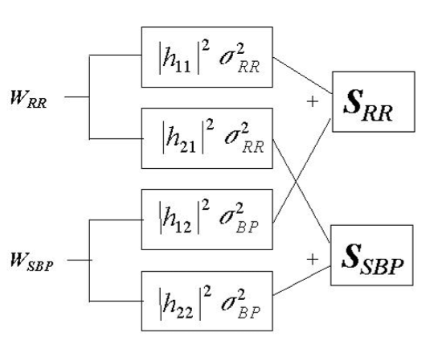

### Granger Causality

*"The topic of how to define causality has kept philosophers busy for over two thousand years and has yet to be resolved. It is a deep convoluted question with many possible answers which do not satisfy everyone, and yet it remains of some importance. Investigators would like to think that they have found a "cause", which is a deep fundamental relationship and possibly potentially useful. In the early 1960's I was considering a pair of related stochastic processes which were clearly inter-related and I wanted to know if this relationship could be broken down into a pair of one way relationships. It was suggested to me to look at a definition of causality proposed by a very famous mathematician, Norbert Weiner, so I adapted this definition (Wiener 1956) into a practical form and discussed it."* ( *Clive Granger* )

A time series $X$ is said to Granger-cause $Y$ if it can be shown, usually through a series of t-tests and F-tests on lagged values of $X$ (and with lagged values of $Y$ also included), that those $X$ values provide statistically-significative information about future values of $Y​$.

When time series $X$ *Granger-causes* time series $Y$, the patterns in $X$ are approximately repeated in $Y$ after some time lag (two examples are indicated with arrows). Thus, past values of $X$ can be used for the prediction of future values of $Y$.

------

The basic "Granger Causality" definition is quite simple. The definition relies on the idea that the cause occurs before the effect. Suppose that we have three time series (*which are not related with the image above*) $X_t$, $Y_t$ and $W_t$, and that we first attempt to predict $X_{t+1}$ using past terms of $X_t$ and $W_t$. We then try to predict $X_{t+1}$ using past terms of $X_t$ , $W_t$ and $Y_t$ .  If the second prediction is found to be more successful, according to standard cost functions, then the past of $Y$ appears to contain information helping in forecasting $X_{t+1}$ that is not in past $X_t$ or $W_t$. In particular, $W_t$ could be a vector of possible explanatory variables. 

Thus, $Y_t$ would *Granger cause* $X_{t+1}$ if:

- $Y_t$ occurs before $X_{t+1}$
- It contains information useful in predicting $X_{t+1}$ that is not found in a group of other appropriate variables.

The larger $W_t$ is, the more carefully its contents are selected, and the more $Y_t$ is passing a stringent criterion.  Eventually, $Y_t$ might seem to contain unique information about $X_{t+1}$ that is not found in other variables which is why the "causality" label is perhaps appropriate.

Let's see an example with the classical *bivariate linear autoregressive model*:
$$
X_1(t) = \sum_{j=1}^{p}A_{11}X_1(t-j)+\sum_{j=1}^{p}A_{12}X_2(t-j)+E_1(t)\\
X_2(t) = \sum_{j=1}^{p}A_{21}X_1(t-j)+\sum_{j=1}^{p}A_{22}X_2(t-j)+E_1(t)
$$
Where *p* is the maximum number of lagged observations included in the model (the model order), the matrix $A$ contains the coefficients of the model (i.e. the contributions of each lagged observation to the predicted values of $X_1(t)$ and $X_2(t)$ ) and $E_1$ and $E_2$ are residuals (prediction errors) for each time series.

We already know this model, we used it to model blood pressure and heart rate (RRs).

Our $W$ variable will be expressed by the residuals in this case. The idea is that if , looking at the first equation (for example), the variance of $E_1$ is reduced by the introduction of $X_2$ then we can say that $X_2$ granger cause $X_1$ . Obviously we are talking about a *significant* reduction of the variance. We can test it statistically by performing an $F-test$ of the null hypothesis that $A_{12}=0$ , given assumptions of covariance stationarity on $X_1$ and $X_2​$ .

With *Granger Causality* we can test directionality, we can use *Granger* to both direction to see, indeed, if there's a double flow.

Another thing is that without *Granger* if we have three variables ($X$,$Y$ and $Z$) we could find that $X$ causes $Y$ even in this case (*the one on the right*), but that's not true (in reality there's no arrow between $X$ and $Y$ !).

Supposing we are in the second model (*the one on the right*) and we already have $Z$ and $Y$,  applying *Granger* between $X$ and $Y$ would result in a false outcome, since $X$ wouldn't add any additional information (all the information we needed was already in $Z$, that we knew!)

Instead in the first case we would have that not *all* the information goes to $Z$, but part of it goes to $Y$, so if we include the variable $X$ in the model we'd see that the prediction of $Y$ would be improved. (so considering $Z$ as the "noise" $W$ of before we'd observe a decrease in the variance of $Z$).

Another instance in which conditional Granger causality is valuable is when a single source drives two outputs with different time-delay. A bivariate analysis, but not  a multivariable analysis, would falsely infer a causal connection from the output with the shorter delay to the output with the longer delay. if $X$ is causing $Z$ and $Z$ is causing $Y$, there will be a longer delay between the information of $X$ reflected in $Y$; that delay is the key for the model to give all the variance to $Z$, because $Z$ will be predicted by $X$ earlier than $Y$ .

We'll see later on that every *arrow* can be expressed as a *transfer function*.

By the way *Granger causality* has some limitations since it makes two important assumptions about the data:

- It is covariance *stationary* (i.e. , the mean and variance of each time series do not change over time)
- it can be adequately described by a *linear model*

Now we have to go beyond stationarity and linearity.  Historically one of the most popular ways that might use the definition of G-causality was models that were defined in the frequency domain. The easiest way to look at G-causality in the frequency domain is frequency transform our linear model already seen before. So it is important to define G-causality in the frequency domain and its power spectral density as a function of frequency (*remember:* the integral of the spectrum is the power spectrum, the amount of dynamics). By using *Fourier* methods it is possible to examine G-causality in the spectra domain. This can be very useful in neurophysiology signals, where frequency decompositions are often of interest. Intuitively, spectral G-causality from $X_1$ to $X_2$ measures the fraction of the total power at frequency $f$ of $X_1$ that is contributed by $X_2$.

Two alternative measures which are closely related to spectral G-causality are *Partial Directed Coherence* and the *Directed Transfer Function*. So, the principal measures based on the Granger Causality principle are:

- *Granger Causality Index* (GCI)
- *Directed Transfer Function* (DTF)
- *Partial Directed Coherence* (PDC)

Let's have the following example, a bivariate system which describes the interactions between RR intervals and *systolic blood pressure*, which can be expressed in the following matrix form:
$$
Y(n) = \sum_{k=1}^{p}A[k]X[n-k]+W[n] \\
\mathbf{A}[k] = \left[\matrix{a_{11}[k] && a_{12}[k]\\a_{21}[k] && a_{22}[k]}\right]\\
X[n] = \left[\matrix{RR[n] \\SBP[n]}\right]\\
\mathbf{W}[n] = \left[\matrix{w_{RR}[n] \\ w_{SBP}[n]}\right]
$$
where $p​$ is the order of the model.

In the frequency domain we have that:
$$
\left[\matrix{RR(f)\\SBP(f)}\right] = \left[\matrix{A_{11}(f) && A_{12}(f)\\A_{21}(f)&& A_{22}(f)}\right]\left[\matrix{RR(f)\\SBP(f)}\right]+ \left[\matrix{w_{RR}(f) \\ w_{SBP}(f)}\right]
$$
If we isolate the single variables we can see the transfer functions form SBP to RR and from RR to SBP:

$$
RR(f) = \frac{A_{12}(f)}{1-A_{11}(f)}SBP(f) + \frac{1}{1-A_{11}(f)}w_{RR}(f)\\
SBP(f) = \frac{A_{21}(f)}{1-A_{22}(f)}RR(f) + \frac{1}{1-A_{22}(f)}w_{SBP}(f) \\
A_{ij}(f) = \sum_{k=1}^{p}a_{ij}[k]e^{-j2\pi fk}
$$
Applying some trick it is possible to rewrite this equations in order to consider the generation of each of the two output signals as produced by contributions coming from the modulation of the two white uncorrelated noise inputs.

Within this formulation we can infer, i.e. , that as big $h_{12}$ is, as much $w_{SBP}$ is influencing *RR* and the higher $h_{21}$ is the more $w_{RR}​$ is influencing *SBP*.

From here we can compute the power spectrum
$$
\underline{S}(f) = \underline{H}^*(f)\ \underline{\Sigma}\ \underline{H}^T(f)\\
\Sigma \cong \left[\matrix{\sigma_{RR} && 0\\0 && \sigma_{SBP}}\right]\\
\left[\matrix{S_{RR}(f) && S_{CROSS}(f)\\S^*_{CROSS}(f) && S_{SBP}(f)}\right] = \left[\matrix{|h_{11}|^2\sigma_{RR}^2+|h_{12}|^2\sigma_{SBP}^2 && h_{11}\ ^*h_{21}\sigma_{RR}^2+h_{12}\ ^*h_{22}\sigma_{SBP}^2 \\
h_{21}\ ^*h_{11}\sigma_{RR}^2+h_{22}\ ^*h_{12}\sigma_{SBP}^2 && |h_{21}|^2\sigma_{RR}^2+|h_{22}|^2\sigma_{SBP}^2}\right]
$$

$S(f)$ is a matrix in which we have in the diagonal the two auto-spectra, spectra of each of the two variables, the cross-diagonal are the cross-spectra, they contain everything that belongs to the 2 variables together, so practically the mutual information between the two variables. If the matrix is diagonal, there is no cross-spectrum. The values obtained are expressed in terms of variance of *RR* and *SBP* and this is the particular case in which the two noises are hypothesized uncorrelated (see that the matrix $\Sigma​$ is diagonal), the formulas would have been more complicated if the noises were correlated.

Remember that the $h$s are just a combination of the initial $a$s parameters, all we did is just technical passages. All we have to estimate is the $a​$s to minimize the variance of the noise (we obviously want it to be as low as possible). 

We can obtain a measure of the gain (which is how much information is transferred between SBP and RR) in two different ways:

as the square root of the ratio between the auto-spectrum of the output (RR) and the auto-spectrum of the input (SBP)
$$
\alpha_o^{I}(f) = \sqrt{\frac{S_{RR}(f)}{S_{SBP}(f)}}
$$
as the ratio between the cross-spectrum and the auto-spectrum of the input noise (SBP)
$$
\alpha_0^{II}(f)=\frac{S_{CROSS}(f)}{S_{SBP}(f)}
$$
The Cross-spectral quantification could also be expressed considering the subdivision of the contributions from the two noises, but the cross-spectrum is reflected in a more complex sum of cross-products of the $h​$ terms.
$$
Coh(f) = \frac{S^2_{CROSS}(f)}{S_{SBP}(f)S_{RR}(f)}<1 \\
{\alpha_o^{II}}^2(f) = \frac{S^2_{CROSS}(f)}{S_{SBP}^2(f)}<\frac{S_{SBP}(f)S_{RR}(f)}{S_{SBP}^2(f)}={\alpha_0^{I}}^{2}(f)
$$
The *Coherence* $Coh(f)$ has its maximum value in $1$. When it is $1​$, all the power of one variable depends on the other one.

Looking again at this block diagram

We can define the *directional gains* as the contribution of the noise related to the input signal on the output signal,divided by the contribution of the same noise on the input signal, giving the same quantities obtained from consideration of the transfer functions:
$$
G_{1\to2}(f) = \left|\frac{h_{21}(f)}{h_{11}(f)}\right|=\left|\frac{A_{21}(f)}{1-A_{22}(f)}\right| \\
G_{2\to1}(f) = \left|\frac{h_{12}(f)}{h_{22}(f)}\right|=\left|\frac{A_{12}(f)}{1-A_{11}(f)}\right|
$$
Which can be rewritten in the following way:
$$
G_{1\to2}(f) =\sqrt{\frac{S_{SBP}(f)-|h_{22}(f)|^2\sigma_{SBP}^2}{S_{RR}(f)-|h_{12}(f)|^2\sigma_{SBP}^2}}\\
G_{2\to1}(f) =\sqrt{\frac{S_{RR}(f)-|h_{11}(f)|^2\sigma_{RR}^2}{S_{SBP}(f)-|h_{21}(f)|^2\sigma_{RR}^2}}
$$
The *directional gain* from a variable $j$ to $i$ is the square root of the ratio, in the frequency domain, of the two spectral content devoid of the information carried by the $i​$ variable.
$$
G_{j\to i}(f) =\sqrt{\frac{S_{ii}(f)-|h_{ii}(f)|^2\sigma_{ii}^2}{S_{jj}(f)-|h_{ji}(f)|^2\sigma_{ii}^2}}
$$
One problem: the gain is proportional to the transfer scale.

But how do we know if these gains reflect Granger causality?

- Granger Causality Index
  $$
  GCI_{Y\to X}=\ln\left(\frac{\sigma_{X|X}}{\sigma_{X|X+Y}}\right)
  $$
  The GCI shows the driving of channel $x$ by channel $y​$ , is defined by the logarithm of the ratio of *residual variance* for one channel to the *residual variance* of the two-channel model.

- Partial Coherence

  It is another index that defines Granger Causality and goes back to the original concept that Granger was talking about. So we include a third variable and then we can define a partial cross-spectrum that is the original cross-spectrum minus whatever linear information is included between $X$ and $Y$. So, the first extension of bivariate analysis was made by incorporating a third signal into the estimation of a new coherence measure, termed *partial coherence*.

  ...

  - Partial Cross-Spectrum
    $$
    S_{xy|z}(f) = S_{xy}(f)-\frac{S_{xz}(f)S_{yz}(f)}{S_{zz}(f)}
    $$
    ...

  - Partial Coherence

  $$
  K_{xy|z}(f) = \frac{|S_{xy|z}(f)|^2}{|S_{xx|z}(f)||S_{yy|z}(f)|}
  $$

  The partial coherence can be represented as the fraction of coherence between $X$ and $Y$ that is not shared with $Z$. The less the coherence (considering $z$ ) the less we will have to consider directionality in which there is $z$. If we have a non-linear system, it could be that $x$ and $y$ have a partial coherence that is low, because they are connected in a non-linear way.  If three signals are fully coherent with each other, partialization of the coherent activity between any two signals with the remaining signal as the predictor would lead to zero coherence. In other words. if $Z$ contributes to the linear interdependence between $X$ and $Y$, then the partial coherence will be smaller than the ordinary coherence $K_{xy}(f)$ . However, it must be noted that partial coherence is based on the assumption of linearity, so any failure in its reduction might be also caused by nonlinear interaction between signals.

- *Directed Transfer Function*

  It is related to the absolute value of the Transfer Function of $i$ to $j$ in relationship to the sum of all the transfer functions.

  It was introduced by *Kaminski and Blinowska* in the form:
  $$
  DTF^2_{j\to i}(f) = \frac{|H_{ij}(f)|^2}{\sum_{m=1}^{k}|H_{im}(f)|^2}
  $$
  DTF described causal influence of channel $j$ on channel $i$ at frequency $f$ 

  The above equation defines a normalized version of DTF, which takes values from $0$ to $1$ producing a ratio between the inflow from channel $j$ to channel $i$ to all the inflows to channel $i$.

  DTF is the specific variance that describes the influence between these channels, linked to the sum of all the transfer functions. DTF is directly linked to the models that link directly the noises with the total variance expressed in every variable of outpu.

  ....

  ....