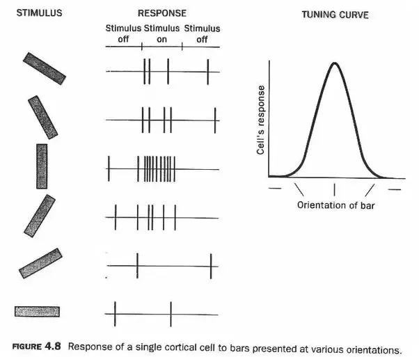
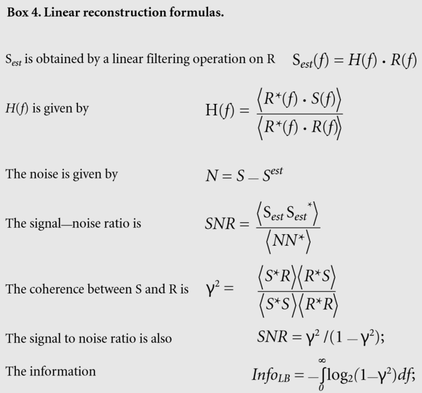
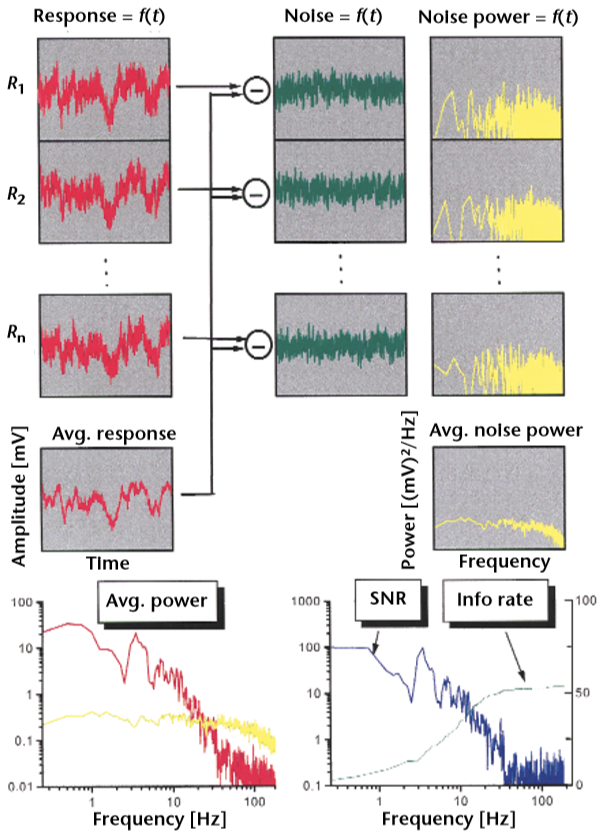
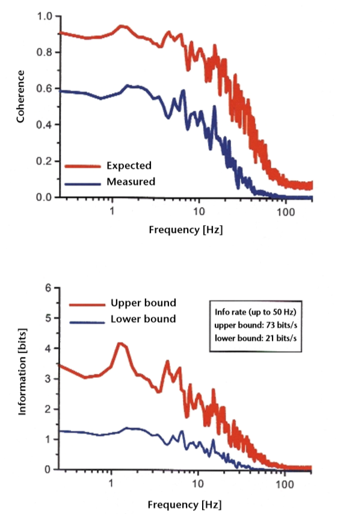

### Neural Coding

So we want to model the response of a neuron... Experimentally it can be observed that the *tuning curve* of a neuron looks like that (this is just a random example)

Remember that a *tuning curve* is just a graph of neuronal response (usually measured in action potentials or spikes per unit time) as a function of a continuous stimulus attribute, such as orientation, wavelength, or frequency. A neuron is said to be "tuned" for the stimulus that evokes the greatest response, and the width of the curve from the half-maximum response on either side of the peak indicates how broadly or narrowly tuned a neuron is for a particular stimulus attribute.

The noisy neuron has a response that can be defined as: 
$$
R(s) = \mathcal{T}(s)+\sqrt{V(s)\xi}
$$
where $\mathcal{T}(s)​$ represents the *Tuning deterministic* part and the second term represents the *Noise stochastic* part.

From our definition of *Mutual information* (amount of information that can be obtained about one random variable by observing another) we know that:
$$
I(X;Y)=H(X)-H(X|Y)=H(Y)-H(Y|X)
$$
We now are interested in solving the following problem: given a response $r$ what are the probabilities of having a stimulus $s$ ? Let's try to solve this problem by firstly defining the *mutual information*:
$$
I(s;r) = H(r)-H(r|s)\\
I(s;r) = H(r)-\sum_{s_i}p(s_i)H(r|s_i)
$$
For each stimulus value $s_i$ a distribution of response values $p(r|s_i)$ is generated, the more $p(r|s_i )$ is closer to a delta function, the lower the value for $H(r|s_i)$. ( *remember: less noise uncertainty = higher information!* ) 

In neural coding, $H(R|S)$ is the entropy in the neural response given the stimulus. This variable, called neuronal noise, measures the uncertainty remaining in the neural response when the stimulus conditions are known.

Note that entropy measures uncertainty and that information is defined as the difference of entropies $\to$ a reduction of uncertainty.
$$
I(s;r)=-\sum_ip(r_i)\log_2p(r_i)+\sum_jp(s_j)\sum_ip(r_i|s_j)\log_2p(r_i|s_j)\\
= -\sum_ip(r_i)\log_2p(r_i)+\sum_{i,j}p(r_i,s_i)\log_2p(r_i|s_j)\\
= -\sum_{i,j}p(r_i,s_j)\log_2p(r_i)+\sum_{i,j}p(r_i,s_i)\log_2p(r_i|s_j)\\
\sum_{i,j}p(r_i,s_j)\log_2\frac{p(r_i,s_j)}{p(r_i)p(s_j)}= \sum_{i,j}p(r_i,s_j)\log_2\frac{p(r_i|s_j)}{p(r_i)}
$$
​			Observe that by the law of total probability $\sum_jp(r_i,s_j) = p(r_i)$ , hence
$$
\sum_ip(r_i)\log_2p(r_i) = \sum_{i,j}p(r_i,s_j)\log_2p(r_i)
$$
A final basic point of information thseory is the "*data processing inequality*" theorem. Its basis is the somewhat trivial statement that information cannot be recovered after being degraded. For example, consider a neural processing chain where $S$ is encoded by a first neuron in a set of neuronal responses $R1$, and $R1$ is then encoded by a second set of neuronal responses $R2$. The data processing inequality says that $I(S, R1) ≥ I(S, R2)$. Note that this is true of all information channels, not just neurons. This theorem is a cornerstone of the method (below) used to find a lower bound on the amount of information about a dynamic stimulus transmitted in a neuronal channel. 

Now, remember that we are in a real case scenario, where we have *noise*, our problem is that we don't know if uncertainty is given by the way the system is working or by a noisy variable that is not contemplated by the paradigm of *information theory*. We have to redefine information theory in terms of *Signal to Noise Ratio*. We will see tables that relate information theory and entropy as a function of the SNR.

Remember that the entropy of a Gaussian is proportional to the variance (  $H(S) = \frac{1}{2}\log_a(2\pi e\sigma^2)​$ ) and, intuitively,  for additive Gaussian noise, information is proportional to signal-to-noise ratio (*SNR*) .

For time-dependent signals, entropy grows with duration (uncertainty increases over time as properties may change).

Now we want to estimate *information*, remember that
$$
I(s;r) = H(r)-H(r|s)\\
  I(s;r) = H(r)-\sum_{s_i}p(s_i)H(r|s_i)
$$
we have $3​$ different methods for *estimating information*:

- *Direct*:

  The first ("*direct*") method calculates information directly from the neural response by estimating its entropy, $H(R)$, and neural noise, $H(R|S)$. This method exactly determines the average information transmitted, but it does not reveal what aspects of the stimulus are being encoded. Since the direct method does not make any assumptions about response probability distributions, it also requires a lot of experimental data.

- *Upper Bound*:

  The second method is similar to the first, with the added assumption that the neuronal response amplitudes, expressed in the frequency domain (see below), have *Gaussian* probability distributions. This method, which gives an upper bound for information transfer, requires significantly less data because Gaussian distributions are completely described by their mean and variance. 

  *Remember :* The fundamental assumption of this method is that the neuronal response and neuronal noise have Gaussian probability distributions in the *frequency domain* and that neuronal noise is *additive*.  Since the *Gaussian* has maximum entropy, the *real* entropy has to be lower!

    

  The figure above consists in the flow chart of how to measure the channel capacity of a neuron. The same stimulus is presented $n$ times while the responses $R_i$ are measured (*left*). These responses are averaged to obtain the average response $R_{avg}$. The difference between each $R_i$ and $R_{avg} $ becomes the noise traces $N_i$ (*middle*). These are Fourier-transformed to the noise power spectra $N_i(f)$ (*right*), which can be averaged as well. Bottom left, power spectra of the mean response (*red*) together with the mean power spectra of the noise (*yellow*). Bottom right, ratio of these two functions, the so-called signal-to-noise ratio or $SNR$, together with the *cumulative* information rate. Response and noise data were created in a pseudorandom way from Gaussian distributions.

  - [ ] DOUBT: WHAT'S THE LINK BETWEEN INFORMATION RATE AND $I(s;r)$ ?

  - [ ] Why are we interested in the CUMULATIVE information rate?

  - [x] What's the link between SNR and upper bound?

    Remember that the entropy of a Gaussian is proportional to the variance (  $H(S) = \frac{1}{2}\log_a(2\pi e\sigma^2)$ ) and, intuitively,  for additive Gaussian noise, information is proportional to signal-to-noise ratio (*SNR*) .

- *Lower Bound*:

  We can investigate stimulus encoding by testing different encoding *models*. Since these models might not capture all the transmitted information, this gives a lower-bound estimate of information.

  One method of modeling stimulus encoding ("*reverse reconstruction*") describes how to calculate the best possible stimulus estimate from the neural responses. In this procedure, the stimulus signal $S$ is encoded into response spike trains. A reconstruction algorithm of choice is then used to estimate $S$ ($S_{est}$) from the response $R$. 

  Mutual information between $S$ and $R$ is then estimated by calculating the information between $S$ and $S_{est}$. From the *data processing inequality*, the information estimate is smaller than (or equal to) the information about $S$ that is in $R$. Thus this procedure gives us a *lower bound on the information*. If $S$ is estimated well, the resulting lower bound is close to the real information transmitted about the stimulus.

  ------

  An example of reverse reconstruction:

  

  Here a visual interneuron of the fly ( *H1 cell* ) was stimulated by a grating moving in front of the animal using a pseudo-random waveform (upper diagram, red trace). The spike output of the cell (shown in black) follows the velocity signal only roughly. The impulse response of the reverse filter (right diagram) is negative in time and possesses band-pass characteristics. Applied to the neural response, the reconstructed or estimated stimulus function comes out as shown in black in the bottom diagram. Except for fast signal deflections, this signal is close to the stimulus (Haag and Borst, unpublished).

The following image is an example of upper and lower bound of information as calculated from the spike train of a fly motion-sensitive nerve cell (H1 cell). The fly was stimulated by a moving grating while the spikes were recorded extracellularly. The lower bound was calculated from the coherence between the membrane potential and the stimulus velocity, the upper bound was calculated from the SNR. The upper integration limit was set to 50 Hz, because higher frequencies were not delivered by the stimulation device. The neural signal is carrying 21–73 bits per s about the stimulus velocity (Haag and Borst, unpublished).

Finally, here is the summary diagram for calculation of *upper* and *lower* bounds on information transfer. Top, situation where a stimulus $S$ is corrupted by additive noise and subsequently fed through an unknown encoder to result in the response $R$. The lower bound is obtained with a linear reverse filter operation. The upper bound is obtained directly by comparing average and individual responses.

------

Here a mock neuron is tested with different stimulus intensities (from $0$ to $10$). For each stimulus intensity, it reveals a Gaussian distribution of spike responses around a mean value, ranging from $20 Hz$ for weak up to $80 Hz​$ for strong stimuli. 

$(a)$ Complete response distributions for each stimulus intensity; darker values indicate higher probabilities. 

$(b)$ Summing these values along the horizontal lines leads to the overall response probability distribution (right), *assuming that each stimulus is equally likely to occur.* 

$(c)$ Information theory allows one to replace the traditional stimulus–response curve (mean ± s.d.) with an information curve (thick line) that indicates how well different values of the stimulus are encoded in the response. The information calculation is based not only the mean value of the response but also on its complete distribution at each stimulus condition.

The distribution of responses obtained for this mock neuron at the middle of its operating range is more unique than the distribution of responses obtained for other stimulus values, leading to maximal values of information in that range.

------

