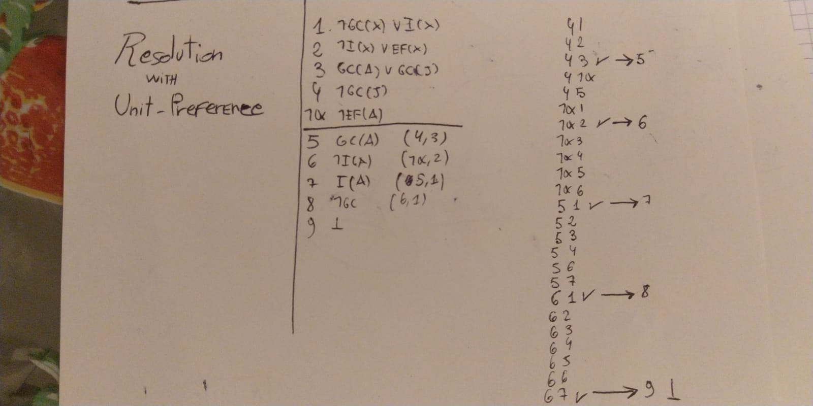
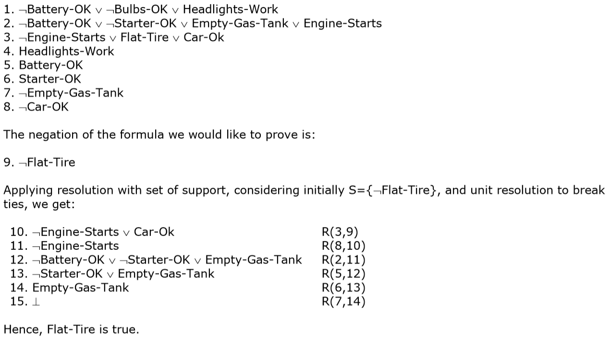
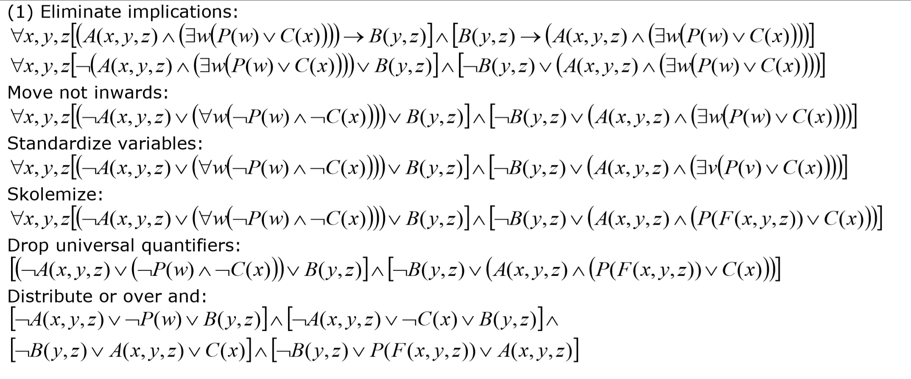

# Artificial Intelligence

*A series of terribly-formatted notes on the Artificial Intelligence course as taught by Francesco Amigoni and Marcello Restelli during the first semester of the academic year 2018-2019 at Politecnico di Milano*

# Index

[TOC]

 

 

# 1 - Search Problems

### Definition of a Search Problem

- Set of states
- Initial state
- Actions
- Result Function: ${Result(s,a)=s'}$
- Costs
- Goal test

### Search Algorithms

Legenda:

- ${b}$  =  Branching Factor:   
  what is the maximum number of children a node can have, the maximum cardinality of the set returned
- ${\epsilon}$ is the smallest path cost you have.

| Strategy             | Complete?                                       | Optimal?                                           | T C      | S        |
| -------------------- | ----------------------------------------------- | -------------------------------------------------- | -------- | -------- |
|                      |                                                 |                                                    |          |          |
| Breadth First Search | Yes (no when the branch factor (b) is infinite) | No (yes if the cost function increases with depth) | $O(b^d)$ | $O(b^d)$ |
|                      |                                                 |                                                    |          |          |
|                      |                                                 |                                                    |          |          |

| Uniform Cost               | Yes (not guaranteed if some costs = 0)   | Yes                                                       | $O(b^c\cdot \epsilon)$ | $O(b^c\cdot  \epsilon)$ |
| -------------------------- | ---------------------------------------- | --------------------------------------------------------- | ---------------------- | ----------------------- |
|                            |                                          |                                                           |                        |                         |
| Depth First                | tree search: no (loop) graph search: yes | No                                                        |                        |                         |
|                            |                                          |                                                           |                        |                         |
|                            |                                          |                                                           |                        |                         |
| Depth Limited Search       | No                                       | No                                                        | $O(b^l)$               | $O(bl)$                 |
|                            |                                          |                                                           |                        |                         |
|                            |                                          |                                                           |                        |                         |
| Iterative Deepening Search | Yes(but not when it's infinite)          | No (but if all costs are 1 it finds the optimal solution) | $O(b^d)$               | $O(bd)$                 |
|                            |                                          |                                                           |                        |                         |
|                            |                                          |                                                           |                        |                         |

**Comments**

- Breadth First Search
  - if we check if a node corresponds to a state that is a goal-state when we generate the node, and not when we pick up the node. This improves the worst case to  O(b^(d+1)).
- Uniform cost Search
  - A property is g(n) that is the path cost. Chooses first from the frontier the node with the smallest path cost. 
    You can never have a loop if costs are different from zero
- Depth First Search
  - Depth-first strategy: when you have to choose a node from the frontier choose the deepest node. "m" is the longest path i can have in the state space.
  - Backtracking : when you expand a node you don't generate all successors but only one, you keep in a separate data structure a track of which are the successor already tried. 
    A memory saving version of depth first. Here spatial complexity is "m", excluding the data structure. 
- Depth Limited Search
  - I will fix a limit called "l" that is the maximum depth at which i can
    generate successors. I will never generate successors that are deeper than
    "l". i check if the node I'm trying to expand is greater than
    "l", if it is i will not expand.
- Iterative Deepening Search
  - The idea is, size of L is a problem, if it's too little i cannot find any solution. Here we start from l=0, if i find a solution then => good   Every time I keep in memory just one path, just one path at a time. Time complexity: How many nodes I have to generate? (d+1) +bd+b^2x(d-1)+…+b^d

### Admissibility and Consistency

- #### Admissibility of a heuristic:

  The heuristic of a node is admissible iff
  $$
  h(A)\le MinPathFrom(A)
  $$
  Where the right member is the minimum path to get to the goal state from A

- #### Consistency of a heuristic:

  1 and 2 are two nodes of the graph, h(1) is the heuristic of 1 and h(2) is the heuristic of 2.
  If such nodes are connected in the following way

  ​                                                                                 $1 \to 2$ 
  Their heuristics are consistence iff
  $$
  c_{12}\ge h(1)-h(2)
  $$

### A* Star Algorithm Completeness & Optimality

- Like breadth-first search,  A* is *complete* and will always find a solution if one exists provided c(node_1,node_2) > epsilon > 0 for fixed epsilon
- Optimal if h() is admissible, with tree search (no elimination of repeated nodes)
- Optimal if h() is consistent, with graph search (elimination of repeated nodes)

 

# 2 - Constraint Satisfaction Problems

### Definition

A (discrete) CSP is defined by:

- A finite set ${}X={x_1,...,x_n}$ of *variables*
- For every variable ${x_i}$, a set ${D_i}$ of possible values, called the *domain* of ${x_i}$ (such domain can be a tuple of domains if required)
- A finite set ${C=\{c_1,...,c_m\}}$ of *constraints* on possible assignments of values to variables.

CSP constraints are represented by logical expressions involving the problem's variables. Such expressions may take a definite truth value when they are applied to an assignment.

### Methods

<u>*Basic Solving Tecnhiques*</u>

- **Backtracking**  
  Choose variables with the specified method (in lexical graphical order if not specified), don't update domains
- **Backtracking with forward checking**  
  Choose variables with the specified method (in lexical graphical order if not specified), update domains

<u>*Variable Selection Heuristics*</u>

- **Degree Heuristic**  
  Choose the variable that is involved in the largest number of constraints on other unassigned variables
- **Minimum Remaining Values (MRV) **  
  Choose the variable with the fewest possible values in the domain

<u>*Value Selection Heuristics*</u>

- **Least-constraining value heuristic**  
  Choose the value of the selected variable that rules out the smallest number of values in variables connected to the current variable by constraints

### Arc Consistency

1. build the constraint directed graph
2. Take a walk in the queue knowing that the arc "X -> Y"  is consistent if for every value of X there is some possible legal value of Y
3. 
   1. if it is not consistent 
      1. I will change the domain of the left member node (X in the example) in order to make it consistent
      2. 1. if after removing the element of the domain that makes the arc consistent I obtain an empty domain there is no solution and I stop
         2. otherwise I'll push in the queue some other arcs: 
            since I modified the domain of X, I will have to push in the queue all the arcs in the form of Z -> X, where Z is any node of the graph, excluding Y and excluding the arcs I already evaluated consistent.
         3. if the queue is empty I stop
   2. if it is consistent 
      1. I throw it away and I forget it forever, it will never be back in the queue
      2. if the queue is empty I stop
4. go back to step 2.

 

# 3 - Logic

### Introductory Definitions

- *Arguments* 
  An argument is any set of statements - explicit or implicit - one of which is the conclusion (the statement being defended) and the others are the premises (statements providing the defense). The relationship between the conclusion and the premises is such that the conclusion follows from the premises.
- *Statement*
  A statement is any indicative sentence that is either true or false
- *Deductively Valid Argument*
  A deductively valid argument is an argument such that it is not possible both for its premises to be true and its conclusion to be false. In other terms, in a valid argument it is not possible that, if the premises are true, the conclusion is false.
- *Soundness*
  An argument can be deductively valid, but unlikely to persuade anyone. Normally good argument are not only deductively valid. They also have true premises. These arguments are called *sound*. For example, "All fish fly. Anything which flies talks. So, all fish talk" is a deductively valid argument but it's not sound.

### Propositional Logic

Propositional Logic is a branch of logic, and it can be thought as comprised of three components:

1. Syntax: which specifies how to build sentences
2. Semantics: which attaches to these sentences a meaning
3. Inference Rules: which manipulate these sentences to obtain more sentences

Before diving into it let's see an example of PL sentence:

${MotherAB \iff FemaleA \space \and ParentAB}$

**Syntax of PL**

It defines the allowable sentences in PL, which are:

- *Atomic Sentences*: indivisible syntactic elements consisting of a single propositional symbol, usually an upper case letter (P,Q,R). Every symbol represents a sentence that can be true or false.
- *Complex Sentences*: constructed from atomic ones by means of logical connectives (negation, conjunction, disjunction, conditional, biconditional).

**Semantics of PL**

the semantics defines the rules for determining the truth of a sentence  with respect to a particular model. The truth-value of complex sentences is established recursively, in accordance with the truth tables of the logical connectives (negation, conjunction, etc).

**Inference in PL**

Reasoning aims at getting new knowledge. New knowledge comes from getting new true sentences from other true sentences that are already in our KB.

**Definitions**

- *Model*
  In Propositional Logic, a model is an assignment of truth values to all propositional symbols.   
  Let us consider the following example. If in our ${KB}$ we make use of the proposition symbols ${P1, P2,P3}$, a possible model is ${M1 =\{ P1 = False, P2 = False, P3 = True\}}$.  

- *Satisfiability*
  a sentence is satisfiable if and only if there is a model that satisfies it. 
  A model satisfies a sentence if the sentence is true under the assignment. 

- *Logical Entailment*
  A set of sentences (called premises) *logically entail* a sentence (called a conclusion) if and only if every model that satisfies the premises also satisfies the conclusion.

- *Logical Inference*
  The action of obtaining new sentences from other sentences by applying inference rules. If the new sentence is true we can expand our KB with such sentence.

- *Soundness of an inference rule*
  An inference rule *i* is said to be sound when all inferred/derived sentences are also entailed.
  $$
  if\space\space\space\space (KB\space |-_i \space\alpha)\space\space\space\space then \space\space\space\space (KB\space|=\space\alpha)
  $$

- *Completeness of an inference rule*
  An inference rule *i* is said to be complete if it can derive/infer all entailed sentences.
  $$
  if\space\space\space\space (KB\space |= \space\alpha)\space\space\space\space then \space\space\space\space (KB\space|-_i\space\alpha)
  $$
  We may have a set of inference rules *I* instead of a single rule *i*.
  $$
  KB\space|-_I\space\alpha
  $$
  means that we obtain alpha from the sentences of KB after applying some of the rules in I a number of times.

- *Soundness & Completeness together*

  - If we have a sound and complete set of inference rules *I*, we may want to use it to check whether KB entails alpha or not, instead of constructing the truth table of all sentences in KB and alpha.
  - if *I* is not sound, 
    even if we get ${KB \space \vdash_i \alpha}$, we cannot be sure that ${KB \models \alpha}$ 
  - if *I* is not complete, 
    even if ${KB \models \alpha}$, we may not get to the result of having ${KB \vdash _i\alpha}$   

- *Logical Equivalence*
  Two sentences ${P_1}$ and ${P_2}$ are equivalent if they are true in the same set of models.
  We write ${P_1 \equiv P_2}$  

- *Validity*
  A sentence is valid if it is true in all models. A valid sentence is also called a tautology.

- *Deduction Theorem*
  For any sentence ${P_1}$ and ${P_2}$, ${P_1 \models P_2}$ if and only if ${P_1 \rightarrow P_2}$ is valid.

- *Satisfiability*
  A sentence is said to be satisfiable if it is true in some model.

- *Contradiction*
  An unsatisfiable sentence.

- *Inference Rules*
  We use inference rules to derive some conclusions from the sentences in our KB.

  - Resolution

    ${A \or B
    \\
    A \or \neg B
    \\
    \rule{2cm}{0.5mm}
    \\
    A \or A \space (with \space resolution) 
    \\
     \rule{2cm}{0.5mm} 
    \\
    A \space (with factoring)}$

    Resolution can be applied only to clauses

  - Modus Ponens

    ${\alpha\to\beta
     \\ 
     \alpha 
     \\ 
     \rule{2cm}{0.5mm} 
     \\ 
     \beta}$

  - Conjunction Elimination
    ${\alpha \and \beta 
    \\
    \rule{2cm}{0.5mm} 
    \\
    \alpha}$

  - Conjunction Introduction
    ${\alpha \\ \beta \\ \rule{2cm}{0.5mm}  \\ \alpha \and\beta}$

  - Disjunction Introduction
    ${\alpha
    \\
    \rule{2cm}{0.5mm} 
    \\
    \alpha\or\beta}$

  - All logical equivalences, for instance contraposition
    ${\alpha \rightarrow \beta \\ \rule{2cm}{0.5mm} 
    \\
    \neg\beta\to\neg\alpha}$

- *Monotonicity*
  A property of Propositional Logic that can be expressed in the following way:

  $${if \space\space KB\models\alpha\space\space\space\space then \space\space KB  \cup{\beta}\models\alpha }$$

  which means that if we expand the KB, we can have additional conclusions, but such expansion cannot invalidate a conclusion already inferred like ${\alpha}$.
  Monotonicity means that we can apply inference rules whenever suitable premises are found in the KB, regardless of what else is there.

#### Resolution

Resolution, as already said, is one of the many possible inference rules we can apply to our KB.
Now we'll get deep into Resolution Inference Procedure.
First of all, remember that resolution ==is not a complete inference procedure==, for example, ${A \or B}$ is a logical consequence of ${A}$, because it is true whenever ${A}$ is true, but such consequence cannot be obtained from ${A}$ by resolution.  
However there is a specific way to exploit resolution, in which some form of completeness hold. if we want to check whether ${A\or B}$ is a logical consequence of ${A}$ we take ${A}$ as hypothesis (that is, we suppose ${A}$ to be true). ${A \or B}$ becomes our thesis, we negate it, and we conjunct the hypothesis with the negated thesis. Such conjunction is not satisfiable if and only if the hypothesis and the negated thesis can never be true at the same time, that is, the thesis is a logical consequence of the hypothesis.  
When the search for the contradiction is performed by means of the resolution technique, we call it *refutation by resolution*.  
When we say that resolution is ==refutation complete==, we mean that this procedure always reaches a breakpoint (we obtain the empty clause, or we obtain no new clauses by applying resolution to all possible pairs of clauses from the KB).

**How to put a proposition in Conjunctive Normal Form**

1. Eliminate implications
2. Move not inwards
3. Standardize variables
4. Skolemize
5. Drop universal  quantifiers
6. Distribute OR over AND

**Algorithm**

solve
$$
\phi_1 \models \phi_2
$$

1. negate 

$$
\phi_2
$$

2. put both $\phi_1$ and $\neg\phi_2$ in Conjunctive Normal Form (all sub-formulas divided by a logical AND)
3. Enumerate all clauses
4. compare them together, if a literal appears in both clauses and in only one of them it is negated we get rid of it and write a new clause 
   Examples:
   - 1. ${A}$ 
     2. ${\neg A \or B}$ 
     3. ${B}$                          R (1,2) 
   - 1. ${\neg A \or \neg B}$
     2. ${A \or B}$ 
     3. ${\neg B \or B}$               R(1,2)
     4. ${\neg A \or A}$               R(1,2)
5. We do not write the new clause if it has already been written
6. the initial expression is true if in the end we obtain the empty clause

**Strategies for selecting clauses:**

- *Unit-preference strategy*

  **Definition**
  "Pairs in which one of the two formulas is a literal should be preferred. The basic idea is that, as we are looking for the empty clause, we have better focus on clauses that are already small".

  **Marco's quote** (*Marco è uscito con 110L dalla triennale, fidatevi di lui*) 
  "*Basta che ci sia sempre una clausola con un solo letterale.  
  Non credo importi l'ordine.   
  Io infatti vado sempre a sentimento cercando di scegliere quelle che mi fanno finire prima*"

  **Gne Procedure **  
  The order in which you compare the clauses can be random, though if you want to make sure to compare all the clauses with each other it's better to follow a procedure (sometimes it can be time consuming). The procedure followed during the correction is probably the following:  
  Give preference to resolutions involving the clauses with the smallest number of literals.
  In depth: Consider the first clause of your KB with the smallest number of literals and compare it with all of the others starting from the first one and going orderly until the end (compare it even with the derivations you obtained in itinere!).  

  Once you are done comparing such clause, repeat the algorithm with the following clause with the smallest number of literals.  

  This procedure can be misleading since if there were clauses with more than 2 literals, we should start comparing the one literals with the two-literals clauses, and 

  **Example**  
  

  **CounterExample**

  # 

  

- *Set-of-support resolution*

- Solve the problem by using always at least one element of the set of support or its derivations.
  Does not guarantee completeness.

- *Input resolution*
  Solve the problem by using always at least one of the input propositions, the negated thesis included.
  Does not guarantee completeness.

- *Subsumption* 
  Eliminates all sentences that are subsumed (i.e., more specific than) an existing sentence in the KB.

### First Order Logic (FOL)

As any other type of logic, FOL is composed of three elements:

- a formal language that models a fragment of natural language.
- a semantics that defines under which conditions a sentence of the language is true or false.
- a calculus that mechanically determines the validity of a sentence.

Before diving into it let's see an example of FOL sentence:

${\forall x \forall y(Mother(x,y))\iff Female(x) \and Parent(x,y))}$

**Formal language**

Defined by means of

- **A dictionary of symbols**

  - *Logical Symbols*
    $$
    \neg,\and,\forall,=,x,y,z,...
    $$

  - *Descriptive Symbols*
    constituted by 

    - a set C of individual constants
      $$
      a,b,c,...
      $$

    - a set P of predicate symbols (${P,Q,R,..}$) or predicates with a function.
      $$
      P\to N \space that \space assigns \space to \space every \space symbol \space an \space arity \space (n°\space of \space arguments)
      $$

  - *Structural Symbols*
    brackets and commas.

  *Terms* are the symbols utilized to refer to individuals.
  *Functional Terms* are complex terms ${f(t_1,...,t_n)}$ where *f* is the functional symbol with arity *n* and ${t_k}$ are terms.

- **A grammar**
  Made out of *formulas* which are made out of *literals* . I will not go into details since it's not the scope of the course. 
  I will just give a few definitions:

  - *Open and Closed Formulas*
    A formula is called *closed* if every occurrence of variable in the formula is bound.
    It is called *open* in the other cases.
  - *Sentences*
    A closed formula is called sentence.
  - *Predicates*
    A predicate is a property that  a given individual can possess or not, or a relation that can subsist or not subsist among couples, terns, etc. of individuals.

**Semantics**

To assign semantics to a logical language means to define a criterion to determine whether an argument is valid. The validity of an argument is reduced to the relation of logical entailment among formulas. This notion of entailment is based on the concept of truth of a formula. But in general a formula is not true or false per se, but only with respect to a precise interpretation of the descriptive symbols of its language (predicates and constants). It follows that to specify the semantics of a language is to define when formula ϕ is true in a model M, which is expressed by the notation ${M \models \varphi}$.
A few definition:

- *Model*
  A model consist of an interpretation of the predicates and the constants of the language.
- *Value assignment*
  The assignment of a value to a variable of the language.
- *True and False Formulas*
  There exists formula that are true in all models, formulas that are false in every model, formulas that are false depending on the model. For instance, every formula with the form ${\varphi \or \neg \varphi}$ is true in each model, ${\varphi \and \neg \varphi}$ is false in each model, ${\exists xP(x)}$ is true in some models and false in others
- *Validity*
  a formula ${\varphi}$ is valid or logically true if for any model M and for any assignment val we have ${M,val \models \varphi}$
- *Satisfiability*
  a formula ${\varphi}$ is satisfiable if for some model M and for some assignment val we have ${M,val \models \varphi}$.

**Calculus**

Similar to the calculus procedures of Propositional Logic, it's though considered a prerequisite for such course so I will not go deep into it.

### DPLL Algorithm

solve 
$$
\phi_1 |= \phi_2
$$

1. Lets draws 3 vertical lines and put in the middle one all the clauses in AND ($\phi_1$ AND not $ \phi_2$)

2. giving the precedence to one-literals and then the pure literals (literals that appear just in one form (or all negated or all not negated)), insert them in the knowledge base in order of appearance (left section) specifying in the right section what you've done / observations (If you really need to...).
   Every time that I insert a literal in the knowledge base I exploit such information simplifying the clauses in the mid section (A=1 -> notA or B becomes B)

3. The goal is to end up with the empty clause in the mid section

   P.S.: 

   - if we find ourselves in having no pure literals and no one-literals, we consider one of the remaining literals (for example A) and split the solution in two (s' and s''). s' will consider A in the knowledge base, while s'' will consider notA. 
     phi_1 implies phi_2 only if both parallel solutions return an empty clause (not verified, but seems pretty obvious to me).
   - If we find ourselves with only one logical proposition left, for example 
     (A or B), let's choose just the first one in order of appearance and put it in the knowledge base. this means that B can assume whatever value it wants, it won't influence the result.

### Backward Chaining

Backward chaining is the logical process of inferring unknown truths from known conclusions by moving backward from a solution to determine the initial conditions and rules.   
In AI, backward chaining is used to find the conditions and rules by which a logical result or conclusion was reached. An AI might utilize backward chaining to find information related to conclusions or solutions in reverse engineering or game theory applications.  
As a goal-driven and top-down form of reasoning, backward chaining usually employs a <u>depth-first search strategy</u> by starting from a conclusion, result or goal and going backward to infer the conditions from which it resulted.

**Algorithm**

Initially the KB is composed only from the single literals and the Goal List is composed only from the literal we want to infer. In our example we have ${KB=\{E;F;P\}}$ and ${Goal \space List = Z}$.  
The children to be derived can be a conjunct of literals (which translates into two children whose branches are connected via an arc) or a single literal (simply one only-child).

1. Draw the root, which is the end literal to be derived.
2. Analyze the children using depth first search:
   1. if the node is part of our KB  we are happy with it and we mark it with a check mark.
   2. elif the node is derivable and is not in the Goal List we add it to the Goal List and derive it.
   3. elif the node is already in the goal list we end the search for that node
   4. elif the node is not in the Goal List, is not part of the KB, and is not derivable we mark it with an X.
   5. go back to 2

The algorithm ends as soon as you find one of the following:

1. a conjunct of true (check marked) children of the goal literal
2. a true only child of the goal literal
3. end of the search (in this case the goal is not satisfied)

 

**Exam's Example**

### Forward Chaining

Forward Chaining is a *sound and complete* inference procedure

- **Algorithm**  
  consider rules in the "implication form", do not put them in CNF .  
  1. Start from your knowledge base which is composed only by the one literals that have been provided to you
  2. Apply Modus Ponens.  
     Write the modus ponens derivations in the form ${MP(Preconditions, Effects)}$.
  3. If all the predicates on the right of the clauses (the effects) have been derived stop. You obtained all the sentences entailed by the KB.  
     else go back to step 2  

- **Example**   
  1. ${A \to B}$
  2. ${A}$
  3. ${B \space \space \space  MP(2,1)}$

 

# 4 - $\alpha$-$\beta$ Pruning

- ${\alpha}$ initial value = + infinity 
- ${\beta}$ initial value = - infinity
- ${v}$ initial value = none.
- ${\alpha}$ & ${\beta}$ are inherited by the daddy
- ${v}$ is inherited by the children
- the first ${v}$ is computed on the left leaf (depth first search)
- Pruning condition
  - <u>If the utility function v is bounded</u>  
    ${\to}$ as soon as we find find a winning path (starting from the root!) for max we end the search there
  - <u>if the utility function ${v}$ is not bounded</u>   
    ${\to  \alpha \ge \beta \implies prune}$

**Zero Sum Game**

A zero sum game is (confusingly) defined as one where the total payoff to all players is the same for every instance of the game.
Chess is zero sum because every game has payoff of either 0+1, 1+0,or 1/2 +1/2.
"constant-sum" would have been a better term,.

 

# 5 - Montecarlo Tree Search

Problem: the tree is deep in the search space: the time in order to find a solution would be exponential.
What tries to do montecarlo? tries to find some approximate solutions to the problem.
Let's try to solve the game of chess. it is very large and so far there is no solution to it right now, because it is too large.
The problem of chess is that the payoff are available only at the end of the game so you need to finish the match in order to understand what is the outcome, but you have to compute a big number of matches and there is not enough time. what is the typical way of reducing the complexity? limiting the depth. let's fix 10 as height limit, but in the case of chess, 10 moves ahead are not enough surely. You have an agent and it needs to make a move, what he can try to do?, in this tree, where the payoffs are available only at the end I stop the search at some level and I put some fictitious payoffs at that level.
At the beginning you have the initial situation, you start building the tree and after a while you stop. when you stop you have to put the payoff, but obviously you don't have it.so you ask yourself is it a good state or a bad state? 

the evaluation of such state will be obtained by simulating the game starting from that state and than for instance playing randomly. you reach a final state and you take the value of this Montecarlo simulation with two random players and you put it to that bad/good state we were talking about.
The possible outcomes of this path are a lot obviously, are a distribution. if you repeat multiple times the simulation you will get different results. you will take the average of these results as an indicator of "how good is this state?"

The assumption is that we can simulate this part of the game very quickly, otherwise it's not efficient.

What is the problem of the average of the result computed?
the result of this random evaluation should be computed avoiding to build the tree when I see there are some states where I will lose with very high possibility.
-->we need a kind of heuristic!
I want to stay toward the states that are better for me
Exploration: try alternatives
Exploitation: go toward the explorations that are more promising.
We need to balance exploration and exploitation
The key factor to balance is what is called Optimist F. Uncertainty (OFU):
If you are very uncertain about something this uncertainty needs optimism. if you are very uncertain about the performance of a state give him a bonus, when you get more and more confident you reduce the bonus.

So here we are, we have three info for each node.

- Q
- N
- An upperbound that is a value computed through a function dependent from Q and N that tells how much this estimate is uncertain

**Algorithm:**
First, what are we looking for?
We just want to solve a planning problem. Giving a state we want to understand which action to take.
Ergo, consider any state of the tree, for that state we want to answer what action to perform.

Node information:
N = number of Montecarlo simulation starting from this node.
Q = sum of the results of the simulations starting from such node

4 steps:

1. Selection

   - As long as the root is not fully expanded you keep on expanding the root.

     otherwise:
     you have to select a node using the following formula:
     
     Consider the node with the maximum value of U.
     if such node is not fully expanded select it
     otherwise: 
     compute the upperbound for its children and select the one children with the highest upperbound. If there is a tie then select the left-most one, or the right-most if you are weird (it's up to you, do whatever you want as long as it is not specified).

     

2. Expansion

   - expand the child selected and initialize its Q and N to zero.

3. Simulation

   - Make up a random result for such child (win,lose, tie).

4. Update or Backup

   - Update all Qs and Ns of the subject node and his ancestors.

this algorithm is Any Time: we can repeat these steps as long as we want and then stop.

 

# 6 - Planning

### Introduction

**Closed World Assumption**

The Closed World Assumption amounts to consider as false all the sentences that are not known to be true. 
In STRIPS, this means that all the predicates not listed in the representation of a state are considered false. 

**Terminology**

- *<u>Predicate</u>*

  - something that can be true or false. stuff with parameters or without.   
    As parameters, predicates take constants.
    A predicate with more than one parameter is called *relation*.
  - Predicates can be divided in two classes:
    - *Fluent*
      Predicates that can change with time (true in some instances of time, false in others)
      (e.g. onTable(A))
      They are the only thing that change!
    - *Atemporal predicate*
      (e.g. Ball(A))

- *<u>Constants</u>*
  A, B : denotes object

- *<u>Primitives & Derivables</u>*

  Clear(A) is derivable because a block is clear if there is not a block upon it.

**State**

A state is represented by a set of literals that are:

- *positive*
- *grounded* 
  they don't have any variable
- *function free*
  there are no functions

**Goal**

- Goals are a set of states 
  [ C over A over B ]  or [ (A over B) and  C ]     --> both satisfy on(A,B)
- A state S satisfies a goal G when the state S contains all the positive literals of G and does not contain any of the negative literals of G
- PDLL
  - Goals are represented by a set of literals that are function-free ${\to}$ variables and negative literals are allowed!
    e.g. 
    not On(A,B) 
    On(x,A)
  - PDLL extends STRIPS
  - if you have a variable in a goal than this variable has an existence quantifier
    On(x,A) means Exists x |on(x,A) is true?
- STRIPS 
  - Goals are represented by a set of positive literals
  - STRIPS doesn't allow negative goals and variables in goals

**Action Schemas & Actions**

Valid for both STRIPS and PDLL:

- Action schema:
  a set of possible actions, an action is derived by an action schema according to how I instantiate the variables.
  divided in

  - *<u>Name</u>*

  - *<u>Preconditions</u>*
    list of literals that are function free that state what should be true in the current state in order for the action to be applicable.
    A precondition allows to decide if an action is applicable in a state.
    An action is *applicable* in a state when 

    - All the positive preconditions of the action are present in the description of the state
    - None of the negative preconditions of the action is present in the description of the state.
      I*n fact the precondition can also contain some negative literals* (something that Amigoni doesn't like). 

  - *<u>Effects</u>*

    1. copy the representation of the previous state
    2. delete the negative effects.
    3. add the positive effects.

    Do not mention atemporal predicates in the actions please.

- ***frame problem***
  transitioning from a state to the other most of the things don't change. (I wrote it just because he could ask it at the exam).
  Example? Disney Cartoons LOL. fixed background, mickey mouse just moves his legs and arms e.e

- Action types (concept needed for backward planning)

  - *relevant actions:*  
    An action is relevant to a goal if it achieves at least one of the conjuncts of the goal.
  - *consistent actions:* 
    An action that does not undo any conjunct of the goal.

### Forward Planning / Progressive Planning

*definition:* Forward planning formulates a search problem that starts from the initial state of the planning problem and applies all the applicable actions, in order to reach a state that satisfies the goal of the planning problem.

- Forward Planning searches in the space of states because the states of the search problem formulated by forward planning are states of the planning problem

### Backward Planning / Regression Planning

*definition*: Backward planning, instead, formulates a search problem that starts from the goal of the planning problem and applies all the regressions of the goal through relevant and consistent actions, in order to reach a goal state that is satisfied by the initial state of the planning problem. 

- given an action A and a goal G, such that A is relevant and consistent for the goal G, the regression of the goal G through the action A is the goal G'
  R[G,A] = G'

- Backward Planning searches in the space of goals because the states of the search problem formulated by backward planning are goals of the planning problem

- In Practice:  
  
You can derive an action if and only if *at least* one of the predicates of the considered state is present in the effect of the considered action.  
  g' is found by 
  
  - copying g
  - deleting positive effects of the action that are present in the starting state
  - adding all the preconditions of A
  
- Some goals g' will not be consistent , I would need a consistency check but usually it's not done. 
  Depth first search would suck! limited depth search would be ok, other searches as well.

  

### Hierarchical Task Network

- Search in the space of plans, which means: let's start from an empty plan (just initial state + goal state) as the root.  
  Its children will be all the plans with only one action going from the initial state to the goal state.  
  Their children will have two actions and so on until we find a plan that actually is feasible for reaching the goal state.
- An optimization consists in the Partial Ordering Planning which constraints the actions of the plan to respect a certain order.

### Situation Calculus

- Start from a planning problem and transform it into a satisfiability problem, which means in a very big propositional logic formula.
- a situation is a picture of the world
- situations are objects, 
- reification: give names to objects
- at(robot1,room6,s_3)   it's a fluent --> it is true for situation 3 but it can be false for s_4
- by convention the situation is the last argument of the thing.
- so, you have logical formulas that are changing their truth values in time.
- *<u>Result Action</u>*
  we define very special elements, one of this elements is a function that is called "Result"
  Result takes an action and a situation and returns a new situation:
  Result( Movesnorth(Product), S_1) = S_2
  A situation can be thought of as a state.
- it's boring to express everything all the time. 
  we don't have the closed world assumption! 

$$
\forall x \forall s  \space Present(x,s) \space \and \space Portable(x) \rightarrow \space Holding(x,Result(Grab(x),s))
$$

- some predicates are fluent and some are not. 
  Portable(x) is not fluent, it's always portable or not.
  the fact that I'm holding an object is fluent. Present as well. 

- The preconditions are on the left side!
  The effect is on the right side!
  the name of the action is on the right side as well.
  left side: it's called the *<u>effect axiom</u>* : what is the effect of he action I'm performing

- every time that I have an *x* and a *s* such that the precondition is true and I'm performing the action of grabbing x then it is true. 

- another example of another effect axiom
  $$
  \forall x \forall s \space \neg Holding(x,Result(Drop(x),s))
  $$
  In this case no precondition.
  it says that if I'm dropping x in a situation s then i will reach a situation in which im not holding x.

- <u>frame axiom</u>

  Unfortunately we have to specify even what is not changing
  it consists in describing what is not changing:

$$
\forall x \forall c\forall s \space Color(x,c,s)\rightarrow Color(x,c,Result(Grab(x),s))If I grab an object x, its color c doesn't change.
$$

​	If I grab an object x, its color c doesn't change.

​	Another way of writing it is with functions (this means that we can use functions in situation calculus)
$$
\forall x\forall s \space Color(x,s)=Color(x,Result(Grab(x),s))
$$

- *In synthesis for each action that you have you should define an effect axiom + a number of frame axioms. moreover you need to specify an initial state (a set of conjuncted predicates) and goal state. how is the goal specified? it is something like this: it's usually an existentially quantified formula*

$$
\exists x \exists s \space Holding(x,s)
$$

​	(don't know if I copied it completely correctly, maybe the exists s has not been written by Amigoni)

​	can I derive this theorem above from the KB? Planning to proving a theorem
​	kb |- alpha where alpha is the thing above.

- STRIPS was created to simplify all this mess, but:
  Situation Calculus ${\to}$ Too Complex ${\to}$ Move to STRIPS ${\to}$ Sometimes difficult to handle ${\to}$ Move to Situation Calculus but use Propositional Logic instead of First Order Logic.

 

# 7 - Ass Savers

- Is [a] logically entailed by the KB? Explain why. 
  Formula [a] is logically entailed by the KB because resolution is a sound inference procedure

  

- tree policy: method used to choose the most urgent node to visit
  default policy: policy of choosing the nodes inside a simulation

  

- The Arc Consistency algorithm cannot be applied to the problem formulated in (1) because the constraints are not binary, and thus a constraint graph cannot be defined.

- Factoring:
  A v A = A

- Explain why depth-first search strategy is preferred over breadth-first search strategy in solving CSPs:
  Because all solutions are at depth n (= number of variables) and no cost is associated to solutions (path is irrelevant). 
  (trivial, but still...)

 

# 8 - Doubts

- Unit Resolution, is there a pattern to be followed?
- ai18feb16s - question 2 of exercise5: At least, how many nodes would have been generated by A* search strategy with the same heuristic function?
- a20feb15: didn't get the second distribution >.<  

- Not a doubt but still: the last exercise of ai18feb16 on backward planning is painful AF, good exercise.

 

# 9 - Theory Questions

- **Explain the differences between forward planning and backward planning for solving planning problems formulated in STRIPS.**   
  Forward planning formulates a search problem that starts from the initial state of the planning problem and applies all the applicable actions, in order to reach a state that satisfies the goal of the planning problem. Backward planning, instead, formulates a search problem that starts from the goal of the planning problem and applies all the regressions of the goal through relevant and consistent actions, in order to reach a state that is satisfied by the initial state of the planning problem. 
- **Why are forward planning and backward planning said to search in the space of states and in the space of goals, respectively?**    
  The states of the search problem formulated by forward planning are states of the planning problem. The states of the search problem formulated by backward planning are goals of the planning problem. 
- **Which one between forward planning and backward planning can generate inconsistent situations? Why? How can these inconsistencies be managed?**   
  Backward planning can generate states of the search problem (= goals of the planning problem) that are inconsistent (for example, they can contain On(A,B) and On(B,A) literals).  This situation can be managed by resorting to procedures that are external to the planning process. These procedures check the consistency of goals and allow to stop the search if a goal refers to inconsistent situations, because that goal cannot be satisfied.  
- **Consider using forward chaining for deriving the sentences entailed by your KB, can you list all the sentences entailed by such KB?**  
  Yes because forward chaining is a sound and complete inference procedure, so every derived sentence is correct (sound) and there are no sentences that can be derived other than the ones obtained by using the algorithm (complete).

 

# References

### Logic

Schiaffonati, V. and Verdicchio, M (2011). Introduction to logic, for the course of Artificial Intelligence of the academic year 2011/2012 at Politecnico di Milano.

they referred to:

Boole, G. (1854). An investigation of the laws of thought, on which are founded the mathematical theories of logic and probabilities, MacMillan & Co., Cambridge.  

 Frege, G. (1879). Begriffsschrift – Eine der arithmetischen nachgebildete Formelsprache des reinen Denkens, Nebert, Halle an der Saale. 

Lepore, E. (2003). Meaning and Argument: An Introduction to Logic Through Language, Blackwell Publishing. 

Robinson J. A. (1965). A Machine-Oriented Logic Based on the Resolution Principle, Journal of the ACM 12(1).  