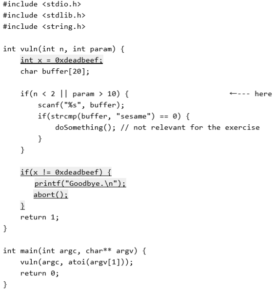
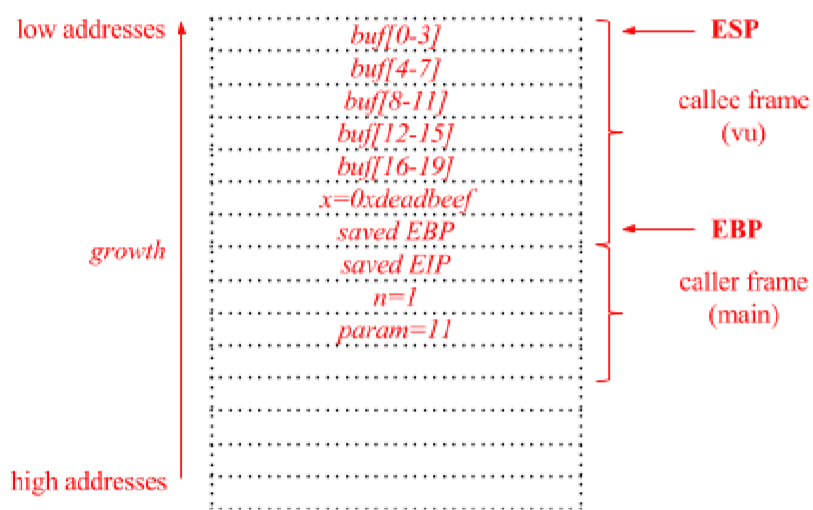

## Computer Security

*A series of notes on the "Computer Security" course as taught by Stefano Zanero during the second semester of the academic year 2018-2019 at Politecnico di Milano.*

- **BUFFER_OVERFLOW**

  We assume, for simplicity,  [ELFs](<https://en.wikipedia.org/wiki/Executable_and_Linkable_Format>) running on *Linux* $\ge 2.6$ processes on top of a *32-bit x86* machine.

  Watch lesson 10.(?)

  

## Exams 

- ***3/07/2017***

***Ex.1***

*What you need to know :*

- The `eip` (Instruction Pointer) register always contains the address of the next instruction to be executed.

- In x86, the stack is simply an area in RAM that was chosen to be the stack - there is no special hardware to store stack contents. The `esp`/`rsp` register holds the address in memory where the bottom of the stack resides. When something is `push`ed to the stack, `esp` decrements by 4 (or 8 on 64-bit x86), and the value that was `push`ed is stored at that location in memory. Likewise, when a `pop` instruction is executed, the value at `esp` is retrieved (i.e. `esp` is dereferenced), and `esp` is then incremented by 4 (or 8).

  *N.B. The stack "grows" down to lower memory addresses!*

  Conventionally, `ebp`/`rbp` contains the address of the top of the current *stack frame*, and so sometimes local variables are referenced as an offset relative to `ebp` rather than an offset to `esp`. A stack frame is essentially just the space used on the stack by a given function.

- Stack canary: 

  - Stack canaries, named for their analogy to a [canary in a coal mine](https://en.wikipedia.org/wiki/Animal_sentinel#Historical_examples), are used to detect a stack buffer overflow before execution of malicious code can occur. This method works by placing a small integer, the value of which is randomly chosen at program start, in memory just before the stack return pointer. Most buffer overflows overwrite memory from lower to higher memory addresses, so in order to overwrite the return pointer (and thus take control of the process) the canary value must also be overwritten. This value is checked to make sure it has not changed before a routine uses the return pointer on the stack.[[2\]](https://en.wikipedia.org/wiki/Stack_buffer_overflow#cite_note-dowd-2) This technique can greatly increase the difficulty of exploiting a stack buffer overflow because it forces the attacker to gain control of the instruction pointer by some non-traditional means such as corrupting other important variables on the stack.

- Nonexecutable Stack:

  Another approach to preventing stack buffer overflow exploitation is to enforce a memory policy on the stack memory region that disallows execution from the stack ([W^X](https://en.wikipedia.org/wiki/W%5EX), "Write XOR Execute"). This means that in order to execute shellcode from the stack an attacker must either find a way to disable the execution protection from memory, or find a way to put her/his shellcode payload in a non-protected region of memory. This method is becoming more popular now that hardware support for the no-execute flag is available in most desktop processors.

  While this method definitely makes the canonical approach to stack buffer overflow exploitation fail, it is not without its problems. First, it is common to find ways to store shellcode in unprotected memory regions like the heap, and so very little need change in the way of exploitation.

  Even if this were not so, there are other ways. The most damning is the so-called [return to libc](https://en.wikipedia.org/wiki/Return-to-libc_attack) method for shellcode creation. In this attack the malicious payload will load the stack not with shellcode, but with a proper call stack so that execution is vectored to a chain of standard library calls, usually with the effect of disabling memory execute protections and allowing shellcode to run as normal. This works because the execution never actually vectors to the stack itself.

  A variant of return-to-libc is [return-oriented programming](https://en.wikipedia.org/wiki/Return-oriented_programming) (ROP), which sets up a series of return addresses, each of which executes a small sequence of cherry-picked machine instructions within the existing program code or system libraries, sequence which ends with a return. These so-called *gadgets* each accomplish some simple register manipulation or similar execution before returning, and stringing them together achieves the attacker's ends. It is even possible to use "returnless" return-oriented programming by exploiting instructions or groups of instructions that behave much like a return instruction.

- Randomization:

  Instead of separating the code from the data, another mitigation technique is to introduce randomization to the memory space of the executing program. Since the attacker needs to determine where executable code that can be used resides, either an executable payload is provided (with an executable stack) or one is constructed using code reuse such as in ret2libc or return-oriented programming (ROP). Randomizing the memory layout will, as a concept, prevent the attacker from knowing where any code is. However, implementations typically will not randomize everything; usually the executable itself is loaded at a fixed address and hence even when [ASLR](https://en.wikipedia.org/wiki/ASLR) (address space layout randomization) is combined with a nonexecutable stack the attacker can use this fixed region of memory. Therefore, all programs should be compiled with [PIE](https://en.wikipedia.org/wiki/Position-independent_code#Position-independent_executables) (position-independent executables) such that even this region of memory is randomized. The entropy of the randomization is different from implementation to implementation and a low enough entropy can in itself be a problem in terms of brute forcing the memory space that is randomized.

- CDECL *calling convention* :

  - Arguments are passed on the stack in Right-to-Left order, and return values are passed in eax.
  - The *calling* function [cleans the stack](<https://www.youtube.com/watch?v=Q2sFmqvpBe0>). This allows CDECL functions to have *variable-length argument lists* (aka variadic functions). For this reason the number of arguments is not appended to the name of the function by the compiler, and the assembler and the linker are therefore unable to determine if an incorrect number of arguments is used.

  

  

   

  

  

**Ex.2**

