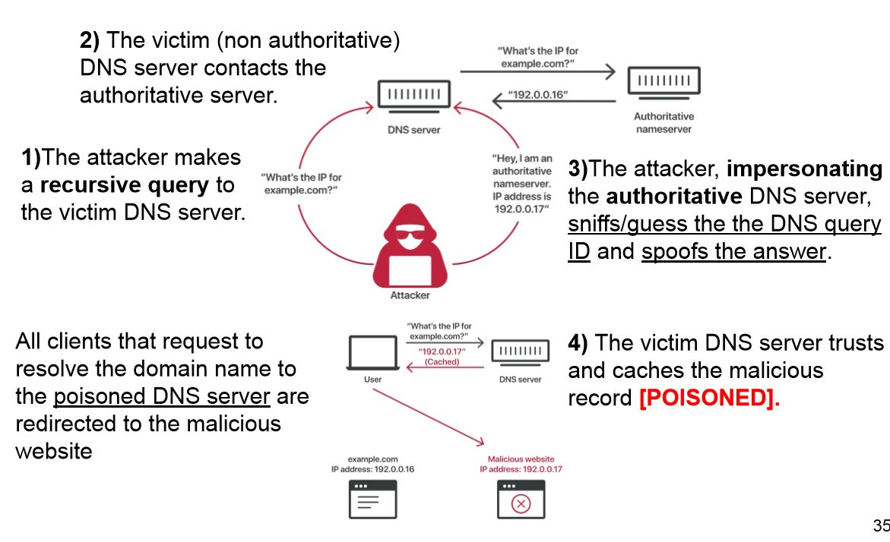

## Computer Security

*A series of notes on the "Computer Security" course as taught by Stefano Zanero during the second semester of the academic year 2018-2019 at Politecnico di Milano.*

### Ass-Savers

- ***Buffer-overflow***

  - Ogni volta che pushi nella stack vai a occupare indirizzi più bassi (zone alte nel disegno)
  - Quando hai una struct pushi i datatype dal basso verso l'alto, e.g. se ho una struct che dichiara un *char*, un *int* e un *array* $\to$ pusho prima l'array, poi l'$int$ e alla fine il $char$
  - All'interno di una funzione pusho le variabile in ordine di "spazio occupato", e.g. se all'interno di una funzione dichiaro prima un $int$ ($4$ byte), poi un $char$ ($1$ byte), un array di $5$ $char$ ($5$ byte) e un array di $2$ $int$ ($8$ byte) $\to$ pusho prima il $char$, poi l'$int$, poi l'array di $char$ e poi l'array di $int$

- ***Firewalls***

  Quando penso a una regola mi devo chiedere sempre : "Chi vuole iniziare la comunicazione??" chiamiamolo $X$ 

  la regola sarà nella direzione $X\to${destinatario}

### Definitions

- ***Cross-Site-Scripting***

  - ***Reflected***

    User input is directly returned by the web application in a response (e.g. error message,search result) which includes some or all of the input provided by the user in the request, *without being stored*  and made safe to render in the web browser.

    ```
    <?php
    $var = $HTTP['varible_name']; // retrieve content from request
    echo $var //print variable in the response
    ?>
    
    malicious crafted URL : http://example.com/?variable_name=<script>alert('XSS')</script>
    ```

  - ***Stored***

    The attacker(malicious) input is stored on the target server in a database (e.g. comment field) and then is retrieved by a victim from the web application.

  - ***DOM based***

    User provided input never leaves the victim's browser: malicious payload is executed by client side script to modify/update the DOM "environment" (e.g. dynamic pages, forms)

    ```
    ...
    <script>
    	document.write("<b>Current URL</b> : " + document.baseURI);
    </script>
    ...
    malicious crafted URL : http://example.com/test.html#<script>alert('XSS')</script>
    ```

- ***Cross-Site Request Forgery (CSRF)*** $\color{red}\text{DUBBIO!}$ $5/2/2018$

  Forces an user to execute a wanted action (state-changing action) on a web application in which it is authenticated (e.g. with cookies)

  *Key concept*: malicious requests (e.g. crafted links) are routed to the vulnerable web application through the victim's browser: web sites can not distinguish if the requests coming from authenticated users have been originated by an explicit user interaction or not.

- ***What is a prepared statement?***

  A prepared statement is a feature used to execute the same (or similar) SQL statements repeatedly with high efficiency.

  Basically it's just template.

  Prepared statements basically work like this:

  - Prepare : An SQL statement template is created and sent to the database. Certain values are left unspecified, called parameters (labeled "?"). Example: INSERT INTO MyGuests VALUES(?, ?, ?)

  - The database parses, compiles, and performs query optimization on the SQL statement template, and stores the result without executing it

  - Execute : At a later time, the application binds the values to the parameters, and the database executes the statement. The application may execute the statement as many times as it wants with different values

- ***ARP spoofing / poisoning***

  <https://www.ilsoftware.it/articoli.asp?tag=ARP-cos-e-e-cosa-sono-gli-attacchi-poisoning_18690>

- ***Rootkit***

  A rootkit is a program or, more often, a collection of software tools that gives a threat actor remote access to and control over a computer or other system.

  Different types:

  - User-Land:

    Easer to build, but often incomplete

    Easier to detect (cross layer examination, use of non-trojaned tools)

  - Kernel-Space:

    More difficult to build, but can hide artifacts completely.

    Can only be detected via post-mortem analysis.

    You can get rid of it by reinstalling the OS or substating the hard-drive.

  - BIOS

    Devi bruciare il computer.

  


## HowToCrackEx3

- ***Kind of attacks:***

  - $\color{red}\text{SMURF attack}$ `(DDOS)`:

    An attacker spoof an IP address (this can be done through HTTP, not HTTPS).

    The attacker send an ICMP request with the spoofed IP address, then the router broadcast the request and any host present in the domain generates an ICMP reply with the victim's address as destination. $\to$ This results in a *distributed denial of service (DDOS)*

    `an ICMP request is a protocol able to notify errors and failures without executing any correction`

    How to prevent this shit?

    - Configure individual hosts and routers to not respond to ICMP requests or broadcasts
    - Configure routers to not forward packets directed to broadcast addresses. 

  -  $\color{red}\text{Ping of Death}$ `(DOS)`:

    A ping of death is a type of attack on a computer system that involves sending a malformed ping to a computer.

    The maximum size of an IP packet may be as large as 65,535 bytes. Like other large but well-formed packets, a ping of death is fragmented into groups of 8 octets before transmission. However, when the target computer reassembles the malformed packet, a buffer overflow can occur, causing a system crash and potentially allowing the injection of malicious code.

    How to prevent this shit?

    - In general can be mitigated adding controls during the process of reassembly.
    - Upgrade the operating system to a non-vulnerable version.
    - Use a firewall that drops such anomalous packets.

  - $\color{red}\text{ARP spoofing (or poisoning)}$ `(e.g. Man in the Middle)`

    `The Address Resolution Protocol (ARP) is a communication protocol used for discovering the link layer address, such as a MAC address, associated with a given internet layer address, typically an IPv4 address` 

    ARP spoofing is a technique by which an attacker sends (spoofed) ARP messages onto a local area network. Generally, the aim is to associate the attacker's MAC address with the IP address of another host such as the default gateway, causing any traffic meant for that IP address to be sent to the attacker instead.

    *ARP request* : 

    ​	$\text{"where is 192.168.0.1 ?"}$	 

    *ARP reply* : 

    ​	$\text{"192.168.0.1  is at b4:e9:b0:c9:81:03"}$

    First come, first trusted !

    An attacker can forge replies easily in UDP or ICMP packets...TCP/IP BOH

    How to prevent this shit?

    - Application level : HTTPS (trusted certificate)
    - Network level : use $\text{802.1x}$ (authenticates clients connected)

    How to detect ARP spoofing?

    - Router level : Notice multiple ARP responses with different MAC addresses (to prevent this attack it is possible to block responses with the IP of the sensible target (e.g. the router) but a different MAC address w.r.t. the real ones)
    - Gateway level : Notice ARP response with IP of the gateway 

  - $\color{red}\text{DHCP poisoning}$ `(e.g. Man in the Middle, Traffic interception, Traffic redirection)`

    `DHCP (Dynamic Host Configuration Protocol) is a protocol used to provide quick, automatic, and central management for the distribution of IP addresses within a network. DHCP is also used to configure the proper subnet mask, default gateway, and DNS server information on the device.`

    DHCP does not support authentication, so every client *must* blindly believe any DHCP offer that it receives, thus an attacker can race and win against the real DHCP server. In this way the attacker can intercept the request, be the first to answer, and craft a DHCP response setting the *IP address*, the *DNS address* and the *default gateway* of the victim client. 

  - $\color{red}\text{TCP/IP}$

    TCP/IP is the main protocol which provides reliable ordered and error-checked delivery of data. It uses sequence numbers for reordering packets, in particular a *semi-random* INITIAL SEQUENCE NUMBER (ISN) is chosen.

    An attacker able to guess the ISN can perform the free-way handshake (SYN $\to$ SYN+ACK $\to$ ACK ) without the need to pose as a Man In The Middle.

    In order to reduce the time available to the attacker to guess the ISN it is possible to use TCP-syn cookies.

  - $\color{red}\text{DNS cache poisoning}$

    DNS translates domain names to the numerical IP addresses. It is based on UDP and messages are *not authenticated*.

    In this kind of attack the IP address is *spoofed* FOR SURE (the attacker want to save his ass I think) ,the MAC address *could* be spoofed.

    The purpose of this attack is to divert any traffic directed to an URL to another server, likely an attacker-controlled machine. The actual purpose could be to manipulate the information on the URL or to capture personal information (e.g. credential, cookies credit cards etc...)

    

    How to prevent this shit?

    - If you are `the administrator of a website e.g www.polimi.it`, use HTTPS (assuming that the attacker is not able to perform DNS spoofing for the network that the certification authority uses to connect to www.polimi.it in order to verify the domain for issuing the certificate. if the attacker can do this, they can obtain a valid certificate for www.polimi.it and mount the same attack)

    - If you are `the administrator of the DNS server used by the network e.g. 10.79.3.0/24` 

      If we assume that the attacker can’t sniff the traffic to\from the DNS server (thus sniffing the query ID): use a random query ID and increase the space of query IDs to prevent guessing the ID in a reasonable time. In general: the server could detect duplicate responses with different A entries and raise an alarm, or detect response with different query IDs and raise an alarm. Notice that if, upon attack detection, the DNS server returns an error, this will transform the attack to a denial of service attack. 

    - If you are `the network administrator of the network e.g. 10.79.3.0/24 `,

      Given that the DNS server is outside the network, the network administrator could reject known spoofed packets (all packets coming from inside the network with an IP address that doesn’t belong to the network). This mitigation is effective ONLY for attackers physically present on the network 10.79.3.0/24, and can’t do anything for spoofed packets that come from outside the administrator-controlled network (e.g., from the Internet). 

       