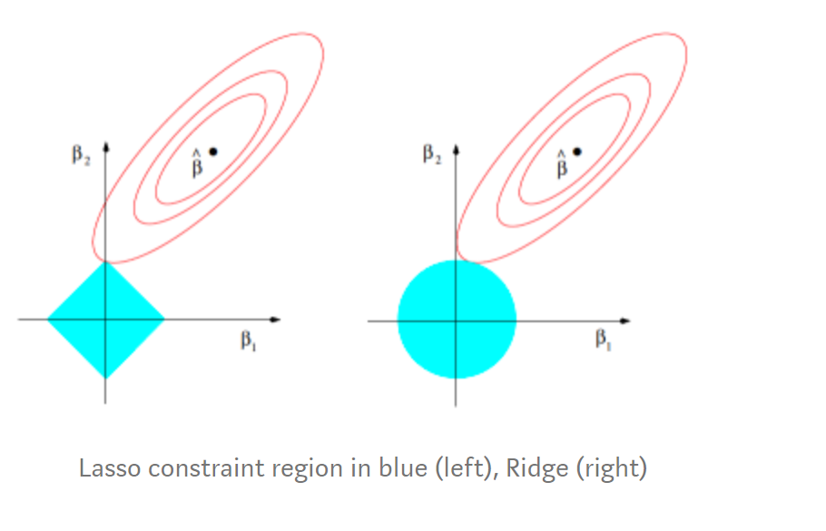

# Q & A - Statistical learning

[TOC]

 

### Ridge vs Lasso

Ridge regression and Lasso regression are two variations of linear regression. The difference consists in the fact that they add a term to the residual sum of squares that penalizes weights from getting high values. In fact high values for weights translates into overfitting, since we would get a non-smooth regression curve.

Ridge Regression's loss function:

${L(\mathbf{w})=\frac{1}{2}\sum_{i=1}^N(t_i-\mathbf{w}^T\phi(\mathbf{x}_i))^2+\frac{\lambda}{2}||\mathbf{w}||^2_2} $ 

The loss function is quadratic wrt to $\mathbf{w}$ so there exist a closed form solution for finding the weights if $\phi^T\phi$ is full rank.  
$$
\hat{\mathbf{w}}=\bigg(\mathbf{\phi}^T\mathbf{\phi}+\lambda \mathbf{I}\bigg)^{-1}\mathbf{\phi}^T\mathbf{t}
$$

Lasso Regression's loss function:

${{L(\mathbf{w})=\frac{1}{2}\sum_{i=1}^N(t_i-\mathbf{w}^T\phi(\mathbf{x}_i))^2+\frac{\lambda}{2}||\mathbf{w}||_1}} $  
Since there is a modulo involved, such function is not linear wrt to $\mathbf{w}$ so no closed form exists.  
We can instead use quadratic programming.  
Lasso is though able to do feature selection since it can shrink some weights to zero in order to minimize $L$. Ridge cannot do so, it can only shrink weights close to zero.

$\beta$ in the images refers to the weights.

Moreover Ridge loss function can be obtained by adopting a Bayesian approach and choosing a Gaussian prior for the weights, while Lasso loss function can be obtained by adopting a Bayesian approach and choosing a Laplacian prior for the weights.

 

 

### PCA

***Describe the Principal Component Analysis technique***

*PCA* is an unsupervised learning method which aims to *reduce* the dimensionality of an input space $\mathcal{X}$ .

Formally, principal component analysis (PCA) is a statistical procedure that uses an *orthogonal transformation* to convert a set of observations with possibly correlated variables into a set of elements with *linearly uncorrelated* variables called *principal components*.

To have a graphical intuition:

It is based on the principle of projecting the data onto the input subspace which accounts for most of the variance: 

- Find a line such that when the data is projected onto that line, it has the maximum variance. 
- Find a new line, orthogonal to the first one, that has maximum projected variance. 
- Repeat until $m$ lines have been identified and project the points in the data set on these lines. 

The precise steps of *PCA* are the following (remember that $\mathbf{X}$ is an $n\times d$ matrix where $n$ denotes the number of samples and $d$ is the dimensionality) : 

- Compute the mean of the data
  $$
  \overline{\mathbf{x}} = \frac{1}{N}\sum_{n=1}^N\mathbf{x}_n
  $$

- Bring the data to zero-mean (by subtracting $\overline{\mathbf{x}}$)

- Compute the covariance matrix $\mathbf{S} = \mathbf{X}^T\mathbf{X} = \frac{1}{N-1}\sum_{n=1}^{N}(\mathbf{x}_n-\overline{\mathbf{x}})^T(\mathbf{x}_n-\overline{\mathbf{x}})$

  - Eigenvector $\mathbf{e}_1$ with largest eigenvalue $\lambda_1$ is the *first principal component* 
  - Eigenvector $\mathbf{e}_k$ with $k^{th}$ largest eigenvalue $\lambda_k$ is the *$k^{th}$ principal component*
  - $\frac{\lambda_k}{\sum_i\lambda_i}$ is the proportion of variance captured by the $k^{th}$ principal component.

Transforming the reduced dimensionality projection back into the original spaces gives a reduced dimensionality reconstruction of the data, that will have some error. This error can be small and often acceptable given the other benefits of dimensionality reduction. PCA has multiple benefits:

- Helps to reduce the computational complexity 
- Can help supervised learning, because reduced dimensions allow simpler hypothesis spaces and less risk of overfitting 
- Can be used for noise reduction 

But also some drawbacks:

- Fails when data consists of multiple clusters
- The directions of greatest variance may not be the most informative
- Computational problems with many dimensions 
- PCA computes linear combination of features, but data often lies on a nonlinear manifold. Suppose that the data is distributed on two dimensions as a circumference: it can be actually represented by one dimension, but PCA is not able to capture it.

 

### Support Vector Machines

***Describe the supervised learning technique denominated Support Vector Machines for classification problems.***

A Support Vector Machine (SVM) performs classification by finding the hyperplane that maximizes the margin between two classes.

We define the hyperplane as $\mathbf{w}^T\mathbf{x} +b= 0$, it is possible to prove that, by observing that $\mathbf{w} \perp \text{hyperplane}$ and by adding the normalization constraint   $|\mathbf{w}^T\mathbf{x}_n+b|=1$ ( where $\mathbf{x}_n$ is the nearest point to the hyperplane, the set of this points corresponds to the *support vectors* ) the distance from the hyperplane to $\mathbf{x}_n$ is:
$$
\text{distance} = \frac{1}{||\mathbf{w}||}
$$
We want to maximize this quantity (which is half the margin).

Our optimization problem can be written as
$$
\underset{w}{\operatorname{argmin}}\frac{1}{2}\mathbf{w}^T\mathbf{w}\\y_n(\mathbf{w}^T\mathbf{x}_n+b)\ge1 \;\;\;\;\text{for $n = 1,2,\dots,N$}
$$
Where $y_n$ is the target value associated with sample $n$.

This is a constraint optimization problem with inequality constraints, we have to derive the *Lagrangian* and apply the *KKT* (Karush–Kuhn–Tucker) conditions. After that, we can solve the problem by means of *quadratic programming*.

Finally we end up with the following equation for classifying *new points*:
$$
\hat{y}(\mathbf{x}) = sign\left(\sum_{n=1}^{N}\alpha_n y_n k(\mathbf{x},\mathbf{x}_n)+b\right)
$$
where $\alpha_n$ are the *Lagrangian Multipliers*.

An interesting observation is derived from the last KKT condition :
$$
\alpha_n(y_n(\mathbf{w}^T\mathbf{x}_n+b)-1)=0\;\;\;\;\;\;\forall{n}
$$
We can observe that either a constraint is active, and hence the point is a support vector, or its multiplier is zero. (if a point is not a support vector its multiplier is $0$)

The method described so far is called *hard-margin SVM* since the margin has to be satisfied strictly, it can happens that the points are not *linearly separable* in *any* way, or we just want to handle *noisy data* to avoid overfitting, so now we're going to briefly define another version of it, which is called *soft-margin SVM* that allows for few errors and penalizes for them. We introduce *slack variables* $\xi_i$ , in this way we allow to *violate* the margin constraint but we add a *penalty*.

*Primal*:
$$
\text{Minimize}\ \ ||\mathbf{w}||_2^2+C\sum_n \xi_n \\
\text{s.t.}\\ \ y_n(\mathbf{w}^Tx_n+b)\ge1-\xi_n\ ,\ \ \ \forall{n}\\
\xi_n\ge0\ ,\ \ \ \forall{n}
$$
*Dual:*
$$
\text{Maximize}\ \ \ \mathcal{L}(\mathbf{\alpha}) =\sum_{n=1}^{N}\alpha_n-\frac{1}{2}\sum_{n=1}^{N}\sum_{m=1}^{M}y_n y_m\alpha_n\alpha_mk(\mathbf{x}_n\mathbf{x}_m)\\
  \text{s.t.}\\
  0\le\alpha_n\le C\ \ \ \ \ \forall{n}\\
  \sum_{n=1}^N\alpha_n y_n = 0
$$
 The *dual formulation* allows us to use *kernels* $k(\mathbf{x}_n\mathbf{x}_m)$

Support vectors are points associated with $\alpha_n > 0$

  if $\alpha_n<C$ the points lies *on the margin*

  if $\alpha_n = C$ the point lies *inside the margin*, and it can be either *correctly classified* ($\xi_i \le 1$) or *misclassified* ($\xi_i>1$)  

When $C$ is large, larger slacks penalize the objective function of SVM’s more than when $C$ is small. As $C$ approaches infinity, this means that having any slack variable set to non-zero would have infinite penalty. Consequently, as $C$ approaches infinity, all slack variables are set to $0$ and we end up with a hard-margin SVM classifier.

`Nota aggiuntiva`

In the soft-margin formulation the last KKT condition is
$$
\alpha_n(y_n(\mathbf{w}^T\mathbf{x}_n+b)-1+\xi_n)=0\;\;\;\;\;\;\forall{n}
$$

 

### Algorithm for Support Vector Machines

***Which algorithm can we use to train an SVM? Provide an upper bound to the generalization error of an SVM.***

Sometimes for computational reasons, when we solve a problem characterized by a huge dataset, it is not possible to compute *all* the support vectors with generic quadratic programming solvers (the number of constraints depends on the number of samples), hence, specialized optimization algorithms are often used. One example is *Sequential Minimal Optimization (SMO)*:

Remember our formulation for the *soft-margin SVM*:
$$
\text{Maximize}\ \ \ \ \mathcal{L}(\mathbf{\alpha}) =\sum_{n=1}^{N}\alpha_n-\frac{1}{2}\sum_{n=1}^{N}\sum_{m=1}^{M}y_n y_m\alpha_n\alpha_mk(\mathbf{x}_n\mathbf{x}_m)\\
  s.t.\\
  0\le\alpha_n\le C\ \ \ \ \text{for}\ n =1,2,\dots,N\\
  \sum_{n=1}^Ny_n\alpha_n=0
$$
*SMO* breaks this problem into a series of smaller possible sub-problems, which are then solved analytically. Because of the linear equality constraint involving the Lagrange multipliers $\alpha _{n}$ , the smallest possible problem involves two such multipliers. Then, for any two multipliers $\alpha_1$ and $\alpha_2$ the constraints are reduced to:
$$
0\le\alpha_1,\alpha_2\le C\\
  y_1\alpha_1+y_2\alpha_2=k
$$
and this reduced problem can be solved analytically: one needs to find a minimum of a one-dimensional quadratic function. $k$ is the negative of the sum over the rest of terms in the equality constraint, which is fixed in each iteration ( we do this because we want that $\sum_{i=1}^ny_i\alpha_i=0$ ).

The algorithm proceeds as follows:

- Find a Lagrange multiplier $\alpha_1$ that violates the *KKT* conditions for the optimization problem.
- Pick a second multiplier $\alpha_2$ and optimize the pair ($\alpha_1$,$\alpha_2$).
- Repeat steps $1$ and $2$ until convergence.

When all the Lagrange multipliers satisfy the KKT conditions (within a user-defined tolerance), the problem has been solved. Although this algorithm is guaranteed to converge, heuristics are used to choose the pair of multipliers so as to accelerate the rate of convergence. This is critical for large data sets since there are $\frac{N(N-1)}{2}$  possible choices for $\alpha_i$ and $\alpha_j$ .

As *Vapnik* said: "In the support-vectors learning algorithm the complexity of the construction does not depend on the dimensionality of the feature space, but on the number of support vectors." So it's reasonable to define an upper bound of the error as:
$$
  L_h\le\frac{\mathbb{E}[\text{number of support vectors}]}{N}
$$
This is called *Leave-One-Out Bound*. The good thing is that it can be easily computed and we don't need to run SVM multiple times.

The other kind of bound is called *Margin bound*: a bound on the VC dimension which decreases with the margin. The larger the margin, the less the variance and so, the less the VC dimension. Unfortunately the bound is quite pessimistic .

 

### VC Dimension

***Define the VC dimension and describe the importance and usefulness of VC dimension in machine learning. What is the VC dimension of a linear classifier?***

A *dichotomy* is a hypothesis $h$ that maps an input from the *sample size* to a result:
$$
h:\{\mathbf{x}_1,\mathbf{x}_2,\dots,\mathbf{x}_N\}\to\{-1,+1\}
$$
The *growth function* is a function that counts the *most* dichotomies on any $N$ points.
$$
m_{\mathcal{H}}(N)=\underset{\mathbf{x}_1,\dots,\mathbf{x}_N\in\mathcal{X}}{max}|\mathcal{H}(\mathbf{x}_1,\dots,\mathbf{x}_N)|
$$
This translates into choosing any $N$ points and laying them out in *any* fashion in the input space. Determining $m$ is equivalent to looking for such a layout of the $N$ points that yields the *most* dichotomies. 

The growth function satisfies:
$$
m_{\mathcal{H}}(N)\le 2^N
$$
The *VC* ( *Vapnik-Chervonenkis ) dimension* of a hypothesis set $\mathcal{H}$ , denoted by $d_{VC}(\mathcal{H})$ is the largest value of $N$ for which $m_{\mathcal{H}}(N)=2^N$  , in other words is "*the most points $\mathcal{H}$ can shatter* " 

We can say that the *VC* dimension is one of many measures that characterize the expressive power, or capacity, of a hypothesis class.

You can think of the VC dimension as "how many points can this model class memorize/shatter?" (a ton? $\to$ BAD! not so many? $\to$ GOOD!).

With respect to learning, the effect of the VC dimension is that if the VC dimension is finite, then the hypothesis will generalize:
$$
d_{vc}(\mathcal H)\ \Longrightarrow\ g \in \mathcal H \text { will generalize }
$$
The key observation here is that this statement is not dependent on:

- The learning algorithm
- The input distribution
- The target function

The only things that factor into this are the training examples, the hypothesis set, and the final hypothesis.

The VC dimension for a linear classifier (i.e. a *line* in 2D, a *plane* in 3D etc...) is $d+1$ (a line can shatter at most $2+1=3$ points, a plane can shatter at most $3+1=4$ points etc...)

