# Machine Learning 

`or: How I Learned to Stop Worrying and Love Restelli`

*A series of extremely verbose and surely overkill notes on the "Machine Learning" course as taught by Marcello Restelli and Francesco Trovò during the second semester of the academic year 2018-2019 at Politecnico di Milano.*

`Feel free to modify the document to correct any mistakes / add additional material in order to favour a better understanding of the concepts`

[TOC]

<div style="page-break-after: always;"></div> 

# Statistical Learning

### Support Vector Machines

***Describe the supervised learning technique denominated Support Vector Machines for classification problems. Which algorithm can we use to train an SVM? Provide an upper bound to the generalization error of an SVM.***

The Support Vector Machines techniques aims to build a binary classifier by finding an hyperplane which is able to separate the data with the largest *margin* possible. 


With SVMs we force our *margin* to be at least *something* in order to accept it, by doing that we restrict the number of possible dichotomies, and therefore if we're able to separate the points with a fat dichotomy (*margin*) then that fat dichotomy will have a smaller *VC* dimension then we'd have without any restriction. Let's do that.

Let be $\mathbf{x}_n$ the nearest data point to the *hyperplane* $\mathbf{w}^T\mathbf{x} = 0$ (just imagine a *line* in a $2$-D space for simplicity), before finding the distance we just have to state two observations:

- There's a minor technicality about the *hyperplane* $\mathbf{w}^T\mathbf{x} = 0$ which is annoying , let's say I multiply the vector $\mathbf{w}$ by $1000000$ , I get the *same* hyperplane! So any formula that takes $\mathbf{w}$ and produces the margin will have to have built-in *scale-invariance*, we do that by normalizing $\mathbf{w}$ , requiring that for the nearest data point $\mathbf{x}_n$:
  $$
  |\mathbf{w}^T\mathbf{x}_n|=1
  $$
  ( So I just scale $\mathbf{w}$ up and down in order to fulfill the condition stated above, we just do it because it's *mathematically convenient*! By the way remember that $1$ does *not* represent the Euclidean distance)

- When you solve for the margin, the $w_1$ to $w_d$ will play a completely different role from the role of $w_0$ , so it is no longer convenient to have them on the same vector. We  pull out $w_0$ from $\mathbf{w}$ and rename $w_0$ with $b$ (for *bias*).
  $$
  \mathbf{w} = (w_1,\dots,w_d)\\w_0=b
  $$

So now our notation is changed:

The *hyperplane* is represented by
$$
\mathbf{w}^T\mathbf{x} +b= 0
$$
and our constraint becomes
$$
|\mathbf{w}^T\mathbf{x}_n+b|=1
$$
It's trivial to demonstrate that the vector $\mathbf{w}$ is orthogonal to the *hyperplane*, just suppose to have two point $\mathbf{x}'$ and $\mathbf{x''}$ belonging to the *hyperplane* , then $\mathbf{w}^T\mathbf{x}' +b= 0$ and $\mathbf{w}^T\mathbf{x}'' +b= 0$.

And of course $\mathbf{w}^T\mathbf{x}'' +b - (\mathbf{w}^T\mathbf{x}' +b)=\mathbf{w}^T(\mathbf{x}''-\mathbf{x}') = 0 $ 

Since $\mathbf{x}''-\mathbf{x}'$ is a vector which lays on the *hyperplane* , we deduce that $\mathbf{w}$ is orthogonal to the *hyperplane*.

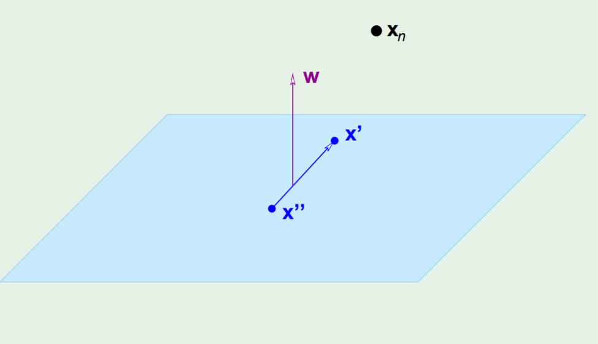

Then the distance from $\mathbf{x}_n$ to the *hyperplane* can be expressed as a dot product between $\mathbf{x}_n-\mathbf{x}$ (where $\mathbf{x}$ is any point belonging to the plane) and the unit vector $\hat{\mathbf{w}}$ , where $\hat{\mathbf{w}} = \frac{\mathbf{w}}{||\mathbf{w}||}$ ( the distance is just the projection of $\mathbf{x}_n-\mathbf{x}$ in the direction of $\hat{\mathbf{w}}$ ! )
$$
distance = |\;\hat{\mathbf{w}}^T(\mathbf{x}_n-\mathbf{x})\;|
$$
(We take the absolute value since we don't know if $\mathbf{w}$ is facing $\mathbf{x}_n$ or is facing the other direction )


We'll now try to simplify our notion of *distance*.
$$
distance = |\;\hat{\mathbf{w}}^T(\mathbf{x}_n-\mathbf{x})\;| = \frac{1}{||\mathbf{w}||}|\;\mathbf{w}^T\mathbf{x}_n-\mathbf{w}^T\mathbf{x}\;|
$$
This can be simplified if we add and subtract the missing term $b$.
$$
distance = \frac{1}{||\mathbf{w}||}|\;\mathbf{w}^T\mathbf{x}_n+b-\mathbf{w}^T\mathbf{x}-b\;| = \frac{1}{||\mathbf{w}||}|\;\mathbf{w}^T\mathbf{x}_n+b-(\mathbf{w}^T\mathbf{x}+b)\;|
$$
Well, $\mathbf{w}^T\mathbf{x}+b$ is just the value of the equation of the plane...for a point *on* the plane. So without any doubt $\mathbf{w}^T\mathbf{x}+b= 0$ , our notion of *distance* becomes
$$
distance = \frac{1}{||\mathbf{w}||}|\;\mathbf{w}^T\mathbf{x}_n+b\;|
$$
But wait...what is $|\;\mathbf{w}^T\mathbf{x}_n+b\;|$ ? It is the constraint that we defined at the beginning of our derivation!
$$
|\mathbf{w}^T\mathbf{x}_n+b|=1
$$
So we end up with the formula for the distance being just
$$
distance = \frac{1}{||\mathbf{w}||}
$$
*Which is sick AF*.

Let's now formulate the optimization problem: 
$$
\underset{w}{\operatorname{argmax}}\frac{1}{||\mathbf{w}||}\\\text{subject to}\;\underset{n=1,2,\dots,N}{\operatorname{min}}|\mathbf{w}^T\mathbf{x}_n+b|=1
$$
Since this is not a *friendly* optimization problem (the constraint is characterized by a minimum and an absolute, which are annoying) we are going to find an equivalent problem which is easier to solve. Our optimization problem can be rewritten as
$$
\underset{w}{\operatorname{argmin}}\frac{1}{2}\mathbf{w}^T\mathbf{w}
\\
\text{subject to} \ \ \ \  y_n \cdot(\mathbf{w}^T\mathbf{x}_n+b)\ge1 \;\;\;\;\text{for $n = 1,2,\dots,N$}
$$
where $y_n$ is a variable that we introduce that will be equal to either $+1$ or $-1$ accordingly to its real target value ( remember that this is a *supervised learning* technique and we know the real target value of each sample) . One could argue that the new constraint is actually different from the former one, since maybe the $\mathbf{w}$ that we'll find will allow the constraint to be *strictly* greater than $1$ for every possible point in our dataset [ $y_n(\mathbf{w}^T\mathbf{x}_n+b)> 1 \;\;\forall{n}$ ] while we'd like it to be *exactly* equal to $1$ for *at least* one value of $n$. But that's actually not true! Since we're trying to minimize $\frac{1}{2}\mathbf{w}^T\mathbf{w}$ our algorithm will try to scale down $\mathbf{w}$ until $\mathbf{w}^T\mathbf{x}_n+b$ will touch $1$ for some specific point $n$ of the dataset. 

So how can we solve this? This is a constraint optimization problem with inequality constraints, we have to derive the *Lagrangian* and apply the [*KKT*](<http://www.svms.org/kkt/>) (Karush–Kuhn–Tucker) conditions.

*Objective Function:*

We have to minimize
$$
\mathcal{L}(\mathbf{w},b,\mathbf{\alpha}) = \frac{1}{2}\mathbf{w}^T\mathbf{w}-\sum_{n=1}^{N}\alpha_n(y_n(\mathbf{w}^T\mathbf{x}_n+b)-1)\\
$$
*w.r.t.* to $\mathbf{w}$ and $b$ and maximize it *w.r.t.* the *Lagrange Multipliers* $\alpha_n$ 

We can easily get the two conditions for the unconstrained part:
$$
\nabla_{\mathbf{w}}\mathcal{L}=\mathbf{w}-\sum_{n=1}^{N}\alpha_n y_n\mathbf{x}_n = 0 \;\;\;\;\;\;\;\; \mathbf{w}=\sum_{n=1}^{N}\alpha_n y_n\mathbf{x}_n\\
\frac{\part\mathcal{L}}{\part b} = -\sum_{n=1}^{N}\alpha_n y_n = 0\;\;\;\;\;\;\;\;\;\;\;\sum_{n=1}^{N}\alpha_n y_n=0
$$
And list the other *KKT* conditions:
$$
y_n(\mathbf{w}^T\mathbf{x}_n+b)-1\ge0\;\;\;\;\;\;\forall{n}\\
\alpha_n\ge0\;\;\;\;\;\;\;\forall{n}\\
\alpha_n(y_n(\mathbf{w}^T\mathbf{x}_n+b)-1)=0\;\;\;\;\;\;\forall{n}
$$
*Alert* :  the last condition is called the KKT *dual complementary condition* and will be key for showing that the SVM has only a small number of "support vectors", and will also give us our convergence test when we'll talk about the *SMO* algorithm. 

Now we can reformulate the *Lagrangian* by applying some substitutions 
$$
\mathcal{L}(\mathbf{w},b,\mathbf{\alpha}) = \frac{1}{2}\mathbf{w}^T\mathbf{w}-\sum_{n=1}^{N}\alpha_n(y_n(\mathbf{w}^T\mathbf{x}_n+b)-1)\\
\mathcal{L}(\mathbf{\alpha}) =\sum_{n=1}^{N}\alpha_n-\frac{1}{2}\sum_{n=1}^{N}\sum_{m=1}^{M}y_n y_m\alpha_n\alpha_m\mathbf{x}_n^T\mathbf{x}_m
$$
(if you have doubts just go to minute 36.50 of [this](https://www.youtube.com/watch?v=eHsErlPJWUU) lecture by professor Yaser Abu-Mostafa at *Caltech* )

We end up with the *dual* formulation of the problem
$$
\underset{\alpha}{\operatorname{argmax}}\sum_{n=1}^{N}\alpha_n-\frac{1}{2}\sum_{n=1}^{N}\sum_{m=1}^{M}y_n y_m\alpha_n\alpha_m\mathbf{x}_n^T\mathbf{x}_m\\
\;\\
s.t. \;\;\;\;\;\;\;\;\alpha_n\ge0\;\;\;\forall{n}\\
\;\;\;\;\;\;\;\;\;\;\;\;\;\;\;\sum_{n=1}^{N}\alpha_n y_n=0
$$
We can notice that the old constraint $\mathbf{w}=\sum_{n=1}^{N}\alpha_n y_n\mathbf{x}_n$ doesn't appear in the new formulation since it is *not* a constraint on $\alpha$ , it was a constraint on $\mathbf{w}$ which is not part of our formulation anymore.

How do we find the solution? we throw this objective (which btw happens to be a *convex* function) to a *quadratic programming* package.

Once the *quadratic programming* package gives us back the solution we find out that a whole bunch of $\alpha$ are just $0$ !  All the $\alpha$ which are not $0$ are the ones associated with the so-called *support vectors* ! ( which are just samples from our dataset )  
They are called *support* vectors because they are the vectors that determine the width of the *margin* , this can be noted by observing the last *KKT* condition  
$\big\{\alpha_n(y_n(\mathbf{w}^T\mathbf{x}_n+b)-1)=0\;\;\;\forall{n}\big\}$,   
in fact either a constraint is active, and hence the point is a support vector, or its multiplier is zero. 

Now that we solved the problem we can get both $\mathbf{w}$  and $b$.
$$
\mathbf{w} = \sum_{\mathbf{x}_n \in \text{ SV}}\alpha_ny_n\mathbf{x}_n\\
y_n(\mathbf{w}^T\mathbf{x}_{n\in\text{SV}}+b)=1
$$
where $\mathbf{x}_{n\in\text{SV}}$ is any *support vector*. (you'd find the *same* $b$ for every support vector)

But the coolest thing about *SVMs* is that we can rewrite our *objective functions*.  
From
$$
\mathcal{L}(\mathbf{\alpha}) =\sum_{n=1}^{N}\alpha_n-\frac{1}{2}\sum_{n=1}^{N}\sum_{m=1}^{M}y_n y_m\alpha_n\alpha_m\mathbf{x}_n^T\mathbf{x}_m
$$
to
$$
\mathcal{L}(\mathbf{\alpha}) =\sum_{n=1}^{N}\alpha_n-\frac{1}{2}\sum_{n=1}^{N}\sum_{m=1}^{M}y_n y_m\alpha_n\alpha_mk(\mathbf{x}_n,\mathbf{x}_m)
$$
We can use *kernels* !! (if you don't know what I'm talking about read the *kernel* related question present somewhere in this document)

Finally we end up with the following equation for classifying *new points*:
$$
\hat{y}(\mathbf{x}) = sign\left(\sum_{n=1}^{N}\alpha_n y_n k(\mathbf{x},\mathbf{x}_n)+b\right)
$$
The method described so far is called *hard-margin SVM* since the margin has to be satisfied strictly, it can happen that the points are not *linearly separable* in *any* way, or we just want to handle *noisy data* to avoid overfitting, so now we're going to briefly define another version of it, which is called *soft-margin SVM* that allows for few errors and penalizes for them.

We introduce *slack variables* $\xi_i$ , this way we allow to *violate* the margin constraint but we add a *penalty* expressed by the distance of the misclassified samples from the hyperplane (samples correctly classified have $\xi_i=0$).

We now have to 
$$
\text{Minimize}\ \ ||\mathbf{w}||_2^2+C\sum_i \xi_i \\
\text{s.t.}\\ \ y_i(\mathbf{w}^Tx_i+b)\ge1-\xi_i\ ,\ \ \ \forall{i}\\
\xi_i\ge0\ ,\ \ \ \forall{i}
$$
$C$ is a coefficient that allows to trade-off bias-variance and is chosen by *cross-validation*.

And obtain the *Dual Representation*

$$
\text{Maximize}\ \ \ \mathcal{L}(\mathbf{\alpha}) =\sum_{n=1}^{N}\alpha_n-\frac{1}{2}\sum_{n=1}^{N}\sum_{m=1}^{M}y_n y_m\alpha_n\alpha_mk(\mathbf{x}_n\mathbf{x}_m)\\
  \text{s.t.}\\
  0\le\alpha_n\le C\ \ \ \ \ \forall{i}\\
  \sum_{n=1}^N\alpha_n t_n = 0
$$
Support vectors are points associated with $\alpha_n > 0$

if $\alpha_n<C$ the points lies *on the margin*

if $\alpha_n = C$ the point lies *inside the margin*, and it can be either *correctly classified* ($\xi_i \le 1$) or *misclassified* ($\xi_i>1$)  

Fun fact: When $C$ is large, larger slacks penalize the objective function of SVM’s more than when $C$ is small. As $C$ approaches infinity, this means that having any slack variable set to non-zero would have infinite penalty. Consequently, as $C$ approaches infinity, all slack variables are set to $0$ and we end up with a hard-margin SVM classifier.

And what about generalization? Can we compute an *Error* bound in order to see if our model is overfitting? 

As *Vapnik* said: "In the support-vectors learning algorithm the complexity of the construction does not depend on the dimensionality of the feature space, but on the number of support vectors." So it's reasonable to define an upper bound of the error as:
$$
L_h\le\frac{\mathbb{E}[\text{number of support vectors}]}{N}
$$
This is called *Leave-One-Out Bound* (I don't know why, maybe it's written [here ](<https://ocw.mit.edu/courses/mathematics/18-465-topics-in-statistics-statistical-learning-theory-spring-2007/lecture-notes/l4.pdf> )). The good thing is that it can be easily computed and we don't need to run SVM multiple times.

The other kind of bound is called *Margin bound*: a bound on the VC dimension which decreases with the margin. The larger the margin, the less the variance and so, the less the VC dimension. Unfortunately the bound is quite pessimistic 

Sometimes for computational reasons, when we solve a problem characterized by a huge dataset, it is not possible to compute *all* the support vectors with generic quadratic programming solvers (the number of constraints depends on the number of samples), hence, specialized optimization algorithms are often used. One example is *Sequential Minimal Optimization (SMO)*:

Remember our formulation for the *soft-margin SVM*:
$$
\mathcal{L}(\mathbf{\alpha}) =\sum_{n=1}^{N}\alpha_n-\frac{1}{2}\sum_{n=1}^{N}\sum_{m=1}^{M}y_n y_m\alpha_n\alpha_mk(\mathbf{x}_n\mathbf{x}_m)\\
  s.t.\\
  0\le\alpha_i\le C\ \ \ \ \text{for}\ i =1,2,\dots,n\\
  \sum_{i=1}^ny_i\alpha_i=0
$$
*SMO* breaks this problem into a series of smallest possible sub-problems, which are then solved analytically. Because of the linear equality constraint involving the Lagrange multipliers $\alpha _{i}$ , the smallest possible problem involves two such multipliers. Then, for any two multipliers $\alpha_1$ and $\alpha_2$ the constraints are reduced to:
$$
0\le\alpha_1,\alpha_2\le C\\
  y_1\alpha_1+y_2\alpha_2=k
$$
and this reduced problem can be solved analytically: one needs to find a minimum of a one-dimensional quadratic function. $k$ is the negative of the sum over the rest of terms in the equality constraint, which is fixed in each iteration ( we do this because we want that $\sum_{i=1}^ny_i\alpha_i=0$ ).

The algorithm proceeds as follows:

  - Find a Lagrange multiplier $\alpha_1$ that violates the *KKT* conditions for the optimization problem.
  - Pick a second multiplier $\alpha_2$ and optimize the pair ($\alpha_1$,$\alpha_2$).
  - Repeat steps $1$ and $2$ until convergence.

When all the Lagrange multipliers satisfy the KKT conditions (within a user-defined tolerance), the problem has been solved. Although this algorithm is guaranteed to converge, heuristics are used to choose the pair of multipliers so as to accelerate the rate of convergence. This is critical for large data sets since there are $\frac{n(n-1)}{2}$  possible choices for $\alpha_i$ and $\alpha_j$ .

<div style="page-break-after: always;"></div> 
### PAC Learning and Agnostic Learning

***What do we mean as PAC-Learning and Agnostic-Learning?***

First, some concepts you need to know:

- We are talking about *Classification*.

- Overfitting happens:

  - Because with a large hypothesis space the training error is a bad estimate of the prediction error, hence we would like to infer something about the generalization error from the training samples. 
  - When the learner doesn’t have access to enough samples, hence we would like to estimate how many samples are enough.

This cannot be performed by measuring the bias and the variance, but we can bound them.

Given:

- Set of instances $\mathcal{X}$ 
- Set of hypothesis $\mathcal{H}$ (finite)
- Set of possible target concepts $C$. Each concept $c$ corresponds to a boolean function $c:\mathcal{X} \to\{0,1\}$ which can be viewed as belonging to a certain class or not
- Training instances generated by a fixed, unknown probability distribution $P$ over $X$. 

The learner observes a sequence $D$ of training examples $\langle x,c(x) \rangle$, for some target concept $c \in C$ and it must output a hypothesis $h$ estimating $c$.

$h$ is evaluated by its performance on subsequent instances drawn according to $P$
$$
L_{true} = Pr_{x \in P}[c(x) \neq h(x)]
$$
We want to bound $L_{true}$ given $L_{train}$, which is the percentage of misclassified training instances.

Let's talk now about *Version Spaces* : The version space $VS_{\mathcal{H},\mathcal{D}}$ is the subset of hypothesis in $H$ consistent with the training data $D$ (in other words is the subset of $H$ where $L_{train} = 0$).

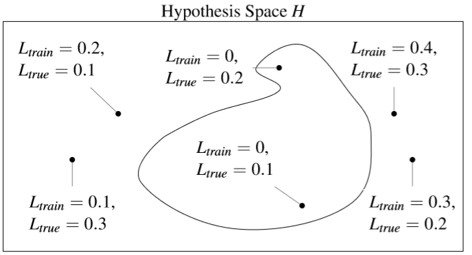

How likely is the learner to pick a *bad hypothesis* ?

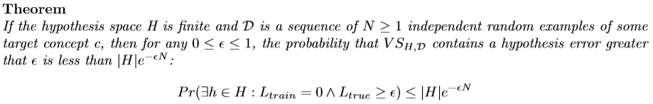

If you're interested in the proof:

------

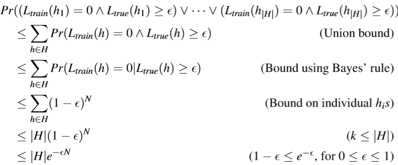

where $k$ is (probably) the number of hypothesis $h \in VS_{\mathcal{H},\mathcal{D}}$  

------

Now, we use a *Probably Approximately Correct (PAC) bound*:

If we want this probability to be at most $\delta$ we can write
$$
|H|e^{-\epsilon N}\le \delta
$$
which means
$$
N \ge \frac{1}{\epsilon}\left(\ln|H|+\ln\left(\frac{1}{\delta}\right)\right)
$$
and
$$
\epsilon \ge \frac{1}{N}\left(\ln|H|+\ln\left(\frac{1}{\delta}\right)\right)
$$
Note that if, *for example*, we consider $M$ boolean features, there are $|C| = 2^M$ distinct concepts and hence $|H| = 2^{2^M}$ (which is huuuge)

If you wonder why let's suppose we have just $2$ boolean features ($A$ and $B$ ) , then we have $|H| = 2^{2^2} = 16$ distinct boolean functions :

```
A   B|  F0  F1  F2  F3  F4  F5  F6  F7
0   0|  0   0   0   0   0   0   0   0
0   1|  0   0   0   0   1   1   1   1
1   0|  0   0   1   1   0   0   1   1
1   1|  0   1   0   1   0   1   0   1

A   B|  F8  F9  F10 F11 F12 F13 F14 F15
0   0|  1   1   1   1   1   1   1   1
0   1|  0   0   0   0   1   1   1   1
1   0|  0   0   1   1   0   0   1   1
1   1|  0   1   0   1   0   1   0   1

function            symbol          name
F0                  0               FALSE
F1                  A ^ B           AND
F2                  A ^ !B          A AND NOT B
F3                  A               A
F4                  !A ^ B          NOT A AND B
F5                  B               B
F6                  A xor B         XOR
F7                  A v B           OR
F8                  A nor B         NOR
F9                  A XNOR B        XNOR
F10                 !B              NOT B
F11                 A v !B          A OR NOT B
F12                 !A              NOT A
F13                 !A v B          NOT A OR B
F14                 A nand B        NAND
F15                 1               TRUE
```

and so the bounds would have an *exponential* dependency on the number of features M !
$$
N \ge \frac{1}{\epsilon}\left(\ln|H|+\ln\left(\frac{1}{\delta}\right)\right)\\
N \ge \frac{1}{\epsilon}\left(\ln2^{2^M}+\ln\left(\frac{1}{\delta}\right)\right)\\
N \ge \frac{1}{\epsilon}\left(\underline{\underline{2^M}}\ln2+\ln\left(\frac{1}{\delta}\right)\right)\\
\epsilon \ge \frac{1}{N}\left(\ln|H|+\ln\left(\frac{1}{\delta}\right)\right)\\
\epsilon \ge \frac{1}{N}\left(\ln2^{2^M}+\ln\left(\frac{1}{\delta}\right)\right)\\
\epsilon \ge \frac{1}{N}\left(\underline{\underline{2^M}}\ln2+\ln\left(\frac{1}{\delta}\right)\right)
$$
which is bad news.

Instead of having an *exponential* dependency on $M$ we'd like to have a, *guess what?* , *polynomial* dependency!

Now, look at the bounds we defined earlier:
$$
N \ge \frac{1}{\epsilon}\left(\ln|H|+\ln\left(\frac{1}{\delta}\right)\right)\\
\epsilon \ge \frac{1}{N}\left(\ln|H|+\ln\left(\frac{1}{\delta}\right)\right)
$$
Consider a class $C$ of possible target concepts defined over a set of instances $X$ and a learner $L$ using hypothesis space $H$.

*Definition :*

$C$ is ***PAC-learnable*** it there exists an algorithm $L$ such that for every $c \in C$ , for any distribution $P$ , for any $\epsilon$ such that $0\le\epsilon\le\frac{1}{2}$ and $\delta$ such that $0\le\delta\le 1$, with probability at least $1-\delta$, outputs an hypothesis $h\in H$, such that $L_{true}(h) \le \epsilon$, using a number of samples that is polynomial of $\frac{1}{\epsilon}$ and $\frac{1}{\delta}$ 

$C$ is ***efficiently PAC-learnable*** by a learner $L$ using $H$ if and only if every $c \in C$ , for any distribution $P$ , for any $\epsilon$ such that $0\le\epsilon\le\frac{1}{2}$ and $\delta$ such that $0\le\delta\le \frac{1}{2}$, with probability at least $1-\delta$, outputs an hypothesis $h\in H$, such that $L_{true}(h) \le \epsilon$, using a number of samples that is polynomial of $\frac{1}{\epsilon}$ , $\frac{1}{\delta}$, $M$ and $size(c)$.

Let's talk now about ***Agnostic Learning***...

Usually the *train* error is not equal to zero, so the $VS$ is empty. In this case there is the need of bounding the gap between train and true errors.
$$
L_{true}(h) \le L_{train}(h) + \epsilon\\
L_{true}(h) - L_{train}(h)\le \epsilon
$$
Firstly, some background:

In probability theory , the *Hoeffding's inequality* provides an upper bound on the probability that the sum of bounded random variables deviates from its expected value by more than a certain amount. Formally speaking, for $N$ *i.i.d* coin flips $X_1,\dots,X_N$ where $X_i \in \{0,1\}$ and $0<\epsilon<1$ , we define the empirical mean
$$
\overline{X}=\frac{1}{N}(X_1+\dots+X_N)
$$
obtaining the following bound:
$$
Pr(\mathbb{E}[\overline{X}]-\overline{X}>\epsilon)<e^{-2N\epsilon^2}
$$
*Theorem:*

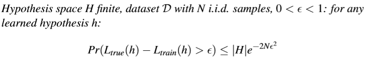

*PAC bound and Bias-Variance Tradeoff*


- For large $|H|$ 

  - Low bias (assuming we can find a good $h$ )
  - High variance (because bound is loser)

- For small $|H|$

  - High bias (is there a good $h$ ? )
  - Low variance (tighter bound)

- Given $\delta$, $\epsilon$ how large should $N$ be?
  $$
  N\ge\frac{1}{2\epsilon^2}\left(\ln |H|+\ln\frac{1}{\delta}\right)
  $$

`manca la parte che trovi su PMDS` 

<div style="page-break-after: always;"></div> 

### VC Dimension

**Define the VC dimension and describe the importance and usefulness of VC dimension in machine learning. Define the VC dimension of a hypothesis space. What is the VC dimension of a linear classifier?***

- We are always talking about *Classification*.

- When counting the number of hypothesis, the entire input space is taken into consideration. In the case of a perceptron, each perceptron differs from another if they differ in at least one input point, and since the input is continuous, there are an infinite number of different perceptrons. (e.g. in a 2D space you can draw an infinite number of different lines)

  Instead of counting the number of hypothesis in the entire input space, we are going to restrict the count only to the samples: a *finite* set of input points. Then, simply count the number of the possible *dichotomies*. A dichotomy is like a mini-hypothesis, it’s a *configuration of labels* on the sample’s input points.

  A *hypothesis* is a function that maps an input from the entire *input space* to a result:
  $$
  h:\mathcal{X}\to\{-1,+1\}
  $$
  The number of hypotheses $|\mathcal{H}|$ can be infinite.

  A *dichotomy* is a hypothesis that maps from an input from the *sample size* to a result:
  $$
  h:\{\mathbf{x}_1,\mathbf{x}_2,\dots,\mathbf{x}_N\}\to\{-1,+1\}
  $$
  The number of *dichotomies* $|\mathcal{H}\{\mathbf{x}_1,\mathbf{x}_2,\dots,\mathbf{x}_N\}|$ is at most $2^N$, where $N$ is the sample size.

  e.g. for a sample size $N = 3$ we have at most $8$ possible dichotomies:

  ```
  	x1 x2 x3
  1	-1 -1 -1
  2	-1 -1 +1
  3	-1 +1 -1
  4	-1 +1 +1
  5	+1 -1 -1 
  6	+1 -1 +1
  7	+1 +1 -1
  8	+1 +1 +1
  
  ```

- The *growth function* is a function that counts the *most* dichotomies on any $N$ points.
  $$
  m_{\mathcal{H}}(N)=\underset{\mathbf{x}_1,\dots,\mathbf{x}_N\in\mathcal{X}}{max}|\mathcal{H}(\mathbf{x}_1,\dots,\mathbf{x}_N)|
  $$
  This translates into choosing any $N$ points and laying them out in *any* fashion in the input space. Determining $m$ is equivalent to looking for such a layout of the $N$ points that yields the *most* dichotomies. 

  The growth function satisfies:
  $$
  m_{\mathcal{H}}(N)\le 2^N
  $$
  This can be applied to the perceptron. For example, when $N=4$, we can lay out the points so that they are easily separated. However, given a layout, we must then consider all possible configurations of labels on the points, one of which is the following:

  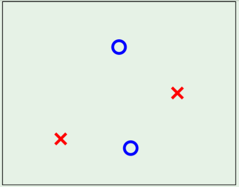

  This is where the perceptron breaks down because it *cannot* separate that configuration, and so $m_{\mathcal{H}}(4)=14$ because two configurations—this one and the one in which the left/right points are blue and top/bottom are red—cannot be represented. For this reason, we have to expect that for perceptrons, $m$ can’t be $2^4$.

The *VC* ( *Vapnik-Chervonenkis ) dimension* of a hypothesis set $\mathcal{H}$ , denoted by $d_{VC}(\mathcal{H})$ is the largest value of $N$ for which $m_{\mathcal{H}}(N)=2^N$  , in other words is "*the most points $\mathcal{H}$ can shatter* " 

We can say that the *VC* dimension is one of many measures that characterize the expressive power, or capacity, of a hypothesis class. 

You can think of the VC dimension as "how many points can this model class memorize/shatter?" (a ton? $\to$ BAD! not so many? $\to$ GOOD!).  

With respect to learning, the effect of the VC dimension is that if the VC dimension is finite, then the hypothesis will generalize:
$$
d_{vc}(\mathcal H)\ \Longrightarrow\ g \in \mathcal H \text { will generalize }
$$
The key observation here is that this statement is independent of:

- The learning algorithm
- The input distribution
- The target function

The only things that factor into this are the training examples, the hypothesis set, and the final hypothesis.

The VC dimension for a linear classifier (i.e. a *line* in 2D, a *plane* in 3D etc...) is $d+1$ (a line can shatter at most $2+1=3$ points, a plane can shatter at most $3+1=4$ points etc...)

Proof: [here](<http://wittawat.com/posts/vc_dimension_linear_classifier.html>)

`READ THE SECTION ON PMDS TOO! `

<div style="page-break-after: always;"></div> 
### Ridge Regression

**Describe the supervised learning technique called ridge regression for regression problems.**    
Ridge Regression is a regularization technique that aims to reduce model complexity and prevent over-fitting which may result from simple linear regression.  
In ridge regression, the cost function is altered by adding a penalty equivalent to the square of the magnitude of the coefficients.  
$$
cost \space function=\sum_{i=1}^M(y_i-\sum_{j=0}^p(w_j\times x_{ij})\space)^2+\lambda\sum_{j=0}^pw_j^2
$$
where ${M}$ is the number of samples and ${p}$ is the number of features.

The penalty term ${\lambda}$ regularizes the coefficients of the features such that if they take large values the optimization function is penalized. 

When ${\lambda \to 0}$, the cost function becomes similar to the linear regression cost function. So lowering ${\lambda}$, the model will resemble the linear regression model.

It is always principled to standardize the features before applying the ridge regression algorithm. Why is this? The coefficients that are produced by the standard least squares method are scale equivariant, i.e. if we multiply each input by ${c}$ then the corresponding coefficients are scaled by a factor of ${\frac{1}{c}}$. Therefore, regardless of how the predictor is scaled, the multiplication of the coefficient and the predictor ${(w_jx_j)}$ remains the same. However, this is not the case with ridge regression, and therefore, we need to standardize the predictors or bring the predictors to the same scale before performing ridge regression. the formula used to do this is given below.
$$
\hat{x}_{ij}=\frac{x_{ij}}{\sqrt{\frac{1}{n}\sum^n_{i=1}(x_{ij}-\bar{x}_j)^2}}
$$
(Sources: [tds - Ridge And Lasso Regression](https://towardsdatascience.com/ridge-and-lasso-regression-a-complete-guide-with-python-scikit-learn-e20e34bcbf0b ) -  [tds - Regularization in ML](https://towardsdatascience.com/regularization-in-machine-learning-76441ddcf99a) )

Since ${\lambda}$ is not defined a priori, we need a method to select a good value for it.  
We use Cross-Validation for solving this problem: we choose a grid of ${\lambda}$ values, and compute   
the cross-validation error rate for each value of ${\lambda}$.  
​We then select the value for ${\lambda}$ for which the cross-validation error is the smallest.  
​Finally, the model is re-fit using all of the available observations and the selected value of ${\lambda}$.  
​Restelli offers the following cost function notation:

${L(\mathbf{w})=L_D(\mathbf{w})+\lambda L_W(\mathbf{w}) }$

where ${L_D(\mathbf{w})}$ is the error on data terms (e.g. RSS) and ${L_W(\mathbf{w})}$ is the model complexity term.

By taking ${L(\mathbf{w})=\frac{1}{2} \mathbf{w}^T\mathbf{w}=\frac{1}{2}||\mathbf{w}||^2_2}$

we obtain:
$$
L(\mathbf{w})=\frac{1}{2}\sum_{i=1}^N(t_i-\mathbf{w}^T\phi(\mathbf{x}_i))^2+\frac{\lambda}{2}||\mathbf{w}||^2_2
$$
We observe that the loss function is still quadratic in **w**:
$$
\hat{\mathbf{w}}_{ridge}=(\lambda \mathbf{I} + \mathbf{\Phi}^T\mathbf{\Phi})^{-1}\mathbf{\Phi}^T\mathbf{t}
$$
(Source: Restelli's Slides)

Ridge Regression is, for example, used when the number of samples is relatively small wrt the  
number of features.  
Ridge Regression can improve predictions made from new data (i.e. reducing variance) by  
making predictions less sensitive to the Training Data.

(Source: [statquests explanation](https://www.youtube.com/watch?v=Q81RR3yKn30))

<div style="page-break-after: always;"></div> 
### Ridge vs Lasso

***Describe and compare the ridge regression and the LASSO algorithms.***    

Before diving into the definitions, let's define what is Regularization: it's a technique which makes slight modifications to the learning algorithm such that the model avoids overfitting, so performing better on unseen data. 

Ridge Regression is a Regularization Technique which consists in adding to the Linear Regression Loss Function a penalty term called L2 regularization element:  

${L(\mathbf{w})=\frac{1}{2}\sum_{i=1}^N(t_i-\mathbf{w}^T\phi(\mathbf{x}_i))^2+\frac{\lambda}{2}||\mathbf{w}||^2_2} $ 

Lasso Regression is a Regularization Technique very similar to Ridge Regression, but instead of adding a L2 regularization element, it adds the so called L1 regularization element:  

${{L(\mathbf{w})=\frac{1}{2}\sum_{i=1}^N(t_i-\mathbf{w}^T\phi(\mathbf{x}_i))^2+\frac{\lambda}{2}||\mathbf{w}||_1}} $ 

The main difference between Ridge and Lasso Regression is that Ridge Regression can only shrink to weights of the features close to 0 while Lasso Regression can shrink them all the way to 0.   
This is due to the fact that Ridge Regression squares the features weights, while Lasso Regression considers the absolute value of such weights.  

This means that Lasso Regression can exclude useless features from the lost function, so being better than Ridge Regression at reducing the variance in models that contain a lot of useless features. In contrast, Ridge Regression tends to do a little better when most features are useful.  

You may ask yourself why Lasso is able to shrink some weights exactly to zero, while Ridge doesn't.  
The following example may be explanatory:  

Consider a model with only one feature ${x_1}$. This model learns the following output: ${\hat{f}(x_1)=4x_1}$. 
Now let's add a new feature to the model: ${x_2}$.  Suppose that such second feature does not tell anything new to the model, which means that it depends linearly from ${x_1}$. Actually, ${x_2 = x_1}$.   
This means that any of the following weights will do the job:  
${\hat{f}(x_1,x_2)=4x_1}$

${\hat{f}(x_1,x_2)=2x_1+2x_2}$

${\hat{f}(x_1,x_2)=x_1+3x_2}$

${\hat{f}(x_1,x_2)=4x_2}$

We can generalize saying that ${\hat{f}(x_1,x_2)=w_1x_1+w_2x_2 \space \space\space with \space\space w_1+w_2=4}$.    

Now consider the ${l_1}$ and ${l_2}$ norms of various solutions, remembering that ${l_1=|w_1+w_2|}$ and that  ${l_2=(w_1^2+w_2^2)}$ .  

| ${w_1}$ | ${w_2}$ | ${l_1}$ | ${l_2}$ |
| ------- | ------- | ------- | ------- |
| 4       | 0       | 4       | 16      |
| 2       | 2       | 4       | 8       |
| 1       | 3       | 4       | 10      |
| -1      | 5       | 6       | 26      |

we can see that minimizing ${l_2}$ we obtain ${w_1=w_2=2}$, which means that it, in this case, tends to spread equally the weights.  
While ${l_1}$ can choose arbitrarily between the first three options, as long as the weights have the same sign it's ok. 

Now suppose ${x_2=2x_1}$, which means that ${x_2}$ does not add new information to the model, but such features have different scale now. We can say that all functions with ${w_1+2w_2=k}$ (in the example above ${k=4}$ ) give the same predictions and have same empirical risk.  

For clarity I will show you some of the possible values we can assign to the weights.  

| ${w_1}$ | ${w_2}$ | ${l_1}$ | ${l_2}$ |
| ------- | ------- | ------- | ------- |
| 4       | 0       | 4       | 16      |
| 3       | 0.5     | 3.5     | 9.25    |
| 2       | 1       | 3       | 5       |
| 1       | 1.5     | 2.5     | 3.25    |
| 0       | 2       | 2       | 4       |

${l_1}$ (which translates into Lasso Regression) chooses ${w_1=0 \space ; \space w_2=2}$  
${l_2}$ (which translates into Ridge Regression) chooses ${w_1=1 \space ; \space w_2=1.5}$  
Obviously I'm oversimplifying,  these won't be the actual chosen values for ${l_2}$. Ridge will choose similar values that will better minimize ${l_2}$, I just didn't list all the possible combinations for ${w_1}$ and ${w_2}$, but the important thing is that Lasso will actually go for ${w_1=0;w_2=2}$.  

What have we noticed then?  

- For Identical Features
  - ${l_1}$ regularization spreads weight arbitrarily (all weights same sign)
  - ${l_2}$ regularization spreads weight evenly
- For Linearly Related Features
  - ${l_1}$ regularization chooses the variable with the largest scale, 0 weight to the others
  - ${l_2}$ prefers variables with larger scale, it spreads the weight proportional to scale


(Sources: [PoliMi Data Scientists Notes - Machine Learning](https://polimidatascientists.it/notes.html)   ;   [Bloomberg - Lasso, Ridge, and Elastic Net](https://www.youtube.com/watch?v=KIoz_aa1ed4&t=934s)	)  

<div style="page-break-after: always;"></div> 
### Ridge Regression vs Bayesian Linear Regression

***Describe the ridge regression algorithm and compare it with the Bayesian linear regression approach.***

`INCOMPLETE: THIS JUST EXPLAIN THE BAYESIAN APPROACH (ALREADY SEEN IN SOFT COMPUTING -> MAXIMUM A POSTERIORI ESTIMATION)`

I've already described Ridge Regression previously.

*Comparison:*

Ridge Regression is a frequentist approach:  
the model assumes that the response variable (y) is a linear combination of weights multiplied by a set of predictor variables (x). The full formula also includes an error term to account for random sampling noise. 

What we obtain from frequentist linear regression is a single estimate for the model parameters based only on the training data. Our model is completely informed by the data: in this view, everything that we need to know for our model is encoded in the training data we have available.

Ridge Regression gives us a single point estimate for the output. However, if we have a small dataset we might like to express our estimate as a distribution of possible values. This is where Bayesian Linear Regression comes in.

The aim of Bayesian Linear Regression is not to find the single “best” value of the model parameters, but rather to determine the *posterior distribution* (*a probability distribution that represents your updated beliefs about the parameter after having seen the data*) for the model parameters.  
Not only is the response generated from a probability distribution, but the model parameters are assumed to come from a distribution as well. The posterior probability of the model parameters is conditional upon the training inputs and outputs:
$$
P(\beta|y,X)=\frac{P(y|\beta,X)P(\beta|X)}{P(y|X)}
$$
Here, ${P(\beta |y,X)}$ is the posterior probability distribution of the model parameters given the inputs and outputs. This is equal to the likelihood of the data, ${P(y|\beta,X)}$, multiplied by the prior probability of the parameters and divided by a normalization constant. This is a simple expression of Bayes Theorem, the fundamental underpinning of Bayesian Inference:
$$
Posterior = \frac{Likelihood*Prior}{Normalization}
$$
Let's stop and think about what this means. In contrast to Ridge Regression , or Linear Regression in general, we have a *posterior* distribution for the model parameters that is proportional to  

- The likelihood of the data
- The prior probability of the parameters

Here we can observe the two primary benefits of Bayesian Linear Regression:

1. **Priors**:   
   if we have domain knowledge, or a guess for what the model parameters should be, we can include them in our model, unlike in the frequentist approach which assumes everything there is to know about the parameters comes from the data. If we don't have any estimates ahead of time, we can use <u>non-informative priors</u> for the parameters such as a normal distribution.
2. **Posterior**:  
   The result of performing Bayesian Linear Regression is a distribution of possible model parameters based on the data and the prior.  
   This allows us to quantify our uncertainty about the model: if we have fewer data points, the posterior distribution will be more spread out.

The formulation of model parameters as distributions encapsulates the Bayesian worldview: we start out with an initial estimate, our prior, and as we gather more evidence, **our model becomes less wrong**. Bayesian reasoning is a natural extension of our intuition. Often, we have an initial hypothesis, and as we collect data that either supports or disproves our ideas, we change our model of the world (ideally this is how we would reason)!

(Sources: [towardsdatascience - Introduction to Bayesian Linear Regression](https://towardsdatascience.com/introduction-to-bayesian-linear-regression-e66e60791ea7) )  

FORSE W_0 CHE DICE NELLE SLIDE SI RIFERISCE ALLA MEDIA E S_0 ALLA MATRICE DI COVARIANZA BOH

AAAAA GUARDA LA SLIDE CHE FA IL PARAGONE CON RIDGE!

***We can derive Ridge Regression from Bayesian Linear Regression!***
If we choose a prior distribution as follows:

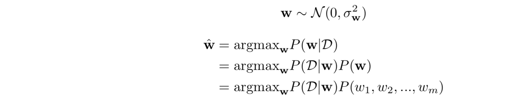

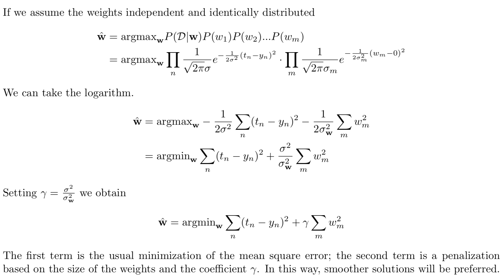

<div style="page-break-after: always;"></div> 
### Logistic Regression

***Describe the logistic regression algorithm and compare it with the perceptron algorithm.***

Although the name might confuse, please note that it is a *classification* algorithm.

Considering a problem of two-class classification, in logistic regression the posterior probability of class $C_1$ can be written as a logistic sigmoid function:
$$
p(C_1|\phi) = \frac{1}{1+e^{-\mathbf{w}^T\phi}}=\sigma(\mathbf{w}^T\phi)
$$


and $p(C_2|\phi) = 1 - p(C_1|\phi)$ 

(we write $\phi$ instead of $\phi(\mathbf{x})$ just for simplicity)

Applying the *Maximum Likelihood* approach...

Given a dataset $\mathcal{D} = \{\mathbf{x}_n,t_n\}$, $t_n \in \{0,1\}$, we have to maximize the probability of getting the right label:
$$
P(\mathbf{t}|\mathbf{X},\mathbf{w}) = \prod_{n=1}^{N}y_n^{t_n}(1-y_n)^{1-t_n},\ \ y_n = \sigma(\mathbf{w}^T\phi_n)
$$
Taking the negative log of the likelihood, the *cross-entropy* error function can be defined and it has to be minimized:
$$
L(\mathbf{w}) = -\ln P(\mathbf{t}|\mathbf{X},\mathbf{w}) = -\sum_{n=1}^{N}(t_n\ln y_n+(1-t_n)\ln(1-y_n))=\sum_{n}^NL_n
$$
Differentiating and using the chain rule:
$$
\frac{\part L_n}{\part y_n}= \frac{y_n-t_n}{y_n(1-y_n)},\ \ \ \ \frac{\part y_n}{\part\mathbf{w}}=y_n(1-y_n)\phi_n\\
\frac{\part L_n}{\part \mathbf{w}}= \frac{\part L_n}{\part y_n}\frac{\part y_n}{\part\mathbf{w}}=(y_n-t_n)\phi
$$
The gradient of the loss function is
$$
\nabla L(\mathbf{w}) = \sum_{n=1}^{N}(y_n-t_n)\phi_n
$$
It has the same form as the gradient of the sum-of-squares error function for linear regression. But in this case $y$ is not a linear function of $\mathbf{w}$ and so, there is no closed form solution. The error function is *convex* (only one optimum) and can be optimized by standard *gradient-based* optimization techniques. It is, hence, easy to adapt to the online learning setting.

Talking about *Multiclass Logistic Regression*...

For the multiclass case, the posterior probabilities can be represented by a *softmax* transformation of linear functions of feature variables:
$$
p(C_k|\phi)=y_k(\phi)=\frac{e^{\mathbf{w}_k^T\phi}}{\sum_j e^{\mathbf{w}_j^T\phi}}
$$
$\phi(\mathbf{x})$ has been abbreviated with $\phi$ for simplicity.

*Maximum Likelihood* is used to directly determine the parameters
$$
p(\mathbf{T}|\Phi,\mathbf{w}_1,\dots,\mathbf{w}_K)=\prod_{n=1}^{N}{\underset{\text{Term for correct class$\;\;\;\;\;\;\;\;\;\;\;\;\;\;\,\,\;\;\;\;\;\;\;\;\;\;\;$}}{\underbrace{\left(\prod_{k=1}^{K}p(C_k|\phi_n)^{t_{nk}}\right)}=\prod_{n=1}^{N}\left(\prod_{k=1}^{K}y_{nk}^{t_{nk}}\right)}}\\
$$
where $y_{nk}=p(C_k|\phi_n)=\frac{e^{\mathbf{w}_k^T\phi_n}}{\sum_j e^{\mathbf{w}_j^T\phi_n}}$

The *cross-entropy* function is:
$$
L(\mathbf{w}_1,\dots,\mathbf{w}_K)=-\ln p(\mathbf{T}|\Phi,\mathbf{w}_1,\dots,\mathbf{w}_K)=-\sum_{n=1}^{N}\left(\sum_{k=1}^{K}t_{nk}\ln y_{nk}\right)
$$
Taking the gradient
$$
\nabla L_{\mathbf{w}_j}(\mathbf{w}_1,\dots,\mathbf{w}_K) =\sum_{n=1}^{N}(y_{nj}-t_{nj})\phi_n
$$
The *perceptron* is an example of *linear discriminant models*, it is an *online* linear classification algorithm.
$$
y(\mathbf{x})=f(\mathbf{w}^T\phi(\mathbf{x}))\\
\text{where}\\

f(a)=
\begin{cases}
+1,\ \ a\ge0\\
-1,\ \ a < 0
\end{cases}
$$
Target values are $+1$ for $C_1$ and $-1$ for $C_2$.

The algorithms finds the *separating hyperplane* by minimizing the distance of *misclassified points* to the *decision boundary*.

Using the number of misclassified points as loss function is not effective since it is a *piecewise constant function*.

We are seeking a vector $\mathbf{w}$ such that $\mathbf{w}^T\phi(\mathbf{x}_n)>0$ when $\mathbf{x}_n \in C_1$ and $\mathbf{w}^T\phi(\mathbf{x}_n)<0$ otherwise.

The *perceptron criterion* assigns

- zero error to correct classification
- $\mathbf{w}^T\phi(\mathbf{x}_n)t_n$ to misclassified patterns $\mathbf{x}_n$ (it is proportional to the distance to the decision boundary)

The *loss* function to be minimized is
$$
L_P(\mathbf{w}) =-\sum_{n\in \mathcal{M}}\mathbf{w}^T\phi(\mathbf{x}_n)t_n
$$
Minimization is performed using *stochastic gradient descent* :
$$
\mathbf{w}^{k+1}=\mathbf{w}^k-\alpha\nabla L_P(\mathbf{w})=\mathbf{w}^k+\alpha\phi(\mathbf{x}_n)t_n
$$
Since the perceptron function does not change if $\mathbf{w}$ is multiplied by a constant, the *learning rate $\alpha$ can be set to $1$*

The effect of a single update is to *reduce the error* due to the *misclassified pattern*, this *does not imply* that the *loss* is reduced at each stage.

*Theorem* (***Perceptron Convergence Theorem***)

"If the training data set is *linearly separable* in the feature space $\phi$, then the perceptron learning algorithm is guaranteed to find an exact solution in a finite number of steps."

*Problems*:

- The number of steps before convergence may be substantial.
- We are not able to distinguish between *non-separable* problems and *slowly converging* ones.
- If multiple solutions exist, the one found depends by the *initialization* of the parameters and the *order of presentation* of the data points.

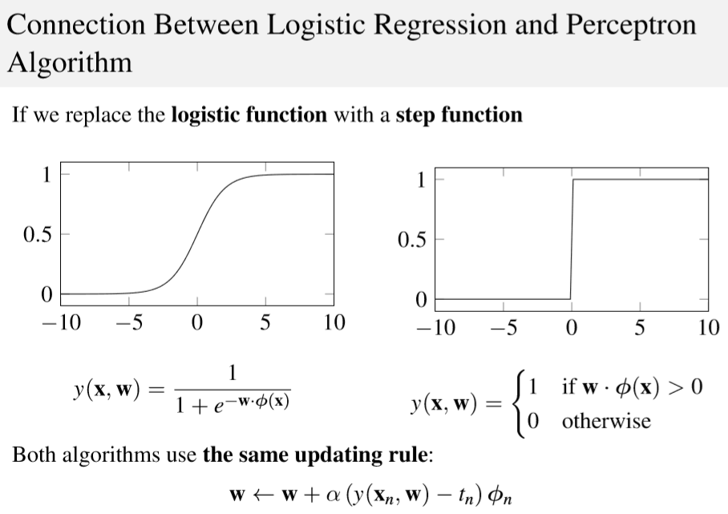

*Please Note* : Here we use the *step function* instead of the *sign function* for the Perceptron!


<div style="page-break-after: always;"></div> 
### PCA

***Describe the Principal Component Analysis technique***

*PCA* is an unsupervised learning method which aims to *reduce* the dimensionality of an input space $\mathcal{X}$ .

Formally, principal component analysis (PCA) is a statistical procedure that uses an *orthogonal transformation* to convert a set of observations of possibly correlated variables into a set of values of *linearly uncorrelated* variables called *principal components*.

To have a graphical intuition:


It is based on the principle of projecting the data onto the input subspace which accounts for most of the variance: 

- Find a line such that when the data is projected onto that line, it has the maximum variance. 
- Find a new line, orthogonal to the first one, that has maximum projected variance. 
- Repeat until $m$ lines have been identified and project the points in the data set on these lines. 

The precise steps of *PCA* are the following (remember that $\mathbf{X}$ is an $n\times d$ matrix where $n$ denotes the number of samples and $d$ is the dimensionality) : 

- Compute the mean of the data
  $$
  \overline{\mathbf{x}} = \frac{1}{N}\sum_{n=1}^N\mathbf{x}_n
  $$

- Bring the data to zero-mean (by subtracting $\overline{\mathbf{x}}$)

- Compute the covariance matrix $\mathbf{S} = \mathbf{X}^T\mathbf{X} = \frac{1}{N-1}\sum_{n=1}^{N}(\mathbf{x}_n-\overline{\mathbf{x}})^T(\mathbf{x}_n-\overline{\mathbf{x}})$

  - Eigenvector $\mathbf{e}_1$ with largest eigenvalue $\lambda_1$ is the *first principal component* 
  - Eigenvector $\mathbf{e}_k$ with $k^{th}$ largest eigenvalue $\lambda_k$ is the *$k^{th}$ principal component*
  - $\frac{\lambda_k}{\sum_i\lambda_i}$ is the proportion of variance captured by the $k^{th}$ principal component.

Transforming the reduced dimensionality projection back into the original spaces gives a reduced dimensionality reconstruction of the data, that will have some error. This error can be small and often acceptable given the other benefits of dimensionality reduction. PCA has multiple benefits:

- Helps to reduce the computational complexity 
- Can help supervised learning, because reduced dimensions allow simpler hypothesis spaces and less risk of overfitting 
- Can be used for noise reduction 

But also some drawbacks:

- Fails when data consists of multiple clusters
- The directions of greatest variance may not be the most informative
- Computational problems with many dimensions 
- PCA computes linear combination of features, but data often lies on a nonlinear manifold. Suppose that the data is distributed on two dimensions as a circumference: it can be actually represented by one dimension, but PCA is not able to capture it.

<div style="page-break-after: always;"></div> 
### Gaussian Processes

***Describe the Gaussian Processes model for regression problems*** (*kriging*)

In probability theory and statistics, a **Gaussian process** is a stochastic process (a collection of random variables indexed by time or space), such that every finite collection of those random variables has a multivariate normal distribution, i.e. every finite linear combination of them is normally distributed. The distribution of a Gaussian process is the joint distribution of all those (infinitely many) random variables, and as such, it is a distribution over functions with a continuous domain, e.g. time or space.

A machine-learning algorithm that involves a Gaussian process uses `lazy learning` and a measure of the similarity between points (the *kernel function*) to predict the value for an unseen point from training data. The prediction is not just an estimate for that point, but also has uncertainty information—it is a one-dimensional Gaussian distribution (which is the marginal distribution at that point).

`*lazy learning* is a learning method in which generalization of the training data is, in theory, delayed until a query is made to the system, as opposed to in *eager learning* , where the system tries to generalize the training data before receiving queries. The main advantage gained in employing a lazy learning method is that the target function will be approximated locally, such as in the k-nearest neighbor algorithm. Because the target function is approximated locally for each query to the system, lazy learning systems can simultaneously solve multiple problems and deal successfully with changes in the problem domain.`

*Slides Definition*:

A *Gaussian Process* is defined as a probability distribution over functions $y(\mathbf{x})$ such that the set of values of $y(\mathbf{x})$ evaluated at an arbitrary set of points $\mathbf{x}_1,\dots,\mathbf{x}_n$ *jointly have a Gaussian distribution*. 

The distribution is completely specified by the second-order statistics, the mean and the covariance:

- Usually we do not have any prior information about the mean of $y(x)$, so we'll take it to be $0$.

- The covariance is given by the *kernel function*
  $$
  \mathbb{E}[y(\mathbf{x}_n)y(\mathbf{x}_m)] = k(\mathbf{x}_n,\mathbf{x}_m)
  $$

Let's talk about *Gaussian Process Regression* (aka *Kriging*)

Take into account the noise on the target
$$
t_n = y(\mathbf{x_n})+\epsilon_n
$$
Random noise under a *Gaussian distribution*
$$
p(t_n|y(\mathbf{x}_n))=\mathcal{N}(t_n|y(\mathbf{x}_n),\sigma^2)
$$
Because the noise is *independent* on each data point, the joint distribution is still *Gaussian*:
$$
p(\mathbf{t}|\mathbf{y})=\mathcal{N}(\mathbf{t}|\mathbf{y},\sigma^2\mathbf{I}_N)
$$
Since $p(\mathbf{y}) = \mathcal{N}(\mathbf{y}|\mathbf{0},\mathbf{K})$ , we can compute the marginal distribution:
$$
p(\mathbf{t})=\int p(\mathbf{t}|\mathbf{y})p(\mathbf{y})d\mathbf{y}=\mathcal{N}(\mathbf{t}|\mathbf{0},\mathbf{C})
$$
where $C(\mathbf{x}_n,\mathbf{x}_m) = k(\mathbf{x}_n,\mathbf{x}_m)+\sigma^2\delta_{nm}$.

Since the two *Gaussians* are *independent* their covariances simply *add*.

<div style="page-break-after: always;"></div> 
### Kernels

***Describe the purpose of using kernels in Machine Learning techniques. How can you construct a valid Kernel? Provide an example of a ML method using kernels and describe the specific advantage of using them for this method.***

Traditionally, theory and algorithms of machine learning and statistics have been very well developed for the linear case. Real world data analysis problems, on the other hand, often require nonlinear methods to detect the kind of dependencies that allow successful prediction of properties of interest. By using a positive definite kernel, one can sometimes have the best of both worlds. The kernel corresponds to a dot product in a (*usually high-dimensional, possibly infinite*) feature space. In this space, our estimation methods are linear, but as long as we can formulate everything in terms of kernel evaluations, we never explicitly have to compute in the high dimensional feature space! (This is called the *Kernel Trick*)

Suppose we have a mapping $\varphi : \R^d \to \R^m$ that brings our vectors in to some feature space $\R^m$. Then the dot product of $\textbf{x}$ and $\textbf{y}$ in this space is $\varphi (\textbf{x})^T\varphi (\textbf{y})$. A kernel is a function $k$ that corresponds to this dot product, i.e. $k(\textbf{x},\textbf{y})=\varphi (\textbf{x})^T\varphi (\textbf{y}) $ . Why is this useful? *Kernels* give a way to compute dot products in some feature space without even knowing what this space is and what is $\varphi$ . For example, consider a simple polynomial kernel $k(\textbf{x},\textbf{y})=(1+\textbf{x}^T\textbf{y})^2$ with $\textbf{x},\textbf{y} \in \R^2$. This doesn't seem to correspond to any mapping function $\varphi$ ,  it's just a function that returns a real number. Assuming that $\textbf{x} = (x_1,x_2)$ and $\textbf{y} = (y_1,y_2)$, let's expand this expression:
$$
k(\textbf{x},\textbf{y})=(1+\textbf{x}^T\textbf{y})^2 = (1+x_1y_1 + x_2y_2)^2=\\1+x_1^2y_1^2+x_2^2y_2^2+2x_1y_1+2x_2y_2+2x_1x_2y_1y_2
$$
Note that this is nothing else but a dot product between two vectors $(1, x_1^2, x_2^2, \sqrt{2} x_1, \sqrt{2} x_2, \sqrt{2} x_1 x_2)$ and $(1, y_1^2, y_2^2, \sqrt{2} y_1, \sqrt{2} y_2, \sqrt{2} y_1 y_2)$ and $\varphi(\mathbf x) = \varphi(x_1, x_2) = (1, x_1^2, x_2^2, \sqrt{2} x_1, \sqrt{2} x_2, \sqrt{2} x_1 x_2)$.

So the kernel $k(\mathbf x, \mathbf y) = (1 + \mathbf x^T \mathbf y)^2 = \varphi(\mathbf x)^T \varphi(\mathbf y)$ computes a dot product in 6-dimensional space without explicitly visiting this space.

Another example is the Gaussian kernel $k(\mathbf x, \mathbf y) = \exp\big(- \gamma \, \|\mathbf x - \mathbf y\|^2 \big)$. If we Taylor-expand this function, we'll see that it corresponds to an infinite-dimensional codomain of $\varphi$.

Instead, the simplest *kernel* is the *linear kernel* which corresponds to an *identity mapping* in the feature space: $k(\mathbf{x},\mathbf{x'}) = \varphi(\mathbf{x})^T\varphi(\mathbf{x'}) = \mathbf{x}^T\mathbf{x}$ 

Moreover, the *kernel* is a *symmetric* function of its arguments: $k(\mathbf{x},\mathbf{x'}) = k(\mathbf{x'},\mathbf{x})$

------

Many linear models for regression and classification can be reformulated in terms of *dual representation* in which the *kernel function arises naturally* ! For example if we consider a linear regression model we know that we obtain the best parameters by minimizing the *regularized sum of squares* error function (*ridge*):
$$
L_{\mathbf{w}} = \frac{1}{2}\sum_{n=1}^{N}(\mathbf{w}^T\varphi(\mathbf{x_n})-t_n)^2+\frac{\lambda}{2}\mathbf{w}^T\mathbf{w}
$$
Setting the gradient of $L_{\mathbf{w}}$ w.r.t $\mathbf{w}$ equal to $0$ we obtain the following:
$$
\mathbf{w} = -\frac{1}{\lambda}\sum_{n=1}^{N}(\mathbf{w}^T\varphi(\mathbf{x_n})-t_n)\varphi(\mathbf{x_n}) = \sum_{n=1}^Na_n\varphi(\mathbf{x}_n)=\Phi^T\mathbf{a}
$$
Where $\Phi$ is the design matrix whose $n^{th}$ row is $\varphi(\mathbf{x}_n)^T$ (remember that in $L_{\mathbf{w}}$ all the vectors are *column* vectors!) and the coefficients $a_n$ are functions of $\mathbf{w}$. So our definition of $\mathbf{w}$ is function of $\mathbf{w}$ itself...which is surely weird, just *wait for it...*

We now define the *Gram Matrix* $\mathbf{K} = \Phi \times \Phi^T$, an $N \times N$ matrix, with elements:
$$
K_{nm} = \varphi(\mathbf{x_n})^T\varphi(\mathbf{x_m})=k(\mathbf{x}_n,\mathbf{x}_m)
$$
So, given $N$ vectors, the *Gram Matrix* is the matrix of all *inner products* 

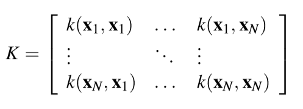

If we substitute $\mathbf{w} = \Phi^T\mathbf{a}$ into $L_{\mathbf{w}}$ we get
$$
L_{\mathbf{a}} = \frac{1}{2}\mathbf{a}^T\Phi\Phi^T\Phi\Phi^T\mathbf{a}-\mathbf{a}^T\Phi\Phi^T\mathbf{t}+\frac{1}{2}\mathbf{t}^T\mathbf{t}+\frac{\lambda}{2}\mathbf{a}^T\Phi\Phi^T\mathbf{a}
$$
where $\mathbf{t} = (t_1,...,t_N)^T$. Guess what? we can rewrite the Loss function in terms of the *Gram Matrix* !
$$
L_{\mathbf{a}} = \frac{1}{2}\mathbf{a}^TKK\mathbf{a}-\mathbf{a}^TK\mathbf{t}+\frac{1}{2}\mathbf{t}^T\mathbf{t}+\frac{\lambda}{2}\mathbf{a}^TK\mathbf{a}
$$
 Solving for $\mathbf{a}$ by combining $\mathbf{w} = \Phi^T\mathbf{a}$ and $a_n = -\frac{1}{\lambda}(\mathbf{w}^T\varphi(\mathbf{x}_n)-t_n)$ (setting the gradient to $0$ etc...)
$$
\mathbf{a}=(K+\lambda\mathbf{I}_N)^{-1}\mathbf{t}
$$
Consider that $K = N\times N$ and $\mathbf{t} = N\times 1$, so $\mathbf{a} = N \times 1$.

So we can make our prediction for a new input $\mathbf{x}$ (which has dimension $D\times 1$ obviously, $\varphi(\mathbf{x})$ will have dimension $M\times 1$ instead, where $M>D$ ) by substituting back into our linear regression model:
$$
y(\mathbf{x}) = \mathbf{w}^T\varphi(\mathbf{x}) = (\Phi^T\mathbf{a})^T\varphi(\mathbf{x}) = \mathbf{a}^T\Phi\varphi(\mathbf{x})= \mathbf{k}(\mathbf{x})^T(K+\lambda\mathbf{I}_N)^{-1}\mathbf{t}
$$
where $\mathbf{k}(\mathbf{x})$ has elements $k_n(\mathbf{x}) = k(\mathbf{x}_n,\mathbf{x})$ . Prediction is just a linear combination of the *target values* from the *training set* . (If you make a dimensionality check you will see that $y(\mathbf{x})$ will be just a number)

The good thing is that instead of inverting an $M\times M$ matrix, we are inverting an $N\times N$ matrix! (as we already said different times,  this allows us to work with *very high or infinite dimensionality* of $\mathbf{x}$).

------

 But *how* can we build a valid *kernel*?

 We have manly two ways to do it:

- *By construction*: we choose a feature space mapping $ \varphi (\mathbf{x})$ and use it to find the corresponding kernel. (I'd call this method *by hand*)

- It is possible to test whether a function is a valid kernel without having to construct the basis function explicitly. The necessary and sufficient condition for a function $k(\mathbf{x},\mathbf{x}')$ to be a kernel is that the Gram matrix $K$ is positive semi-definite for all possible choices of the set $\{x_n\}$. It means that $\mathbf{x}^TK\mathbf{x}\ge 0$ for non-zero vectors $\mathbf{x}$ with real entries, i.e.$\sum_n\sum_m K_{n,m}x_nx_m \ge 0$ for any real number $x_n,x_m$. 

  *Mercer's Theorem :* Any continuous, symmetric, positive semi-definite kernel function $k(\mathbf{x},\mathbf{y})$ can be expressed as a dot product in a high-dimensional space.

  New kernels can be constructed from simpler kernels as *building blocks*:

  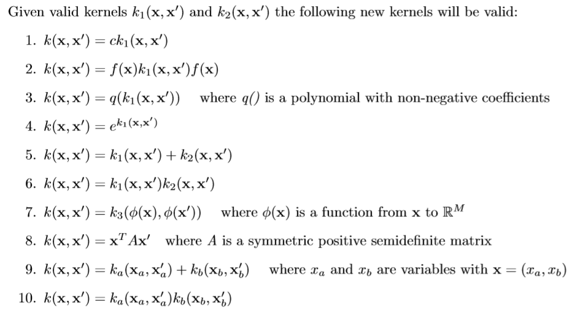

***What is Kernel Regression?***

The *radial basis function* kernel is a popular kernel function used in various kernelized learning algorithms. In particular, it is commonly used in support vector machine classification. The RBF kernel on two samples $\mathbf{x}$ and $\mathbf{x}'$, represented as feature vectors in some *input space*, is defined as:
$$
K(\mathbf{x},\mathbf{x}')=e^{-\frac{||\mathbf{x}-\mathbf{x}'||^2}{2\sigma^2}}
$$
where $||\mathbf{x}-\mathbf{x}'||^2$ may be recognized as the squared Euclidean distance between two feature vectors, $\sigma$ is a free parameter. Since the value of the RBF kernel decreases with distance and ranges between $0$ (in the limit) and $1$ (when $\mathbf{x} =\mathbf{x}'$) , it has a ready interpretation as a similarity measure. It can be seen (*by expansion)* that the feature space of the kernel has an infinite number of dimensions.

But how is this framework related to *regression*? $\to$ *Kernel Regression*!

Before we dive into the actual regression algorithm, let’s look at the approach from a high level. Let’s say you have the following scatter plot, and you want to approximate the $y$ value at $x = 60$. We’ll call this our "query point".


How would you go about it? One way would be to look at the data points near $x = 60$, say from $x = 58$ to $x = 62$, and average their $y$ values. Even better would be to somehow weight the values based on their distance from our query point, so that points closer to $x = 60$ got more weight than points farther away.

This is precisely what *Gaussian Kernel Regression* does, it takes a weighted average of the surrounding points. Say we want to take the weighted average of three values: $3$, $4$ and $5$. To do this, we multiply each value by its weight (I've chosen some arbitrary weights: $0.2$,$0.4$ and $0.6$) , take the sum, then divide by the sum of the weights:
$$
\frac{0.2\cdot3+0.4\cdot4+0.6\cdot5}{0.2+0.4+0.6}=\frac{5.2}{1.2}=4.33
$$
More generally, the weighted average is found as:
$$
\overline{y}=\frac{\sum_{i=1}^m(w_iy_i)}{\sum_{i=1}^mw_i}
$$
where $w_i$ is the weight to assign to value $y_i$ and $m$ is the number of values in the set.

In *Kernel Regression* in order to compute the weight values to use in our regression problem, we're going to use the *Gaussian Function*, which has the perfect behavior for computing our weight values! The function will produces its highest value when the distance between the data point and the query point is zero. For data points farther from the query, the weight value will fall off exponentially. 

To arrive at the final equation for Gaussian Kernel Regression, we’ll start with the equation for taking a weighted average and replace the weight values with our *Gaussian* kernel function.
$$
y^*=\frac{\sum_{i=1}^m(K(x^*,x_i)y_i)}{\sum_{i=1}^mK(x^*,x_i)}
$$
It is interesting to note that Gaussian Kernel Regression is equivalent to creating an RBF Network with the following properties:

- Every training example is stored as an RBF neuron center
- The $\beta$ coefficient ( the *first* set of weights) for every neuron is set to the same value.
- There is one output node.
- The output weight for each RBF neuron is equal to the output value ( $y_i$ ) of its data point.
- The output of the RBFN must be normalized by dividing it by the sum of all of the RBF neuron activations.


The input can be modeled as a vector of real numbers $\mathbf{x}\in \mathbb{R}^n$. The output of the network is then a scalar function of the input vector, $\varphi:\R^n\to\R$ and is given by
$$
\varphi(\mathbf{x})=\sum_{i=1}^Ny_i\rho(||\mathbf{x}-\mathbf{x}_i||)
$$

$$
\rho(||\mathbf{x}-\mathbf{x}_i||)=e^{-\frac{||\mathbf{x}-\mathbf{x}_i||^2}{2\sigma_i^2}}=e^{-\beta_i||\mathbf{x}-\mathbf{x}_i||^2}
$$

Most of the times it is convenient to use *normalized* radial function as basis. Normalization is used in practice as it avoids having regions of input space where all basis functions take *small values*, which would necessarily lead to predictions in such regions that are either *small* or controlled purely by the *bias parameter*. In this case we have
$$
\varphi(\mathbf{x})=\sum_{i=1}^{N}y_i u(||\mathbf{x}-\mathbf{x}_i||) \\
u||\mathbf{x}-\mathbf{x}_i|| = \frac{\rho||\mathbf{x}-\mathbf{x}_i||}{\sum_{j=1}^N\rho||\mathbf{x}-\mathbf{x}_j||}
$$
Here is a $1$-D example, just to give you an idea:

`Here we use` $c_1$ `and` $c_2$ `as *centroids*, it makes sense that we don't want always to average over *all* the samples of our dataset, instead we can choose some *relevant* points (that I call *centroids* ) in our formulation by performing, for example, some local averaging...That was kinda what we did in fuzzy systems. According to David Salsbrug: "Coming up with almost exactly the same computer algorithm, fuzzy systems and kernel density-based regressions appear to have been developed completely independently of one another.`


Two unnormalized radial basis functions in one input dimension. The basis function centers are located at $c_1=0.75$ and $c_2=3.25$.


Two normalized radial basis functions in one input dimension. The basis function centers are the same as before, in this specific case the activation functions become *sigmoids*!

Let's try to derive the *kernel regression* formulation more formally:

*Kernel Regression* is a non-parametric technique in statistics to estimate the *conditional expectation* of a *random variable*. The objective is to find a non-linear relation between a pair of random variables $\mathbf{X}$ and $\mathbf{Y}$. In any nonparametric regression, the conditional expectation of a variable $\mathbf{Y}$ relative to a variable $\mathbf{X}$ may be written:
$$
\mathbb{E}(Y|X) = m(X)
$$
where $m$ is an unknown function.

*Nadaraya* and *Watson*, both in 1964, proposed to estimate $m$ as a locally weighted average, using a kernel as a weighting function. The Nadaraya-Watson estimator is:
$$
\hat{m_h}(x) =\frac{\sum_{i=1}^nK_h(x-x_i)y_i}{\sum_{j=1}^nK_h(x-x_j)}
$$
where $K_h$ is a kernel with a bandwidth $h$ (which is related to the variance). The denominator is a weighting term with sum $1$.

*Derivation*:
$$
\mathbb{E}(Y|X=x) = \int{yf(y|x)dy}=\int y\frac{f(x,y)}{f(x)}dy
$$
Using the *kernel density estimation* (also termed the *Parzen–Rosenblatt* window method, it is just a non parametric way to estimate the *pdf* of a random variable) for both the joint distribution $f(x,y)$ and $f(x)$ with a kernel $K$ 
$$
\hat{f}(x,y) = \frac{1}{n}\sum_{i=1}^{n}K_h(x-x_i)K_h(y-y_i)\\
\hat{f}(x) = \frac{1}{n}\sum_{i=1}^{n}K_h(x-x_i)
$$
we get
$$
\hat{\mathbb{E}}(Y|X=x)=\int \frac{y\sum_{i=1}^{n}K_h(x-x_i)K_h(y-y_i)}{\sum_{j=1}^{n}K_h(x-x_j)}dy\\
=\frac{\sum_{i=1}^{n}K_h(x-x_i)\int yK_h(y-y_i)dy}{\sum_{j=1}^{n}K_h(x-x_j)}\\
=\frac{\sum_{i=1}^{n}K_h(x-x_i)y_i}{\sum_{j=1}^{n}K_h(x-x_j)}\\
$$

<div style="page-break-after: always;"></div> 

# Interesting Articles

- [Polynomial Regression](https://towardsdatascience.com/polynomial-regression-bbe8b9d97491)
- [Difference between Frequentist and Bayesian Approach](https://towardsdatascience.com/introduction-to-bayesian-linear-regression-e66e60791ea7) 

  
