# **Machine** Learning - Reinforcement Learning

`or: How I Learned to Stop Worrying and Love Restelli`

*A series of extremely verbose and surely overkill notes on the "Machine Learning" course as taught by Marcello Restelli and Francesco Trovò during the second semester of the academic year 2018-2019 at Politecnico di Milano.*

`Feel free to modify the document to correct any mistake / add additional material in order to favour a better understanding of the concepts`

*Edited by: William Bonvini*

[TOC]

 
# Q & A

### Methods to compute the value function in DMDP

***Describe which methods can be used to compute the value function $V^{\pi}$ of a policy $\pi$ in a discounted Markov Decision Process.***   

The question is asking what are the methods to do prediction in a discounted MDP.  
We have to distinguish between Model-Based environments and Model-Free environments.

***Model-Based***  
Model-Based means that you are given all the dynamics of the system: the transition matrix, and the rewards for each state action pair.

The methods to do prediction in model-based problems are dynamic programming algorithms, and these are:

- Policy Evaluation
- Modified Policy Evaluation

*<u>Policy Evaluation</u>*

It consists in iteratively applying the *Bellman Expectation Equation* to a value function following policy ${\pi}$
$$
V_{k+1}(s)\leftarrow \sum_{a\in A}\pi (a|s)\Bigg[R(s,a)+\gamma \sum_{s'\in S}P(s'|s,a)V_k(s') \Bigg]
$$
until ${k \to \infty}$.

<u>*Modified Policy Evaluation*</u>

It's a modified version of Policy Evaluation which returns an approximation of the value function ${V^\pi}$ for of the policy ${\pi}$.

It differs from Policy Evaluation just by the fact that we stop the evaluation after a certain number of steps ${\to}$ we don't wait for the full convergence.

***Model-Free***  
Model-Free means that you are not given the transition matrix and the rewards for each state action pair.

There are mainly two algorithms to do prediction in Model-Free problems:

- Monte Carlo
- Temporal Difference

 
<u>*Monte Carlo*</u>

The way Monte Carlo estimates the state-value function for a given policy from experience is simply by averaging the returns observed after visits to that state. As more returns are observed, the average should converge to the expected value. 

So Monte Carlo policy evaluations uses empirical mean return instead of the expected return and it can be computed with two different approaches:

- First-Visit MC  
  Average returns only for the first time ${s}$ is visited (**unbiased** estimator) in an episode
- Every-Visit MC  
  Average returns for every time ${s}$ is visited (**biased** but **consistent** estimator)

Once an episode is over, we proceed with updating the two values

- ${V(s)}$ : the state-value function
- ${N(s)}$: the total number of times ${s}$ has been visited

for each state ${s}$ that has been visited during the last episode.

Stationary Case:

${N(s_t)\leftarrow N(s_t)+1}$

${V(s_t)\leftarrow V(s_t)+ \frac{1}{N(s_t)}(v_t-V(s_t) )}$

Non-Stationary Case:
$$
V(s_t)\leftarrow V(s_t)+ \alpha\bigg(v_t-V(s_t)\bigg)
$$
with ${{v_t=G_t=R_{t+1}+\gamma R_{t+2}+...+\gamma^{T-1}R_T}}$

<u>*Temporal Difference*</u>  
Temporal Difference prediction consists in updating our value function towards the estimated return after one step:  
Specifically, the estimate consists in two parts: the immediate reward ${r_{t+1}}$ plus the discounted value of the next step ${\gamma V(S_{t+1})}$. 
$$
V(s_t)\leftarrow V(s_t)+\alpha \bigg(r_{t+1}+\gamma V(s_{t+1})-V(s_t)\bigg)
$$
The one above is the simplest temporal-difference learning algorithm, called ${TD(0)}$, which means Temporal Difference with ${\lambda=0}$   
The general algorithm for Temporal Difference depends on such value ${\lambda}$ and  ${0\le\lambda \le 1}$.

in ${TD(0)}$ we estimate the new return by doing just a one-step lookahead, but we could even do a two-steps lookahead or in general a ${k}$-step lookahead.

if ${\lambda = 1}$ we obtain Monte Carlo learning.

(Source: this document)

 
### Policy Iteration

***Describe the policy iteration technique for control problems on Markov Decision Processes***  
 If you want a concise answer just go to the end.  
premise: what is a control problem? is the task of finding the optimal value function, which translates into finding the optimal policy.  
Policy Iteration is a dynamic programming policy optimization technique that can be decoupled in two phases:

- Policy Evaluation
- Policy Improvement

***Policy Evaluation*** 
Consists in computing the state-value function ${V^\pi}$ for a given policy ${\pi}$.   
It is done by iteratively applying the Bellman expectation backup.  
$$
V_{k+1}(s)\leftarrow \sum_{a\in A}\pi (a|s)\Bigg[R(s,a)+\gamma \sum_{s'\in S}P(s'|s,a)V_k(s') \Bigg]
$$
Applying a backup operation to each state is called **sweep**.  

What we will actually do is to start off with an arbitrary initial value function, let's call it ${V_1}$. So, this ${V_1}$ tells us what is the value of all states in the MDP (the canonical case is to start with ${V(\forall s)=0}$).  
Afterwards we are going to plug in one step of our Bellman equation: we do a one step lookahead and doing so we figure out a new value function that we call ${V_2}$.  
If we iterate this process many times we end up with the true value function ${V_\pi}$.  
$$
V_1\to V_2 \to... \to V_\pi
$$
Ok, but how do we actually pass from ${V_k}$ to ${V_{k+1}}$?  

We do it by using *synchronous backups*: 

- at each iteration ${k+1}$
- for all states ${s \in S}$
- update ${V_{k+1}(s)}$ from ${V_k(s')}$ ,  where ${s'}$ is a successor state of ${s}$

So let's understand exactly how to do such update:  
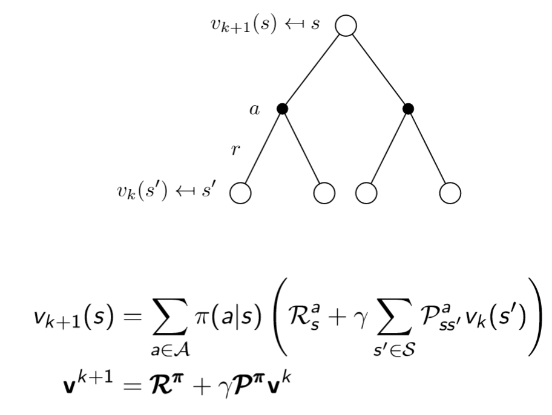

The picture in the previous page shows our one-step lookahead tree and the *Bellman Expectation Equation*, what do they tell us?  
They tell us that the value of the root is given by a one-step lookahead: we consider all the actions we might take and all the states we might go in.  
We know the value of each state we might go in, so we back them all up (summing them together weighted by the probabilities involved) and we get the new value of the root.  
Why do we know the value of such successor states? Because in our example they are all leaves, obviously if they weren't leaves we should have iterated the process over such states.

So, imagine just to start always from the root of your tree, go down the tree until you find the leaves, and then come back up by doing what I just described.  
Ok but by doing so we just "changed our skin" once, we went from ${V_1}$ to ${V_2}$ for example. Well, in order to go from ${V_2}$ to ${V_3}$ and in the end find ${V_\pi}$ we just iterate this process of updating ${V}$.

So, let's consider we just computed ${V_2}$, now we simply plug ${V_2}$ into the leaves, back them up, and get ${V_3}$ at the root.

This process is guaranteed to converge to the true value function ${V_\pi}$ (pay attention, it's not that it converges to the optimal value function, it might, but what I'm saying is that it converges to the value function of the policy you are considering!).

Let's make and example:   

This is called the Small Gridworld example.  
There are two terminal states (the top left and bottom right squares). there are 14 non-terminal states. The reward is -1 until the terminal state is reached. 
For now consider only the left column of the following images:   

Our initial estimate for each state is a trivial 0.  
Now we apply one step of iterative policy evaluation and we'll end up with a new value for each of these states.

For example, let's look at the update from ${k=0}$ to ${k=1}$.  We updated the value of almost each state to -1.0 because whichever step I take is going to give me -1 unless I'm already at the goal (in fact the two terminal states keep on having 0).  
Now let's consider the grid in ${k=2}$ and in particular third cell in the second row.  
In the grid with ${k=1}$ it contained a ${-1.0}$, while now it contains ${-2.0}$. This is due to the fact that wherever I go from that cell (left,up,right,down), I have an immediate cost of ${-1}$ and I find myself in a state with value ${-1}$, in fact all the states around such cell contain a ${-1}$. So the value gets updated to the average of all of these returns, and it's ${-2}$.

Always considering the transition from ${k=1}$ to ${k=2}$, look at the second cell of the first row. It gets updated to ${1.75}$ (in the image you'll see ${1.7}$ just because it was truncated). Why ${1.75}$? because if I go up, I actually stick where I am, so I pay ${-1}$ for the action and ${-1}$ because I end up in a state whose value is ${-1}$. Same thing for moving on the right and on the bottom. If instead I move to the left, I get rewarded ${-1}$ for the action but I end up in a state whose value is ${0}$, so let's average: ${\frac{(-1-1)+(-1-1)+(-1-1)+(-1)}{4}=-1.75}$.

Ok, enough examples.

If we keep on iterating, we end up with the true value function ${(k=\infty)}$ and this value function tells us how many steps on average I'd need to take from each state in order to reach a terminal state following a uniform policy (0.25 possibility of going in each direction).  
Ok, policy evaluation is done.

 
***Policy Improvement***

Now let's talk about the column on the right:  
While evaluating we can improve our policy by acting greedily wrt to the value function!  
Already in the second grid ${(k=1)}$ we can see that if we find ourselves in the second cell of the first row, the only reasonable thing to do is to go left, because the value of all the other neighbors is worse.

So one interesting thing about Policy Evaluation is that, by evaluating our policy, we could infer a new policy!  

And there is more: after a few iterations of policy evaluation (in our example, when ${k=3}$) , even if the true value function has not been determined yet, the new policy has usually already converged, because it depends on the shape of ${V}$, not on its absolute value. So, instead of using the closed form solution, which is expensive, applying the iteration for a few steps allows to have a bad approximation of the value function, but a good estimation of the policy (this concept is the key for the *modified policy iteration* algorithm, we'll see it soon).   

Very important: In the Small Gridworld example we are lucky because the first value function we evaluate (approximate evaluation for ${k=3}$ or full evaluation for ${k=\infty}$) gives us right away the optimal policy, but this is not always the case!  

*Policy improvement* consists in changing the policy according to the newly estimated values.  
For a given state ${s}$, would it be better to do an action  ${a \neq \pi(s)}$?  
We can improve the policy by acting greedily:  
$$
\pi'(s)=arg\  \max_{a \in A}Q^\pi(s,a)
$$
This improves the value from any state ${s}$ over one step  
$$
Q^\pi(s,\pi'(s))=\max_{a \in A}Q^\pi(s,a)\ge Q^\pi(s,\pi(s))=V^\pi(s)
$$
<u>*Theorem: Policy Improvement theorem*</u>

let ${\pi}$ and ${\pi '}$ be any pair of deterministic policies such that
$$
Q^\pi(s,\pi '(s))\ge V^\pi(s) \ \ \ , \ \ \ \forall s \in S
$$
Then, the policy ${\pi '}$ must be as good as, or better than ${\pi}$
$$
V^{\pi'}(s)\ge V^\pi (s) \ \ \ , \ \ \ \forall s \in S
$$

 
***Let's put it all together and optimize***

<u>*policy iteration*</u>

1. You start from any policy you want
2. fully evaluate that policy by iterating policy evaluation until ${k\to\infty}$ 
3. come up with a better policy by acting greedily wrt the old policy.
4. if you haven't found the optimal policy yet consider the new policy and go back to step 2, otherwise terminate.

Optimizations:  

*<u>modified policy iteration</u>* (the step 2 is explained at the beginning of the *Policy Improvement* section):

1. You start from any policy you want
2. approximately evaluate that policy by iterating policy evaluation until ${k\to const}$ 
3. come up with a better policy by acting greedily wrt the old policy.
4. if you haven't found the optimal policy yet consider the new policy and go back to step 2, otherwise terminate.

<u>*value iteration*</u>

1. You start from any policy you want
2. very approximately evaluate that policy by doing policy evaluation just once ${(k=1) }$ 
3. come up with a better policy by acting greedily wrt the old policy.
4. if you haven't found the optimal policy yet consider the new policy and go back to step 2, otherwise terminate.

**Concise Answer**

Policy Iteration is a dynamic programming policy optimization technique that can be decoupled in two phases:

- Policy Evaluation
- Policy Improvement

<u>*Policy Evaluation*</u>

An iterative policy evaluation is performed by applying the Bellman expectation backup an infinite number of times. A full policy-evaluation backup
$$
V_{k+1}(s)\leftarrow \sum_{a\in A}\pi (a|s)\Bigg[R(s,a)+\gamma \sum_{s'\in S}P(s'|s,a)V_k(s') \Bigg]
$$
Applying a backup operation to each state is called *sweep*.  
We use synchronous backups: 

- at each iteration ${k+1}$
- for all states ${s \in S}$
- update ${V_{k+1}(s)}$ from ${V_k(s')}$ ,  where ${s'}$ is a successor state of ${s}$

After few iterations even if the true value function is not determined, the policy has usually already converged, because it depends on the shape of V, not on its absolute value. So, instead of using the closed form solution, which is expensive, applying the iteration for a few steps allows to have a bad approximation of the value function, but a good estimation of the policy. The usage of this approximated evaluation combined with policy improvement is called *modified policy evaluation*.

*<u>Policy improvement</u>*  
It consists in changing the policy according to the newly estimated values.  
For a given state ${s}$, would it be better to do an action  ${a \neq \pi(s)}$?  
We can improve the policy by acting greedily:  
$$
\pi'(s)=arg\  \max_{a \in A}Q^\pi(s,a)
$$
This improves the value from any state ${s}$ over one step  
$$
Q^\pi(s,\pi'(s))=\max_{a \in A}Q^\pi(s,a)\ge Q^\pi(s,\pi(s))=V^\pi(s)
$$
<u>*Theorem: Policy Improvement theorem*</u>

let ${\pi}$ and ${\pi '}$ be any pair of deterministic policies such that
$$
Q^\pi(s,\pi '(s))\ge V^\pi(s) \ \ \ , \ \ \ \forall s \in S
$$
Then, the policy ${\pi '}$ must be as good as, or better than ${\pi}$
$$
V^{\pi'}(s)\ge V^\pi (s) \ \ \ , \ \ \ \forall s \in S
$$
  ( Sources: PMDS Notes ${\leftarrow}$ there are some mistakes though - [Deep Mind Dynamic Programming](https://www.youtube.com/watch?v=Nd1-UUMVfz4&t=142s) )

 
### Value Iteration

***Describe the value iteration algorithm. Does the algorithm always return the optimal policy?***   

If you are looking for a concise answer go to the end.

Value iteration is the most popular dynamic programming algorithm applied in model based scenarios. 

Value iteration is based on the principle of Optimality:

If the first action I take is optimal and then I follow an optimal policy from whichever state I end up, the overall behavior is optimal.

***Principle of Optimality***  
A policy ${\pi(a|s)}$ achieves the optimal value from state ${s}$ , ${v_\pi (s)=v_* (s)}$, if and only if, for any state ${s'}$ reachable from ${s}$,   
${\pi}$ achieves the optimal value from state ${s'}$, ${v_\pi (s')=v_*(s')}$.

Ok, how to exploit this?  
If we know the solution to the subproblems ${v_* (s')}$, we can find ${v_* (s)}$ just by applying a one-step lookahead:
$$
v_* (s) \leftarrow \max _{a \in A}\bigg\{{R_s^a+\gamma \sum_{s' \in S}P_{ss'}^a v_*(s')\bigg\} }
$$
The idea of value iteration is to apply these update iteratively:  
we plug into the right member of the equation the current value function (so, it's not optimal at first!), obtain a new value function, plug such new value function to the right member, obtain a new value function, and so on until we find the optimal value function.

Intuition: start with the final rewards and work backwards.  
Shortest Path Example:    
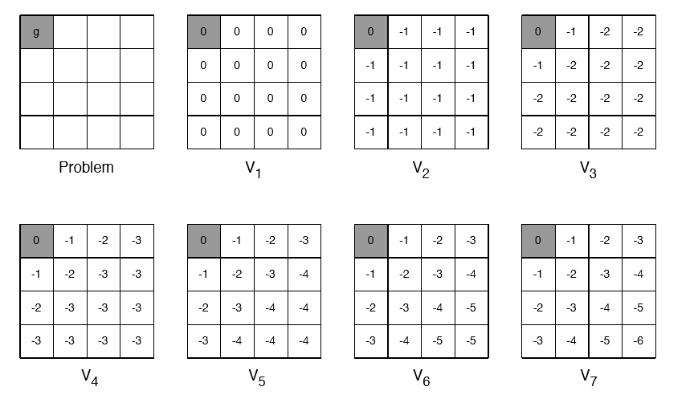 

This problem consists in finding the optimal value function for each cell. the goal of the game is to reach the terminal state (top-left corner), the possible actions are move left, up,right, down.  
Each actions' reward is ${-1}$. 

 
With value iteration we are able to find the optimal value function just by iterating on the Bellman's Optimality Equation.

We initialize all the values to ${0}$.

from ${ V_2}$ to $V_3$  we have that 

${[0,0]}$:
$$
V_* ([0,0]) \leftarrow \max _{a \in A}\bigg\{R_s^a+\gamma \sum_{s' \in S}P_{ss'}^a V_*(s') \bigg\}
$$

$$
V_* ([0,0]) \leftarrow 0+1 \sum_{s' \in S}P_{ss'}^a V_*(s')
$$

$$
V_* ([0,0]) \leftarrow 0+0
$$

${[0,1]}$:
$$
V_* ([0,1]) \leftarrow \max _{a \in A}\bigg\{R_s^a+\gamma \sum_{s' \in S}P_{ss'}^a V_*(s') \bigg\} 
  \\
  V_* ([0,1]) \leftarrow -1+1 \bigg(1\cdot0\bigg) 
  \\
  V_*([0,1])\leftarrow-1
$$
  ${[2,2]}$:
$$
V_*([2,2])\leftarrow -1+1\cdot\bigg(1\cdot(-1)\bigg)
  \\
  V_*([2,2])\leftarrow-2
$$
(In ${[2,2]}$ I chose randomly to perform one of the actions, they all give the same result. In ${[0,1]}$ I considered moving west since it's the most convenient choice).

I did a couple of examples for ${V_2}$, hopefully you can get the sense of the algorithm.

Let's take stock of the situation: value iteration is a method for solving MDPs, how do we do it? by applying iteratively the Bellman Optimality Equation, doing so we find the optimal value function.
$$
  v_1 \to v_2 \to v_3 \to... \to v_*
$$
  *What are the differences between policy iteration and value iteration?*

- in Value Iteration we are not building a policy at each step, we are working directly in value space. In Policy Iteration there is an alternation between value and policy space.
- Intermediate value functions of Value Iteration may not correspond to any policy, while intermediate value functions of Policy Iteration surely do. What does this mean? It means that in Value Iteration, during the iteration, we could get an intermediate ${v}$,  which does not correspond to any ${v_\pi}$ for any ${\pi}$.
- We can say that Value Iteration is equivalent to do Modified Policy Iteration with ${k=1}$. 

 
*One last image to sum up:*  
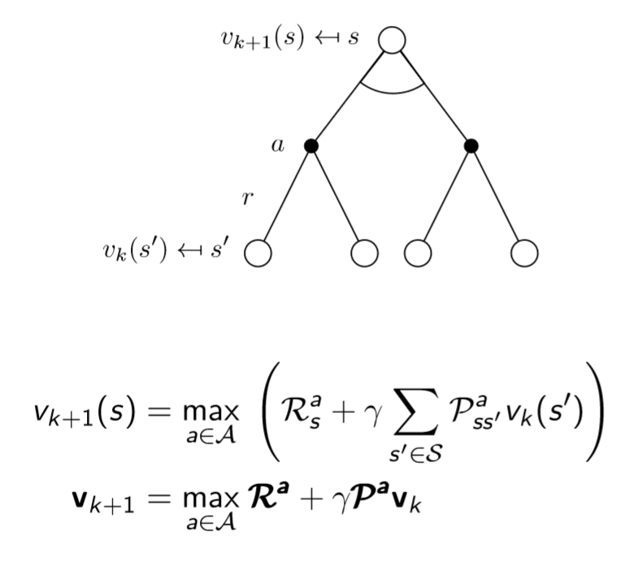

*In a nutshell:* 

1. Take the current value function and plug it in the leaves. 
2. for each state (consider it the root of the tree):  
   Such root
   1. Does a lookahead
   2. Maximizes over all the things it might do
   3. Takes an expectation over all the things the environment might do. 
   4. Backs it up to get its new value.
3. Back to step 1 until you find the optimal policy

  Important: Value Iteration assures to find the optimal value function, consequently it assures to find the optimal policy. 

  How come?

  Define the max-norm: ${||V||_\infty}=\max_s|V(s)|$

  *Theorem*:

  Value Iteration converges to the optimal state-value function ${\lim_{k\to\infty}V_k=V^*}$

  *Proof*:
$$
  ||V_{k+1}-V^*||_\infty =||T^*V_k-T^*V^*||_\infty\le \gamma||V_k-V^*||_\infty \\
  \le  \ ... \ \le \gamma^{k+1}||V_0-V^*||_\infty \to \infty
$$
  *Theorem*  
$$
||V_{i+1}-V_i||_\infty < \epsilon \implies ||V_{i+1}-V^*||_\infty < \frac{2\epsilon\gamma}{1-\gamma}
$$

 
***Concise Answer***  

Value iteration is the most popular dynamic programming algorithm applied in model based scenarios.

The problem of finding the optimal policy ${\pi_*}$ is solved by iteratively applying the Bellman Optimality equation, without any explicit policy.  
In fact, intermediate value functions may not correspond to any policy.  

  *Bellman's Optimality Equation*:
$$
  v_* (s) \leftarrow \max _{a \in A}\bigg\{{R_s^a+\gamma \sum_{s' \in S}P_{ss'}^a v_*(s')\bigg\} }
$$
  Value Iteration always return the optimal policy, as shown by the following theorem.

  Define the max-norm: ${||V||_\infty}=\max_s|V(s)|$

  *Theorem*:

  Value Iteration converges to the optimal state-value function ${\lim_{k\to\infty}V_k=V^*}$

  *Proof*:
$$
||V_{k+1}-V^*||_\infty =||T^*V_k-T^*V^*||_\infty\le\gamma||V_k-V^*||_\infty 
  \le  \ ... \ \le \gamma^{k+1}||V_0-V^*||_\infty \to \infty
$$
  *Theorem*  
$$
  ||V_{i+1}-V_i||_\infty < \epsilon \implies ||V_{i+1}-V^*||_\infty < \frac{2\epsilon\gamma}{1-\gamma}
$$
  ( Sources: PMDS Notes - [Deep Mind Dynamic Programming](https://www.youtube.com/watch?v=Nd1-UUMVfz4&t=142s) )

  

 
### Value Iteration vs Policy Iteration

***Describe and compare Value Iteration and Policy Iteration algorithms.***   

Value iteration and Policy Iteration are two algorithms used to do control in Model-Based environments.

Value Iteration can be considered a particular case of Modified Policy Iteration.

***Policy Iteration***  

It's divided in two steps:

- Policy Evaluation 
- Policy Improvement

*Policy Evaluation* consists in evaluating a certain policy ${\pi}$ by iteratively applying the *Bellman Expectation Equation*
$$
V_{k+1}(s)\leftarrow \sum_{a\in A}\pi (a|s)\Bigg[R(s,a)+\gamma \sum_{s'\in S}P(s'|s,a)V_k(s') \Bigg]
$$
It means that the value function at the iteration ${k+1}$ is given by the immediate reward obtained following policy ${\pi}$ plus the discounted average total reward obtained from the successor state ${s'}$.  
The evaluation is completed (the value function converges to the true value function for that policy) when ${k \to \infty}$. 

*Policy Improvement* consists in coming up with a better policy ${\pi'}$ starting from a policy ${ \pi}$. This is achieved by acting greedily wrt to the value function evaluated in the first step of policy iteration.

${\pi'(s)=\underset{a \in A}{\text{argmax}}}\ {Q^\pi(s,a)}$

By repeating evaluation and improvement we are certain of obtaining in the end the optimal policy ${\pi^*}$

***Value Iteration***  
*Value Iteration* consists in applying iteratively the *Bellman Optimality Equation*
$$
V^*(s)=\max_{a \in A}{\bigg\{R(s,a)+\gamma \sum_{s' \in S}P(s'|s,a)V^*(s') \bigg\}}
$$
until the actual optimal value function is found.

The optimal value function is found when the old value function ${V_k}$ and the new one ${V_{k+1}}$ differ less than a small number ${\epsilon}$.  
Value iteration is based on the principle of Optimality:  
A policy ${\pi(a|s)}$ achieves the optimal value from state ${s}$, ${v_\pi (s)=v_* (s)}$, if and only if, for any state ${s'}$ reachable from ${s}$,  ${\pi}$ achieves the optimal value from state ${s'}$, ${v_\pi (s')=v_*(s')}$.

This algorithm assures convergence to the optimal value function, and consequently to the optimal policy.

 
***Differences***

- in Value Iteration we are not building a policy at each step, we are working directly in value space. in Policy Iteration there is an alternation between value and policy space.
- Intermediate value functions of Value Iteration may not correspond to any policy, while intermediate value functions of Policy Iteration do. What does this mean? It means that in VI, during the iteration, we could get an intermediate ${v}$,  which does not correspond to any ${v_\pi}$ for any ${\pi}$.
- We can say that Value iteration is equivalent to do Modified Policy Iteration with ${k=1}$.  Modified Policy Iteration is just Policy Iteration, but we don't wait the value function to converge to the true one, we stop the evaluation at ${k=const}$. 

(Sources: this document)

 
### Prediction vs Control

***Describe the two problems tackled by Reinforcement Learning (RL): prediction and control. Describe how the Monte Carlo RL technique can be used to solve these two problems.***   

- Prediction:  
  this type of task consists in predicting the expected total reward from any given state assuming the function ${\pi(a|s)}$ is given. 
- Control:  
  This type of task consists in finding the policy ${\pi(a|s)}$ that maximizes the expected total reward from any given state. In other words, some policy ${\pi}$ is given, and it finds the optimal policy ${\pi^*}$. 

Monte Carlo is Model Free RL technique.  
Model Free means that we don't have complete knowledge of the environment, namely, we don't know the transition matrix ${P}$ and the rewards ${r}$ associated with each state-action pair.  

***Prediction In Monte Carlo***  
The way Monte Carlo estimates the state-value function for a given policy from experience is simply by averaging the returns observed after visits to that state. As more returns are observed, the average should converge to the expected value. 

So Monte Carlo policy evaluations uses empirical mean return instead of the expected return and it can be computed with two different approaches:

- First-Visit MC  
  Average returns only for the first time ${s}$ is visited (**unbiased** estimator) in an episode
- Every-Visit MC  
  Average returns for every time ${s}$ is visited (**biased** but **consistent** estimator)

Once an episode is over, we proceed with updating the two values

- ${V(s)}$ : the state-value function
- ${N(s)}$: the total number of times ${s}$ has been visited

for each state ${s}$ that has been visited during the last episode.

${N(s_t)\leftarrow N(s_t)+1}$

${V(s_t)\leftarrow V(s_t)+ \frac{1}{N(s_t)}(\color{red}v_t-V(s_t)\color{black} )}$

So what have we done? 

1. We incremented the number of occurrences ${N}$ of the visited state ${s_t}$.
2. We updated our estimate of ${V}$ a little bit in the direction of the error (red colored) between the old expected value of ${V}$ and the return we actually observed during this episode ${v_t}$.  
   Just think of it as saying that ${V}$ is exactly the same ${V}$ as before but incremented/decremented of a small quantity weighted by ${\frac{1}{N(s_t)}}$.  Or google *incremental mean* to get such equation starting from the generic equation of the *arithmetic mean*. 

 
***Control in Monte Carlo***

{DISCLAIMER: I derived MC Control step by step, if you want you can jump to *GLIE Monte Carlo Control* for the short answer}  
We use Policy Iteration for the control tasks.

It is composed of Policy Evaluation and Policy Improvement.

- Policy Evaluation:  
  Estimate ${v_\pi}$ 
- Policy Improvement  
  Generate ${\pi ' \ge \pi}$ 

 So let's try to plug in this iteration process in Monte Carlo.  
The first thing that comes up in our mind is to do the following:  

Which means, estimate the ${V}$ values of the visited states ${s}$ using policy ${\pi}$ and then act greedily wrt to ${V}$ to improve our policy.   
(The diagram above shows the iteration process: while the arrow goes up we do evaluation, while it goes down we do improvement. These arrows become smaller and smaller because after some iterations ${V}$ and ${\pi}$ converge.)

There are actually two problems with this  approach: we can't use ${V}$ and we can't be so greedy.

***We can't use ${V}$***:

we want to be model free, but how can we me model free if we are using the state-value function ${V}$?   
We'd still need a model of the MDP to figure out how to act greedily wrt to ${V}$. We'd only know the values of the estimated return of each state, and we want to know what action is the best to be taken, so we would have to imagine in which state ${s'}$ we would go for each possible action. But wait, we don't know the transition matrix ${P}$!  
The solution consists in using ${Q}$. action-value functions ${(Q)}$ allow us to do control in a model free setting.  
$$
Q(s_t,a_t)\leftarrow Qs(s_t,a_t)+\frac{1}{N(s_t,a_t)}\bigg(v_t-Q(s_t,a_t)\bigg)
$$
sum up:  
Greedy Policy Improvement over ${V(s)}$ *requires model* of MDP (can't be used in model free setting)
$$
\pi'(s)=arg \max_{a \in A}\bigg(R(s,a)+P(s'|s,a)V(s')\bigg)
$$

 
Greedy Policy Improvement over ${Q(s,a)}$ is *model-free*
$$
\pi'(s)=arg \max_{a \in A}Q(s,a) 
$$
So here we are, this is our new approach:

  

The same as before, but instead of ${V}$ we use ${Q}$

  

***We can't be so greedy***

If we act greedily all the time we don't do exploration, we just do exploitation: we just exploit what looks to be the best path, but maybe there is another path that for the first steps does not give us a good reward, but later on gives us a better reward than the path we are exploiting.  
The simplest idea for ensuring continual exploitation is to use an ${\epsilon}$-greedy approach:
$$
  \pi(s,a)=
  \begin{cases}
  \frac{\epsilon}{m}+1-\epsilon \ \ \ \ \ if \ a^*=arg \max_{a \in A}Q(s,a) \\
  \frac{\epsilon}{m} \ \ \ \ \ \ \ \ \ \ \ \ \ \ \ \ \ \  otherwise
  \end{cases}
$$
This means that all ${m}$ actions are tried with a non-zero probability. With probability ${\frac{\epsilon}{m}+1-\epsilon}$ we choose the greedy action, and with probability ${\frac{\epsilon}{m}}$ we choose any of the remaining ${m-1}$ actions. Pay attention: we could see it as choosing the greedy action with probability ${1-\epsilon}$ and with probability ${\frac{\epsilon}{m}}$ any of the actions, including the greedy one.  
This approach works well, and this is shown by the Policy Improvement Theorem:  
For any ${\epsilon}$–greedy policy ${\pi}$, the ${\epsilon}$–greedy policy ${\pi '}$ wrt ${Q^\pi}$ is an improvement.  
Therefore ${V^{\pi'}(s)\ge V^{\pi}(s)}$ 
(The demonstration of the theorem is easily findable on the internet or on page 56 of Restelli's slides of lecture 10 ).  
Moreover, when the number of episodes ${k\to \infty}$, the policy converges on a greedy policy

Here we are with our new approach:

  

We just got rid of the greedy improvement, and went for an ${\epsilon}$-greedy one. (yes, there is a mistake in the slide, in the diagram there should be written ${\pi=\epsilon}$-greedy${(Q)}$) )

***But there is more!***

Let's make this a little more efficient:  
In this kind of policy iteration frameworks, it's not necessary to fully evaluate our policy (run many episodes and get the mean return for each ${Q}$): we can just run **one** episode, update only the ${Q}$ values of the state-action pairs we visited during such episode (evaluation), improve our policy based on the new ${Q}$s we obtained, and repeat. Why should we wait to get more episodes of information when we could already improve the policy?   
So once again, here we are with our new approach:

  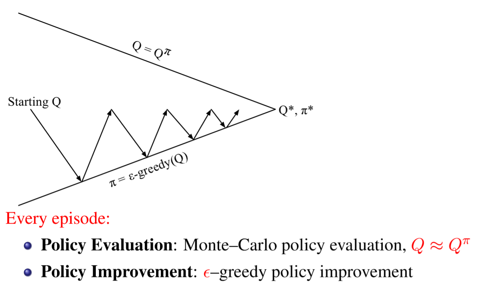

**No, we are not done yet, there's still one little problem to solve**    
We almost have the full picture. One last step:    
How can we really guarantee that we find the best possible policy? what we really want to find is ${\pi^*}$, the optimal policy. Such policy is greedy by definition, it tells us what action to take (with no doubts) in state ${s}$.  
So what we want to do is to explore in order to make sure we are not missing out on anything, but at a certain point, asymptotically, we want to stop exploring, and just exploiting.  
This translates into the GLIE property (Greedy in the Limit with Infinite Exploration):

- All state-action pairs are explored **infinitely** many times:  
  $$
  \lim_{k\to\infty}N_k(s,a)=\infty
  $$

- The policy **converges** on a **greedy** policy:  
  $$
  \lim_{k\to\infty}\pi_k(a|s)=
  \begin{cases} 
  \mathbf{1} \ \ \ \ if \ a=\arg \max_{a'\in A}Q_k(s,a') \\
  \mathbf{0} \ \ \ \ otherwise
  \end{cases}
  $$
  (on Restelli's slides there is a mistake: there's written ${Q_k(s',a')}$ but that ${s'}$ should be ${s}$. )

  Now we are ready to actually answer the question: what is used in Monte Carlo Control?
  Here it is:  
  **GLIE Monte Carlo Control**  

1. Sample ${k}$-th episode using ${\pi}$: ${\{S_1,A_1,R_2,...,S_T\} \sim \pi}$  

2. For each state ${S_t}$ and action ${A_t}$ visited in the episode:  
   $$
   N(S_t,A_t) \leftarrow N(S_t,A_t)+1
   $$

   $$
   Q(S_t,A_t)\leftarrow Q(S_t,A_t)+\frac{1}{N(S_t,A_t)}(G_t-Q(S_t,A_t))
   $$

     

3. Improve the policy based on the new action-value function, considering:  
   $$
   \epsilon \leftarrow\frac{1}{k}
   $$
   ${ \ \ \ \ \ \ \ \ \ \ \ \ \ \ \ \ \ \ \ \ \ \ \ \ \ \ \ \ \ \  \ \ \ \ \ \ \ \ \ \ \ \ \ \ \ \ \ \ \ \ \ \ \ \ \ \ \ \ \ \ \ \ \ \ \ \ \ \ \ \ \ \pi \leftarrow \epsilon}$-greedy${(Q)}$

So what has changed from before? well, we are updating ${\epsilon}$ every time we run a new episode! Now it will become smaller and smaller each time we generate a new episode.  
Theorem:  
*GLIE Monte Carlo Control converges to the optimal action-value function:*  
$$
  Q(s,a)\to q^*(s,a)
$$
Well, GLIE MC is our first full solution.  
We can throw this into any MDP and it will find the right solution!   
So, let's sum up the solutions we adopted for MC control:

1. Use ${Q}$, not ${V}$
2. evaluate and improve your policy *every time you run an episode*
   3. use an ${\epsilon}$-greedy policy
3. the value of ${\epsilon}$ should decay at every iteration in order to guarantee to find the optimal policy

(Sources:  [David Silver's Lesson 5 on RL ](https://www.youtube.com/watch?v=0g4j2k_Ggc4&t=630s) -  Restelli's Slides  -  [Model Free Algorithms](https://medium.com/deep-math-machine-learning-ai/ch-12-1-model-free-reinforcement-learning-algorithms-monte-carlo-sarsa-q-learning-65267cb8d1b4)  )

 
### Monte Carlo vs Temporal Difference

***Describe the differences existing between the Montecarlo and the Temporal Difference methods in the model-free estimation of a value function for a given policy.***  
If you are looking for a concise answer just go to the end.  
Monte Carlo and Temporal Difference are two different algorithms to solve Model Free Reinforcement Learning planning problems.

The question asks us to find the differences between MC-Prediction and TD-Prediction, so let's first write down both update equations:  

*Monte-Carlo Update:*  
The following updates are used *each time* an episode ends.  
For each state ${s_t}$ with return ${v_t}$: 

Stationary Case:
$$
N(s_t)\leftarrow N(s_t)+1
$$

$$
V(s_t)\leftarrow V(s_t)+ \frac{1}{N(s_t)}\bigg(v_t-V(s_t)\bigg)
$$

Non Stationary Case (we use a running mean: we forget old episodes thanks to ${\alpha}$):
$$
\color{blue}V(s_t)\leftarrow V(s_t)+ \alpha\bigg(\color{red}v_t\color{blue}-V(s_t)\bigg)
$$
${v_t}$: the return we observed from ${s_t}$ during the current episode:  
${v_t=G_t=R_{t+1}+\gamma R_{t+2}+...+\gamma^{T-1}R_T}$

${N(s_t)}$: the total number of times I visited state ${s_t}$ along all episodes I've ever run.   
Usually, in real world scenarios, we deal with non-stationary setups: we don't want to remember everything about the past. This is the case in RL as well, because during the control task we keep on updating our policy and get better and better evaluations of our states, so we want to get rid of the contribute of old evaluations  ${\to}$ we always go with the non-stationary update function.  
(if you haven't understood this last part don't worry, it will be clearer once you study control techniques).

*TD-Update*  
$$
\color{blue} V(s_t)\leftarrow V(s_t)+\alpha \bigg(\color{red}r_{t+1}+\gamma V(s_{t+1})\color{blue}-V(s_t)\bigg)
$$
The one above is the simplest temporal-difference learning algorithm, called ${TD(0)}$. We'll use it as reference. The red colored part is called TD-target.

In this case we are updating our value function towards the estimated return after one step:  
Specifically, the estimate consists in two parts: the immediate reward ${r_{t+1}}$ plus the discounted value of the next step ${\gamma V(S_{t+1})}$. 

 
***So what are the differences between MC and TD?***

Ok, here you are:  

***Behavioral difference***  
Let's start from a concrete example:  
Imagine you are driving your car and suddenly see another car moving towards you. You think you are going to crash, but in the end the car swerves out of the way, and you don't actually crash. In MC you wouldn't get any crash in the end (because in MC, the value function is updated only in the end of the episode) so you wouldn't update your values, even if you almost died.  
In TD learning, you start thinking that everything's fine, but, when you see the car coming towards you, you immediately update you estimate of the return ("damn it, If I don't do something I'm gonna die") and choose to slow down the car (which translates into choosing the action of decelerating because it gives a better estimate of the final reward).

You asked for a second example?  here you are: 

Another driving example. We need to predict how much time we need to reach home from our office.  

- "Elapsed time" is the time passed.  
- "Predicted Time to Go" is the time we are predicting to need in order to get home from our current state.  
- "Predicted Total Time" is the total time, starting from our office, we predict to need to get home.  

So: the "Elapsed Time" from a state ${i}$ to a state ${j}$ is our reward: from the office to the car we get 5 minutes of reward, from the car to the exit of the highway we get 15 minutes of reward. "Predicted time to go" is our value function. The sum of the total elapsed time and the "Predicted Time to Go" give us the total predicted time.  
(But wait, why is the reward positive? shouldn't it be negative? yes, but it's just an example, easier to deal with positive values).

Each row corresponds to a state: the starting state is the office, then we get to the parking lot, highway, etc.  
Now, consider ${\alpha=1}$ for both MC and TD (just to make things easier). what does this mean? that we completely forget about the past (just look at the equations above and you'll find out why).  
The following charts show you how both algorithms update the value function of each state (for visualization purposes Sutton (the book) plots the predicted total time instead of the Predicted Time to Go):

MC updates every state to have a "predicted total time" equal to the end estimate, so to 43:  

$V(s) \leftarrow V(s)+ \alpha \bigg(v_t -V(s)\bigg)$

${V(lo)\leftarrow 30+1\bigg(43-(30)\bigg)=43}$  	(Elapsed Time = 0)  

${V(rc)\leftarrow 35+1\bigg(38-(35)\bigg)=38}$ 		(Elapsed Time = 5)    

${V(eh) \leftarrow 15+1\bigg(23-(15)\bigg)=23}$			(Elapsed Time = 20)  
${...}$  
The sum of each ${V}$ with the relative elapsed time always sums up to 43.

While TD updates every state to the estimate of the successor state.:   
(we are considering ${\gamma=1}$ as well)

${V(lo)\leftarrow V(lo)+1 \bigg(r_{t+1}+\gamma V(rc)-V(lo)\bigg)}$

${V(lo)\leftarrow 30 + 1\bigg(5+1\cdot35-(30)\bigg)=40}$		(Elapsed Time = 0)  

${V(rc) \leftarrow 35 + 1\bigg( 15+1\cdot 15-(35)\bigg)=30}$		(Elapsed Time = 5)  

${V(eh)\leftarrow 15 + \bigg(10+1\cdot 10-(15)\bigg)=20}$		(Elapsed Time = 20)

The sum of each ${V(S_t)}$ with the relative elapsed time always sums up to the total predicted time in state ${S_{t+1}}$.

 
**Complete/Incomplete - Episodic/Continuing environments**

- TD can learn *before* knowing the final outcome, it learns online, step by step. (online means that it learns on the go, doesn't wait the episode to be over)
- MC *must* wait until the end of the episode before the return is known.

But what if there is no episode? what if there is no final outcome?

- TD can learn from incomplete sequences
- MC can only learn from complete sequences
- TD works in continuing (non-terminating) environments
- MC only works for episodic (terminating) environments

**Bias & Variance differences**

But the major difference between this two algorithms translates into a Bias/Variance Trade-Off:  
Monte-Carlo's estimate of the value function ${v_\pi(s_t)}$ is *unbiased*:   
${G_t= R_{t+1}+\gamma R_{t+2} +...+ \gamma^{T-1}R_{T}}$  
${V}$ is an actual sample of the expected return, we are not introducing any bias.  

Temporal-Difference's estimate of the value function ${v_\pi(s_t)}$ is *biased*   

${TD}$ - ${target}$ ${= R_{t+1}+\gamma V(S_{t+1})}$

because ${V(S_{t+1})}$ is just an estimate of the value function of ${S_{t+1}}$.  
That said, TD is biased but it's much more lower variance in the return wrt MC, why?

- MC's return (${G_t}$) depends on many random actions, transitions, rewards
- TD-target depends on one random action, transition, reward

Moreover TD is more efficient, since it is much more lower variance!  
Let's see an example of this:

*Random Walk Example*:

consider the following MDP where you get zero reward for any transition but moving right from E. the episode ends only in two situations:  
When you reach the leftmost square, or the rightmost one. let's adopt a policy that makes you move to the left and to the right with 50% probability. Once we run any algorithm we should obtain something like this:
$$
V(A)=\frac{1}{6} \\
V(B)=\frac{2}{6} \\
V(C)=\frac{3}{6} \\
V(D)=\frac{4}{6} \\
V(E)=\frac{5}{6}
$$
The chart above shows you how the value estimates of each state change based on how many episodes we run. (this chart was plotted applying ${TD(0)}$).  
We can see that by running roughly 100 episode we get a good approximation of the true value function.

Now let's compare TD and MC for this example:

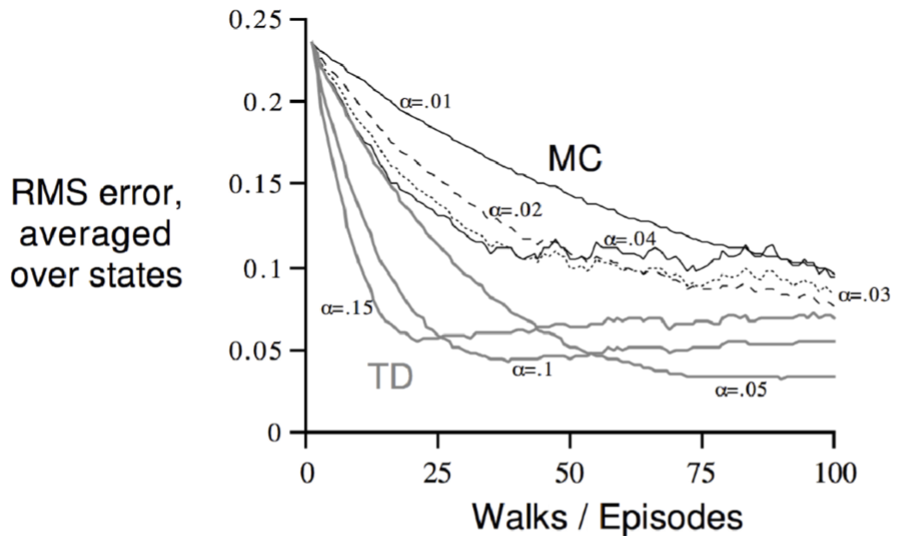

In the ${y}$ axis we have the total error over all states, which means "how much the function we estimated is wrong wrt to the true one".  
We can notice that we plot lines for both MC an TD and for different step sizes ${\alpha}$.  
We notice that TD does better than MC, doesn't matter how many episodes we run.  
We even notice that MC is noisier (more variance).

 
**Markov / non-Markov Environments**  

Last but non least: which of them takes advantage of the Markov property? (*the future is independent of the past given the present*). the short answer is: TD does, MC does not.

The long answer is: follow the example (we are almost done).

So far we have dealt with convergence given that we run a huge number of episodes:

${MC}$ and ${TD}$ converge: ${V(s) \to v_\pi(s)}$ as experience ${\to \infty}$.

But what if we can't run a huge number of episodes? what if we are provided with 8 episodes and we should learn only from them? In this case we would get a *batch* solution: we would repeatedly sample from our ${k}$ episodes to learn everything we can.

To get an intuition consider the following problem:

Each line corresponds to an episode, and each episode correspond to a sequence of states and rewards.  
if we run Monte-Carlo we would get ${V(A)=0}$ and ${V(B)=\frac{6}{8}}$. Why? In every episode we saw ${A}$ we got a total reward of ${0}$ (we visit it only in the first episode), so it makes sense that, even if we run 1000 times the first episode we would still get ${V(A)=0}$.  
This is a completely legit value for ${A}$.  
${V(B)=\frac{6}{8}}$ because, if we run ${k}$ times our 8 episodes, we get that ${6k}$ times out of the ${8k}$ we encountered ${B}$, we got a total reward of 1.

Now let's run ${TD(0)}$:  
${V(A)=\frac{6}{8}}$ and ${V(B)=\frac{6}{8}}$.  
Why? the return of ${A}$ has changed? you could see it like this:  
In ${TD}$, in the first episode, we have that
$$
V(A)\leftarrow V(A)+\alpha \bigg(r_{t+1}+\gamma V(B)-V(A)\bigg) \\
  V(A)\leftarrow V(A)+\alpha \bigg(0+\gamma V(B)-V(A)\bigg)
$$
the expected return of ${B}$ will become ${\frac{6}{8}}$ so ${V(A)}$ gets updated toward that value.  
${TD}$ is able to capture, *even in finite experience situations*, the Markov property.  
${TD}$, *even in finite experience situations*, is able to build an MDP model, ${MC}$ can't! 

This is what ${TD}$ builds:  

if you want to have a look to the math behind all of this here you are:  

MC would still capture partially the Markov property if it was given a higher number of episodes to deal with, but, since he can deal with just those 8 ones (and those 8 ones are not very representative of the model) it can't capture the structure of the MDP. 

**Function Approximation**

What is function approximation? well, in most cases we have tons and tons of states, and it's not very efficient to compute the value function of each single state, so with function approximation we mean that we compute an approximate value for some states' value function.

it's bad to use function approximation in TD because, once you update the value of a certain ${s}$, you need to update the linear equation that approximates the behavior of each value of ${V}$ wrt to the states ${s' \neq s}$.

Ok, we are done, what follows is a concise summary of the differences between the two algorithms:

 
**Concise Summary**

if you want to briefly answer the question you could probably just say the following:

- *MC*
  - **high variance, zero bias**
  - good convergence properties
  - converges even with function approximation
  - Not very sensitive to initial value
  - Very simple to understand and use
  - learns only from **complete** sequences
  - works only **offline**, must wait the end of an episode to be run
  - Must be run only for **episodic** environments
  - usually more effective in non-Markov environments $\to$ **does not exploit Markov property**
  - usually **less efficient** than TD because of higher variance.
- *TD*
  - **low variance, some bias**
  - ${TD(0)}$ converges to ${V_\pi(s)}$
  - doesn't always converge with function approximation
  - more sensitive to the initial value
  - learns even from **incomplete** sequences
  - can learn **online**, after every step
  - works for both **episodic** and c**ontinuing** environments (not necessary to know the final outcome)
  - usually more effective in Markov environments $\to$ **exploits Markov property**
  - usually **more efficient** than MC because of lower variance.

(  Sources: David Silver's Slides;  [David Silver's RL Lecture 04](https://www.youtube.com/watch?v=PnHCvfgC_ZA&t=1702s)  ) 

 
### On-Policy vs Off-Policy

***Describe the difference between on-policy and off-policy reinforcement learning techniques. Make an example of an on-policy algorithm and an example of an off-policy algorithm.***   
Let's first revise some concepts:  

- a  **probability distribution** is a mathematical function that provides the probabilities of occurrence of different possible outcomes in an experiment
- A **policy** ${\pi}$ is a distribution, a mapping, at any given point in time, from states to probabilities of selecting each possible action. It decides which action the agents selects, defining its behavior.    
  A more concise definition is the following:  
  A policy ${\pi}$ is a distribution over actions given the state:  
  ${\pi(a|s)= \mathbb{P} [a|s]}$   

The difference between Off and On policy techniques is the following:  
**On-policy learning** "learns on the job". The policy that I'm following is the policy that I'm learning about.   
It learns about policy ${\pi}$ from experience sampled from ${\pi}$ itself.   
An example of on-policy technique is  *SARSA Algorithm*.   

SARSA update function (on-policy):  
${Q(S_t,A_t)\leftarrow Q(S_t,A_t)+\alpha (\color{red} R_{t+1}+\gamma Q(S_{t+1},A_{t+1}) \color{black} -Q(S_t,A_t))}$  

**Off-policy learning** "learns over someone's shoulders". It learns about the **target policy** ${\pi(a|s)}$ while following a **behavior policy** ${\bar{\pi}(a|s)}$.  
Off policies learn from observing humans or other agents.  
They re-use experience generated from old policies ${\pi_1,\pi_2,...,\pi_{t-1}}$ in order to generate the new target policy ${\pi}$.

the best known example of why off-policy learning is used is the one regarding the exploration-exploitation tradeoff. We can follow an exploratory policy and at the same time learn about the optimal policy.  
Another interesting use of off-policy learning is wanting to learn about multiple policies while following one: there might be many different behaviors we want to figure out.

An example of off-policy technique is *Q-Learning*.  

*Q-Learning* update function (off-policy)  :  
${Q(S_t,A_t)\leftarrow Q(S_t,A_t)+ \alpha( \color{red} R_{t+1}+\gamma \max_{a' \in A}  Q(S_{t+1},a') \color{black} - Q(S_t,A_t))}$  

(Sources: PMDS Notes and [Model Free Algorithms](https://medium.com/deep-math-machine-learning-ai/ch-12-1-model-free-reinforcement-learning-algorithms-monte-carlo-sarsa-q-learning-65267cb8d1b4) )

 
### Eligibility Traces

***Describe what are eligibility traces and how they are used in the TD(λ) algorithm. Explain what happens when λ = 0 and when λ = 1.***   
If you are interested in the concise answer read from the section *Eligibility Traces* on.  
First of all let's give some contest. 
***TD(${ \lambda}$)***  
It's a Temporal Difference algorithm that consists in averaging over ${n}$-steps returns over different ${n}$. This is done in a weighted way, using the value ${ \lambda}$.

***Forward-View ${TD(\lambda) }$***

Forward-View is an offline algorithm ${\to}$ needs to run the entire episode.  
$$
V(s_t) \leftarrow V(s_t)+\alpha (v_t^\lambda -V(s_t))  
\\
v_t^\lambda=(1-\lambda)\sum_{n=1}^\infty \lambda^{n-1}v_t^{(n)}
$$
where
$$
v_t^{(\color{red}n\color{black})}=r_{t+1}+\gamma r_{t+2}+...+\gamma^{\color{red}n\color{black}-1}r_{t+\color{red}n\color{black}} +\gamma^{\color{red}n\color{black}}V(s_{t+\color{red}n}\color{black})
$$
  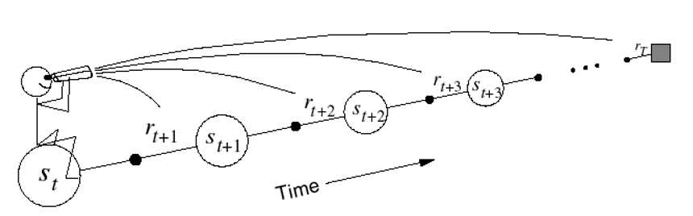

- Updates the value function towards the ${ \lambda}$ return 
- Forward-View looks into the future to compute the target ${v_t^\lambda}$
- Like MC, can only be compute from complete sequences

***Backward-View ${TD(\lambda)}$***

This is an online algorithm, so there is no need for the episodes to be complete.  

- It keeps an eligibility trace for every state ${s}$ (we'll explain them soon)

- It updates value ${V(s)}$ for every state ${s}$ in proportion to the ${TD}$-error ${\delta_t}$ (one-step error!) and the eligibility trace ${e_t(s)}$  
  $$
  \\
  V(s) \leftarrow V(s)+\alpha \delta_te_t(s)
  \\
  \ 
  \\
  \delta_t=R_{t+1}+ \gamma V(S_{t+1})-V(S_t)
  $$

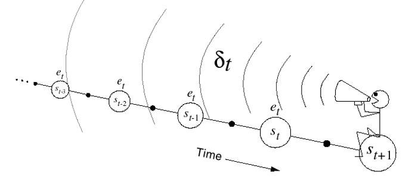

Intuition: imagine to be a rat, and you notice that usually, when a bell rings three times and the light of the room gets turned on, you get electrocuted.  

It has many advantages:

- It updates the weight vector on every step of an episode rather than only at the end, and thus its estimates may be better sooner.
- Its computations are equally distributed in time rather than all at the end of the episode. 
- It can be applied to continuing or incomplete episodes problems rather than just complete episodes problems.

How to do it?

Thanks to Eligibility Traces. 

***Eligibility Traces***

Eligibility Traces are used in Backward-View ${TD(\lambda)}$ algorithms, both for prediction and control.   
An *Eligibility Trace* is a short-term memory vector${\mathbf{e}_t \in \R^d}$ .  
When a state is visited, the corresponding component of ${\mathbf{e}_t}$ is bumped up and than begins to fade away. So, for a given state ${s}$ , the update of ${V(s)}$ will occur in proportion to the ${TD}$-error ${\delta_t}$ and to the eligibility trace ${e_t(s)}$.  
The *trace-decay* parameter ${\lambda}$ determines the rate at which the trace falls.  
$$
e_0(s)=0 
\\
e_t(s)=\gamma\lambda e_{t-1}(s)+ \mathbf{1}(s=s_t)
\\
\ 
\\
\delta_t=R_{t+1}+ \gamma V(S_{t+1})-V(S_t)
\\
\
\\
\color{blue} 
V(s) \leftarrow V(s)+\alpha \delta_te_t(s)
$$
The pseudo-code for ${e_t(s)}$ says that ${e(t)}$ decays of a factor ${\gamma \lambda}$ when it's not visited, but, when it's visited, it does decay of that same factor and at the same time gets incremented by ${1}$.

The eligibility trace keeps track of which states have contributed, positively or negatively, to recent state valuations, by combining both *frequency heuristics* (assign credit to the most frequent states) and *recency heuristics* (assign credit to the most frequent states).  
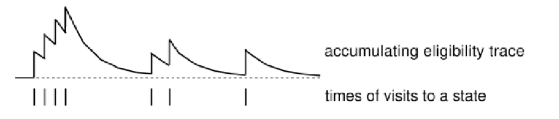

***What happens for ${\lambda=0}$ and ${\lambda=1}$?***

*${\lambda=0}$*:  
When ${ \lambda=0}$, only the current state gets updated.  
$$
e_t(s\neq s_t)= \gamma \cdot0\cdot e_{t-1}(s)+0=0 
\\
e_t(s=s_t)=\gamma\cdot 0 \cdot e_{t+1}(s)+1=1
\\
V(s) \leftarrow V(s)+\alpha \delta_te_t{(s)} \ \ \ \ \ \ \ \ \ \ \ \  \ \forall s
$$
Which is exactly equivalent to ${TD(0)}$'s  update:  
$$
V(s) \leftarrow V(s)+\alpha \delta_t \ \ \  \ \ \ (s=s_t)​
$$
*${\lambda=1}$*:    

It's roughly equivalent to Every-Visit Monte-Carlo, we'll see why.  
Consider an episode where any state ${s}$ is visited at time-step ${k}$.  
${TD(1)}$ eligibility trace for ${s}$ gets discounted from the moment it's visited ${(t=k)}$:
$$
e_t(s)=\gamma e_{t-1}(s)+\mathbf{1}(s_t=s) 
\\
= \begin{cases}
0 \ \ \ \ \ \  \ \ \ if \ \  \ t<k
\\
1 \ \ \ \ \ \ \ \  \  if \ \ \ t=k
\\
\gamma^{t-k} \ \ \ \  if \ \ \ t>k

\end{cases}
$$
The second and third case can be merged:  ${e_t(s)=\gamma^{t-k} \ \ \ \ if \ \ \ t \ge k}$, I wrote it like that just because I think it's more intuitive. 

So ${TD(1)}$ updates accumulate errors *online*
$$
\sum_{t=1}^{T-1}\alpha \delta_t e_t(s)=\alpha \sum_{t=k}^{T-1}\gamma^{t-k}\delta_t=\alpha (G_k-V(s_k))
$$
How did we get to the last equation? let's see:  
By the end of the episode it accumulates the total error:
$$
\delta_k+\gamma\delta_{k+1}+\gamma^2\delta_{k+2}+...+\gamma^{T-1-k}\delta_{T-1}
$$
Just by rearranging such total error  we understand that, for  ${\lambda=1}$, the sum of TD errors telescopes into ${MC}$ error.
$$
\delta_k+\gamma\delta_{k+1}+\gamma^2\delta_{k+2}+...+\gamma^{T-1-k}\delta_{T-1} \\
=R_{t+1}+\gamma V(s_{t+1})-V(s_t) 
\\
+\gamma R_{t+2}+\gamma^2 V(s_{t+2})-\gamma V(s_{t+1})
\\
+ \gamma ^2 R_{t+3} + \gamma^3 V(s_{t+3})-\gamma^2 V(s_{t+2})

\\
\vdots
\\

\gamma^{T-1-t}R_T
+\gamma^{T-t}V(s_t)-\gamma^{T-1-t}V(s_{t-1})
\\
=R_{t+1}+\gamma R_{t+2}+\gamma^2R_{t+3}+...+\gamma^{T-1-t}R_t-V(s_t)
\\
=G_t-V(s_t)
$$
So ${TD(1)}$ is roughly equivalent to every-visit Monte-Carlo. Why roughly? because the total error is accumulated online, step-by-step.  
If the value function was updated offline, at the end of the episode, then the total update would have been exactly the same as MC.  

Important observation (not needed for answering the question though):  
*The sum of offline updates is identical for forward-view and backward-view ${TD(\lambda)}$*  
$$
\sum_{t=1}^T\alpha \delta_te_t(s)=\sum_{t=1}^{T}\alpha \bigg(v_t^\lambda -V(s_t)\bigg)\mathbf{1} (s_t=s)
$$
(Sources: David Silver's Slides on Prediction - Restelli's Slides on Finite MDPs)

 
### Q-Learning vs SARSA

***Describe the differences existing between the Q-learning and SARSA algorithms***  
First of all, let's say what they are used for:  
*SARSA* and *Q-Learning* are two algorithms used to do control using the model free method called *Temporal Difference*.   
If you don't remember what a control task is, here you are:   
*Control is the task of obtaining an improved policy ${\pi'}$ starting from a policy ${\pi}$.*  
Now let's jump into the differences:  
Q-Learning is an example of off-policy learning, while SARSA is an example of on-policy learning.   
It implies that    

- Q-learning uses a target policy $\pi$  (which is greedy) to choose the best next action ${a'}$ while following a behavior policy  $\bar{\pi}$ (which is ${\epsilon}$-greedy). this means off-policy.
  ${Q(S_t,A_t)\leftarrow Q(S_t,A_t)+ \alpha \big( \color{red} R_{t+1}+\gamma \max_{a' \in A}  Q(S_{t+1},a') \color{black} - Q(S_t,A_t)\big)} $   

  

- SARSA learns the optimal Q-value based on the actions performed following its own policy. this means on-policy. 
  ${Q(S_t,A_t)\leftarrow Q(S_t,A_t)+\alpha (\color{red} R+\gamma Q(S_{t+1},A_{t+1}) \color{black} -Q(S_t,A_t))}$   

If you want to get a full understanding of both algorithms, here you are:

***SARSA Algorithm***  

  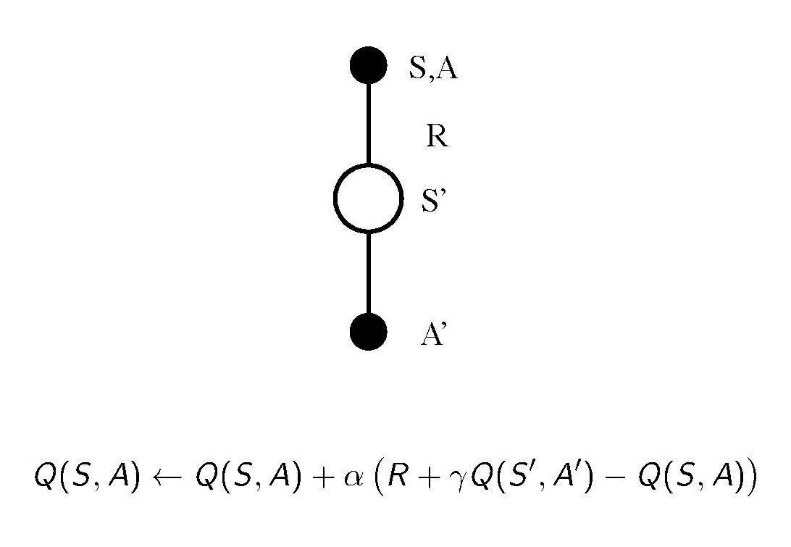

It's called SARSA because the agent starts in ${S}$, performs action ${A}$ following its own policy.   
Afterwards, we are going to randomly sample from our environment to see what reward ${R}$ we receive and that state ${S'}$ we end up in.  
then we are going to sample again from our policy to generate ${A'}$.  
So basically, SARSA, indicates a particular update pattern we can use.  
*Updating ${Q}$ functions with SARSA*:  
${Q(S,A)\leftarrow Q(S,A)+\alpha (\color{red} R+\gamma Q(S',A') \color{black} -Q(S,A))}$

We move our ${Q}$ value a little bit in the direction of our TD target (the red colored part) minus the ${Q}$ value of where we started.  
This update is done after every transition from a nonterminal state ${s}$. If ${s'}$ is terminal, then ${Q(s',a')}$ is zero.

*Policy Improvement/ Control with SARSA*:  
Ok, so far we just evaluated our ${Q}$ function. Implicitly we did Policy Evaluation. How do we do Policy Improvement when we apply SARSA?

we simply use an ${\epsilon}$- greedy policy improvement:  

- All ${m}$ actions are tried with non-zero probability.
- With probability ${1-\epsilon}$ we choose the greedy action
- With probability ${\epsilon}$ we choose an action at random (possibly we select the greedy one!)

$$
  \pi(s,a)=\begin{cases}\frac{\epsilon}{m}+1-\epsilon  \ \ \ \ if \ \    a^*=arg\max_{a\in A} Q(s,a) \\
  \frac{\epsilon}{m} \ \ \ \ \ \ \ \ \ \ \ \ \ \ \ \ \ otherwise\end{cases} 
$$

Complete algorithm for SARSA:

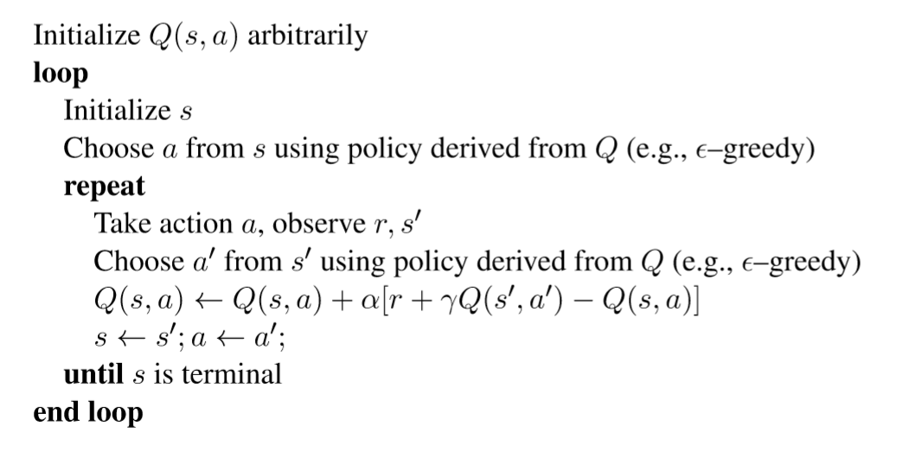

***Q-Learning***  

Consider being in state ${S_t}$ and selecting our next action following our behavioral policy: ${A_{t+1}\sim \bar{\pi}(\cdot |S_t)}$.  
In the meanwhile consider some alternative successor action that we might have taken following our target policy ${A'\sim\pi(\cdot|S_t)}$. 
Finally we update our ${Q}$-value for the state we started in and the action that we actually took (${Q(S_t,A_t)}$) towards the value of our alternative action ${A'}$. 

${Q(S_t,A_t)\leftarrow Q(S_t,A_t)+ \alpha( \color{red} R_{t+1}+\gamma Q(S_{t+1},A') \color{black} - Q(S_t,A_t))}$

${S_t}$ = actual state  
${A_t}$= actual action taken following behavioral policy ${\pi}$.   
${\alpha}$ = learning rate  
${R_{t+1}}$ = actual reward taken by performing ${A_t}.$    

${\gamma}$ = discounting factor.  
${S_{t+1}}$= successor state.

${A'}$ = action sampled from our target policy in state ${S_t}$. 

A special case of this updating process is the Q-Learning algorithm.  
In this case, the target policy ${\pi}$ is a greedy policy wrt ${Q(s,a)}$ and the behavior policy ${\bar{\pi}}$ is ${\epsilon}$-greedy wrt ${Q(s,a)}$.
$$
\pi(S_{t+1})=\arg\max_{a'}Q(S_{t+1},a')
$$
Let's update the new estimation of the final return:
$$
R_{t+1} +\gamma Q(S_{t+1},A')=          \ \ \ \ \ \ \ \ \ \ \ \ \ \ \ \ \ \ \ \ \ \ \ \ \ \ \ \
$$

$$
R_{t+1}+\gamma Q(S_{t+1},\arg\max_{a'}Q(S_{t+1},a') )=
$$

$$
R_{t+1}+\max_{a'} \gamma Q(S_{t+1},a') \ \ \ \ \ \ \ \ \ \ \ \ \ \ \ \ \ \ \ \ \ \ \ \ \ \ \
$$

If we plug this estimation in the general Q update equation I described earlier, just by replacing the  
old red colored component with the new one, we obtain the Q-update equation for Q-Learning:     
$$
Q(S_t,A_t)\leftarrow Q(S_t,A_t)+ \alpha \big( \color{red} R_{t+1}+\gamma \max_{a' \in A}  Q(S_{t+1},a') \color{black} - Q(S_t,A_t)\big)
$$
Complete algorithm for Q-Learning:

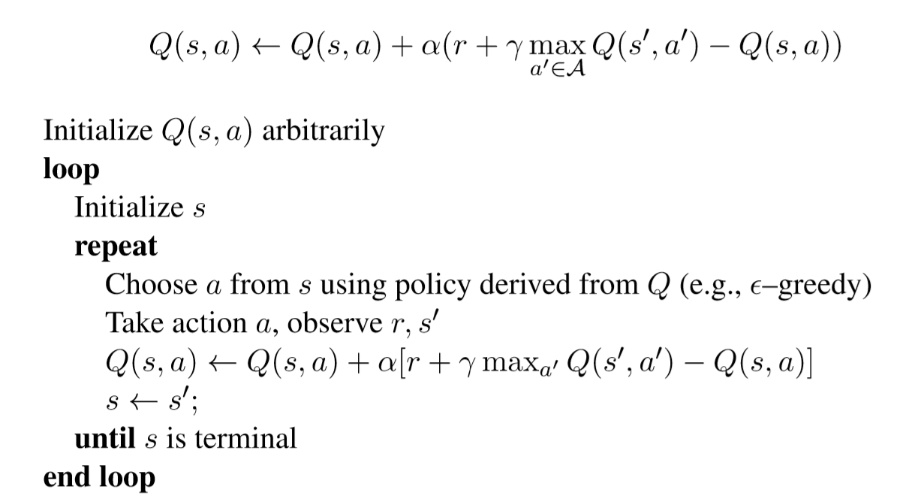

(Sources: [Model Free Algorithms](https://medium.com/deep-math-machine-learning-ai/ch-12-1-model-free-reinforcement-learning-algorithms-monte-carlo-sarsa-q-learning-65267cb8d1b4) - [Deep Mind Model Free Control](https://www.youtube.com/watch?v=0g4j2k_Ggc4&list=PLqYmG7hTraZDM-OYHWgPebj2MfCFzFObQ&index=5) )

 
### UCB1 Algorithm 

***Describe the UCB1 algorithm. Is it a deterministic or a stochastic algorithm?***

This is a complete derivation of the algorithm, refer to the document *Reinforcement_Learning_SHORT* for a concise answer.  
UCB1 is an algorithm to solve stochastic MAB problems via a frequentist approach.  
Frequentist means that the rewards associated with each action are unknown parameters, and that we select an arm through a policy based on the observation history.  
The more we are uncertain on a specific choice, the more we want the algorithm to explore that option.

In UCB1, what we do is instead of using the empirical estimate of each reward associated with an action $(\hat{R}(a_i))$, we consider an upper bound $U(a_i)$ over the expected value of $R(a_i)$.  
More formally, we need to compute an upper bound:
$$
U(a_i):= \hat{R}_t(a_i)+B_t(a_i)\ge R(a_i)
$$
Let's call $N_t(a_i)$ the number of times I've performed action $a_i$ during my history.

Small $N_t(a_i)$ implies a large $U(a_i)$ which means that  the estimated value $\hat{R}_t(a_i)$ is ***uncertain***.  
Large $N_t(a_i)$ implies a small $U(a_i)$, which means that the estimate value $\hat{R}_t(a_i)$ is ***accurate***.

Let's now introduce briefly the *Hoeffding Inequality Bound* says that:  
Let $X_1,...,X_t$ be i.i.d. random variables with support in $[0,1]$ and identical mean $\mathbb{E}[X_i]=:X$ and let $\bar{X}_t=\frac{\sum_{t=1}^tX_i}{t}$ be the sample mean. then:  
$$
\mathbb{P}(X>\bar{X}_t+u)\le e^{-2tu^2}
$$

We'll now apply the *Hoeffding Inequality Bound* to the upperbound corresponding to each arm.  
$$
\mathbb{P}(R(a_i)>\bar{R}_t(a_i)+B_t(a_i))\le e^{-2N_t(a_i)B_t(a_i)^2}
$$
Now let's compute such upperbound:
$$
e^{-2N_t(a_i)B_t(a_i)^2}=p
$$

$$
B_t(a_i)=\sqrt{\frac{-\log p}{2N_t(a_i)}}
$$

Let's reduce $p$ over time $\to p=t^{-4}$
$$
B_t(a_i)=\sqrt{\frac{2\log t}{N_t(a_i)}}
$$
Now we can talk about the algorithm:

***UCB1 Algorithm***

For each time step $t$:

1. Compute $\hat{R}_t(a_i)=\frac{\sum_{i=1}^tr_{i,t}\mathbf{1}\{a_i=a_{it}\}}{N_t(a_i)} \ \forall a_i $
2. Compute $B_t(a_i)=\sqrt{\frac{2\log t}{N_t(a_i)}} \ \forall a_i$
3. Play arm $a_{it}=\arg \max_{a_i\in A}{\bigg(\hat{R}_t(a_i)+B_t(a_i)\bigg)}$

*Theorem*:

*At finite time $T$, the expected total regret of the UCB1 algorithm applied to a stochastic MAB problem is*
$$
L_t\le8\log{T}\sum_{i|\Delta_i>0}\frac{1}{\Delta_i}+\bigg(1+\frac{\pi^2}{3}\bigg)\sum_{i|\Delta_i>0}\Delta_i
$$
where $\Delta_i=R^*-R(a_i)$, and $R^*$ is the reward obtained by performing the best action.

The first term of the sum signifies that we expect to play any suboptimal machine about a logarithmic number of times, roughly scaled by how hard it is to distinguish from the optimal machine. That is, if  is small we will require more tries to know that action  is suboptimal, and hence we will incur more regret. The second term represents a small constant number (the  part) that caps the number of times we’ll play suboptimal machines in excess of the first term due to unlikely events occurring. So the first term is like our expected losses, and the second is our risk.

(Source: Restelli's Slides - [JeremyKun](https://jeremykun.com/2013/10/28/optimism-in-the-face-of-uncertainty-the-ucb1-algorithm/) )

 
# Interesting Articles

- [Model Based Algorithms](https://medium.com/deep-math-machine-learning-ai/ch-12-reinforcement-learning-complete-guide-towardsagi-ceea325c5d53)
- [Model Free Algorithms](https://medium.com/deep-math-machine-learning-ai/ch-12-1-model-free-reinforcement-learning-algorithms-monte-carlo-sarsa-q-learning-65267cb8d1b4)
- [Q-Learning (and Policy Gradients)](https://medium.com/deep-math-machine-learning-ai/ch-13-deep-reinforcement-learning-deep-q-learning-and-policy-gradients-towards-agi-a2a0b611617e)

