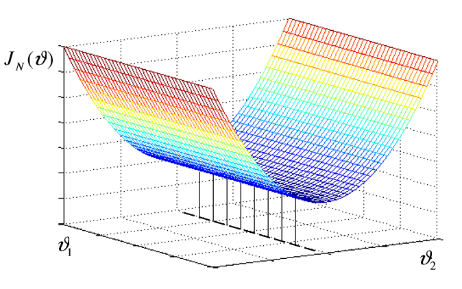
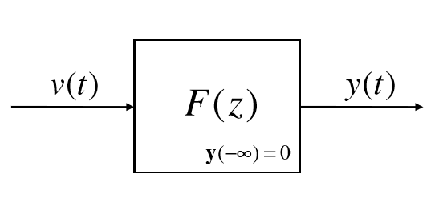
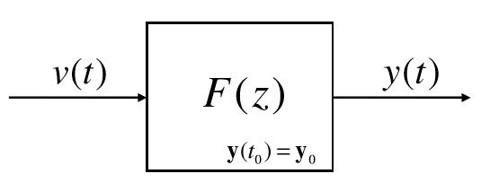

## Model Identification 

*A series of notes on the "Identificazione dei modelli" course as taught by Simone Garatti (maybe?) during the first semester of the academic year 2018-2019 at Politecnico di Milano.*

#### Formulas & Ass-Savers

* *Magic formulas:*

$$
e^{jw}+e^{-jw} =2cos(w)
$$

- *Canonical Form*:
  - Numeratore e Denominatore dello *stesso grado*
  - Numeratore e Denominatore *monici*
  - Numeratore e Denominatore *asintoticamente stabili*
  - Numeratore e Denominatore *coprimi* 

- *Trick n°1*:

$$
\eta(t)\sim WN(\mu,\sigma^2)\\
\frac{1+az^{-1}}{1+\frac{1}{a} z^{-1}}\eta(t)=\frac{z+a}{z+\frac{1}{a}}\eta(t)=e(t)\\
e(t)\sim WN(\ \mu\cdot a\ ,\ \sigma^2\cdot a^{2})
$$

- *Trick n°2*:
  $$
  \eta(t)\sim WN(\mu,\sigma^2)\\
  k\cdot\eta(t)=e(t)\\
  e(t)\sim WN(\ \mu\cdot k\ ,\ \sigma^2\cdot k^{2})
  $$

- *Filtro passa-tutto*:

$$
\frac{1}{a}\frac{z+a}{z+\frac{1}{a}}
$$

1. Spettro di uscita identico allo spettro di ingresso.
2. Per noi due processi con lo stesso spettro sono equivalenti.

- *Long Division*:
  $$
  y(t)=\frac{C(z)}{A(z)}e(t)=\frac{1+\frac{1}{4}z^{-1}}{1+\frac{1}{2}z^{-1}}e(t)\\
  $$

  - *one - step*

    ```
    			         1 + 1/4 z^(-1)   |  1 + 1/2 z^(-1)
    		         - ( 1 + 1/2 z^(-1) ) |________________
      	             _____________________|  1
          	               - 1/4 z^(-1)   | {E(z)}
                            {F(z) z^(-k)} |
    ```

  - *two - step*

    ```
    			         1 + 1/4 z^(-1)   |  1 + 1/2 z^(-1)
    		         - ( 1 + 1/2 z^(-1) ) |________________
      	             _____________________|  1 - 1/4 z^(-1)
          	               - 1/4 z^(-1)   | {E(z)}
           - (- 1/4 z^(-1) - 1/8 z^(-2) ) |
           _______________________________|
                             1/8 z^(-2)   |
                            {F(z) z^(-k)} |
    ```

    $$
    C(z)=E(z)\cdot A(z)+F(z)z^{-k} \\
    \frac{C(z)}{A(z)} = E(z) +\frac{F(z)z^{-k}}{A(z)}
    $$

    

- *one-step predictor fast formulas*:

  from

$$
y(t)=\frac{C(z)}{A(z)}e(t)
$$

​	we obtain
$$
\hat{y}(t|t-1)=\frac{C(z)-A(z)}{C(z)}y(t)\ \ \ \ \ \ \text{from the data}\\
\hat{y}(t|t-1) =\frac{C(z)-A(z)}{A(z)}e(t)\ \ \ \ \ \ \text{from the noise}
$$

- *error prediction variance*:
  $$
  \mathbb{E}\left[(y(t)-\hat{y}(t|t-1))^2\right] = \mathbb{E}\left[(E(z)e(t))^2\right]
  $$

- *what to do before computing the optimal predictor*

  - depolarize everything
  - check if both the numerator and the denominator are asymptotically stable

- Per modelli $AR$ E $ARX$ la funzione di costo $J(a) = \frac{1}{N}\sum_{t=1}^{N}(y(t)-y(t|t-1;a))^2$ è quadratica.

- Relazione tra Spettro e Funzione di Covarianza
  $$
  \Gamma_y(\omega)=\sum_{\tau=-\infty}^{\infty}\gamma_y(\tau)e^{-j\omega\tau}\\
  \Gamma_y(\omega)=\left|FDT\right|^2\cdot\mathbb{E}[e(t)^2]\\
  \gamma_y(\tau)=\frac{1}{2\pi}\int_{-\pi}^{\pi}\Gamma_y(\omega)e^{j\omega \tau}d\omega\ 
  $$
  


### Exam Questions

- ***Si dia la definizione di un processo $MA(\infty)$ e si discutano le condizioni affinchè tale processo sia stazionario e ben definito. Dimostrare la formula per il calcolo della funzione di covarianza di un processo $MA(\infty)$. Spiegare infine perchè questi processi sono d'interesse nello studio dei processi $AR$ e $ARMA$.*** 
  $$
  y(t) = c_0e(t)+c_1e(t-1)+\dots+c_ie(t-i)+\dots=\sum_{i=0}^{\infty}c_ie(t-i)\\
  e(t)\sim WN(0,\lambda^2)
  $$
  Assumption to guarantee that $y(t)$ is well defined:
  $$
  \sum_{i=0}^{\infty}c_i^2<\infty
  $$

  - *Mean*

  $$
  m_y(t)=E[y(t)]=E\left[\sum_{i=0}^{\infty}c_ie(t-i)\right] = \sum_{i=0}^{\infty}c_iE[e(t-i)]= 0
  $$

  - *Covariance Function*

  $$
  \gamma_y(t,t) = E[y(t)^2]=E\left[\sum_{i=0}^{\infty}c_ie(t-i)\sum_{j=0}^{\infty}c_je(t-j)\right] = E\left[\sum_{i,j=0}^{\infty}c_ic_je(t-i)e(t-j)\right] = \\\sum_{i,j=0}^{\infty}c_ic_jE\left[e(t-i)e(t-j)\right] \\
  \text{since $e(t)\sim WN(0,\lambda^2)$ we end up with:}\\
  \gamma_y(t,t) = \sum_{i=0}^{\infty}c_i^2\lambda^2
  $$

  Hence, if $\sum_{i=0}^{\infty}c_i^2 < \infty$ , $\gamma(t,t)$ *is well defined* and
  $$
  \gamma_y(t,t) = \gamma_y(0) = \sum_{i=0}^{\infty}c_i^2\lambda^2=(c_0^2+c_1^2+\dots)\cdot\lambda^2
  $$
  Instead
  $$
  \gamma_y(t,t-\tau) = E[y(t)y(t-\tau)]= E\left[\sum_{i=0}^{\infty}c_ie(t-i)\sum_{j=0}^{\infty}c_je(t-j-\tau)\right]= \\
  E\left[\sum_{i,j=0}^{\infty}c_ic_je(t-i)e(t-j-\tau)\right] = \sum_{i,j=0}^{\infty}c_ic_jE\left[e(t-i)e(t-j-\tau)\right] =\\
  \text{since $e(t)\sim WN(0,\lambda^2)$ we have that:}\\
   \\
  \begin{equation}
      E\left[e(t-i)e(t-j-\tau)\right] =
      \begin{cases}
        \lambda^2, & \text{if}\ i=j+\tau \\
        0, & \text{if }i \neq j+\tau
      \end{cases}
    \end{equation}
  $$
  So:
  $$
  \gamma_y(t,t-\tau) = \sum_{j=0}^{\infty}c_{j+\tau}c_j\cdot E[e(t-j-\tau)^2] = \sum_{j=0}^{\infty}c_{j+\tau}c_j\cdot\lambda^2
  $$
   if $\sum_{i=0}^{\infty}c_i^2 < \infty$ ,  then $\sum_{j=0}^{\infty}c_{j+\tau}c_j$ converges and  $\gamma(t,t-\tau)$ *is well defined* and dependes *only* (!) on $\tau$.

  In conclusion, if $\sum_{i=0}^{\infty}c_i^2 < \infty$ , then $MA(\infty)$ is well defined and is a *s.s.p*. (Stationary *Stochastic* Processes)

  *Remember:* a Stochastic Processes is called *Stationary* (wide sense) if:

  - $m(t) = m \ \ \forall{t}$
  - $\gamma(t_1,t_2)$ depends on $\tau = t_1-t_2$ *only*.  $\forall{t_1,t_2,t_3,t_4}\ \ \ \ (t_1-t_2=t_3-t_4)$

  

  **Let's talk now about $AR$ processes:**
  $$
  y(t)=a_1y(t-1)+a_2y(t-2)+\dots+a_my(t-m)+e(t)\ \ \ \ \ \ \ \ e(t)\sim WN(\mu,\lambda^2)
  $$
  Example: 
  $$
  AR(1):\\
  y(t) = ay(t-1)+e(t)\\
  y(t) = e(t)+a\cdot e(t-1)+a^2 \cdot y(t-2)\\
  \cdots\\
  y(t) = e(t)+a\cdot e(t-1)+a^2 \cdot e(t-2)+\dots a^{t-t_0}y(t_0)\ \ \ \ \ \ \ \ y(t_0) = 0\ \ \ t_0 \to \infty\\
  y(t)=\sum_{i=0}^{\infty}a^ie(t-i)
  $$
  In general $AR$ processes are $MA(\infty)$ processes with coefficients determined by the $AR$ model coefficients by recursively applying the difference equation. 

  **Let's talk now about $ARMA$ processes:**
  $$
  y(t) = a_1y(t-1)+a_2y(t-2)+\dots+a_my(t-m) +\\c_0e(t)+c_1e(t-1)+\dots+c_ne(t-n)\\
  e(t) \sim WN(\mu,\lambda^2)
  $$
  Again, by $ARMA$ process we mean the *steady-state* solution obtained by letting $y(-\infty) = 0$. Similarly to $AR$ processes, the stead-state solution is a $MA(\infty)$ process whose coefficients are obtained from the $ARMA$ model coefficients by recursively applying the difference equaiton.

  ***Observation***:

  $MA(\infty)$ processes are very general, they almost cover the class of stationary stochastic processes (i.e. apart from few exceptions, all *s.s.p* can be written as $MA(\infty)$ ).

  However, $MA(\infty)$ are difficult to handle since there are infinite coefficients and, moreover, the computation of the covariance function requires the computation of the sum of an infinite series (hard in general)

- ***Si discuta a riguardo della conergenza asintotica (al tendere del numero di dati all'infinito) dei parametri dei modelli identificati mediante il metodo PEM (Prediction Error Minimization) nell'ipotesi che i processi d'ingresso e di uscita siano stazionari e generati da un sistema lineare.***

  PEM identification:

  - Collect INPUT/OUTPUT measurements
    $$
    \begin{equation}
        \begin{cases}
      y(1), y(2), \dots,y(N) & \\
      u(1), u(2), \dots,u(N) 
    \end{cases}
    
      \end{equation}
    $$

  - Select a suitable ($ARMAX$) model class $\mathcal{M}(\theta) = \{M(\theta),\theta\in \Theta \subseteq\mathcal{R}^{n_\theta} \}$ where $\Theta$ is the set of admissible values for the *parameter* vector $\theta$

  - Find the optmal model parameter $\hat{\theta}_N$ minimizing the empirical prediction error variance:
    $$
    \hat{\theta}_N = \underset{\theta}{\mathrm{argmin}}\{J_N(\theta)\}\\
    \text{where } J_N(\theta) = \frac{1}{N}\sum_{i=0}^{N}\varepsilon(t,\theta)^2
    $$
    Main question: is $\mathcal{M} (\hat{\theta}_N)$ a good model for the process $y(t)$ ?

    Very difficult to give an answer when $N$ is finite! Yet, we can give an *asymptotic* answer, for $N\to\infty$, i.e.  $\mathcal{M} (\hat{\theta}_N)$ is a good model provided that $N$ is large enough.

    *Assumption*: input and output processes are *stationary* and generated from a *linear system*:
    $$
    \begin{equation}
        s :
        \begin{cases}
          y(t) = G(z)u(t)+H(z)e(t)& \\
          u(t) = F(z)r(t)+S(z)e(t) 
        \end{cases}
      \end{equation}\ \ \ \ e(t) \sim WN(0,\lambda^2)\ \ \ r(t) \sim WN(0,\sigma^2)
    $$
    where $G(z),H(z),F(z),S(z)$ are stable rational transfer functions.

    The measured data sequence corresponds *to a particular realization* of INPUT/OUTPUT signals os $s$.
    $$
    \begin{equation}
        
        \begin{cases}
          y(1), y(2), \dots,y(N) & \\
          u(1), u(2), \dots,u(N) 
        \end{cases}
       \implies 
        \begin{cases}
          y(1,\overline{s}), y(2,\overline{s}), \dots,y(N,\overline{s}) & \\
          u(1,\overline{s}), u(2,\overline{s}), \dots,u(N,\overline{s}) 
        \end{cases}
      \end{equation}
      
    $$
    Hence, the identification criterion *depends on te particular realization* which has been measured!
    $$
    J_N(\theta,\overline{s}) = \frac{1}{N}\sum_{t=1}^{N}\varepsilon(t,\theta,\overline{s})^2\\
    \hat{\theta}_N \implies\hat{\theta}_N(\overline{s}) \ \ \ \text{ it depends on the realization too!}
    $$
    

    If we go futrher the special problem at hand, $J_N(\theta,\overline{s})$ should be thought of as a bunch of curves and $\hat{\theta}_N(\overline{s})$ as a set of points. $\implies\ $very complicated to descrie when for finite $N$ !

    But as $N\to\infty$ the curves corresponding to different realizations of $J_N(\theta,s)$ *shrinks* to a single (*asymptotic*) curve, and correspondingly, the points of minimum $\hat{\theta}_N(s)$ get closer and closer.

    

    ***Theorem***: 

    *Under the current assumptions, as the number of data points becomes larger and larger, we have with probability one that*
    $$
    J_N(\theta,s) \underset{N\to\infty}{\to}\overline{J}(\theta) = E[\varepsilon(t,\theta)^2]\\
    $$
    *Moreover, by letting*
    $$
    \Delta = \{\theta^{*}:\overline{J}(\theta^{*})\le\overline{J}(\theta),\forall\theta\}
    $$
    *be the set of global minimum points of $\overline{J}(\theta)$, we have, with probability one, that:*
    $$
    \overline{\theta}_N(s)\underset{N\to\infty}{\to}\Delta
    $$
    The theorem says that the result of PEM identification is the same, independently of the measured realizations of process $y(t),u(t)$ *as long as $N$ is large enough*. Hence, instead of studying the quality of identified models for finite $N$, we can easily evaluate their *asymptotic* quality, i.e. is $\mathcal{M}(\theta^{*})$ a good model? If the answer is yes, then we can infer that $\mathcal{M}(\overline{\theta}_N)$ is also good, *as long as $N$ is large enough*.

    

- ***Se $y(t)=W(z)e(t)\ \ \ e(t)\sim WN(0,1)$ , dove $W(z)$ è una funzione di trasferimento razionale con zeri sul bordo del cerchio di raggio unitario nel piano complesso, allora è possibile calcolare il predittore ottimo di $y(t)$ dal rumore, ma non dai dati.* **

  - [x] *True*
  - [ ] *False*

  Motivation:

  Predictor from the noise:
  $$
  y(t) = W(z)e(t)=\frac{C(z)}{A(z)}e(t)
  $$
  This is always true provided that $W(z)$ is asymptotically stable.

  We can reconstruct $e(t)$ if and only if:

  - $y(t)$ is a *canonical* representation of the ARMA process $y(t)$
  - $W(z)$ has no zeroes on the unit circle boundary.

  If these two conditions are satisfied then the inverse function $W(z)^{-1}=\frac{A(z)}{C(z)}$ is asymptotically stable too, and the noise $e(t)$ can be reconstructed based on past values of the ouput.
  $$
  e(t)=W(z)^{-1}y(t) = \overline{w_0}y(t) + \overline{w_1}y(t-1) + \overline{w_2}y(t-2) +\dots
  $$

- ***Si consideri l'identificazione PEM (cifra di costo : $\frac{1}{N}\sum_{i=1}^{N}(y(i)-\hat{y}(i|i-1))^2$) di modelli ARX ($\hat{y}(i|i-1) = \theta^T\varphi(i)$). Dire che cosa si intende per equazioni normali del metodo dei minimi quadrati. Derivare rali equazioni e discutere sull'unicità/non unicità della soluzione.***

  PEM identification criterion:
  $$
  J_N(\theta)= \frac{1}{N}\sum_{i=1}^{N}(y(i)-\hat{y}(i|i-1,\theta)) = \frac{1}{N}\sum_{i=1}^{N}\varepsilon(i,\theta)^2
  $$
  i.e. is the empirical variance of the prediction error (global performance index with respect of all available data)

  PEM best model:
  $$
  \hat{\theta}_N=\underset{\theta \in \Theta}{\text{argmin}}\ J_N(\theta)=  \underset{\theta \in \Theta}{\text{argmin}}\ \frac{1}{N}\sum_{i=1}^{N}\varepsilon(i,\theta)^2
  $$
  Underlying idea: if $\mathcal{M}(\hat{\theta}_N) = s$ i.e. the *true* sysem was perfectly identified, we would have $\varepsilon(t,\hat{\theta}_N) = e(t)$ and $\lambda^2 = E[\varepsilon(t,\hat{\theta}_N)^2]$ .

  Generic *ARX* model:
  $$
  \mathcal{M}(\hat{\theta}_N):\ \ y(t) = \frac{B(z)}{A(z)}u(t-d)+\frac{1}{A(z)}e(t)\ \ \ \ \ e(t) \sim WN(0,\lambda^2) \\
  A(z) = 1-a_1z^{-1}-a_2z^{-2}-\dots-a_mz^{-m} \\
  B(z) = b_1 + b_2z^{-1}+b_3z^{-2}+\dots+b_pz^{-p+1} \\
  \theta = \left[a_1,\dots,a_m,b_1,\dots,b_p\right]^T\text{ (column vector of dimension $n_{\theta}=m+p$)}\\
  \mathcal{M}(\theta): y(t) = (1-A(z))y(t)+B(z)u(t-d)+e(t) \\
  y(t) = (a_1z^{-1}+\dots+a_mz^{-m})y(t)+(b_1 + b_2z^{-1}+\dots+b_pz^{-p+1})u(t-d)+e(t)\\
  y(t) = \underset{\text{predictable at time $t-1$}}{\underbrace{a_1y(t-1)+\dots+a_my(t-m)+b_1u(t-d)+\dots+b_pu(t-q)}}+\underset{\text{unpredictable at time $t-1$}}{\underbrace{e(t)}}\\
  $$
  Where $q = d+p-1$ .

  Models in prediciton form:
  $$
  \hat{\mathcal{M}}(\theta): \left\{a_1y(t-1)+\dots+a_my(t-m)+b_1u(t-d)+\dots+b_pu(t-q)\right\}
  $$
  We define
  $$
  \varphi(t) = \left[y(t-1),\dots ,y(t-m),u(t-d),\dots,u(t-q)\right]^T \text{ (column vector of dimension $n_{\theta}=m+p$)}
  $$
  *regression vector*

  Then
  $$
  \hat{\mathcal{M}}(\theta):\hat{y}(t|t-1,\theta) = \theta^T\varphi(t) = \varphi(t)^T\theta
  $$
  Observation: $\hat{y}(t|t-1,\theta)$ depends linearly on $\theta$ , $J_N(\theta)$ is a quadratic function! ($\implies$ the minimum can be explicity computed!)
  $$
  J_N(\theta) = \frac{1}{N}\sum_{t=1}^{N}(y(t)-\hat{y}(t|t-1;\theta))^2\\
  J_N(\theta) = \frac{1}{N}\sum_{t=1}^{N}(y(t)-\varphi(t)^T\theta)^2
  $$
  Optimization theory gives us the condition to find the minimum:

  - The derivative vector must be null, condition to find *stationary* points. 
    $$
    \left.\frac{\part J_N(\theta)}{\part \theta}\right\rvert_{\theta = \hat{\theta}_N} = 0
    $$

  - The hessian Matrix must be semi-definite positive, condition for spotting out *minimum* points.
    $$
    \left.\frac{\part ^2J_N(\theta)}{\part\theta^2}\right\rvert_{\theta = \hat{\theta}_N} \ge 0
    $$
    So...

  $$
  \frac{\part J_N(\theta)}{\part \theta} = \begin{pmatrix}\frac{\part J_N(\theta)}{\part \theta_1} \\ \frac{\part J_N(\theta)}{\part \theta_2}\\ \cdots \\ \frac{\part J_N(\theta)}{\part \theta_{n\theta}}\end{pmatrix} = 
  \begin{pmatrix}\frac{\part J_N(\theta)}{\part a_1} \\ \frac{\part J_N(\theta)}{\part a_2}\\ \cdots \\ \frac{\part J_N(\theta)}{\part b_q}\end{pmatrix} \text{It's a column vector}
  $$

  $$
  \frac{\part J_N(\theta)}{\part \theta} = \frac{\part}{\part \theta}\left[\frac{1}{N}\sum_{t=1}^{N}(y(t)-\varphi(t)^T\theta)^2\right] = \frac{1}{N}\sum_{t=1}^{N}\frac{\part}{\part \theta}(y(t)-\varphi(t)^T\theta)^2=\\
   \frac{1}{N}\sum_{t=1}^{N}2(y(t)-\varphi(t)^T\theta)\frac{\part}{\part \theta}(y(t)-\varphi(t)^T\theta)=\\ 
   \varphi(t)^T \text{ is linear in $\theta$ and recall that we are considering the derivative vector as a column vector.}\\
  \frac{1}{N}\sum_{t=1}^{N}2(y(t)-\varphi(t)^T\theta)(-\varphi(t))=\\
  -\frac{2}{N}\sum_{t=1}^N\varphi(t)(y(t)-\varphi(t)^T\theta)
  $$

  By letting $\frac{\part J_N(\theta)}{\part \theta}= 0$ we get
  $$
  -\frac{2}{N}\sum_{t=1}^N\varphi(t)(y(t)-\varphi(t)^T\theta)=0 \\
  -\frac{2}{N}\sum_{t=1}^N\varphi(t)y(t)=-\frac{2}{N}\sum_{t=1}^N\varphi(t)\varphi(t)^T\theta
  $$

  - *Least Squares (LS) Normal Equations*:
    $$
    \left(\sum_{t=1}^N\varphi(t)\varphi(t)^T\right)\theta=\sum_{t=1}^N\varphi(t)y(t) \\
    \text{Dimensionally speaking...}\\
    \left(\sum_{t=1}^N[n\theta\times1][1\times n\theta]\right)[n\theta\times1]=\sum_{t=1}^N[n\theta\times1][1\times1]
    $$
    We have a linear system of $n\theta$ equations for $n\theta$ unknown. The solutions correspond to stationary points of our indentification criterion.

    If  $\sum_{t=1}^N\varphi(t)\varphi(t)^T$ is *not* singular, and hence *invertible*:

    *Least Squares (LS) Formula:*
    $$
    \hat{\theta}_N=\left(\sum_{t=1}^N\varphi(t)\varphi(t)^T\right)^{-1}\sum_{t=1}^N\varphi(t)y(t)
    $$
    The solution is unique and is explicity computed. But are the solutions of the normal equations minimum points? *Yes!*
    $$
    \frac{\part J_N(\theta)}{\part \theta} = -\frac{2}{N}\sum_{t=1}^N\varphi(t)(y(t)-\varphi(t)^T\theta) \\
    \frac{\part^2J_N(\theta)}{\part \theta^2} = \frac{\part}{\part \theta}\frac{\part J_N(\theta)}{\part \theta}=\frac{2}{N}\sum_{t=1}^N\varphi(t)\varphi(t)^T
    $$
    You can see that the Hessian Matrix does not depend on $\theta$ , is it semi-definite positive?

    Recall that a quadratic matrix $M$ is called semi-definite positive if:
    $$
    \forall{x}\neq 0\ \ ,\ \ X^TMX\ge0\\
    \text{in our case} \\
    X^T\frac{2}{N}\sum_{t=1}^N\varphi(t)\varphi(t)^TX\ge 0\\
    \frac{2}{N}\sum_{t=1}^NX^T\varphi(t)\varphi(t)^TX\ge 0\\
    \frac{2}{N}\sum_{t=1}^N\left(X^T\varphi(t)\right)^2\ge0\\
    \text{which is always true!}
    $$
    So the *Hessian* is always semi-definite positive. The solutions of the normal equations are always minimum points.

    There are two possible cases:

    - $\frac{2}{N}\sum_{t=1}^N\varphi(t)\varphi(t)^T$ is *non-singular*, i.e. invertible. $J_N(\theta)$ is parabolic with an unique point of minimum which is $J_N(\hat{\theta})$ as given by the LS formula.

      

    - $\frac{2}{N}\sum_{t=1}^N\varphi(t)\varphi(t)^T$ is *singular*, i.e. not invertible. $J_N(\theta)$ is parabolic but degenerate, with an *infinite* number of minimum points which are the solutions of the normal equations. In this case all solutions of the normal equations are equivalent for prediction purposes and the "best" model can be chosen at will among these.

      

      

- ***Dire che cosa si intende per uscita steady-state di un filtro digitale $W(z)$ alimentato da un processo stocastico $v(t)$ e specificare le condizioni affinchè tale uscita steady-state sia un processo stocastico stazionario. Dire invece cosa succede a fronte di una inizializzazione generica del filtro $W(z)$ , spiegando in particolare come l'uscita ottenuta si relaziona con l'uscita steady-state.***

  By *steady-state* solution we mean the solution obtained by taking the initial condition $y(t_0)=0$ and letting the initial time instant tend to minus infinity ($t_0 \to -\infty$ ).

  Let us consider a stochastic process $y(t)$ obtained as the steady-state output of a digital filter $F(z)$ fed by a stochastic process $v(t)$ as input. 

  

  - *Theorem:*

    The steady-state output $y(t)$ is stationary if and only if:

    - $v(t)$ is stationary.
    - $F(z)$ is asymptotically stable.

    So the steady-state output of an asymptotically stable digital filter fed by a stationary stochastic process is stationary as well.

  Now, let us consider the stochastic process  $y(t)$ obtained as output of an asymptotically stable digital filter $F(z)$ fed by a stationary stochastic process $v(t)$ as input, but with a *generic* initialization. (*not* steady-state). 

  

  - *Theorem:*

    There is just one stationary output which corresponds to the steady-state solution. However, if $F(z)$ is asymptotically stable, then all possible outputs obtained for different initialization of the digital filter $F(z)$ *tends asymptotically* (as $t\to\infty$) to the steady-state solution.

  

- ***Prediction of ARMAX processes***


$$
  y(t) = \underset{\text{deterministic part of the process}}{\underbrace{\frac{B(z)}{A(z)}{u(t-d)}}}+\underset{\text{stochastic part of the process}}{\underbrace{\frac{C(z)}{A(z)}{e(t)}}}\ \ \ \ \ \ \ e(t)\sim WN(0,\lambda^2)
$$
  $u(t-d)$ is a measurable signal and $d$ is a time-delay.

  $\frac{C(z)}{A(z)}$ is a *canonical representation*.

  $u(t-d)$ is a signal completely known for $t=-\infty$ to $t=\infty$

  Let $z(t) = y(t)-\frac{B(z)}{A(z)}u(t-d)$ , then $z(t) = \frac{C(z)}{A(z)}e(t)$ is an ARMA process.
$$
  \frac{C(z)}{A(z)} = E(z)+z^{-k}\frac{F(z)}{A(z)}\ \ \ \ \ \text{k step division between $C(z)$ and $A(z)$}
$$
  So
$$
  \hat{z}(t+k|t)=\frac{F(z)}{C(z)}z(t)\ \ \ \ \ \text{(or $\hat{z}(t|t-k)=\frac{F(z)z^{-k}}{C(z)}z(t)$ )}
$$
  and
$$
  y(t) = \frac{B(z)}{A(z)}u(t-d)+z(t) \\
  \hat{y}(t+k|t) = \frac{B(z)}{A(z)}u(t+k-d)+\hat{z}(t+k|t) \\
  \hat{y}(t+k|t) = \frac{B(z)}{A(z)}u(t+k-d)+\frac{F(z)}{C(z)}z(t)\\
  \hat{y}(t+k|t) = \frac{B(z)}{A(z)}u(t+k-d)+\frac{F(z)}{C(z)}\left(y(t)-\frac{B(z)}{A(z)}u(t-d)\right)\\
  \hat{y}(t+k|t) = \frac{B(z)}{A(z)}u(t+k-d)+\frac{F(z)}{C(z)}y(t)-\frac{F(z)B(z)}{C(z)A(z)}u(t-d)\\
  \hat{y}(t+k|t) = \frac{B(z)}{A(z)}u(t+k-d)+\frac{F(z)}{C(z)}y(t)-\frac{F(z)B(z)z^{-k}}{C(z)A(z)}u(t+k-d)\\
  \hat{y}(t+k|t) = \frac{B(z)}{C(z)}\underset{E(z)}{\underbrace{\left(\frac{C(z)}{A(z)}-\frac{F(z)z^{-k}}{A(z)}\right)}}u(t+k-d)+\frac{F(z)}{C(z)}y(t)\\
  \hat{y}(t+k|t) = \frac{B(z)E(z)}{C(z)}u(t+k-d)+\frac{F(z)}{C(z)}y(t)
$$


- ***Dire che cosa si intende per spettro di un processo stocastico stazionario ed illustrarne le principali proprietà***

  Dato un p.s.s. $y(t)$ si definisce *spettro* di $y(t)$ la seguente quantità:
  $$
  \Gamma_y(\omega) = \sum_{\tau=-\infty}^{\infty}\gamma_y(\tau)e^{-j\omega\tau}
  $$
  Ovvero la trasformata di Fourier della funzione di covarianza.

  *Proprietà principali:*

  - $\Gamma_y(\omega)$ è una funzione *reale* della variabile *reale* $\omega$ 
    $$
    Im(\Gamma_y(\omega)) = 0\ \ \forall{\omega}\in\mathcal{R}
    $$

  - $\Gamma_y(\omega)$ è una funzione *positiva*
    $$
    \Gamma_y(\omega)\ge0\ \ \forall{\omega}\in\mathcal{R}
    $$

  - $\Gamma_y(\omega)$ è una funzione *pari*
    $$
    \Gamma_y(\omega)=\Gamma_y(-\omega)\ \ \forall{\omega}\in\mathcal{R}
    $$

  - $\Gamma_y(\omega)$ è una funzione periodica di periodo $2\pi$ 
    $$
    \Gamma_y(\omega)=\Gamma_y(\omega+k\cdot2\pi)\ \ \forall{\omega}\in\mathcal{R},\ \ \forall{k}\in\mathcal{Z}
    $$
    ( quindi è sufficiente tracciare la funzione su un perodo $[-\pi,\pi]$)

- ***Dire che cosa si intende per predittore di Kalman di regime e si illustrino le ragioni per le quali si può essere interessati ad usare tale predittore al posto di quello ottimo di Kalman. Spiegare quali condizioni deve soddisfare $P(t)$ affinchè il predittore di regime sia ben definito e abbia buone prestazioni.***

  Problema: se il sistema è tempo-invariante, è inteessante chiederci se esiste (e come è fatta) la soluzione di regime, ovvero:

  - La sequenza $P(1),P(2),\dots,P(t)$ converge ad un valore di regime $\overline{P}$ ?
  - Se $P(t)$ converge a $\overline{P}$, il corrispondente guadagno $\overline{K} = \left(F\overline{P}H^T+V_{12}\right)\left(H\overline{P}H^T+V_2\right)^{-1}$ rende il filtro *asintoticamente stabile* ?

  Analizziamo la stabilità del filtro; si osserva che
  $$
  \hat{x}(t+1|t)=(F-\overline{K}H)\hat{x}(t|t-1)+\overline{K}y(t)
  $$
  dove $(F-\overline{K}H)$ prende il nome di *matrice dinamica del filtro di Kalman*

  Il predittore di Kalman *di regime* è asintoticamente stabile se e solo se tutti gli autovalori di $(F-\overline{K}H)$ sono *strettamente* interni al cerchio di raggio unitario. 

  Questo significa che il filtro di Kalman può essere asitoticamente stabile anche se il sistema non lo è ! ( $(F-\overline{K}H) \neq F$ )

  La teoria del filtro di Kalman può essere applicata quindi anche a sistemi instabili (a differenza della teoria di *Kolmogorov-Wiener*)

  Se il predittore di regime non è asintoticamente stabile *non* è quindi garantito che tale predittore si comporti asintoticamente come il predittore *ottimo*, in questo caso è quindi poco opportuno usare il predittore di regime.

  Esistono due risultati teorici, noti come primo e secondo teorema di convergenza asintotica (“teoremi asintotici”), che ci consentono di dare condizioni *sufficienti* di convergenza. 

  - *Primo Teorema di Convergenza*:

    Se...

    $V_{12}=0$

    Il sistema $S$ è asintoticamente stabile ( ovvero se tutti gli autovalori di $F$ sono strettamente interni al cerchio di raggio unitario )

    Allora...

    La ARE ha una e una solo soluzione $\overline{P}\ge0$ (s.d.p.)

    La DRE converge asintoticamente a $\overline{P}\ \ \forall{P_0}$

    IL guadagno $\overline{K}$ corrispondente a $\overline{P}$ garantisce l'asintotica stabilità del filtro di Kalman (ovvero tutti gli autovalori della matrice $F-\overline{K}H$ sono strettamente interni al cerchio unitario)

  - *Secondo Teorema di Convergenza*:

    Se...

    $V_{12}=0$

    $(F,G)$ è Raggiungibile ($V_1 = GG^T$)

    $(F,H)$ è Osservabile

    Allora...

    La ARE ha una e una solo soluzione $\overline{P}\ge0$ (d.p.)

    La DRE converge asintoticamente a $\overline{P}\ \ \forall{P_0}$

    IL guadagno $\overline{K}$ corrispondente a $\overline{P}$ garantisce l'asintotica stabilità del filtro di Kalman (ovvero tutti gli autovalori della matrice $F-\overline{K}H$ sono strettamente interni al cerchio unitario)

  **Osservazione**: I teoremi di convergenza asintotica sono solo condizioni sufficienti. Quindi se le loro ipotesi non sono verificate non possiamo concludere nulla $\implies$ dobbiamo fare analisi diretta della DRE. 

- ***Dire cosa si intende per rappresentazione canonica di un processo stazionario ARMA. Spiegare inoltre l'utilità della rappresentazione canonica per il calcolo del predittore di un processo ARMA***

- ***Sia $e(t)\sim WN(0,1) $. Dire, motivando brevemente la risposta, quali dei seguenti processi stocastici sono stazionari e quali invece non lo sono.***

  - $y(t) = e(t) + e(t-1)$ 

    - [ ] *stazionario*

      sssss

  - $y(t) = e(t^3)+e((t-1)^3)$ 

    - [ ] *stazionario*

      ffffffff

  - $y(t) = e(t)+e(-t)$

    - [ ] *stazionario*

      fffffff

  - $y(t) = (-1)^t(e(t)+e(t-1))$

    - [ ] *stazionario*

      ffffffffffff

  