### Bioengineering of Neurosensory System (Part 2)

*A series of notes on the "Bioengineering of Neurosensory System" course as taught by ... Paglialonga during the first semester of the academic year 2018-2019 at Politecnico di Milano.*

#### Auditory Path Overview

*Primary auditory pathway:*

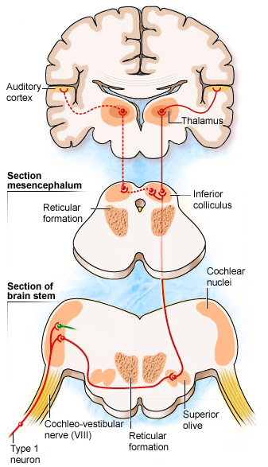

#### Near Field Evoked Potentials

- ***Compound Action Potential***

  Compound action potential (CAP) is a signal recorded extracellularly from large population of axons (nerve).

  Usually the recording is done in peripheral nerves, where separation of single axons is either technically difficult, or unnecessary.

- ***EcochG***

  

  ***Electrocochleography*** (EcochG) is the name given to the recording of cochlear potentials.
  Under local anaestethic, a thin needle electrode is placed through the tympanic membrane onto the promontory, near the round window niche.

  Without any filtering, the cochlear potential is a composite response, which includes the *microphonic potential* (reflecting the hair cell receptor potential, mainly OHCs), and two slow components: the *compound action potential* (reflecting the auditory nerve activity) and the *summating potential*.

  These different components are better visualized using appropriate filtering (see below).

  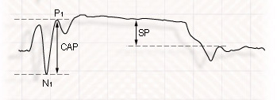

  The compound action potential CAP is the result of synchronous activity of the auditory nerve fibers. The CAP amplitude is measured between N1 and P1. The summating potential (SP) reflects the continuous component of the sensory hair cells, mainly the IHCs.

  The cochlear microphonic CM, which closely resembles the sound stimulus, is a reflection of the alternating component, which mainly originates from the OHCs.

  So...

  ***CM*** = Cochlear microphonic (from OHCs)- AC component , mirrors the stimulus waveform

  ***SM*** = Summing Potential (from OHCs) - DC component , same duration as stimulus

  ***CAP*** = Compound Action Potential (from the auditory nerve) - Transient component

  To understand CM more deeply:

  As the basilar membrane vibrates, the hair cells attached to this membrane are rhythmically pushed up against the tectorial membrane, bending the hair cell stereocilia. This opens mechanically gated ion channels on the hair cell, allowing influx of potassium (K+) and calcium(Ca2+) ions. The flow of ions generates an AC current through the hair cell surface, at the same frequency as the acoustic stimulus. This measurable AC voltage is called the cochlear microphonic (CM), which mimics the stimulus.

  ***Stimuli:***

  Usually through loud speaker, sometimes through headphones. Can be acoustic clicks or tone bursts "*Condensation*" and "*Rarefaction*" click with different polarity , alternating polarity allows reduction of CM & artifacts (CAP and SP are independent of stimulus phase) Time window circa $10\ ms$, can be increased to circa $20\ ms$ with low frequency stimuli.

  

#### Far Field Evoked Potentials

- ***Auditory Brainstem response (ABR)***

  

  E' un potenziale evocato lontano, si presenta nei primi 10ms dopo la somministrazione di un suono transitorio. Viene misurato con $2$ elettrodi, uno posto al vertice e l’altro posto o sul mastoide o sul lobo dell’orecchio. Registra tipicamente $5$-$7$ picchi nell’onda del segnale. Il valore che si estrae è la latenza. Le differenti componenti dell’onda ABR sono generate dall’attività neurale seguendo la sequenza di strutture attivate presenti sul cammino del segnale uditivo neurale. Le ampiezze misurate sono nell’ordine delle centinaia di $nV$. Si può diminuire il tempo di latenza con delle cuffie non sovra-aurali ma inserite all’interno del condotto uditivo. Diminuendo l’intensità dello stimolo: aumenta il tempo di latenza, diminuisce l’ampiezza delle curve, viene modificata la forma delle curve. Se aumenta la frequenza di stimolazione: le onde diminuiscono in ampiezza e la latenza aumenta. L'ABR viene solitamente campionato a $512$ punti. Si può misurare l'ABR ipso laterale o contro laterale e le forme d’onda sono un po’ diverse.

- ***Middle Latency Responses (MLR)***

  The middle-latency response is often referred to as MLR or AMLR. AMLR stands for auditory middle-latency response. The MLR is derived from the medial geniculate body, inferior colliculus and the primary auditory cortex. The most important thing to keep in mind as we move into middle and late responses is that the patient cannot be asleep for this testing. As you move further up into the brain, the patient needs to stay awake and alert in order to maintain a response. The MLR is used to assess auditory cortical function, whether the person has function or does not have function. If there is an abnormality, you can determine which side is affected.

  The MLR produces waveforms that are identifiable at or near threshold and may be useful in identifying low-frequency auditory sensitivity. However, the ABR latencies are more consistent between tests than with MLRs. MLR has larger amplitude than the ABR and is less dependent on neural synchrony. The latency of the response is unchanged whether the patient is asleep or awake, but the amplitude is highly affected. The amplitude is smaller if the patient is asleep, so arrange for the patient to be awake during testing. You definitely do not want the patient to be anesthetized or have light sedatives because this will eliminate the MLR response.

  A change in intensity does not affect latency, so unlike the ABR, when you go down in intensity, there is not a significant shift in latency. Po, Pa and Pb are the labels used to mark the MLR at high intensities. As you decrease intensity, only Pa will remain. With reduced intensity, you will see a slight increase in latency and a decrease in amplitude for Pa. The response is not highly frequency-dependent, but an increased stimulus frequency will result in slight reduction of latency and lower amplitudes. The stimulus rate is slow, between 6 and 10 stimuli per second. The MLR response occurs between 10 to 80 milliseconds. The Na will occur at 12 to 18 milliseconds, Pa at 25 to 30 milliseconds and Pb at approximately 50 milliseconds.

  The default protocol in the Chartr EP 200 system uses a high intensity stimulus at 80 dBnHL with a rarefaction click at a rate of 7.7 per second and 75k gain. The response amplitude decreases with faster rates, so it is easier to record the MLR if a slower rate is used. The filters are 10 to 300 Hz, so notice they are much narrower than for ECochG or ABR. Remember, the ECochG was 10 to 1500 Hz and the ABR is 100 to 3000 or 100 to 1500 Hz. Artifact reject should be on.

  The sweep time (epoch or time window) must be set so you capture the response you are measuring. It is only 10 milliseconds for an adult ABR because the response usually occurs between 0 and 6 msec. The MLR is a much later potential so the sweep time is relatively long: 80 milliseconds. It is a large response so not as many sweeps are needed to collect this response: about 1,000 sweeps will do, and you can always stop the collection if a robust response appears. A 10 millisecond pre-stimulus delay is recommended.

- ***Late Responses***
  Late potentials occur between 50 and 1,000 msec which include the P300 and Cortical responses.

  P300 is considered a late-latency response that generally occurs at approximately 300 milliseconds. P300 is dependent on internal thought process and is generated by the hippocampus where short-term memory functions are stored. The patient must be awake and alert to the stimuli.

  The cortical response is derived from a slow-vertex response. It produces waveforms that are identifiable near a threshold and may be useful in identifying hearing status using tone burst stimuli. It is used for medical legal cases or for patients who are difficult to test with behavioral audiometry. The one disadvantage to cortical is that the response is not fully mature until the late teen years. 

- ***Riassunto***

  ***Auditory Evoked Response***:

  E' il sommario di ABR (early), molto stabile indipendente dallo stato del soggetto, MiddleLatencyResponse (misurata in modo simile all’ABR e viene generata dal strutture neurali più centrali dell’ABR e anche dalla corteccia uditiva) che dipende dallo stato di attenzione del soggetto, LATE è in questa parte che avviene l’elaborazione.

  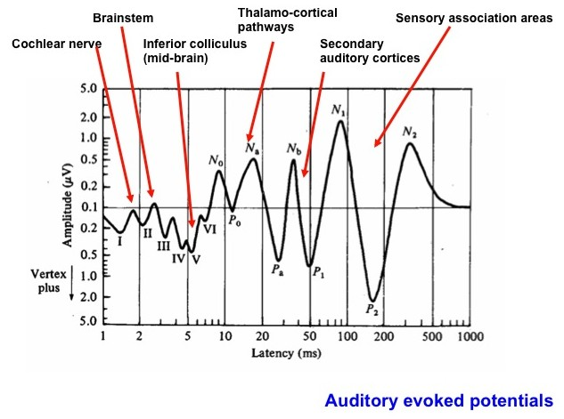

  To make a summary...

  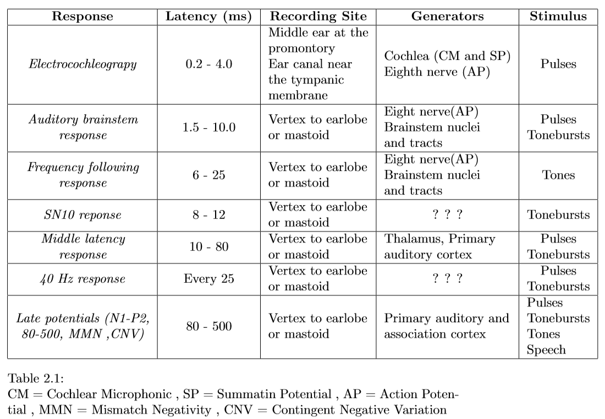

#### Audiograms

An *audiogram* is a graph that shows the audible threshold for standardized frequencies as measured by an audiometer. It gives a measure of the difference between the absolute threshold of the subject and a normal mean threshold conventionally defined by international agreements.

$0$ $dB$ $HL$ (Hearing Level) $=$ conventional hearing threshold 

Stimuli are also standardized (pure tones at different frequencies); usually tests are conducted for both ears, to obtain two respective audiograms.

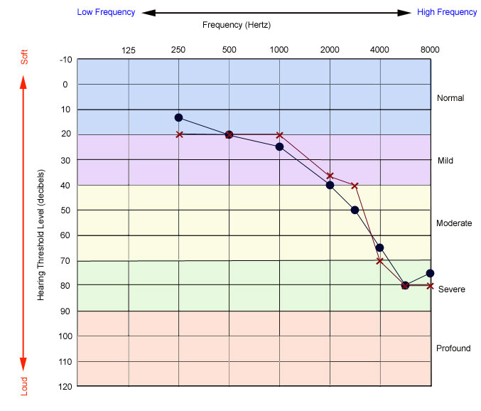

#### Range of hearing

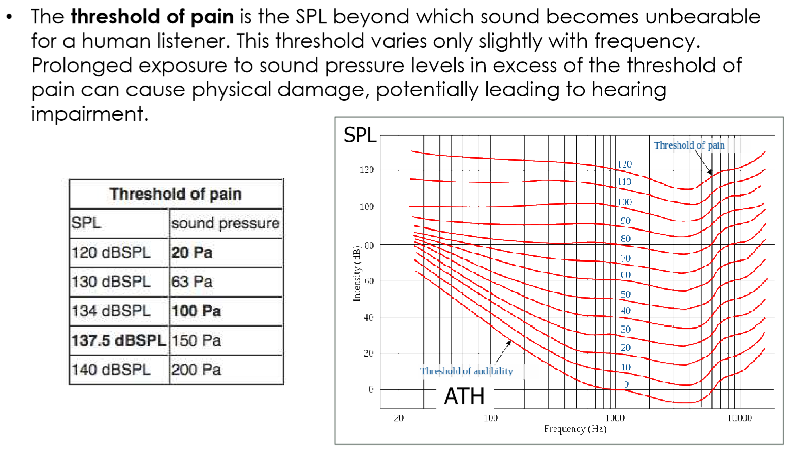

#### Loudness

- ***Stevens's Power Law*** 

  Loudness is proportional to some power of Intensity. $ L = kI^{a}$ 

We have *two* different scales for loudness:
*Phon* and *Sone*. 

- ***Phon***
  The unit phonis used to indicate an individual’s perception of loudness. By definition, 1 phon is equivalent to 1 deciBel at 1000 Hz (1 kHz).

  

  The figure above shows several equal loudness curves ***isophonic curves***. The curves were determined experimentally. Volunteers were subjected to a 1 kHz sound at 60 dB; this is a loudness of $60$ phon. Sounds with different frequencies were then played; the volunteer adjusted the decibel level until it was perceived to have the same loudness as it had at 1000 Hz. This was repeated for varying frequencies to generate the entire $60$-phon curve. To create an $80$-phon curve, subjects were exposed to 1 kHz sounds at 80 dB. For other frequencies, they adjusted the decibel level until it was perceived to be of equal loudness as the 1 kHz sound. This figure represents an average of the results for many individuals.

- ***Sone***

  The *sone* scale is a third scale associated with the loudness of a sound. The sone scale is based on the observation that a $10$ phon increase in a sound level is most often perceived as a doubling of loudness. According to the sone scale, a $1$ sone sound is defined as a sound whose loudness is equal to $40$ phons. The following figure is generated based on these assumptions.

  $1$ sone : Loudness of a $1000$ $Hz$ tone at SPL (or SL) of $40dB​$. 

  

#### Pitch

*ANSI definition*: "*That attribute of auditory sensation in terms of which sounds may be ordered on a scale extending from low to high*".

For simple/pure tones, pitch closely relates to ***frequency***. Similarly to loudness and SL [Sound Intensity Level], pitch relates to frequency logarithmically; a pitch increase by an octave corresponds to frequency doubling.

The pitch of pure tones depends on ***intensity***. In general, increasing the intensity of pure tones decreases the pitch of low frequencies (approx. greater than $300Hz$), increases the pitch of high frequencies ( approx. less than $3000Hz​$), and has no noticeable effect at middle frequencies.

Pitch also depends on ***duration***. A tone must last more than a minimum amount of time ($\sim 10-60\ ms$, depending on frequency and intensity) in order to sound more than a 'click' and convey a clear sense of pitch

- ***Mel Scale***

  *MEL* = The name *mel* comes from the word melody to indicate that the scale is based on pitch comparisons. 

  The MEL scale, named by Stevens, Volkmann, and Newman in 1937, is a perceptual scale of pitches judged by listeners to be equal in distance from one another. The reference point between this scale and normal frequency measurement is defined by assigning a perceptual pitch of 1000 mels to a 1000 Hz tone, 40 dB above the listener's threshold. Above about 500 Hz, equal pitch increments are produced by increasingly large intervals

  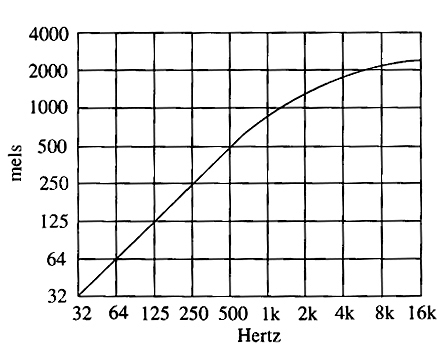

- ***Missing fundamental***

  The pitch of complex sounds depends mostly from the way the harmonics composing the sound are perceived.

  Missing Fundamental (or residual pitch) = sensation of a low frequency tone which can arise from hearing a complex sound composed of high-frequency harmonics.
  Sound is perceived also in absence of a response at the basilar membrane level corresponding to the fundamental frequency , the main hypothesis here is the presence of a time-frequency coding mechanism at the central level(brain)

  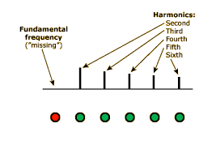

- ***Distortion***

  When two different tones at two different frequencies are presented(f1andf2) it is possible that the subjective sensation be of tones at a frequency that is a combination of f1 and f2.\newline

  Most common: $f2+f1$ , $f2-f1$

  Aural harmonics: $2f1$ , $2f2$

  Cubic products: $2f1-f2$ , $2f2-f1$

  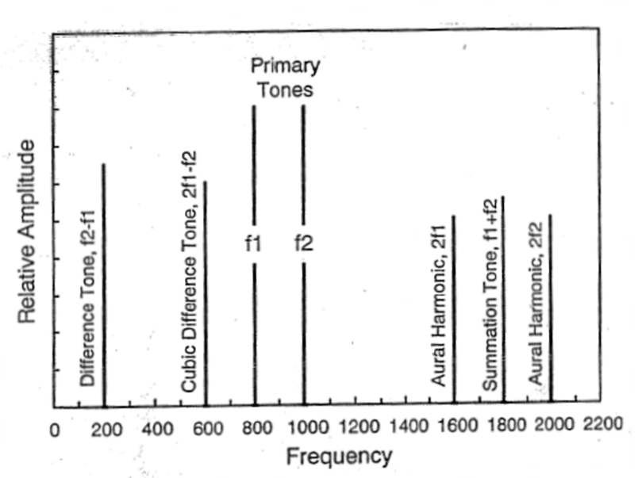

- ***Beating***

  If two tones at very close frequencies $f1$ e $f2$ (e.g. $1000$ and $1005\ Hz$) are presented simultaneously.
  The representation of these tones along the basilar membrane oscillates periodically (positive and negative interference).

  The result is a periodic signal modulated by a sinusoid of frequency $f = f2-f1$

  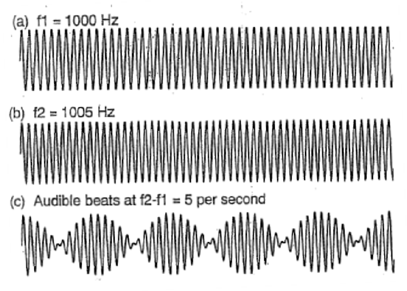

- ***Critical Band***
  The actual length of the critical band corresponds, therefore, to a frequency difference value called ***critical bandwidth***. If the frequency difference between two simultaneous sine waves is within the critical bandwidth, the ear will not be able to resolve the two frequencies, while the waves will interact in a specific and musically important way:

  If the frequency difference is $<10-20 Hz​$ (approx.), the wave interaction will be perceived as a slow loudness fluctuation called ***beating***. 

  If the frequency difference is $> 20 Hz$ (approx.) but smaller than the critical bandwidth, the interaction of the two simultaneous waves will be perceived as a change in the character of the combined sound referred to as ***roughness***

  ***Critical bandwidth*** may be defined as the frequency separation in Hz. between two simultaneous sine waves necessary for beats/roughness to disappear and for the resulting tones to sound clearly apart.

- ***Masking***
  Phenomenon that affects the ability to perceive a signal (maskee) due to the presence of a second signal (masker). 

  The ***unmasked threshold*** is the quietest level of the signal which can be perceived without a masking signal present. The ***masked threshold*** is the quietest level of the signal perceived when combined with a specific masking noise. The amount of masking is the difference between the masked and unmasked thresholds.

  

  Gelfand provides a basic example.[1] Let us say that for a given individual, the sound of a cat scratching a post in an otherwise quiet environment is first audible at a level of $10$ $dB$ SPL. However, in the presence of a masking noise (for example, a vacuum cleaner that is running simultaneously) that same individual cannot detect the sound of the cat scratching unless the level of the scratching sound is at least 26 dB SPL. We would say that the unmasked threshold for that individual for the target sound (i.e., the cat scratching) is 10 dB SPL, while the masked threshold is $26$ $dB$ SPL. The amount of masking is simply the difference between these two thresholds: $16$ $dB​$.

  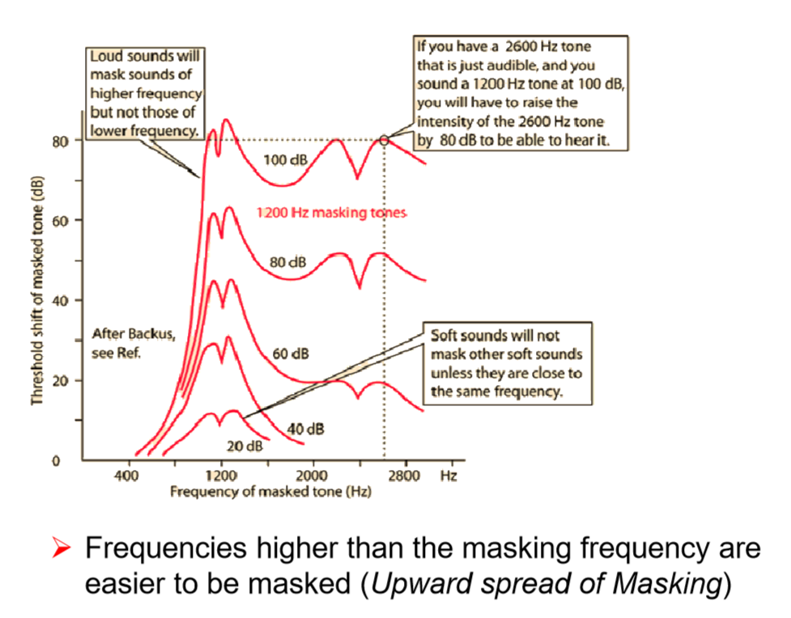

  $\uparrow$ IMPORTANTE

- ***Timbre***

  Definition: Two sounds of the same pitch and loudness may have recognizably different qualities: for instance the sounds of string vs. reed instruments in the orchestra. These distinguishing qualities of sound are collectively referred to as timbre. 

  Timbre is a perceptual attribute of sound waves related mainly to a ***complex wave's spectral distribution***.

- ***Hearing Range***

  The frequency range of hearing extends from $20\ Hz$ to $20000\ Hz$. 

  On average, frequencies below $20Hz$ sound as individual pulses with no definite pitch, while frequencies above $20KHz$ are inaudible by humans. 

  The frequency hearing range that can give an accurately identifiable pitch sensation extends from $30Hz$ to $5000Hz$.

  The common instrumental pitch range spans most this frequency range.

  Frequencies above 10kHz give rise to pitch sensations that, although may be distinguishable from other pitch sensations, are hard to identify and cannot accurately portray direction of pitch change. 

#### Hearing Aids

- ***$dB$ SPL vs $dB$ HL***
  The decibel  ($dB$) is a logarithmic unit of measurement used to express the  magnitude of a sound relative to some reference level. Decibels in hearing level, or  $dB$ HL ,  is  commonly used in audiology because it refers to the decibel level on the audiometer. The reference level for dB HL is “0,” which is related to the average threshold in decibels sound pressure level (dB SPL) for the average, normal-hearing listener. In the following figure, the  solid  black  line  represents  the  average  auditory  threshold  in  dB  SPL  at  each  audio-metric frequency. Each threshold in dB SPL is equal to 0 dB HL on the audiometer for the corresponding frequency.  Decibels in sound pressure level, or  dB SPL , refers to the magnitude of the dis-placement of molecules in the air. The reference for dB SPL is$20$ $\mu Pa$ or $0.0002\ \text{dynes}/cm^2$ . Because it is easy to measure $dB$ SPL with a condenser or free-field microphone coupled to a sound level meter, sound measurements are often expressed in $dB$ SPL.

  

#### Cochlear implants and Implantable Hearing Devices (IHD)

- ***Middle-Ear Implants*** (MEI) [Mechanical Stimulation (vibration)]

- ***Bone-Anchored Hearing Aids*** (BAHA) [Mechanical Stimulation (vibration)]

- ***Cochlear Implants*** (CI) [Electric Stimulation]

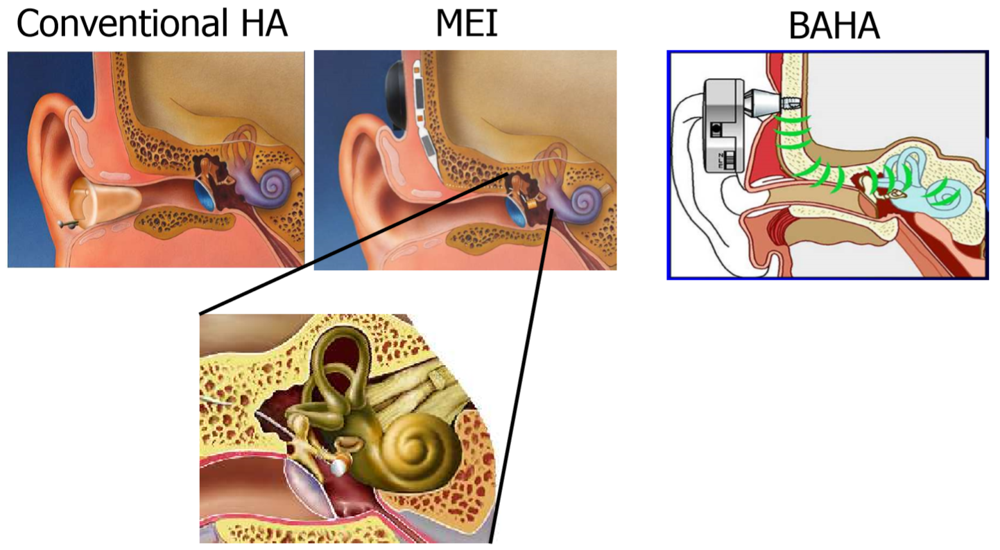

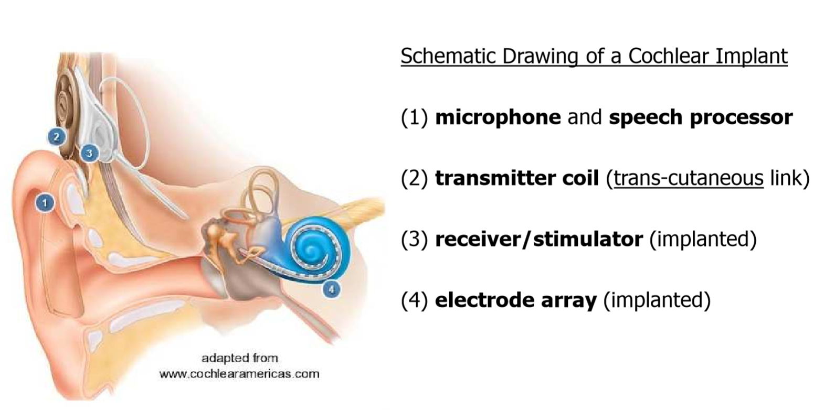

The ***most comfortable loudness*** (MCL) (typically called **C** or **M** level) level is the level at which the listener perceives pure-tones or speech as “*most comfortable*”. This may be measured during a hearing test by presenting sounds at different levels and asking the listener to identify the most comfortable level. The measurement can be useful for programming hearing aids. 

***Neural Response Telemetry*** (also called neural response imaging –NRI) is the method by which one can measure responses from the auditory nerve. The implant array is used to deliver electrical pulses the elicit the compound action potential (CAP). The same electrode array is used also to measure the CAP and send back to the speech processor unit the CAP waveform. CAP elicited by electric stimulation, are called ***ECAP*** .

*ECAP latency* (time between stimulus onset and N1 peak) = $200-400$ $\mu s$.

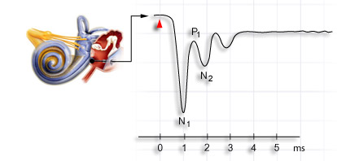

The figure is referred to a normal CAP, but you got the idea.

The ECAP threshold measured during NRT is typically between the behaviorally measured **T** and **C** levels, and can be used to create a map without any subjective responses from the patient.
Such objectively created maps are especially valuable with pediatric implant populations and those who cannot give accurate behavioral responses.

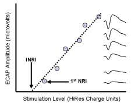

ECAP input-output function(response waveform at right). The $1^{st}$ ***NRI*** is defined as the lowest stimulus level that elicits an observable ECAP response. The $t$***NRI*** is defined as the stimulus-level x-intercept created by fitting a regression line to the input-output function
**C**  can be estimated, on average, knowing that:
$1^{st}$NRI = $85\%$ of C
$t$NRI = $65\%​$ of C

- ***Stimulation Modes***

  

  Most  of  the  current  cochlear  implant  systems  use  intracochlear  and  extracochlear  electrodes.  Three different modes of current stimulation have been used in cochlear implant systems – *Monopolar*, *Bipolar* and *Common ground* 

  In  ***monopolar***  stimulation,  current  is  passed  between  one  active  intracochlear  electrode  and  the  extracochlear  electrodes  (which  provide  the  return  current  path)  placed  either  as  a  ball  electrode  under  the  temporalis  muscle  (MP1)  or  a  plate  electrode  on  the  receiver  casing  (MP2)  (figure  2b).  When  both  of  these  extracochlear  electrodes  act  as  return  electrodes  in  parallel,  it  is  called  MP1+2  configuration. 

  In ***bipolar*** stimulation, current flows between an active and a return electrode within  the  cochlea;  whereas  in  common  ground  stimulation,  current  flows  from  one  electrode within the cochlea to all other intracochlear electrodes.  

  ***Common Ground*** is an important stimulation mode because it is used diagnostically to detect electrode anomalies, since each electrode is independently activated

  

#### Vision Aids Instrumentation

- ***Eye Anatomy***

  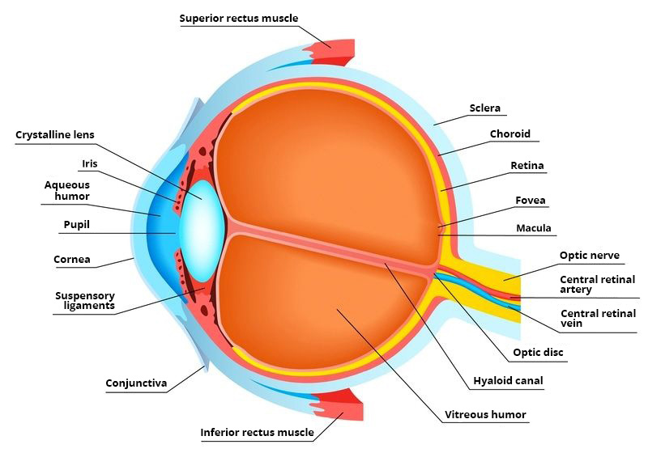

- ***ERG***

  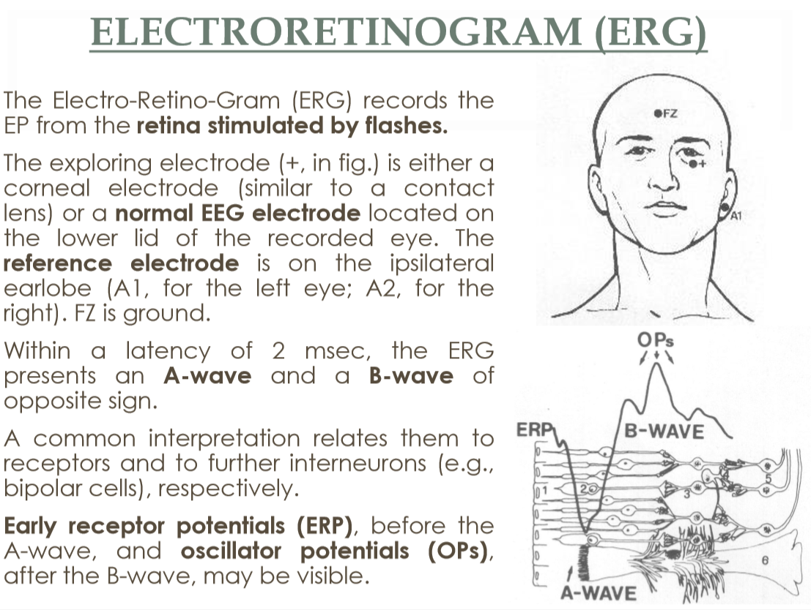

- ***EOG***

  

- ***Cortical Visual Evoked Potentials***

  

  This stimulus permits to assess the perception at the V1 level (pattern recognition is present even if the subject has not a conscious recognition due to lesions at higher level).  By decreasing chess dimension is possible to assess acuity, since a blurred sight would perceive a uniform grey. When the pattern occupies the ***entire visual field*** leads are occipital (LO, MO, RO) against mid frontal (MF), while vertex (CZ) is ground. When the ***emi-field responses*** are investigated, also temporal electrodes (LT, RT) can be explored against MF. Pattern perception by the visual cortex is assessed by the ***P100 wave***, having a latency of about 100 msec.

  With pattern reversal VEPs examination, it is possible to verify the developing ***capability of perceiving patterns in newborns***, who obviously would not respond to psychophysical trials. 

   P100 amplitude and latency can be explored by varying both chess dimension and contrast.

   The main obtainable clinical information relates to the existence/non-existence of a cortical response.
   So..

  - ERG provides rough, objective information about the functional responsiveness of retina and receptors.

  - VEPs assess the responsiveness of the primary visual cortex, both to illumination and patterns.

- ***Fundus Oculi***

  L’esame del fondo oculare (o fundus oculi), consiste nell’esame delle strutture oculari collocate posteriormente all’iride ed al cristallino: corpo vitreo, retina centrale (polo posteriore, contenente la macula, sede della visione più definita), retina periferica, porzione intraoculare del nervo ottico (papilla ottica).

  Per esplorare queste strutture é spesso necessario dilatare la pupilla instillando alcune gocce di collirio midriatico. La pupilla inizia a dilatarsi dopo 10-15 minuti e rimane dilatata in modo ottimale per 45-60 minuti.

  Pupil dilation is performed by means of ***atropine***, a drug which blocks the constriction of the pupil by parasympathetic fibers (it’s called a cholinergic blocker, since it blocks acetylcholine receptors). 

  Clinical signs most relevant to diagnose a healthy retina are:

  - *adhesion to the inner eye wall*
  - *absence of ruptures*
  - *vascularization of all parts around the macula (no stroke)* 
  - *absence of abnormal proliferation of new vessels (no diabetic retinopathy).*

  

- ***Fundus Autofluoroscence***

  

- ***Fluoroscein Angiography***

  

- ***Ophtalmic echography***

  

  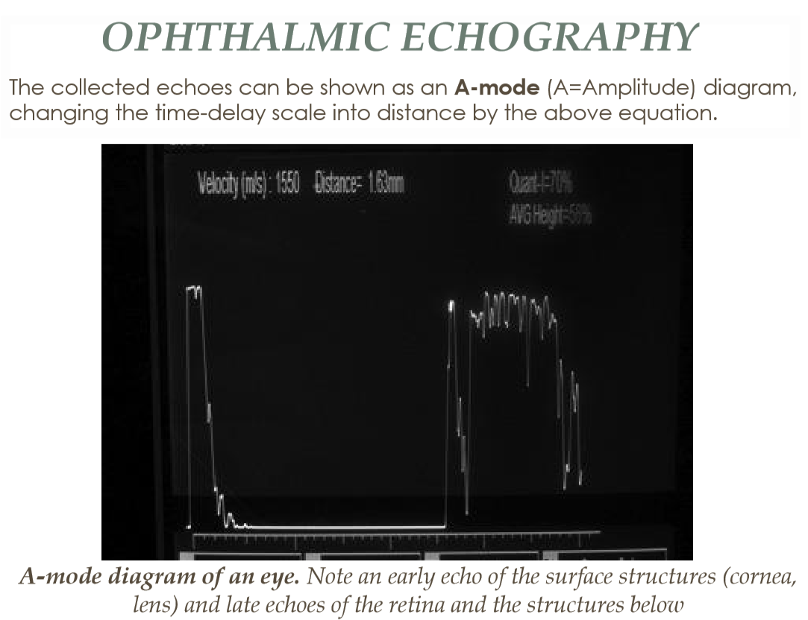

  

  

  

  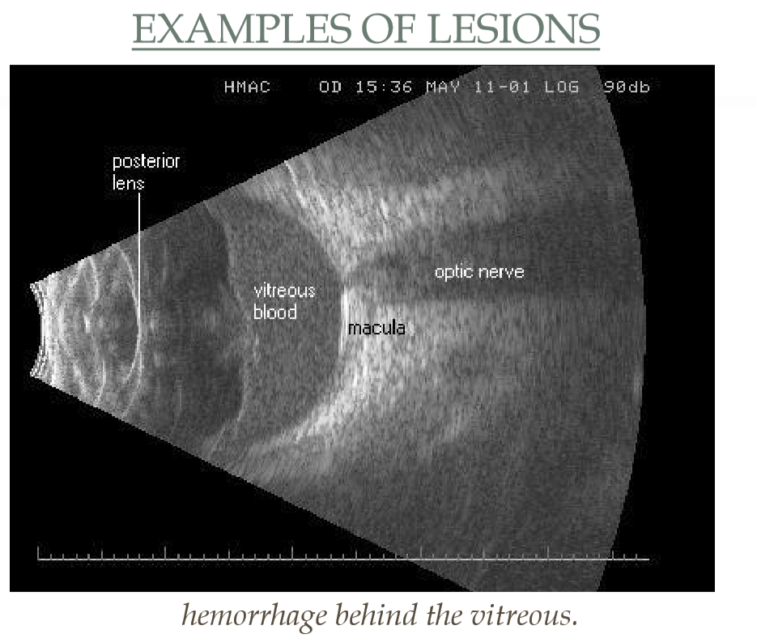

  So...

  ***Higher frequency waves penetrate less into tissue but have better resolution. In contrast, lower frequency waves penetrate more deeply but have worse resolution.***

  In fact...

  

  

  

- ***Optical Coherence Tomography***
  ***Fundus*** imaging displays a flat image of the retina while ***Ophthalmic echography*** can only resolve the position in depth of the retina.

  Neither of these methods can show the microscopic structure of retinal layers, which is \textit{of utmost importance in the clinical assessment of retinal degeneration pathologies}. 

  

- ***Michaelson Interferometer***
  In physics, two wave sources are perfectly \textbf{coherent} if they have a constant phase difference and the same frequency, and the same waveform.

  

  

  

  

  

  

  

- ***Corneal topography (not "tomography")***
  ***Corneal topography***, also known as *photokeratoscopy* or *videokeratography,* is a non-invasive medical imaging technique for mapping the surface curvature of the cornea, the outer structure of the eye. Since the cornea is normally responsible for some 70\% of the eye's refractive power, its topography is of critical importance in determining the quality of vision and corneal health.

  Is used before *refractive surgery of the cornea*, for assessing *astigmatism*, or for the diagnosis of *keratoconus*.

  The three-dimensional map is therefore a valuable aid to the examining ophthalmologist or optometrist and can assist in the diagnosis and treatment of a number of conditions; in planning cataract surgery and intraocular lens (IOL) implantation (plano or toric IOLs); in planning refractive surgery such as LASIK, and evaluating its results; or in assessing the fit of contact lenses. A development of keratoscopy, corneal topography extends the measurement range from the four points a few millimeters apart that is offered by keratometry to a grid of thousands of points covering the entire cornea. The procedure is carried out in seconds and is painless.

  The patient is seated facing the device, which is raised to eye level. One design consists of a bowl containing an illuminated pattern, such as a series of concentric rings. Another type uses a mechanically rotated arm bearing a light source. In either type, light is focused on the anterior surface of the patient's cornea and reflected back to a digital camera at the device. The topology of the cornea is revealed by the shape taken by the reflected pattern. A computer provides the necessary analysis, typically determining the position and height of several thousand points across the cornea. The topographical map can be represented in a number of graphical formats, such as a sagittal map, which color-codes the steepness of curvature according to its dioptric value.

  

  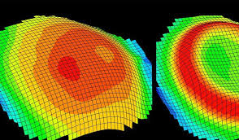

  Se vedi questo capisci tutto:
  https://www.youtube.com/watch?v=Ck0iyKShTsA

- ***Pachymetry***

  Is the ***measure and mapping of corneal thickness***. The principal application is to evaluate the amount of corneal tissue which can be safely removed in refractive surgery. 

  It can be performed optically by a ***Scheimpflug camera***, which projects a slit of light and evaluates the distance between the reflexes from the external and internal corneal surfaces. 

  

- ***Ophthalmic Laser Surgery [INCOMPLETE]***

  Lasers are largely applied in eye surgery. 

  Wide range of uses and applications.

  Different targets (from corneal surface to deep structures as the retina) and physical principles of laser light interaction with tissue.

  There are four basic interactions, according to which the possible targets change, as well as the laser pulses wavelength, duration, and energy:

  - ***thermal***, due to conversion of absorbed light into heat, thus producing calibrated lesions; 
  - ***photo-mechanic***, causing the rupture of membranes or holes were needed for surgical correction;

  - ***photo-chemical***, for the conversion of drug molecules to their active form; 
  - ***photo-ablation***, for shaping of corneal surface, which is principally applied for refractive correction.

- ***Refractive Surgery***

  Refractive surgery has become very popular in recent years; however, some complications may result in rare cases, mainly due to healing of the cornea with an imperfect surface (irregular astigmatism), which blurs the vision of light spots in the dark.

- ***Retinal Degeneration Pathologies***

  Most retinal degeneration pathologies involve the \textbf{loss of receptors}.

  The gangliar cells (often with most retinal layers) and the subsequent visual pathways are preserved.
  Hence, a functional electrical stimulation of the retina could stimulate visual pathways.
  Similarly, this can be done at higher levels, such as optical nerves, LGN, and V1 cortex.

   Foerster (1929) and Krause and Schum (1931) were the first to report the perception of a spot of light, called phosphene, by a conscious patient under brain surgery when the occipital cortex was electrically stimulated.

   A phosphene is the visual equivalent of the illusionary tactile perception reported by conscious patients under the stimulation of the somatosensory (post-central gyrus) described almost in the same years (published in 1951) by Penfield, who mapped the body on the cortex as “homunculus”.

- ***Retinal implants***
  Two main approaches are pursued:

  - Epiretinal – the electrode array is attached to the inner retinal surface laying on the ganglion cells.
  - Subretinal – the electrode array is inserted between the retina and the choroid. 

  Design features to be decided for both types are: 

  - Image capture and transmission
  - Energy
  - Position and density of elements
  - Biocompatibility

#### Somatosensory System

- ***Introduction***

  The somatic sensory system transmits information about four major modalities:

  - *Discriminative touch* (required to recognize the size, shape, and texture of objects and their movement across the skin)

  - *Proprioception* (the sense of static position and movement of the limbs and body)

  - *Nociception* (the signaling of tissue damage or chemical irritation, typically perceived as pain or itch)

  - *Temperature sense* (warmth and cold).

  Each of these modalities is mediated by a distinct system of receptors and pathways to the brain.

  All share a common class of sensory neurons: the dorsal root ganglion neurons.

  Different types of information are transmitted by populations of different types of sensory neurons, and conveyed in parallel pathways to the primary somatosensory cortex, where all the information is combined into a unified somatic percept.

- ***Receptors*** 
  

  - *Touch and Proprioception*
    Discriminative touch and limb proprioception depend on encapsulated mechanoreceptors sensitive to physical deformation produced by indentation or lateral motion across the skin, stretch or contraction of muscles, or the angle of individual joints.
    Mechanoreceptors in the skin are further specialized to transduce pressure or motion, allowing them to sense the shape and surface texture of objects.
    Spatial resolution depends on the receptive fields of these receptors and is greatest on the fingertips and lips, where the receptors are most abundant.
    REMEMBER: ***Receptive field:*** The receptive field of an individual sensory neuron is the particular region of the sensory space (e.g., the body surface, or the visual field) in which a stimulus will modify the firing of that neuron.

  - *Temperature and Pain*

    The sense of temperature is mediated by the bare endings of thinly myelinated or unmyelinated nerves sensitive to specific ranges of thermal energy.
    Separate classes of thermal receptors sense temperatures that are perceived as cold, cool, warm, and hot, as they differ in their peak sensitivities and temperature ranges. Painful sensations are mediated by free nerve endings, called nociceptors, that sense destructive mechanical stimuli that squeeze, pinch, or puncture the skin; extremely hot or cold temperatures that might burn or freeze the skin; or chemical substances released from cells as a result of tissue damage. 

  

- ***Somatosensory Pathways:***

  - *Touch and Proprioception* are transmitted by large-diameter axons with fast conduction velocities to the dorsal horn of the spinal cord and then to the brainstem and thalamus through the dorsal column-medial lemniscal system.

  - *Pain and Temperature* are conveyed by thinly myelinated and unmyelinated nerves that terminate in the most superficial layers of the spinal or trigeminal dorsal horn. These modalities are conveyed directly, and through multisynaptic networks, to the thalamus through the contralateral anterolateral pathway.

  Tactile sensation and limb proprioception are transmitted to the thalamus by the dorsal column-medial lemniscal system.
  Painful and thermal sensations are transmitted to the thalamus by the \textbf{anterolateral system}.
  Touch and proprioception ascend ipsilaterally in the spinal cord, whereas pain and temperature sense ascend contralaterally.

  [IMMAGINE SLIDE 20 PAG 7]

- ***Structural Basis Of The Receptive Field of touch receptors***

  The receptive field of a touch-sensitive neuron in the skin includes the sensory transduction apparatus in the nerve terminals and the surrounding skin in which the terminals are located.
  A patch of skin contains many overlapping receptive fields that are innervated by individual sensory nerve fibers.
  When this region is touched, spikes are initiated at the node of Ranvier closest to the nerve terminals in the skin.

  ***Not so important*:**
  *The density of receptors in a given part of the body determines how well the sensory system can resolve the detail of stimuli in that area.*
  *A dense population of receptors leads to finer resolution of spatial detail because the receptors have smaller receptive fields.*
  *The spatial resolution of a sensory system is not uniform throughout the receptor sheet.*
  *For example, spatial discrimination is very acute in the fingertips, where sensory receptors are plentiful and the receptive fields are small.*
  *In other regions, such as the trunk, the spatial information signaled by individual nerves is less precise because receptors in those areas are fewer and thus have larger receptive fields.*

  ***Important:***

  All somatosensory information from the limbs and trunk is conveyed by **dorsal root ganglion neurons**}. Somatosensory information from cranial structures (the face, lips, oral cavity, conjunctiva, and dura mater) is transmitted by the **trigeminal sensory neurons**, which are functionally and morphologically homologous to dorsal root ganglion neurons.
  The dorsal root ganglion neuron is well suited to its two principal functions: (1) stimulus transduction and (2) transmission of encoded stimulus information to the central nervous system. The cell body lies in a ganglion on the dorsal root of a spinal nerve. The axon has two branches, one projecting to the periphery and one projecting to the central nervous system.

  

  *The terminal of the peripheral branch of the axon is the only portion of the dorsal root ganglion cell that is sensitive to natural stimuli.*
  The properties of the nerve terminal determine the sensory function of each dorsal root ganglion neuron. The remainder of the peripheral branch, together with the central branch, is called the *primary afferent fiber*; it transmits the encoded stimulus information to the spinal cord or brainstem.

  *IMPORTANTE! (ANCHE SE L'ABBIAMO GIà DETTO):*

   The peripheral terminals of dorsal root ganglion neurons are of two types. The terminal may be a *bare nerve ending* or the nerve ending may be *encapsulated* by a non-neural structure.

  Dorsal root ganglion neurons with encapsulated terminals mediate the somatic modalities of touch and proprioception. They sense stimuli that indent or otherwise physically deform the receptive surface.

  Mechanoreceptors and proprioceptors are innervated by dorsal root ganglion neurons with large-diameter, myelinated axons that conduct action potentials rapidly.

  In contrast, dorsal root ganglion neurons with bare nerve endings mediate painful or thermal sensations. Thermal receptors and nociceptors have small-diameter axons, either unmyelinated or thinly myelinated. These nerves conduct impulses more slowly.

- ***The Pacinian Corpuscle***

   The Pacinian corpuscle is a rapidly adapting mechanoreceptor located in the skin, in joint capsules, and in the mesentary of the abdominal wall.
  The receptor consists of concentrically arranged, fluid-filled lamellae of connective tissue that form a capsule surrounding the sensory nerve terminal. Because of this capsule, the sensory endings specialize in the detection of motion.

  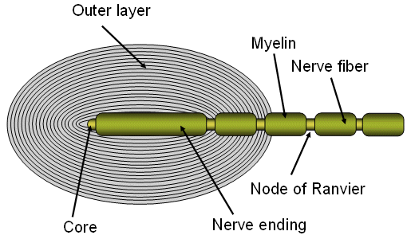

  The capsule of the Pacinian corpuscle (DOESN'T!!) deflects steady pressure. When a stimulus first impinges on the skin, the capsule is deformed, compressing the nerve terminal. The pressure pulse activates stretch-sensitive channels in the nerve terminal, producing the response to stimulus onset. During steady pressure the capsule changes shape, reducing stretch of the nerve membrane. When pressure is removed, the capsule resumes its initial shape, and the resultant tissue movement stimulates the nerve terminal again, producing an “off” response.
  B. Pacinian corpuscles are sensitive to vibration. Rapid movements are transmitted through the lamellae to the nerve terminal, generating a receptor potential and action potential for each vibratory cycle.

- ***Somatic Sensation***
  Neurologists distinguish between two classes of somatic sensation: \textbf{Epicritic and Protopathic.}

  Epicritic sensations involve fine aspects of touch and are mediated by encapsulated receptors.
  Protopathic sensations involve pain and temperature senses (as well as itch and tickle) and are mediated by receptors with bare nerve endings. 

  Receptors are located in the superficial skin, at the junction of the dermis and epidermis, and more deeply in the dermis and subcutaneous tissue.
  The receptors of the glabrous skin are Meissner's corpuscles, located in the dermal papillae; Merkel disk receptors, located between the dermal papillae; and bare nerve endings.
  The receptors of the hairy skin are hair receptors, Merkel's receptors (having a slightly different organization than their counterparts in the glabrous skin), and bare nerve endings.
  Subcutaneous receptors, beneath both glabrous and hairy skin, include Pacinian corpuscles and Ruffini endings.

  

- ***Superficial layers of the skin:***

  Two principal mechanoreceptors in superficial layers of the skin: the ***Meissner's corpuscle*** and the ***Merkel disk receptor***.
  The Meissner's corpuscle, a *rapidly adapting receptor*, is coupled mechanically to the edge of the papillary ridge, a relationship that confers fine mechanical sensitivity.
  The receptor is a globular, fluid- filled structure that encloses a stack of flattened epithelial cells; the sensory nerve terminal is entwined between the various layers of the corpuscle.
  The Merkel disk receptor, a *slowly adapting receptor*, is a small epithelial cell that surrounds the nerve terminal.
  The Merkel cell encloses a semirigid structure that transmits compressing strain from the skin to the sensory nerve ending, evoking sustained, slowly adapting responses.
  Merkel disk receptors are normally found in clusters at the center of the papillary ridge.

- ***Deep layers of the skin:***

  The two mechanoreceptors found in the deep subcutaneous tissue are the *Pacinian corpuscle* and the *Ruffini ending*. These receptors are much larger than the Merkel cells and Meissner's corpuscles, and less numerous.
   The Pacinian corpuscle is physiologically similar to the Meissner's corpuscle. It responds to rapid indentation of the skin but not to steady pressure because of the connective tissue lamellae that surround the nerve ending. The large capsule of this receptor is flexibly attached to the skin, allowing the receptor to sense vibration occurring several centimeters away.
  These receptors are activated selectively by the common neurological test of touching a tuning fork (oscillating at 200-300 Hz) to the skin or bony prominence.
  Ruffini endings are slowly adapting receptors that link the subcutaneous tissue to folds in the skin at the joints and in the palm or to the fingernails.
  These receptors sense stretch of the skin or bending of the fingernails as these stimuli compress the nerve endings. Mechanical information sensed by Ruffini endings contributes to our perception of the shape of grasped objects.

  A single dorsal root ganglion cell innervating the *superficial layers* receives input from a cluster of 10-25 Meissner's corpuscles or Merkel disk receptors. The afferent fiber has a receptive field that spans a small circular area with a diameter ranging from 2 to 10 mm. 

  In contrast, each nerve fiber innervating the *deep layers* of skin innervates a single Pacinian corpuscle or Ruffini ending.

  So...

  Meissner's corpuscle and Merkel disk receptors in the *superficial layers* resolve fine spatial differences because they transmit information from a restricted area of skin. As these receptors are smaller in diameter than the fingerprint ridges of glabrous skin, individual receptors can be stimulated by very small bumps on a surface. This very fine spatial resolution allows humans to perform fine tactile discrimination of surface texture and to read Braille.

  Pacinian corpuscles and Ruffini endings in the *deep layers* are poorly suited for accurate spatial localization or for fine spatial resolution, and resolve only coarse spatial differences. Mechanoreceptors in the deep layers of the skin sense more global properties of objects and detect displacements from a wide area of skin.

- ***Vibrations***

  Mechanoreceptors in the skin respond to oscillations by a pulse code in which each action potential signals one cycle of the sinusoidal wave. The vibratory frequency is signaled by the frequency of action potentials fired by the nerves.

  ***Tuning curves***: Receptor tuning thresholds determine the ability to sense vibration. Humans are most sensitive to vibration at 200-250 Hz. To be felt, lower and higher frequencies must have proportionately larger amplitude vibrations.

  Individual mechanoreceptors differ in their threshold sensitivity to vibration:

   Merkel disk receptors are most responsive to extremely low frequencies (5-15 Hz); Meissner's corpuscles are most sensitive to midrange stimuli (20-50 Hz).
   The Pacinian corpuscles have the lowest thresholds for high frequencies (60-400 Hz); at 250 Hz they detect vibrations as small as 1 = µm but at 30 Hz require stimuli with much larger amplitudes. 

  REMEMBER: Merkel and  Meissner's $\to$ SUPERFICIAL
  Pacinian and Ruffini's $\to​$ DEEP

  IMPORTANT:  Intensity of vibration is NOT signaled by frequency of firing, which codes the vibratory frequency, but by the total number of sensory nerve fibers that are active, The number of active sensory nerves is directly proportional to the amplitude of vibration.

- ***Higher order Receptive Fields***

  Many peripheral receptors converge onto a single second-order sensory neuron in the dorsal column nuclei. As a consequence, the excitatory receptive field of the central neuron is made up of the receptive fields of all the presynaptic cells. 
  The receptive field of a neuron in the dorsal column nuclei and in the ventral posterior nuclei of the thalamus typically has a central excitatory receptive field surrounded or flanked by an inhibitory region

- ***AFFERENT FIBERS: DERMATOMES***
  A ***dermatome*** is an area of skin that is mainly supplied by a single spinal nerve.
  The 31 pairs of dorsal roots are labeled by the corresponding vertebral foramen (foro) through which the root enters the spinal cord.
  There are 7 cervical (C), 12 thoracic (T), 5 lumbar (L), and 5 sacral (S) roots, which are numbered rostrally to caudally for each division of the vertebral column.
  Each of these nerves relays sensation (including pain) from a particular region of skin to the brain.

  Note that there is no dorsal root at C1, only a ventral (or motor) root, and that the S5 dermatome located in the perianal region is not shown.
  The facial skin is innervated by the three branches of the \textbf{trigeminal nerve}: the ophthalmic (I), maxillary (II), and mandibular (III) branches.

- ***NEURONS IN HIGHER CORTICAL AREAS HAVE COMPLEX FEATURE-DETECTING PROPERTIES.***

  To produce a coherent sensation of an object the nervous system must integrate information from a large number and variety of receptors as well as the modalities of touch, proprioception, and temperature.

  At least four factors are involved in this integration :

  The size of the receptive field becomes larger at each level of processing, so that eventually the entire object rather than a single edge is sensed by a neuron. 

  The profile of activity in the active population of neurons changes through the action of inhibitory networks.

  At successive levels of sensory processing in the cortex individual neurons respond to more complex inputs.

  The submodalities converge on individual neurons in association cortical areas.

  

#### 2nd Midterm Questions

- ***What kind of nociceptors exist in the human?***

  Three classes of nociceptors can be distinguished on the basis of the type of stimulus:

  ***Mechanical*** and ***thermal*** nociceptors are activated by 
  particular forms of noxious stimuli.

  ***Polymodal*** nociceptors, the largest class, are sensitive to the destructive effects of a stimulus rather than to its physical properties.

  - Mechanical nociceptors require strong tactile stimuli, such as a pinch, in order to respond. They are also excited by sharp objects that penetrate, squeeze, or pinch the skin, and therefore mediate sensations of sharp or pricking pain. Their firing rates increase with the destructiveness of mechanical stimuli, from near-damaging to overtly destructive of the skin. The afferent fibers for mechanical nociceptors have bare nerve endings and, because they are myelinated, are the fastest-conducting nociceptive afferents.

  - Thermal nociceptors are excited by extremes of temperature as well as by strong mechanical stimuli. One group of thermal nociceptors is excited by noxious heat (temperatures above 45°C). A second group responds to noxious cold (cooling the skin below 5°C).

  - Polymodal nociceptors respond to a variety of destructive mechanical, thermal, and chemical stimuli. They are activated by noxious mechanical stimuli, such as pinch or puncture, by noxious heat and noxious cold, and by irritant chemicals applied to the skin. • These receptors are insensitive to gentle mechanical stimuli, such as stroking the skin or light pressure. • Stimulation of these receptors in humans evokes sensations of slow, burning pain. • Polymodal nociceptors provide the major sensory innervation of the tooth pulp.
    

- ***Two-Point discrimination.***
  Spatial resolution of stimuli on various regions of the skin can be quantified in humans by measuring their ability to perceive a pair of nearby stimuli as two distinct entities. The minimum distance between two detectable stimuli is called the two-point threshold. Two-point discrimination varies throughout the body surface. The two-point threshold measures the minimum distance at which two stimuli are resolved as distinct. Two-point thresholds are measured clinically using a calibrated compass in which the separation of the tips is accurately scaled.
  Two-point thresholds can also be determined from measurements of the ability of subjects to discriminate the orientation of grating ridges as a function of their spacing.
  The greatest discriminative capacity is in the fingertips, lips, and tongue, which have the smallest receptive fields.

- ***Spiega cosa sono e disegna delle curve isophoniche (attento ai numeri che metti in asse x/y)***

- ***Descrivi gli steps principali di speech processing che avvengono in un cochlear implant.}***

  

  BPF = Band Pass Filter (responsible for spectral analysis)
  Rect = Rectifier (responsible for envelope extraction)

- ***ABR descrizione e disegno. (Posizionamento degli elettrodi).***

  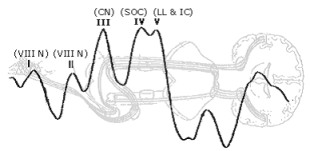

  The auditory brainstem response (ABR) is an auditory evoked potential extracted from ongoing electrical activity in the brain and recorded via electrodes placed on the scalp. The measured recording is a series of six to seven vertex positive waves of which I through V are evaluated. These waves, labeled with Roman numerals in Jewett and Williston convention, occur in the first 10 milliseconds after onset of an auditory stimulus. The ABR is considered an exogenous response because it is dependent upon external factors.

  The auditory structures that generate the auditory brainstem response are believed to be as follows:[2][4]

  Wave I through III – generated by the auditory branch of cranial nerve VIII and lower.

  Wave IV and V – generated by the upper brainstem.

  More in depth location – wave I originates from the dendrites of the auditory nerve fibers, wave II from the cochlear nucleus, III showing activity in the superior olivary complex, and wave IV–V associated with the lateral lemniscus.

- ***CEOAEs descrizione e disegno e parametri importanti (dove viene messo il microfono?).***

- ***Linear vs Non-Linear gain descrizione e disegno (cosa c'è in x e cosa in y).}***

  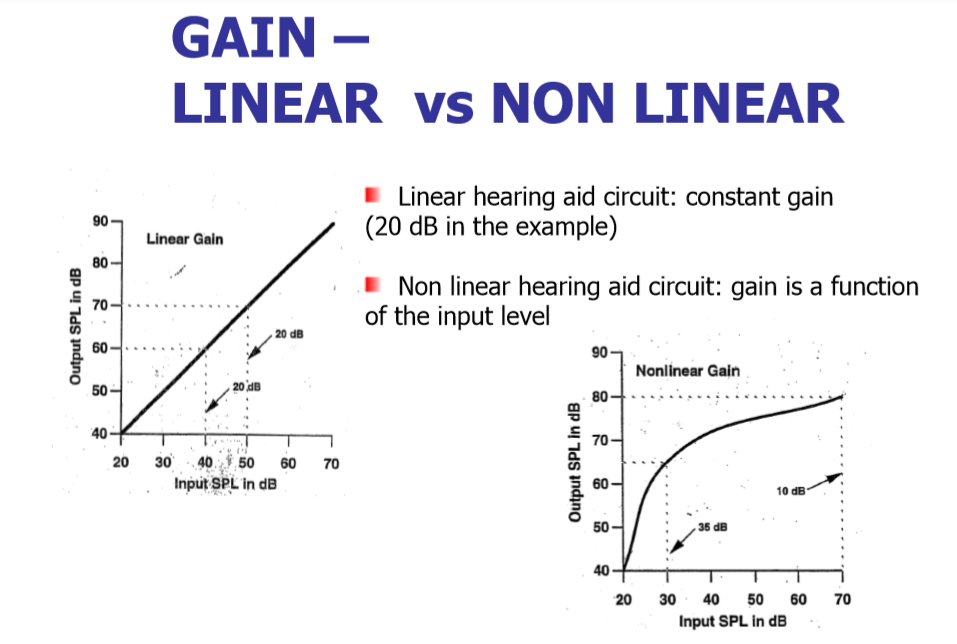

  Le ordinate iniziano 40 dB!

  

  

- ***Kurtzweil Reading Machine. Explain it.***

   The input to a KRM is also a digital image, captured by a small camera.

  Optical Character Recognition (OCR) is used to recognize single characters; this was not a trivial problem in the 1970s, since it requires to solve a fairly difficult pattern recognition problem (performed by a computer).
  Vocabularies are used to recognize entire words (thus correcting misinterpretations of single characters).
  Speech synthesis converts words into audible sounds; this was also a very difficult challenge at the earliest stages, since it implies the use of non-trivial models for the production of each phoneme (consonant and vowel); nowadays, speech synthesis is common practice.

- ***Temperature Receptors (maybe incomplete).***

  Thermal sensations result from differences between the external temperature of the air or of objects contacting the body and the normal skin temperature of 34°C.

  Each class of thermal receptor shows peak firing at a preferred skin temperature. Cold receptors fire most vigorously at skin temperatures of 25°C, whereas warmth receptors are most active at 45°C. Cold receptors respond to steady-state temperatures of 5-40°C. Warmth receptors are tonically active at steady temperatures of 29-45°C.

  Individual cold and warmth receptors do not give a precise reading of the skin temperature, as the same firing rate can be evoked by stimuli greater than or less than the preferred value. Rather, the code for skin temperature involves comparing the relative activity of the different populations of thermal receptors and nociceptors.

  Warmth receptors are unresponsive to hot temperatures, as stimuli above 50°C fail to excite them. At these high temperatures humans perceive heat pain rather than sensations of warmth.

  The coding of object temperature is analogous to the representation of color in the visual system. In each of these modalities there are populations of receptors sensitive to limited ranges of the energy bandwidth.

  Each population has a peak sensitivity in a specific position of the energy band. The perceived temperature or color is determined by the relative activity of each of the responding populations of receptors.

- ***Source Filter Model nel dettaglio.***

  The source–filter model models speech as a combination of a sound source, such as the vocal cords, and a linear acoustic filter, the vocal tract (and radiation characteristic). An important assumption that is often made in the use of the source-filter model is the independence of source and filter. In such cases, the model should more accurately be referred to as the "independent source-filter model".

  

  The spectrum of the glottal source is made up of a number of frequency spikes corresponding to the harmonics of the fundamental frequency of vibration of the vocal folds. The spectrum decreases in amplitude with increasing frequency at a rate of around -12dB per octave -- that is for each doubling in frequency, the amplitude of the spectrum decreases by around 12dB.
  The filter in speech production is the vocal tract, a tube of uneven cross section which is closed at one end (by the glottis) and measures around 17.5 cm for the average male. As with any other filter, this tube has a characteristic spectrum. Importantly, this spectrum changes as the shape of the vocal tract changes during speech production. The different qualities of the speech sounds are produced by changing the shape of the vocal tract to produce a particular set of filter characteristics.

  

- ***Definition of acoustic impedance.***

  Acoustic impedance and specific acoustic impedance are measures of the opposition that a system presents to the acoustic flow resulting of an acoustic pressure applied to the system.

- ***What is Fundus Oculi, explain it.***

  Both direct observation of the retina through the pupil and its imaging have fundamental importance for clinical evaluation in ophthalmology. 
  The fundus of the eye is the interior surface of the eye opposite the lens and includes the retina, optic disc, macula, fovea, and posterior pole. The fundus can be examined by ophthalmoscopy and/or fundus photography.
  To explore this kind of structures it is important to dilate the pupil, pupil dilation is performed by means of atropine, a drug which blocks the constriction of the pupil by parasympathetic ?bres (its called a cholinergic blocker, since it blocks acetylcholine receptors).

  Clinical signs most relevant to diagnose a healthy retina are:

  - adhesion to the inner eye wall

  - absence of ruptures

  - vascularization of all parts around the macula (no stroke)

  - absence of abnormal proliferation of new vessels (no diabetic retinopathy).

- ***What is Ophthalmic Echography, explain it.***

  Echography provides a tomographic image of a slice of soft tissue, scanned by a focused ultrasound (US) beam in the $MHz$ range. After the US transducer emits a burst(short package of oscillations at US frequency) along a beam in a given direction, the echoes of structures with changing density(acoustic impedance) are captured back  by the same transducer.
  if $D$ is the depth of a structure causing an echo and $c$ is the US travelling velocity ($\sim 1500\ m/s$), the echo delay is $T=\frac{2D}{c}$  where the factor $2$ is due to the burst travelling back and forth as an echo.
  The collected  echoes can be shown as an A-mode ($A$ = Amplitude) diagram, changing the time-delay scale into distance by the above equation. (Avremo amplitude in ordinata e Distance in ascissa).

  When the US beam sweeps all the angles within a sector of the insonated plane, the collected echoes can be displayed as a tomography by converting the polar coordinates (direction, distance) into axial (x,y) position.

  Echo amplitudes are converted into brightness, thus obtaining a B-mode image(B, for brightness)

  IMPORTANT: higher frequencies waves penetrate less into tissue but have better resolution. In contrast, lower frequency waves penetrate more deeply but have worse resolution.

- ***What is OCT? (Optical Coherence Tomography)***

  Optical coherence tomography (OCT) is an imaging technique that uses coherent light to capture micrometer-resolution, two- and three-dimensional images from within optical scattering media(e.g., biological tissue).
  OCT is  capable to scan (image is acquired pixel-by-pixel) a slice orthogonal to the retinal surface, mainly through the macula and fovea, which hare the most important zones involved in degeneration. A resolution of a few micrometers permits to put into evidence the main retinal layers and the structure of the choroid below.
  Optical coherence tomography is based on low-coherence interferometry, typically employing near-infrared light.

  Remember: In physics, two wave sources are perfectly coherent if they have a constant phase difference and the same frequency, and the same waveform. 

- ***Michaelson Interferometer***

  The light source is a low coherence laser or a superluminiscent diode.
  It emits a wave packet of very short (femtoseconds) coherence length. A beam splitter divides the light between two paths:
  1) a reference path ending with a mirror
  2) a measuring path entering the explored volume(sample).
  The light reflected from the layers in the sample is summed by the central beam splitter (which now in the reverse direction acts as beam composer) to the one reflected by the mirror.
  Only the reflex having travelled for a length equal to the reference pathway is coherently combined with the reference beam, and thus only this reflex is sensed by the detector.
  (GUARDA DISEGNI, RICORDATI BENE COS'è UNA SHORT COHERENCE LENGTH LIGHT)

- ***ARTICULATION FEATURES OF CONSONANT (PHONETIC)***
- ***OAES DP AND I/O GRAPHS***
- ***CARDIOID DYNAMIC DIR MIC***
- ***Thermal effect laser with absorption/wavelength graph***
- ***homunculus***
- ***red blue green in fundus oculi***
- ***near field vs far evoked potential***